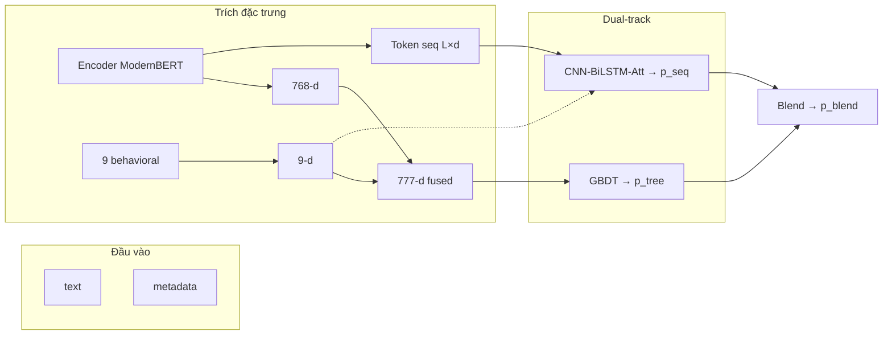

# CHƯƠNG 2: CƠ SỞ LÝ THUYẾT VÀ TỔNG QUAN TÀI LIỆU

*Chương này trả lời ba câu hỏi học thuật: (1) Bài toán FRD được định nghĩa và phân loại thế nào? (2) Tài liệu hiện có đi đến đâu, còn thiếu gì? (3) **Vì sao** pipeline đề tài chọn từng họ thuật toán — dựa trên **so sánh lý thuyết**, không mô tả triển khai (metric, split, τ: Chương 3, §3.2; kiến trúc: Chương 3, §3.1). Bối cảnh thị trường: Chương 1, §1.1.*

| Mục | Nội dung |
|-----|----------|
| **§2.1** | Định nghĩa, phân loại, mô hình hóa bài toán |
| **§2.2** | Tổng quan tài liệu: lịch sử → 20 công trình → khoảng trống G1–G8 |
| **§2.3** | Cơ sở lý thuyết lựa chọn từng thành phần pipeline (so sánh & lập luận) |
| **§2.4** | Tính mới của đề tài |

---

## 2.1. Định nghĩa, phân loại và mô hình hóa bài toán

### 2.1.1. Khái niệm *opinion spam* / đánh giá giả

Jindal và Liu (2008) định nghĩa đánh giá giả là nhận xét **không phản ánh trải nghiệm mua–dùng thực tế**, được tạo **có chủ đích** để thao túng nhận thức người mua hoặc thuật toán xếp hạng. Hai trục này tách FRD khỏi phân loại cảm xúc thuần túy: một review có thể *tiêu cực* nhưng vẫn *genuine*, hoặc *tích cực* nhưng *fake*.

Từ góc kinh tế thông tin, spam review làm tăng bất cân xứng thông tin giữa seller và buyer (Luca & Zervas, 2016). Trong phạm vi học máy, đầu vào là cặp **(văn bản, metadata)**; đầu ra là nhãn nhị phân fake/genuine. Nhãn trên corpus Amazon là **proxy** do dataset gán — không đồng nhất với nhãn moderation nội bộ nền tảng (Ren & Ji, 2024).

### 2.1.2. Phân loại theo mục đích và hình thức

**Phân loại cổ điển** (Jindal & Liu, 2008; Ott et al., 2011) vẫn dùng để mô tả động cơ spam:

- **Promotional** — khen quá mức để đẩy sản phẩm.
- **Demotional** — hạ uy tín đối thủ.
- **Non-review** — nội dung không mang thông tin trải nghiệm.

**Phân loại mở rộng (2024–2026)** khi gian lận công nghiệp hóa (Gupta et al., 2024; Ren & Ji, 2024):

| Dạng | Đặc điểm | Hệ quả cho thiết kế mô hình |
|------|----------|------------------------------|
| LLM-generated | Ngữ phong tự nhiên, đa dạng | Feature tâm lý học (Ott, 2011) suy giảm → cần embedding sâu |
| Crowdsourced + verified | Reviewer thật, đơn verified thật | Rule đơn giản không đủ → cần học máy đa tín hiệu |
| Coordinated campaign | Burst theo sản phẩm/thời gian | Cần tín hiệu hành vi (và đôi khi graph) |
| AI paraphrase | Tránh trùng lặp văn bản | Cần ngữ nghĩa, không chỉ n-gram |

Đề tài chuẩn hóa về **phân loại nhị phân** fake/genuine — phù hợp moderation production (một quyết định) và corpus Amazon (~40% fake). Metric và protocol đánh giá được trình bày tại **Chương 3, §3.2** (không thuộc lý thuyết thuật toán chương này).

### 2.1.3. Mô hình hóa học máy

Gọi $\mathcal{D} = \{(x_i, y_i)\}_{i=1}^{N}$, $x_i = (\text{text}_i, \text{meta}_i)$, $y_i \in \{0,1\}$. Mục tiêu học $f(x) \approx P(y=1 \mid x)$. Khác phân loại văn bản đơn thuần, FRD trên TMDT khai thác **hai không gian tín hiệu độc lập**:

1. **Không gian ngôn ngữ** — nội dung review.
2. **Không gian hành vi** — metadata (rating, thời gian, verified, …).

Lập luận lý thuyết cho việc kết hợp hai không gian: spam LLM có thể che dấu ngôn ngữ nhưng **khó đồng bộ hóa hành vi** ở quy mô chiến dịch (Mukherjee et al., 2013) — dẫn tới thiết kế fusion ở §2.3.

---

## 2.2. Tổng quan tài liệu nghiên cứu

*Mục này gom lịch sử FRD, so sánh paradigm, 20 công trình tham chiếu và khoảng trống G1–G8 — trình bày liền mạch để mỗi gap có căn cứ từ tài liệu, không tách rời §2.3/2.4/2.5.*

### 2.2.1. Bốn dòng phát triển FRD (2008–nay)

Lịch sử học thuật (đối chiếu timeline thị trường: Chương 1, Bảng 1.4) không tiến theo đường thẳng mà **chồng lấn**:

**Dòng 1 — Nền tảng (2008–2012).** Jindal & Liu (2008) đặt định nghĩa *opinion spam* trên Amazon, thử feature thủ công + LR/SVM. Ott et al. (2011) tạo OpSpam 400 — corpus “cảm xúc giả” — và chứng minh dấu vết tâm lý học trong văn bản. Đóng góp: khung bài toán, benchmark chất lượng, cảnh báo metric trên dữ liệu mất cân bằng.

**Dòng 2 — Behavioral & graph (2013–2017).** Mukherjee et al. (2013) chuyển sang metadata: burstiness, rating deviation, verified ratio. Rayana & Akoglu (2015), Wang et al. (2017) đưa **đồ thị** reviewer–product — mạnh với spam tập thể nhưng phụ thuộc cấu trúc đồ thị và quy mô dữ liệu.

**Dòng 3 — Deep learning & Transformer (2018–2023).** Hajek et al. (2020), Bhuvaneshwari et al. (2021), Refaeli & Hajek (2021) dùng CNN, BiLSTM, Attention, BERT. Embedding ngữ cảnh vượt TF-IDF trước paraphrase và LLM-spam. Trade-off: chi phí tính toán, overfit trên corpus nhỏ.

**Dòng 4 — Hybrid, tối ưu, khảo sát (2019–nay).** Shah (2019) PCA + active learning trên Amazon. Duma et al. (2023) hybrid text + rating + aspect. Gupta et al. (2024), Ren & Ji (2024) **khảo sát hệ thống** — chỉ ra phân mảnh dataset, metric, reproducibility. Dòng 4 không thay Dòng 3 mà đặt câu hỏi: *kết hợp nào có ý nghĩa, báo cáo thế nào mới tin được?*

### 2.2.2. So sánh các paradigm ở mức khái niệm

Bảng 2.1 **không** phải phân loại tự đặt mà **tổng hợp** từ: (i) taxonomy trong khảo sát Gupta et al. (2024) — 98 papers FRD 2019–2023; (ii) nguyên tắc phân nhóm Ren & Ji (2024); (iii) ánh xạ lên **20 công trình** Bảng 2.2 (mỗi hướng có ít nhất một paper đại diện đã verify). Cột *Nguồn điển hình* trích ID Bảng 2.2 và tài liệu nền tảng.

**Bảng 2.1.** Các hướng FRD — tín hiệu, ưu/nhược, hiện trạng và nguồn tham chiếu

| Hướng | Tín hiệu | Điểm mạnh | Hạn chế | Hiện trạng 2024–2026 | Nguồn điển hình (Bảng 2.2 / nền tảng) |
|-------|----------|-----------|---------|----------------------|----------------------------------------|
| **ML cổ điển** | BoW, TF-IDF, POS, sentiment | Nhẹ; giải thích được; baseline mạnh trên corpus nhỏ | Mất ngữ cảnh; yếu paraphrase và LLM-spam | Baseline; ít dùng đơn lẻ | ID 1–2, 6–7 (Jindal & Liu, 2008; Ott et al., 2011; Kennedy et al., 2019; Shah, 2019) |
| **DL văn bản** | CNN, LSTM, BiLSTM, Attention | Bắt n-gram cục bộ và phụ thuộc trình tự | Cần data; overfit; khó scale ngữ nghĩa sâu | Backbone nhánh sequence | ID 8, 12 (Hajek et al., 2020; Bhuvaneshwari et al., 2021); Kim (2014) |
| **Transformer** | BERT, RoBERTa, **ModernBERT** | Self-attention — ngữ cảnh hai chiều; chống paraphrase | Chi phí RAM/GPU; nhiều paper text-only | **Chuẩn** feature extractor FRD | ID 11, 13, 16 (Gupta, 2021; Refaeli & Hajek, 2021; Mir et al., 2023); Devlin et al. (2019); Warner et al. (2024) |
| **Behavioral** | Velocity, burst, verified, rating deviation | Metadata khó giả đồng bộ quy mô lớn | Phụ thuộc trường metadata sẵn có | Bổ sung bắt buộc khi LLM che text | ID 3, 15 (Mukherjee et al., 2013; Duma et al., 2023) |
| **Graph** | Đồ thị reviewer–product–review | Bắt spam **tập thể**, quan hệ ẩn | RAM, scale; corpus Yelp ≠ Amazon | Tier B — tham chiếu, không so số trực tiếp | ID 4–5, 10, 20 (Rayana & Akoglu, 2015; Wang et al., 2017; Zhang et al., 2020; Wu et al., 2024) |
| **Ensemble / hybrid** | Kết hợp tree + DL + embedding | Giảm phương sai khi base đa dạng (Breiman, 1996) | Thiếu protocol τ và ablation trong nhiều paper | Xu hướng hybrid text+metadata | ID 10, 14, 15 (Zhang et al., 2020; Deshai & Rao, 2023; Duma et al., 2023) |
| **Multimodal / GNN SOTA** | Text + ảnh; heterogeneous GNN | SOTA trên benchmark riêng | Khác paradigm, dataset, metric — so số dễ sai | Bối cảnh ngoài Tier A | ID 19–20 (Veluru et al., 2025; Wu et al., 2024) |
| **Khảo sát / meta** | Taxonomy gap, reproducibility | Định hướng G1–G8, metric, leakage | Không số SOTA trực tiếp | Chuẩn mực báo cáo 2024+ | ID 17–18 (Gupta et al., 2024; Ren & Ji, 2024) |

*Cách đọc bảng:* Mỗi hàng là một **paradigm** trong tài liệu FRD; cột *Nguồn* chỉ paper **đã kiểm chứng** trong Bảng 2.2 hoặc trích dẫn nền tảng (BoW → Jindal/Ott; Transformer → Devlin/Warner; ensemble → Breiman). Gupta et al. (2024) xác nhận text-only Transformer vẫn chiếm đa số (→ G1); Ren & Ji (2024) nhấn graph và multimodal là nhánh tách biệt — khớp việc đề tài chỉ claim Tier A.

Đề tài định vị ở giao **Transformer (hàng 3) + Behavioral (hàng 4) + Ensemble/hybrid (hàng 6)** — không triển khai graph/multimodal (hàng 5, 7) trong phạm vi M5.

### 2.2.3. Hai mươi công trình tham chiếu và phân tầng so sánh

So sánh SOTA FRD dễ sai nếu không kiểm soát **dataset × metric × paradigm** (Gupta et al., 2024). Đề tài phân tầng:

- **Tier A** — text/tabular Amazon: so sánh số trực tiếp (M5).
- **Tier B** — graph / Yelp-heavy: bối cảnh, không claim beat.
- **Tier C** — nền tảng 2008–2012: động cơ lịch sử.
- **Survey (17–18)** — taxonomy gap.
- **Ngoài tier (19–20)** — paradigm khác (multimodal, graph).

**Bảng 2.2.** Tóm tắt 20 công trình (nguồn: `docs/00_Literature_Review_SOTA.md`)

| ID | Tác giả (Năm) | Dataset | Metric | Điểm báo cáo | Tier |
|----|---------------|---------|--------|--------------|------|
| 1 | Jindal & Liu (2008) | Amazon sớm | Accuracy | ~0,78 LR | C |
| 2 | Ott et al. (2011) | OpSpam 400 | F1 | ~0,90 | C |
| 3 | Mukherjee et al. (2013) | Yelp | Accuracy | 67,8% | C |
| 4 | Rayana & Akoglu (2015) | Yelp graph | F1 | ~0,85+ | B |
| 5 | Wang et al. (2017) | Yelp | F1 | > baseline | B |
| 6 | Kennedy et al. (2019) | OpSpam | Accuracy | > ML | C |
| 7 | Shah (2019) | Amazon | Accuracy | ~82% | C |
| 8 | Hajek et al. (2020) | Amz+Yelp | F1/Acc | Cao | A |
| 9 | Vidanagama et al. (2020) | Amz+Yelp | **Accuracy** | 97,3% Amz | A |
| 10 | Zhang et al. (2020) | Yelp | F1 | > RF/SVM | B |
| 11 | Gupta (2021) | Yelp 1,4M | Weighted-F1 | 0,69 | — |
| 12 | Bhuvaneshwari et al. (2021) | Amazon | F1/Acc | >90% | A |
| 13 | Refaeli & Hajek (2021) | Multi | F1 | Competitive | A |
| 14 | Deshai & Rao (2023) | Multi | Accuracy | đến 99,4%* | A |
| 15 | Duma et al. (2023) | Amazon aspect | F1 | > baseline | A |
| 16 | Mir et al. (2023) | General | Accuracy | 87,81% | A |
| 17 | Gupta et al. (2024) | Survey 98 | — | Gap taxonomy | — |
| 18 | Ren & Ji (2024) | Survey | — | Principles | — |
| 19 | Veluru et al. (2025) | Multimodal 20k | F1 | 0,934 | — |
| 20 | Wu et al. (2024) | Graph | F1 | ~0,915 | B |

**Phân tích sâu Tier A (ID 8, 9, 12, 13, 14, 15, 16)** — các paper **text/tabular** có corpus Amazon hoặc multi-domain gồm Amazon, là tầng so sánh số trực tiếp (M5). Mỗi paper theo khung: *(1) Thuật toán & I/O → (2) So sánh với pipeline đề tài → (3) Hàm ý / gap*.

---

#### ID 8 — Hajek et al. (2020) | Amazon + Yelp | Tier A

**(1) Thuật toán và vận hành**

| Khía cạnh | Mô tả |
|-----------|-------|
| **Đầu vào** | Văn bản review; emotion embeddings (vector cảm xúc); có thể kèm metadata tùy thí nghiệm |
| **Biểu diễn** | Kết hợp word embedding và **emotion embedding** — không dùng BERT/Transformer hiện đại |
| **Mô hình** | Học sâu (CNN / LSTM / hybrid) trên vector đã ghép |
| **Đầu ra** | Nhãn fake/genuine; báo cáo F1 và Accuracy cao trên cả Amazon và Yelp |
| **Tác dụng** | Chứng minh **đa nguồn tín hiệu** (text + emotion) vượt text đơn thuần trên FRD |

Hajek et al. (2020) thuộc Dòng 3 (Bảng 2.1) — DL văn bản — nhưng tín hiệu phụ là **emotion** chứ không phải behavioral metadata TMDT (velocity, verified, burst).

**(2) So sánh với đề tài**

| Tiêu chí | Hajek et al. (2020) | Pipeline đề tài |
|----------|---------------------|-----------------|
| Encoder | Emotion + word embedding | **ModernBERT** 768-d (Transformer) |
| Metadata | Emotion vector | **9 behavioral** engineered (Mukherjee/Duma) |
| Nhánh tabular | Một luồng DL | **GBDT** trên 777-d |
| Nhánh sequence | Không tách dual-track | **CNN-BiLSTM-Att** + ensemble |
| Corpus Amazon | Có (cùng hệ Amazon) | Amazon Labeled 42.749 |

**(3) Hàm ý.** Hajek củng cố lập luận **fusion đa tín hiệu** (§2.3.1) nhưng khác **loại** tín hiệu phụ. Đề tài thay emotion bằng behavioral TMDT và thêm GBDT + ensemble — lấp G1, G2 so với kiến trúc Hajek.

---

#### ID 9 — Vidanagama et al. (2020) | Amazon + Yelp | Tier A

**(1) Thuật toán và vận hành**

| Khía cạnh | Mô tả |
|-----------|-------|
| **Đầu vào** | Văn bản review (Amazon và Yelp) |
| **Biểu diễn** | Word embedding / feature CNN đầu vào |
| **Mô hình** | **CNN** — convolution trích n-gram cục bộ (Kim, 2014) |
| **Đầu ra** | Accuracy **97,3%** trên Amazon — metric chính là **Accuracy**, không Macro F1 |
| **Tác dụng** | Cho thấy CNN đơn giản đã mạnh trên Amazon khi metric là Accuracy |

**(2) So sánh với đề tài**

| Tiêu chí | Vidanagama (2020) | Pipeline đề tài |
|----------|-------------------|-----------------|
| Metric | **Accuracy** 97,3% | **Macro F1** 0,9433 (M1); Precision Fake 0,9816 (M2) |
| Kiến trúc | CNN đơn | ModernBERT + CNN-BiLSTM-Att + GBDT + blend |
| Metadata | Text-only | 9 behavioral fused |
| Imbalance | Accuracy dễ “đẹp” trên tập mất cân bằng | Macro F1 + dual-threshold (Ch. 3 §3.2) |

**(3) Hàm ý.** Paper minh họa **cảnh báo M5**: số Accuracy cao **không so trực tiếp** với Macro F1 đề tài (Ott et al., 2011; Gupta et al., 2024). Về mặt thuật toán, đề tài **bao trùm** CNN thuần bằng stack sâu hơn + đa tín hiệu — nhưng claim phải nêu rõ metric và split.

---

#### ID 12 — Bhuvaneshwari et al. (2021) | Amazon | Tier A ★ mốc sequence

**(1) Thuật toán và vận hành**

| Khía cạnh | Mô tả |
|-----------|-------|
| **Đầu vào** | Chuỗi token / embedding review Amazon |
| **Mô hình** | **CNN → BiLSTM → Attention** — kiến trúc lai ba lớp (§2.3.5) |
| **Cơ chế** | CNN: n-gram cục bộ; BiLSTM: phụ thuộc trình tự; Attention: trọng số token quyết định |
| **Đầu ra** | F1 / Accuracy **>90%** trên Amazon |
| **Tác dụng** | **Mốc Tier A** gần nhất với nhánh sequence đề tài trên cùng nền tảng Amazon |

Đây là paper đề tài **kế thừa trực tiếp** về kiến trúc sequence (§2.3.5), khác ở encoder đầu vào.

**(2) So sánh với đề tài**

| Tiêu chí | Bhuvaneshwari (2021) | Pipeline đề tài |
|----------|----------------------|-----------------|
| Encoder | Embedding/BERT-era (paper gốc) | **ModernBERT freeze** |
| Kiến trúc sequence | CNN-BiLSTM-Att | **Cùng họ** + late fusion behavioral |
| Nhánh tabular GBDT | Không báo cáo | **XGB + LGBM** trên 777-d |
| Ensemble | Single model (hoặc không blend đa họ) | **Weighted blend** CNN + GBDT |
| Loss / τ | Không dual-threshold | Focal Loss; dual-τ (G3, G7) |

**(3) Hàm ý.** Bhuvaneshwari chứng minh CNN-BiLSTM-Att **khả thi trên Amazon** — đề tài sequence Macro F1 ~0,93 có căn cứ Tier A. Gap **G2**: Bhuvaneshwari **không** có dual-track GBDT + blend cùng protocol — đó là đóng góp tích hợp đề tài, không phải thay thế kiến trúc sequence.

---

#### ID 13 — Refaeli & Hajek (2021) | Multi-domain (gồm Amazon) | Tier A

**(1) Thuật toán và vận hành**

| Khía cạnh | Mô tả |
|-----------|-------|
| **Đầu vào** | Văn bản review đa miền (nhiều dataset, có Amazon) |
| **Biểu diễn** | **BERT fine-tune end-to-end** — cập nhật toàn bộ trọng số Transformer |
| **Mô hình** | Classifier trên [CLS] hoặc pooling BERT |
| **Đầu ra** | F1 competitive trên multi-domain |
| **Tác dụng** | Chứng minh **fine-tune BERT** mạnh cross-domain FRD |

**(2) So sánh với đề tài**

| Tiêu chí | Refaeli & Hajek (2021) | Pipeline đề tài |
|----------|------------------------|-----------------|
| BERT | **Fine-tune E2E** | **Freeze** + head (§2.3.2) |
| Behavioral | **Text-only** | 9 behavioral → 777-d (G1) |
| Kiến trúc | Một nhánh Transformer | Dual-track + ensemble |
| Tài nguyên | Giả định GPU đủ cho fine-tune | RAM ≤ 12GB Colab |

**(3) Hàm ý.** Refaeli là **đối chứng lý thuyết** cho quyết định freeze: fine-tune mạnh hơn về mặt lý thuyết nhưng khó kết hợp GBDT + sequence trong một pipeline 12GB. Đề tài chấp nhận trade-off để có **fusion behavioral + dual-track** — gap G1 Refaeli chưa lấp.

---

#### ID 14 — Deshai & Rao (2023) | Multi-dataset (gồm Amazon) | Tier A

**(1) Thuật toán và vận hành**

| Khía cạnh | Mô tả |
|-----------|-------|
| **Đầu vào** | Văn bản review trên nhiều dataset |
| **Mô hình** | **CNN** + tối ưu **APSO** (Adaptive Particle Swarm Optimization) |
| **Vận hành PSO** | Quần thể hạt tìm hyperparameter CNN trong không gian liên tục (Kennedy & Eberhart, 1995) |
| **Đầu ra** | Accuracy tới **99,4%** trên một số cấu hình multi-dataset |
| **Tác dụng** | Cho thấy PSO có thể đẩy metric khi kết hợp CNN |

**(2) So sánh với đề tài**

| Tiêu chí | Deshai & Rao (2023) | Pipeline đề tài |
|----------|---------------------|-----------------|
| Tối ưu | **PSO/APSO** toàn pipeline | **Grid** blend trên val; PSO chỉ **ablation** (§2.3.7, G6) |
| Metric | **Accuracy** đến 99,4% | Macro F1 + Precision Fake |
| Kiến trúc | CNN + PSO | ModernBERT + GBDT + CNN-BiLSTM + blend |
| Reproducibility | Swarm — khó audit | Seed 42, protocol G4 |

**(3) Hàm ý.** Deshai là nguồn cho **hàng PSO** Bảng 2.1 và ablation track đề tài — không dùng làm pipeline chính vì overclaim và metric khác (M5). So số 99,4% Accuracy **không** đặt làm mục tiêu M1–M3.

---

#### ID 15 — Duma et al. (2023) | Amazon (aspect-level) | Tier A ★ mốc hybrid Amazon

**(1) Thuật toán và vận hành**

| Khía cạnh | Mô tả |
|-----------|-------|
| **Đầu vào** | Văn bản review + **rating** + **aspect** (phân tích theo khía cạnh sản phẩm) |
| **Biểu diễn** | Embedding text kết hợp vector rating/aspect |
| **Mô hình** | Hybrid classifier — khai thác **đa tín hiệu** trên Amazon |
| **Đầu ra** | F1 vượt baseline text-only |
| **Tác dụng** | Paper **gần nhất** với hướng text + metadata trên Amazon (Bảng 2.1 hàng Behavioral + Ensemble) |

**(2) So sánh với đề tài**

| Tiêu chí | Duma et al. (2023) | Pipeline đề tài |
|----------|-------------------|-----------------|
| Metadata | Rating + **aspect** | **9 behavioral** (velocity, burst, verified, …) |
| Encoder | Embedding era (không ModernBERT) | **ModernBERT** 768-d |
| Kiến trúc | Single hybrid | **Dual-track** GBDT + sequence + blend (G2) |
| Mức review | Aspect-level | Review-level nhị phân |

**(3) Hàm ý.** Duma **ủng hộ lý thuyết G1** (không text-only). Đề tài khác ở **loại metadata** (behavioral hành vi thay aspect) và **tách hai inductive bias** (tree vs sequence) thay một classifier duy nhất — đóng góp kiến trúc, không phủ nhận hướng hybrid của Duma.

---

#### ID 16 — Mir et al. (2023) | General reviews | Tier A

**(1) Thuật toán và vận hành**

| Khía cạnh | Mô tả |
|-----------|-------|
| **Đầu vào** | Văn bản review (corpus general, không chỉ Amazon) |
| **Mô hình** | **SVM + BERT** — pipeline cổ điển: embedding BERT → SVM margin |
| **Vận hành** | BERT trích feature; SVM phân lớp tuyến tính/kernel trên vector |
| **Đầu ra** | Accuracy **87,81%** |
| **Tác dụng** | Baseline hybrid **shallow (SVM) + deep (BERT)** trên review tổng quát |

**(2) So sánh với đề tài**

| Tiêu chí | Mir (2023) | Pipeline đề tài |
|----------|------------|-----------------|
| Classifier tabular | **SVM** | **GBDT** (XGB, LGBM) — mạnh hơn trên tabular dense (Shwartz-Ziv & Armon, 2021) |
| Behavioral | Không 9 feat. engineered | 777-d fused (G1) |
| Corpus | General | **Amazon Labeled** 42.749 |
| Metric | Accuracy 87,81% | Macro F1 0,94+ |

**(3) Hàm ý.** Mir đại diện paradigm **BERT + shallow learner** (Bảng 2.1). Đề tài **nâng cấp** nhánh tabular từ SVM lên GBDT và thêm behavioral + sequence — có lý do lý thuyết (§2.3.4), không so Accuracy trực tiếp.

---

**Bảng 2.2a.** Tổng hợp Tier A — đối chiếu nhanh với pipeline đề tài

| ID | Paper | Đầu vào chính | Mô hình cốt lõi | Metric báo cáo | Điểm khác biệt so với đề tài | Gap liên quan |
|----|-------|--------------|-----------------|----------------|------------------------------|---------------|
| 8 | Hajek (2020) | Text + emotion emb. | DL hybrid | F1/Acc cao | Emotion ≠ behavioral; không dual-track | G1, G2 |
| 9 | Vidanagama (2020) | Text | CNN | Acc 97,3% Amz | Metric Accuracy; text-only | M5, G1 |
| 12 | Bhuvaneshwari (2021) | Text Amazon | CNN-BiLSTM-Att | F1/Acc >90% | Thiếu GBDT+blend; encoder cũ hơn | **G2** (mốc sequence) |
| 13 | Refaeli (2021) | Text multi-domain | BERT fine-tune | F1 competitive | Text-only; E2E không freeze | G1 |
| 14 | Deshai (2023) | Text multi | CNN + APSO | Acc 99,4%* | PSO headline; metric Accuracy | G6, M5 |
| 15 | Duma (2023) | Text+rating+aspect Amz | Hybrid | F1 strong | Single hybrid; aspect ≠ behavioral | G1, G2 |
| 16 | Mir (2023) | Text general | SVM+BERT | Acc 87,81% | SVM tabular; không Amazon corpus | G1, M5 |

*Số chi tiết đề tài vs Tier A: Chương 4, §4.12.*

---

**Các nhóm còn lại (tóm tắt — không so số trực tiếp M5):**

**Tier B (4, 5, 10, 20) — graph / Yelp-heavy:** Rayana, Wang, Zhang, Wu — đầu vào là **đồ thị** hoặc corpus Yelp; inductive bias collective spam (§2.3.3). Đề tài không triển khai vì RAM và paradigm khác (Chương 1, §1.3).

**Tier C (1, 2, 3, 6, 7) — nền tảng:** Jindal/Ott đặt định nghĩa; Mukherjee mở behavioral; Shah (PCA) — nguồn ablation §2.3.7.

**Survey (17–18):** Gupta (2024) taxonomy G1–G8; Ren & Ji (2024) reproducibility — củng cố Chương 3 §3.2.

**Ngoài tier (19–20):** Veluru multimodal; Wu graph SOTA — trần tham chiếu, không claim beat.

### 2.2.4. Khoảng trống G1–G8 và ánh xạ sang đề tài

Từ Bảng 2.2 và khảo sát Gupta/Ren, tám khoảng trống được hệ thống hóa:

**Bảng 2.3.** Khoảng trống nghiên cứu G1–G8

| Gap | Mô tả | Bằng chứng từ Bảng 2.2 | Hệ quả nếu bỏ qua |
|-----|-------|--------------------------|-------------------|
| **G1** | Ít kết hợp Transformer hiện đại + behavioral engineered | Refaeli, Mir text-heavy; Duma có metadata nhưng khác kiến trúc | Bỏ sót signal khi LLM che text |
| **G2** | Thiếu dual-track tabular GBDT + sequence DL cùng protocol | Bhuvaneshwari có sequence; ít paper có cả tree + DL + blend | Không biết nhánh nào đóng góp |
| **G3** | Ensemble thiếu protocol chọn τ trên val | Hầu hết 1 metric; Zhang ensemble nhưng không dual-threshold | Không map moderation |
| **G4** | Thiếu audit leakage | Hầu hết không mô tả train-only fit | SOTA không tái lập |
| **G5** | PCA fused vector chưa chứng minh vs raw | Shah PCA text; chưa ablation BERT+behavioral | Giả định “giảm chiều = tốt” |
| **G6** | PSO tách rời stack | Deshai APSO; dễ overclaim | Chi phí không justify |
| **G7** | Hiếm macro F1 + precision-first đồng thời | Gupta survey | Metric lệch vận hành |
| **G8** | Thiếu ablation cùng split | Nhiều paper không ablate | Claim hybrid không kiểm chứng |

**Bảng 2.4.** Ánh xạ Gap → lựa chọn lý thuyết (§2.3) → mục tiêu

| Gap | Hướng lý thuyết §2.3 | Mục tiêu | Kiểm chứng |
|-----|----------------------|----------|------------|
| G1 | §2.3.2–2.3.3 ModernBERT + behavioral fusion | M1–M3; RQ1 | Ch. 3–4 |
| G2 | §2.3.1 dual-track; §2.3.4–2.3.5 GBDT + sequence | RQ2 | Ch. 3–4 |
| G3, G7 | §2.3.6 ensemble; protocol τ → Ch. 3 §3.2 | RQ5; M1–M2 | Ch. 3–5 |
| G4 | — (phương pháp Ch. 3 §3.2.3) | M4 | Ch. 3–4 |
| G5, G6 | §2.3.7 PCA/PSO ablation | RQ3, RQ6; M6 | Ch. 4–5 |
| G8 | Toàn §2.3 ablation logic | RQ6; M6 | Ch. 4 |
| G1–G3 | Tier A; Bảng 2.2 | M5 | Ch. 2, 4 |

§2.3 trình bày **lý thuyết và so sánh** để giải thích vì sao Bảng 2.4 chọn đúng các họ thuật toán đó — trước khi Chương 3 mô tả cách cài đặt.

---

## 2.3. Cơ sở lý thuyết lựa chọn thành phần pipeline

*Mỗi tiểu mục tuân thứ tự: **(1) Giới thiệu thuật toán** — định nghĩa, cơ chế vận hành, đầu vào/đầu ra, tác dụng trong FRD; **(2) So sánh** với phương án thay thế đã có trong tài liệu (Bảng 2.1–2.2); **(3) Kết luận** lựa chọn của đề tài. Chi tiết cài đặt: Chương 3.*

### 2.3.1. Khung tổng thể: hai không gian tín hiệu và kiến trúc dual-track

#### (1) Lý thuyết và vận hành

**Hai không gian tín hiệu.** Mỗi review $x_i$ gồm cặp $(\text{text}_i, \text{meta}_i)$:

| Không gian | Đầu vào | Đại diện lý thuyết | Đầu ra trung gian | Tác dụng trong FRD |
|------------|---------|-------------------|-------------------|-------------------|
| **Ngôn ngữ** | Chuỗi từ review | Ott et al. (2011): deceptive language | Embedding 768-d; chuỗi token | Bắt ngữ nghĩa, paraphrase, cấu trúc câu |
| **Hành vi** | Rating, thời gian, verified, user, product | Mukherjee et al. (2013): burst, deviation | Vector 9-d | Bắt chiến dịch, anomaly metadata |

Hai không gian **bổ sung thông tin**: spam LLM có thể viết văn bản “đẹp” nhưng khó đồng thời giả mạo velocity, burst, pattern reviewer (Gupta et al., 2024).

**Kiến trúc dual-track** tách **hai cách đọc** cùng một review sau khi trích đặc trưng:

| Nhánh | Đầu vào | Bộ phân loại | Đầu ra | Vai trò |
|-------|---------|--------------|--------|---------|
| **Tabular** | Vector fused $\mathbf{x} \in \mathbb{R}^{777}$ (768 embedding + 9 behavioral) | GBDT (XGBoost, LightGBM) | $p_{\text{tree}} \in [0,1]$ | Học tương tác phi tuyến giữa chiều embedding và metadata |
| **Sequence** | Ma trận token $\mathbf{T} \in \mathbb{R}^{L \times d}$ từ encoder | CNN-BiLSTM-Attention | $p_{\text{seq}} \in [0,1]$ | Học pattern cục bộ/toàn cục trên trình tự |
| **Ensemble** | $\{p_{\text{tree}}, p_{\text{seq}}, \ldots\}$ | Weighted blend | $p_{\text{blend}} = \sum_k w_k p_k$ | Giảm phương sai khi hai nhánh sai khác nhau |

#### (2) So sánh kiến trúc trong tài liệu

| Kiến trúc | Cách vận hành | Paper (Bảng 2.2) | Hạn chế lý thuyết |
|-----------|---------------|------------------|-------------------|
| Text-only | text → BERT → classifier | Refaeli (13), Mir (16) | Bỏ metadata → G1 |
| Behavioral-only | meta → SVM/rules/graph | Mukherjee (3) | Yếu khi nội dung là signal chính |
| Single hybrid | fusion → **một** model | Duma (15) gần | Không tách tabular vs sequence → G2 |
| **Dual-track + ensemble** | fusion → GBDT **và** sequence → blend | Bhuvaneshwari (12) có sequence; thiếu GBDT+blend cùng protocol | Phức tạp hơn — **đề tài** lấp G2 |

#### (3) Kết luận chọn dual-track

GBDT mạnh trên **vector cố định** nhờ cây quyết định và tương tác phi tuyến (Chen & Guestrin, 2016; Shwartz-Ziv & Armon, 2021). CNN-BiLSTM mạnh trên **chuỗi** nhờ n-gram cục bộ và phụ thuộc dài hạn (Kim, 2014; Hochreiter & Schmidhuber, 1997). Hai inductive bias khác nhau → ensemble giảm phương sai khi sai số không tương quan (Breiman, 1996). Tài liệu chưa có paper Tier A nào trong Bảng 2.2 kết hợp đủ **ModernBERT + behavioral + GBDT + sequence + blend** trên cùng protocol — đây là lý do đề tài chọn dual-track làm khung lý thuyết trung tâm.

---

### 2.3.2. Biểu diễn văn bản: Transformer encoder và ModernBERT

#### (1) Lý thuyết thuật toán

**Transformer** (Vaswani et al., 2017) biểu diễn câu bằng **self-attention**: mỗi token $t_i$ tính attention tới mọi token $t_j$, tạo representation phụ thuộc toàn ngữ cảnh. Công thức attention scaled dot-product:

$$\text{Attention}(Q,K,V) = \text{softmax}\left(\frac{QK^\top}{\sqrt{d_k}}\right)V$$

**BERT** (Devlin et al., 2019) pretrain encoder bằng *masked language modeling* (MLM) — dự đoán token bị che — và *next sentence prediction*. Sau pretrain, mỗi token có vector ngữ cảnh 768 chiều (base).

**ModernBERT** (Warner et al., 2024) cải tiến kiến trúc encoder: dùng **RoPE** (Su et al., 2024) để mã hóa vị trí, tối ưu attention — hỗ trợ ngữ cảnh dài hơn BERT 512 tokens về mặt thiết kế.

**Vai trò trong pipeline đề tài — feature extractor (freeze):**

| Bước | Đầu vào | Vận hành | Đầu ra | Tác dụng |
|------|---------|----------|--------|----------|
| Tokenize | text (chuỗi ký tự) | BPE/wordpiece | ID token $[t_1,\ldots,t_L]$ | Chuẩn hóa đầu vào encoder |
| Forward encoder | ID token | $L$ lớp self-attention + FFN; **không** cập nhật gradient (freeze) | $\mathbf{H} \in \mathbb{R}^{L \times 768}$ | Trích ngữ nghĩa sâu đã pretrain |
| Pooling (tabular) | $\mathbf{H}$ | Mean/max/CLS pooling | $\mathbf{e} \in \mathbb{R}^{768}$ | Một vector đại diện cả review cho GBDT |
| Sequence export | $\mathbf{H}$ hoặc embedding token | Giữ chiều trình tự | $\mathbf{T} \in \mathbb{R}^{L \times d}$ | Đầu vào nhánh CNN-BiLSTM |

Freeze nghĩa là coi encoder như hàm cố định $\phi(\text{text}) \rightarrow \mathbf{e}$: chỉ các lớp phía sau (GBDT head, CNN-BiLSTM) được học từ dữ liệu FRD.

#### (2) So sánh biểu diễn văn bản trong tài liệu

| Phương án | Cơ chế | Đầu ra | FRD (Bảng 2.2) | Giới hạn |
|-----------|--------|--------|----------------|----------|
| BoW / TF-IDF | Đếm từ, TF-IDF | Vector sparse | Jindal (1), Ott (2), Shah (7) | Paraphrase, LLM-spam |
| CNN trên embedding tĩnh | Conv1D | Logits | Hajek (8) | Embedding tĩnh yếu ngữ cảnh |
| BERT fine-tune | Cập nhật toàn encoder | Logits | Refaeli (13) | Cần data/GPU lớn |
| BERT/ModernBERT **freeze** | $\phi$ cố định + head | 768-d hoặc $p$ | Refaeli (13) feature-based; **ModernBERT ít paper Amazon** | Có thể kém E2E fine-tune |

Gupta et al. (2024) ghi nhận họ Transformer chiếm đa số nhưng thường **text-only** — chưa kết hợp behavioral engineered (G1).

#### (3) Kết luận chọn ModernBERT freeze

- **ModernBERT** thay BERT-base: ngữ cảnh dài hơn, kiến trúc mới (Warner et al., 2024) — phù hợp review TMDT độ dài biến thiên.
- **Freeze** thay fine-tune E2E: corpus ~40k và pipeline đa nhánh — fine-tune toàn encoder dễ overfit và OOM (Refaeli & Hajek, 2021; Ren & Ji, 2024).
- **Hai đầu ra** (768-d pooled + token sequence): phục vụ đồng thời nhánh tabular và sequence — một encoder, hai inductive bias (§2.3.1).

---

### 2.3.3. Đặc trưng hành vi (behavioral features)

#### (1) Lý thuyết thuật toán

Behavioral feature là **hàm số** ánh xạ metadata $\text{meta}_i$ sang số thực, không qua học sâu:

$$f_j: \text{meta}_i \mapsto \mathbb{R}, \quad \mathbf{f}_i = [f_1,\ldots,f_9]^\top \in \mathbb{R}^9$$

**Nhóm basic (5)** — mô tả trực tiếp review đơn lẻ:

| Feature | Đầu vào metadata | Ý nghĩa lý thuyết | Tác dụng FRD |
|---------|------------------|-------------------|--------------|
| Log độ dài ký tự / số từ | text | Fake thường ngắn, ít chi tiết (Ott, 2011) | Phân biệt độ “giàu” nội dung |
| Độ lệch rating | rating, lịch sử sản phẩm | Spam có thể lệch so với trung bình sản phẩm | Bắt khen/chê bất thường |
| Sentiment compound | text (lexicon) | Cường điệu cảm xúc | Bổ sung khi chưa có embedding |
| Cờ verified | verified purchase | Review broker đôi khi vẫn verified | Tín hiệu yếu đơn lẻ nhưng hữu ích khi fusion |

**Nhóm advanced (4)** — mô tả **hành vi theo thời gian / người dùng**:

| Feature | Đầu vào | Ý nghĩa | Tác dụng |
|---------|---------|---------|----------|
| Review velocity | timestamp, user | Tần suất đăng của user | Farm account |
| Product burst | timestamp, product | Nhiều review trong cửa sổ ngắn | Chiến dịch coordinated |
| Time gap | lịch sử user | Khoảng cách giữa các review | Bot / spam pattern |
| Anomaly reviewer | lịch sử reviewer | Điểm bất thường hành vi | Spam chuyên nghiệp |

**Fusion với embedding:**

- **Sớm (early):** $\mathbf{x}_i = [\mathbf{e}_i; \mathbf{f}_i] \in \mathbb{R}^{777}$ — đầu vào GBDT.
- **Muộn (late):** concat $\mathbf{f}_i$ vào đầu ra nhánh sequence trước softmax — bổ sung metadata cho DL.

#### (2) So sánh khai thác metadata trong tài liệu

| Phương án | Đầu vào | Đầu ra | Paper | Nhận xét |
|-----------|---------|--------|-------|----------|
| Rule / heuristic | meta | nhãn 0/1 | Jindal (1) sơ khai | Không đủ LLM + verified thật |
| Feature + SVM | vector meta | nhãn | Mukherjee (3) | Nền tảng behavioral |
| Graph feature | đồ thị | embedding node | Rayana (4), Wu (20) | Mạnh collective; RAM cao |
| **Engineered + fusion text** | meta + BERT | 777-d | Duma (15) aspect+rating; **chưa ModernBERT+9 feat.** | G1 đề tài lấp chỗ trống |

#### (3) Kết luận chọn 9 behavioral + dual fusion

Graph (Bảng 2.1, hàng Graph; ID 4, 20) vượt RAM và Tier B. Text-only (Refaeli, Mir) bỏ metadata. Đề tài chọn **engineered 9 features** vì: (i) có đủ trường metadata Amazon; (ii) Mukherjee/Duma chứng minh hướng có signal; (iii) fusion sớm cho GBDT + fusion muộn cho sequence — hai đường khai thác cùng một bộ feature, phù hợp dual-track.

---

### 2.3.4. Phân loại tabular: Gradient Boosting Decision Tree (XGBoost, LightGBM)

#### (1) Lý thuyết thuật toán

**Gradient Boosting** (Friedman, 2001; triển khai: Chen & Guestrin, 2016 — XGBoost; Ke et al., 2017 — LightGBM) xây dựng ensemble **cây quyết định** tuần tự. Mô hình sau $t$ bước:

$$F_t(\mathbf{x}) = F_{t-1}(\mathbf{x}) + \eta \cdot h_t(\mathbf{x})$$

trong đó $h_t$ là cây mới fit vào **gradient** của loss tại residual — mỗi cây sửa lỗi của ensemble trước.

**Vận hành trên 777-d:**

| Khía cạnh | Mô tả |
|-----------|-------|
| **Đầu vào** | $\mathbf{x} \in \mathbb{R}^{777}$ (768 chiều embedding + 9 behavioral) |
| **Huấn luyện** | Tối thiểu hóa loss (logistic / cross-entropy) bằng cách thêm cây; mỗi split chọn feature và ngưỡng tối ưu information gain |
| **Đầu ra** | $p_{\text{tree}} = \sigma(F(\mathbf{x})) \in [0,1]$ — xác suất Fake |
| **Tác dụng** | Học tương tác phi tuyến (vd. “embedding chiều 42 cao **và** verified=0 **và** burst cao”) mà linear model không bắt được |

**XGBoost vs LightGBM** (cùng họ GBDT, khác cách grow cây): XGBoost level-wise; LightGBM leaf-wise với histogram — thường nhanh hơn trên tabular lớn. Dùng **cả hai** làm hai base models tăng diversity cho ensemble (§2.3.6).

#### (2) So sánh classifier tabular trong tài liệu

| Họ | Cơ chế | Paper FRD | Trên fused dense vector |
|----|--------|-----------|-------------------------|
| LR / SVM | Linear / kernel margin | Jindal (1), Mukherjee (3) | Yếu tương tác cao chiều |
| MLP | Fully-connected | Vidanagama (9) CNN pipeline | Dễ overfit ~40k |
| **GBDT** | Boosting trees | Duma (15), Refaeli (13) hybrid | **Mạnh** (Shwartz-Ziv & Armon, 2021) |

Shwartz-Ziv & Armon (2021) chỉ ra trên tabular có cấu trúc, GBDT thường **thắng hoặc ngang** deep learning — vector 777-d sau Transformer thuộc loại này.

#### (3) Kết luận chọn XGBoost + LightGBM

Refaeli (13) và Duma (15) đã chứng minh hybrid **embedding + tree** trên FRD. Đề tài áp dụng trên **777-d fused** (không chỉ text embedding). Hai implementation GBDT khác nhau → hai $p_{\text{tree}}$ đa dạng cho blend. MLP có thể tham gia grid ensemble nhưng GBDT là **nhánh tabular chính** theo lý thuyết tabular data.

---

### 2.3.5. Phân loại sequence: CNN-BiLSTM-Attention và Focal Loss

#### (1) Lý thuyết thuật toán

Nhánh sequence **không** dùng vector 777-d pooled mà xử lý **trình tự** representation từ encoder.

**Luồng tính toán (khái niệm):**

| Lớp | Đầu vào | Vận hành | Đầu ra | Tác dụng |
|-----|---------|----------|--------|----------|
| **CNN** (Kim, 2014) | $\mathbf{T} \in \mathbb{R}^{L \times d}$ | Conv1D nhiều kernel width | Feature maps cục bộ | Bắt n-gram (cụm từ quảng cáo, sentiment cục bộ) |
| **BiLSTM** (Hochreiter & Schmidhuber, 1997) | output CNN | Đọc xuôi + ngược theo thời gian | Hidden hai chiều | Phụ thuộc dài giữa đầu–cuối review |
| **Attention** | hidden LSTM | Trọng số $\alpha_t$ trên từng bước thời gian | Vector context $\mathbf{c}$ | Nhấn token quyết định (vd. cụm “highly recommend”) |
| **Late fusion behavioral** | $\mathbf{c}$, $\mathbf{f}$ | Concat $[\mathbf{c}; \mathbf{f}]$ | Vector mở rộng | Đưa metadata vào quyết định sequence |
| **Dense + sigmoid** | vector mở rộng | Linear + $\sigma$ | $p_{\text{seq}} \in [0,1]$ | Xác suất Fake |

**Focal Loss** (Lin et al., 2017) thay cross-entropy khi có imbalance:

$$FL(p_t) = -\alpha_t (1-p_t)^\gamma \log(p_t)$$

tham số $\gamma > 0$ **giảm** loss của mẫu dễ (đã phân loại đúng với confidence cao), buộc mô hình học **mẫu khó** gần biên quyết định — phù hợp fake/genuine chồng lấn ngữ nghĩa (~40% fake, Ott et al., 2011).

#### (2) So sánh nhánh sequence trong tài liệu

| Kiến trúc | Inductive bias | Paper | Ghi chú |
|-----------|----------------|-------|---------|
| Pure CNN | N-gram cục bộ | Hajek (8) | Thiếu phụ thuộc dài |
| Pure LSTM | Trình tự | — | Thiếu conv cục bộ |
| CNN-BiLSTM-Att | Cục bộ + toàn cục + attention | **Bhuvaneshwari (12)** >90% Amazon | Tier A gần nhất |
| Transformer E2E | Global attention, fine-tune all | Refaeli (13) | Cần GPU/data lớn |

Bhuvaneshwari et al. (2021) — ID 12 Bảng 2.2 — là **mốc lý thuyết** cho nhánh sequence trên Amazon; đề tài kế thừa kiến trúc lai nhưng thay embedding bằng ModernBERT freeze.

#### (3) Kết luận chọn CNN-BiLSTM-Attention + Focal Loss

- **Kiến trúc lai** vượt pure CNN/LSTM trên text classification (Kim, 2014; Bhuvaneshwari, 2021).
- **Trên embedding freeze** thay E2E: phù hợp corpus và tài nguyên (so sánh Refaeli fine-tune vs Bhuvaneshwari hybrid).
- **Focal Loss** xử lý imbalance trong hàm mất mát — nhất quán Ott (2011) và thực tế ~40% fake.
- **Late fusion behavioral** — metadata không bị mất khi chỉ học trên token.

---

### 2.3.6. Tổng hợp dự đoán: Ensemble và weighted blend

#### (1) Lý thuyết thuật toán

**Ensemble learning** (Breiman, 1996): giả sử có $K$ base models, mỗi model $k$ xuất $p_k(\mathbf{x}) \in [0,1]$. **Weighted blend**:

$$p_{\text{blend}}(\mathbf{x}) = \sum_{k=1}^{K} w_k \cdot p_k(\mathbf{x}), \quad \sum_k w_k = 1, \; w_k \geq 0$$

| Khía cạnh | Mô tả |
|-----------|-------|
| **Đầu vào** | Tập xác suất $\{p_{\text{seq}}, p_{\text{xgb}}, p_{\text{lgbm}}, \ldots\}$ trên cùng tập mẫu |
| **Học trọng số** | Chọn $\mathbf{w}$ tối ưu metric trên **validation** (grid search) — protocol Chương 3 |
| **Đầu ra** | $p_{\text{blend}}$ — xác suất cuối trước khi áp ngưỡng $\tau$ |
| **Tác dụng** | Kết hợp sai số không tương quan: khi sequence miss pattern mà tree bắt được metadata (hoặc ngược lại), blend ổn định hơn single model |

**Stacking** (khác blend): thêm meta-learner $g(p_1,\ldots,p_K)$ — thường linear hoặc logistic — học trên validation. Linh hoạt hơn nhưng thêm tham số.

#### (2) So sánh tổng hợp trong tài liệu

| Phương án | Cơ chế | Paper | Rủi ro |
|-----------|--------|-------|--------|
| Single best | Một $p_k$ | Đa số paper Bảng 2.2 | Bỏ diversity |
| **Weighted blend** | $\sum w_k p_k$ | Zhang (10) ensemble Yelp | Cần grid $w_k$ |
| Stacking | Meta trên $p_k$ | Zhang (10) | Overfit val nhỏ |
| APSO + hybrid | PSO tối ưu + DL | Deshai (14) | Khó reproduce (G6) |

Zhang et al. (2020) — ID 10 — chứng minh ensemble vượt RF/SVM trên Yelp; Gupta (2024) vẫn chỉ ra thiếu protocol τ (G3, G7).

#### (3) Kết luận chọn weighted blend

Base models đủ mạnh và **khác họ** (sequence DL vs GBDT tabular) → điều kiện ensemble của Breiman (1996). Stacking trên val ~6k mẫu dễ overfit meta-layer (Zhang, 2020). Blend **trong suốt** (biết $w_k$), reproducible, map G3. Áp dual-threshold trên $p_{\text{blend}}$ là bước **sau** ensemble — thuộc protocol Chương 3, không đổi lý thuyết blend.

---

### 2.3.7. Ablation lý thuyết: PCA và PSO (track phụ)

#### (1) Lý thuyết thuật toán

**PCA** (Jolliffe, 2002): tìm ma trận chiếu $\mathbf{W}$ sao cho $\mathbf{z} = \mathbf{W}^\top \mathbf{x}$ giữ phương sai lớn nhất. Trên $\mathbf{x} \in \mathbb{R}^{777}$, PCA 777→$d$ (vd. 400) nén chiều trước khi đưa vào classifier/DL.

| Khía cạnh | PCA |
|-----------|-----|
| Đầu vào | $\mathbf{x} \in \mathbb{R}^{777}$ |
| Vận hành | Eigendecomposition covariance; giữ $d$ thành phần chính |
| Đầu ra | $\mathbf{z} \in \mathbb{R}^{d}$ |
| Tác dụng lý thuyết | Giảm chiều, giảm nhiễu — **hợp lý** với TF-IDF sparse (Shah, 2019, ID 7) |

**PSO** (Kennedy & Eberhart, 1995): mỗi “hạt” là một vector siêu tham số; hạt di chuyển theo vị trí cá nhân tốt nhất và global tốt nhất:

$$v_i^{t+1} = w v_i^t + c_1 r_1 (p_i - x_i^t) + c_2 r_2 (g - x_i^t)$$

| Khía cạnh | PSO |
|-----------|-----|
| Đầu vào | Không gian hyperparameter (learning rate, kernel size, …) |
| Đầu ra | Bộ hyperparameter tối ưu theo fitness (vd. val F1) |
| Tác dụng | Tự động search thay grid thủ công — Deshai & Rao (2023, ID 14) dùng APSO |

#### (2) So sánh với hướng chính (raw + grid)

| Thành phần | Pipeline chính (lý thuyết) | Ablation (PCA/PSO) | Paper tham chiếu |
|------------|---------------------------|---------------------|------------------|
| Biểu diễn | Raw 777-d | PCA 777→400 | Shah (7) PCA text |
| Tối ưu DL | Grid blend / grid HP | PSO swarm | Deshai (14) |
| GBDT input | $\mathbf{x}$ đầy đủ | $\mathbf{z}$ nén | Shwartz-Ziv & Armon (2021) nghi ngờ PCA+tree |

#### (3) Kết luận: ablation track, không final track

Shwartz-Ziv & Armon (2021): GBDT trên tabular dense **không cần** PCA — giảm chiều có thể phá tương tác. Shah (2019) PCA trên **text sparse** — bối cảnh khác fused BERT. PSO (Deshai, 14) hợp lý cho ablation so sánh nhưng dễ overclaim (G6). **Final track** theo raw 777-d + grid blend; PCA/PSO chỉ để **kiểm chứng G5, G6** (kết quả: Chương 4).

---

### 2.3.8. Giải thích mô hình (XAI) và độ bền

#### (1) Lý thuyết thuật toán

**SHAP** (Lundberg & Lee, 2017): với mô hình $f$ và feature $j$, SHAP value $\phi_j$ là đóng góp trung bình của $j$ theo **Shapley value** từ lý thuyết trò chơi hợp tác — thỏa tính công bằng (efficiency, symmetry).

| Khía cạnh | SHAP / LIME |
|-----------|-------------|
| **Đầu vào** | Mô hình $f$ (vd. XGBoost trên 777-d), một mẫu $\mathbf{x}$ |
| **Vận hành** | SHAP: tính $\phi_j$ cho mọi feature; LIME: fit mô hình linear cục bộ quanh $\mathbf{x}$ |
| **Đầu ra** | Trọng số feature / hệ số linear xấp xỉ |
| **Tác dụng** | Trả lời *“vì sao review này bị gắn Fake?”* — cần khi moderation ảnh hưởng seller (Ren & Ji, 2024) |

**Adversarial perturbation** (Goodfellow et al., 2015): $\mathbf{x}' = \mathbf{x} + \epsilon \cdot \text{sign}(\nabla_{\mathbf{x}} L)$ — đo độ bền khi đầu vào bị nhiễu nhỏ (tương tự spammer paraphrase từng từ).

#### (2) So sánh trong bối cảnh FRD

| Hướng | Có trong 20 papers? | Ghi chú |
|-------|----------------------|---------|
| Black-box F1 only | Đa số Tier A | Không giải thích được |
| XAI post-hoc | Một số survey khuyến nghị | Ren & Ji (2024) |
| **XAI trên vector có tên feature** | Hiếm khi 777-d behavioral+embedding | Đề tài: kiểm chứng fusion §2.3.3 |

#### (3) Kết luận có XAI trong đề tài

Không phải thuật toán phát hiện spam mới mà **lớp kiểm chứng lý thuyết**: nếu SHAP top là verified, word count, sentiment — nhất quán Mukherjee/Ott; nếu chỉ embedding — gợi ý behavioral yếu. Triển khai và kết quả: Chương 4 §4.9.

---

## 2.4. Tính mới của đề tài

Tính mới **không** phải phát minh thuật toán đơn lẻ (ModernBERT, XGBoost, CNN-BiLSTM đều có trong tài liệu) mà là **tích hợp có lập luận lý thuyết và kiểm chứng** lấp G1–G8:

1. **Dual-track có cơ sở inductive bias** (G2): GBDT trên fused vector + sequence DL — hai họ bổ sung (§2.3.1, 2.3.4–2.3.5).
2. **Fusion Transformer hiện đại + behavioral engineered** (G1): 777-d — lý thuyết hai không gian tín hiệu (§2.3.2–2.3.3).
3. **Ensemble blend + dual-threshold** (G3, G7): weighted blend ổn định hơn stacking khi val hữu hạn; hai chế độ τ — protocol Ch. 3 (§2.3.6).
4. **Ablation có ý nghĩa lý thuyết** (G5, G6, G8): PCA/PSO tách track — negative result trên fused dense vector (§2.3.7).
5. **So sánh SOTA có trách nhiệm** (M5): Tier A, Bảng 2.2 — không claim graph/multimodal.
6. **XAI trên feature có tên** — kiểm chứng fusion (§2.3.8).

*Kiến trúc và metric: Chương 3. Số liệu: Chương 4–5. Mục tiêu: Chương 1.*