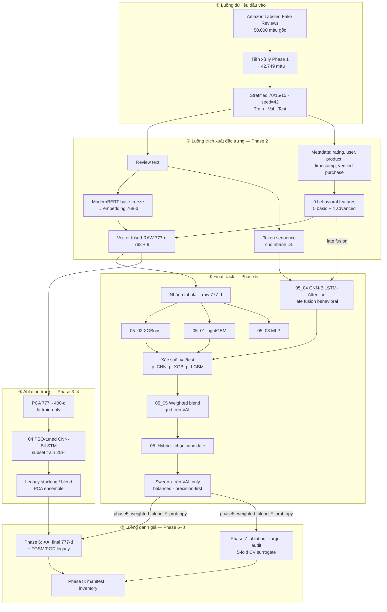
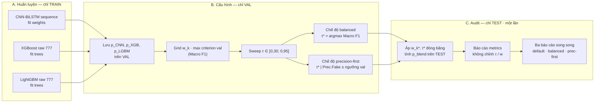
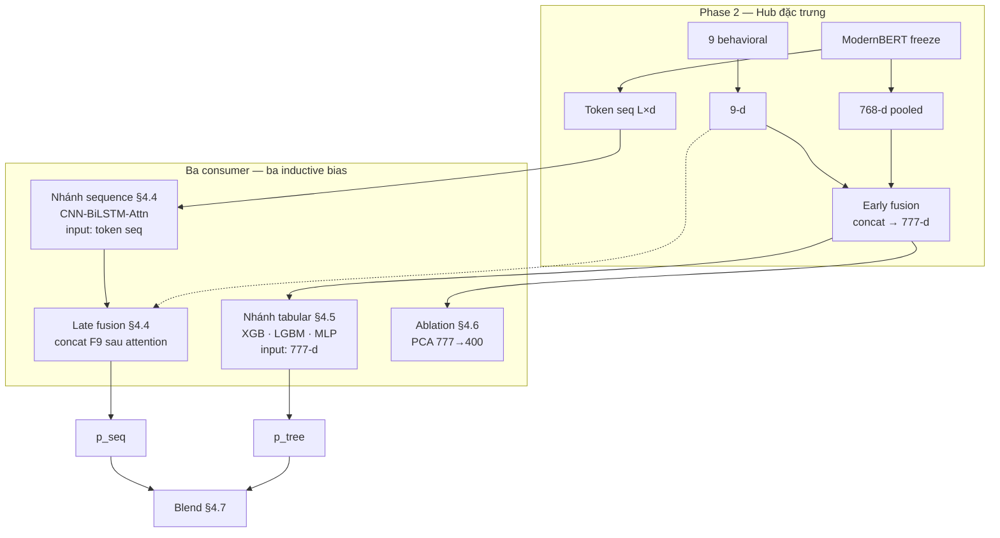

# CHƯƠNG 3: PHƯƠNG PHÁP NGHIÊN CỨU

Chương này trình bày **logic vận hành** của pipeline phát hiện đánh giá giả — bổ sung Chương 2 (lý thuyết và lý do chọn thuật toán). Trọng tâm là **bóc tách luồng**: dữ liệu đi đâu, tại sao tách nhánh, điều kiện nào không được vi phạm (fit policy, không hợp nhất track ở inference). **Triển khai chi tiết từng phase, số liệu và đối chiếu mục tiêu** → Chương 4 (§4.1–4.15). **Khung đánh giá chất lượng** → §3.13 (Bảng 3.13, chiều D0–D8).

Mọi triển khai chạy dưới ràng buộc RAM 12GB (Google Colab, Tesla T4), tuân thủ reproducibility và tránh leakage (Gupta et al., 2024; Ren & Ji, 2024). Lý do *tại sao chọn* từng họ thuật toán: Chương 2, §2.3 — Chương 3 chỉ mô tả *cách luồng được nối*.

### Bảng 3.1. Ánh xạ lý thuyết (Chương 2) → luồng triển khai (Chương 3)

| Mục Ch. 2 | Ý nghĩa trong pipeline | Luồng (Ch. 3) | Triển khai & kết quả (Ch. 4) |
|-----------|------------------------|---------------|------------------------------|
| §2.3.1 | Hai không gian tín hiệu; dual-track | §3.1 | §4.1–4.15 |
| §2.3.2 | ModernBERT freeze; hai đầu ra | Hình 3.1–3.3 | §4.2 |
| §2.3.3 | 9 behavioral; fusion 777-d | Hình 3.3 | §4.3 |
| §2.3.4 | GBDT tabular | Hình 3.1③ | §4.5 |
| §2.3.5 | CNN-BiLSTM-Attention | Hình 3.1③ | §4.4 |
| §2.3.6 | Weighted blend; dual-threshold | Hình 3.2 | §4.7–4.8 |
| §2.3.7 | PCA/PSO ablation | Hình 3.1④ | §4.6 |
| §2.3.8 | XAI kiểm chứng fusion | Hình 3.1⑤ | §4.9 |
| — | Protocol, metric *tại sao* | §3.2 | §4.1, §4.8 |
| — | Ablation / audit | Hình 3.1⑤ | §4.10 |
| — | Tái lập | §3.12 | §4.15 |

**Diễn giải:** Bảng 3.1 tách rõ **lý thuyết** (Ch.2) khỏi **luồng** (Ch.3) và **số liệu** (Ch.4). Cột “Triển khai & kết quả” trỏ §4.x để độc giả không phải tìm chi tiết notebook trong chương phương pháp. Mọi thành phần pipeline đều có điểm neo kết quả — tránh mô tả “treo” không kiểm chứng.

### Bảng 3.2. Ánh xạ RQ → luồng kiểm chứng

| RQ | Luồng (Ch. 3) | Kết quả (Ch. 4) |
|----|---------------|-----------------|
| RQ1 | Hình 3.3 — fusion 777-d | §4.3, §4.9 (XAI), §4.10 Model C |
| RQ2 | Hình 3.1④ — PSO ablation | §4.6 |
| RQ3 | Hình 3.1④ — PCA vs raw | §4.6, §4.10 Model B |
| RQ4 | Hình 3.2 — blend vs đơn nhánh | §4.4–4.7, §4.10 Models A/D/E |
| RQ5 | §3.2.2 — dual-threshold | §4.8 |
| RQ6 | Hình 3.1⑤ — ablation | §4.10 |

**Diễn giải:** Mỗi RQ gắn **một điểm trong luồng** (Hình 3.1–3.3) và **một mục kết quả** cụ thể ở Ch.4 — đảm bảo Ch.5 thảo luận RQ có số đối chiếu, không chỉ lập luận định tính. RQ4 và RQ6 cùng dùng ablation §4.10 nhưng góc nhìn khác: RQ4 so blend vs đơn nhánh; RQ6 tách đóng góp PSO/PCA/behavioral.

**Kết luận:** Sáu RQ được “đóng vòng” từ thiết kế (Ch.3) → đo lường (Ch.4) → diễn giải (Ch.5).

---

## 3.1. Tổng quan kiến trúc dual-track

Kiến trúc được tổ chức thành **hai track song song** trên cùng nguồn đặc trưng Phase 2, nhưng **khác biểu diễn** và **khác mục đích báo cáo** (Ch. 2, §2.3.1):

| Track | Giả thuyết vận hành | Vai trò trong luận văn |
|-------|---------------------|----------------------|
| **Final track** | Vector fused **raw 777-d** đủ thông tin cho GBDT; sequence DL bổ sung inductive bias token | Pipeline headline — mọi số SOTA và XAI chính |
| **Ablation track** | PCA + PSO + legacy ensemble phục vụ giảm RAM và so sánh lịch sử | Diagnostic, negative result, appendix |

**Nguyên tắc bất biến:** Track ③ và ④ **không hợp nhất** ở inference — PCA không được đưa vào `weighted_blend` final; ngược lại, ablation không “kéo” raw 777 vào legacy τ = 0,79. Vi phạm nguyên tắc này làm mất tính audit của dual-track (chiều D8, Bảng 3.13).

---

### 3.1.1. Sơ đồ kiến trúc tổng thể (Hình 3.1)

Hình 3.1 là **bản đồ pha** (*phase map*): năm khối luồng ①–⑤, thứ tự phụ thuộc, và điểm tách dual-track.

*Hình 3.1. Sơ đồ kiến trúc dual-track — năm luồng logic ①–⑤.*

#### Giải thích khối ① — Luồng dữ liệu đầu vào

Khối ① tạo **điểm neo reproducible** cho toàn pipeline. Mọi phase sau chỉ được *đọc* split đã cố định, không tái chia hay tái làm sạch khi đã có artifact Phase 1.

| Nút | Chức năng | Logic học thuật |
|-----|-----------|-----------------|
| **RAW** | Corpus gốc 50.000 mẫu, nhãn Fake/Real, metadata đầy đủ | Một nguồn duy nhất — mọi so sánh ablation sau này cùng population |
| **CLEAN** | Loại duplicate, thiếu trường bắt buộc → 42.749 mẫu | Không imputation text: mẫu thiếu ngữ nghĩa không có cơ sở gán nhãn giả định (Ren & Ji, 2024) |
| **SPLIT** | Stratified 70/15/15, seed 42 | Val dành cho **chọn** cấu hình (blend, τ); test dành cho **audit một lần** — tách vai trò tập theo best practice survey FRD |

**Đầu ra khối ①** (`train/val/test.csv`) là **điều kiện tiên quyết** của khối ②: không có split hợp lệ thì mọi fit policy “train-only” vô nghĩa.

#### Giải thích khối ② — Luồng trích xuất đặc trưng (hub)

Khối ② là **hub trung tâm** — mọi track đều xuất phát từ đây nhưng **phân nhánh biểu diễn** khác nhau (Hình 3.3, §3.1.3).

| Nút | Đầu vào | Đầu ra | Vai trò trong luồng |
|-----|---------|--------|---------------------|
| **TXT / META** | Tách từ cùng một review sau split | Hai luồng song song | Thể hiện hai không gian tín hiệu (Ch. 2, §2.3.1): ngôn ngữ vs hành vi |
| **MBERT** | Text | (A) Vector 768-d pooled; (B) Ma trận token | Một encoder, **hai consumer** — tiết kiệm RAM, tránh hai bản mã hóa không nhất quán |
| **BEH9** | Metadata | Vector 9-d | Tín hiệu engineered — khó đồng bộ hóa ở quy mô chiến dịch (Mukherjee et al., 2013) |
| **V777** | Concat $[\mathbf{e}_{768}; \mathbf{f}_9]$ | Vector tabular 777-d | **Early fusion** cho nhánh GBDT (Ch. 4, §4.5) và PCA ablation (§4.6) |
| **TOKSEQ** | Token từ MBERT | Chuỗi $L \times d$ | **Không** fusion sớm với 777-d — giữ inductive bias sequence (§4.4) |

**Fit policy khối ②:** Inference ModernBERT không cập nhật trọng số; scaler behavioral và aggregate rating (cho `basic_rating_deviation`, velocity, burst) **chỉ học từ train**. Val/test chỉ transform — ngăn leakage từ phân phối tương lai vào thống kê hành vi.

#### Giải thích khối ③ — Final track (đường báo cáo chính)

Khối ③ triển khai giả thuyết **dual-view**: cùng một review được đọc theo hai inductive bias (tabular GBDT + sequence DL), rồi **hợp nhất ở tầng xác suất**, không ở tầng đặc trưng.

| Giai đoạn con | Nút | Logic vận hành |
|---------------|-----|----------------|
| Phân loại song song | **TAB** → XGB, LGBM, MLP | Cùng input 777-d; GBDT khai thác tương tác phi tuyến chiều embedding–behavioral (Shwartz-Ziv & Armon, 2021) |
| Phân loại song song | **TOKSEQ** → **SEQ** | CNN-BiLSTM-Attention trên thứ tự token; **BEH9** nối đường chấm *late fusion* — behavioral vào sau attention, không trộn vào token |
| Thu thập xác suất | **PROB** | Mỗi base model xuất $p_k \in [0,1]$ trên val và test — **tách** khỏi quyết định nhị phân |
| Hợp nhất | **BLEND** | $p_{\text{blend}} = \sum_k w_k p_k$; $w_k$ chọn bằng grid **chỉ trên val** — không thêm meta-learner (tránh overfit val ~6k mẫu, Zhang et al., 2020) |
| Chọn báo cáo | **HYBRID** | So sánh candidate (blend vs stacking) theo protocol đóng băng |
| Quyết định vận hành | **TAU** | Sweep τ trên val → hai chế độ balanced / precision-first (§3.2.2; kết quả §4.8) |

**Mũi tên vào Phase 6–7:** `phase5_weighted_blend_*_prob.npy` là **hợp đồng dữ liệu** giữa huấn luyện và đánh giá — Phase 7 không retrain khi audit.

#### Giải thích khối ④ — Ablation track (song song, không thay thế ③)

| Nút | Mục đích trong luồng | Quan hệ với khối ③ |
|-----|---------------------|-------------------|
| **PCA** | Giảm 777→400, fit train — phục vụ DL trong RAM 12GB | Cùng nguồn V777 nhưng **biến đổi** không gian; kết quả so sánh controlled tại Phase 7 (RQ3) |
| **PSO** | Tối ưu 12 hyperparameter DL trên subset train | Trả lời RQ2 trong **không gian PCA**, không claim cho final blend |
| **LEGSTACK** | Ensemble legacy trên PCA — lịch sử thiết kế ban đầu | Cung cấp mô hình cho FGSM/PGD appendix (Ch. 4, §4.9); τ legacy **khác** protocol final |

Khối ④ **không có cạnh** vào BLEND hay TAU — đây là cam kết phương pháp luận: ablation không “ô nhiễm” đường SOTA.

#### Giải thích khối ⑤ — Luồng đánh giá và đóng gói

| Phase | Đọc từ đâu | Logic |
|-------|------------|-------|
| **P6** | Probs + model final 777-d; legacy từ ④ | Tách XAI headline (giải thích fusion) vs adversarial legacy (không overclaim robustness final) |
| **P7** | Probs blend final | Target audit (M1–M3), ablation Models A–E **cùng split**, CV surrogate |
| **P8** | Toàn bộ artifact ①–⑦ | Manifest, inventory — phục vụ reproducibility (D3, Bảng 3.13) |

**Thứ tự logic:** ③ hoàn tất → ⑤ đọc kết quả; ④ có thể chạy song song với ③ sau khi ② xong, nhưng ⑤ chỉ **diễn giải** ④ ở mức appendix/ablation.

#### Tổng hợp quy tắc kết nối Hình 3.1

1. **Chiều dọc (phụ thuộc pha):** ① → ② → (③ ∥ ④) → ⑤ — không bỏ qua ② để vào ③.
2. **Chiều ngang (tách track):** ③ ⊥ ④ ở inference; chỉ ⑤ được đọc cả hai với nhãn rõ ràng.
3. **Hub ②:** Một lần trích xuất — nhiều consumer; tránh leakage bằng fit policy thống nhất.
4. **Điểm quyết định duy nhất trên val:** BLEND ($w_k$) và TAU (τ) — test không tham gia chọn lựa.

---

### 3.1.2. Sơ đồ luồng xác suất và chọn ngưỡng (Hình 3.2)

Hình 3.2 **phóng đại** giai đoạn cuối khối ③: tách bạch ba **vai trò tập** (train / val / test) theo Ren & Ji (2024) — tránh *test-set peeking*.

*Hình 3.2. Ba giai đoạn A–B–C: học tham số → chọn cấu hình → audit.*

#### Giai đoạn A — Huấn luyện (TRAIN only)

Ba base model **độc lập** về tham số nhưng **phụ thuộc** cùng split và cùng hub đặc trưng ②:

| Model | Học gì trên train | Không được làm trên val/test |
|-------|-------------------|------------------------------|
| CNN-BiLSTM | Trọng số CNN, LSTM, attention, FC | Fit, early-stop theo val chỉ để **dừng epoch**, không chọn kiến trúc thay thế |
| XGBoost / LightGBM | Cấu trúc cây, split feature | Không dùng phân phối val để tái fit scaler/embedding |

**Ý nghĩa học thuật:** Giai đoạn A chỉ trả lời câu hỏi “với đặc trưng đã đóng băng, mỗi họ phân loại học được gì?” — chưa có quyết định vận hành (blend, τ).

#### Giai đoạn B — Chọn cấu hình (VAL only)

Đây là **điểm ra quyết định** của pipeline — mọi hyperparameter “vận hành” (không phải trọng số neural/tree) được chọn ở đây:

| Bước | Đối tượng chọn | Tiêu chí | Tại sao trên val |
|------|----------------|----------|------------------|
| **PV** | Vector xác suất per model | Lưu artifact — không quyết định nhãn | Val có nhãn để tính metric nhưng **chưa** phải báo cáo cuối |
| **GRID** | $\mathbf{w} = (w_{\text{CNN}}, w_{\text{XGB}}, \ldots)$ | Max Macro F1 val (criterion chính) | Convex blend — ít tham số, ổn định hơn stacking khi val nhỏ |
| **SWEEP** | $\tau$ | Quét dải rộng | ROC-AUC cao (M3) cho phép τ hoạt động — metric ranking đã được kiểm tra ở §3.2.1 |
| **MODE1/2** | $\tau^*$ cho từng kịch bản | Balanced vs precision-first (§3.2.2) | Một $p_{\text{blend}}$, hai **chính sách triển khai** — map nghiệp vụ e-commerce |

**Hai chế độ τ không phải hai mô hình:** Cùng $p_{\text{blend}}$, khác ngưỡng cắt — phản ánh trade-off moderation rộng (recall) vs auto-flag (precision), không cần retrain.

#### Giai đoạn C — Audit (TEST · một lần)

| Quy tắc | Lý do |
|---------|-------|
| Áp $(\mathbf{w}^*, \tau^*)$ đã đóng băng từ B | Test không tham gia tối ưu → ước lượng không chệch (optimistic bias) |
| Báo cáo đồng thời default τ=0,50 và hai chế độ val-select | Default là đối chiếu literature; hai chế độ kia map M1–M2 |
| Không chỉnh pipeline sau khi đọc test | Mọi chỉnh sửa sau audit làm mất ý nghĩa test độc lập (Gap G4) |

**Đầu ra C** chuyển sang Chương 4 và chiều D1/D7 (Bảng 3.13) — Chương 3 chỉ khẳng định **luồng** đảm bảo tính hợp lệ của việc đo.

---

### 3.1.3. Sơ đồ phân nhánh biểu diễn đặc trưng (Hình 3.3)

Hình 3.3 làm rõ **tại sao** cùng hub ② lại tạo ba đường consumer khác nhau — tránh nhầm lẫn “fusion 777-d” với “sequence input”.

*Hình 3.3. Early fusion (tabular) vs late fusion (sequence) — cùng nguồn, khác điểm hợp nhất.*

#### Phân tích logic từng nhánh consumer

**Nhánh tabular (777-d, early fusion):** Behavioral và embedding gặp nhau **trước** bộ phân loại. GBDT có thể học split trên cả chiều BERT lẫn `basic_verified_purchase` — phù hợp khi tín hiệu hành vi mang tên feature, giải thích được (XAI §4.9).

**Nhánh sequence (token, late fusion):** Behavioral **không** đưa vào chuỗi token vì (i) metadata không có thứ tự như từ, (ii) trộn sai modality làm nhiễu convolution/attention. Behavioral chỉ vào **sau** khi text đã được mã hóa thành representation — mô hình hóa tương tác text–meta ở tầng quyết định.

**Nhánh PCA (ablation):** Cùng 777-d nhưng nén chiều — kiểm chứng giả thuyết “giảm chiều giúp generalization” (Shah, 2019) trên **vector fused hiện đại**, tách khỏi đường raw đã chọn cho GBDT final.

**Hợp nhất cuối:** Chỉ $p_{\text{tree}}$ và $p_{\text{seq}}$ (và các biến thể tabular) vào blend — **không** hợp nhất representation trung gian. Điều này giữ diversity giữa họ mô hình (Breiman, 1996) và làm ablation “bỏ một nhánh” có ý nghĩa (Models A, D — Ch. 4, §4.10).

---

### 3.1.4. Tổng hợp logic năm luồng

| Luồng | Câu hỏi phương pháp luận trả lời | Invariant (không vi phạm) |
|-------|----------------------------------|---------------------------|
| ① | Dữ liệu có đủ sạch và tách tập hợp lệ không? | Một split seed 42; không đổi sau khi có kết quả test |
| ② | Hai không gian tín hiệu được mã hóa nhất quán? | Fit train-only; một encoder → hai đầu ra |
| ③ | Dual-view + ensemble có vận hành đúng protocol val/test? | w, τ chọn val; test audit một lần |
| ④ | PCA/PSO có đóng góp gì khi tách khỏi final? | Không đưa PCA vào blend headline |
| ⑤ | Kết quả có audit được và tái lập được? | Artifact JSON; dual-track disclose |

**Phụ thuộc thời gian:** ①→② bắt buộc tuần tự; ③ và ④ có thể song song sau ②; ⑤ sau ③ (và đọc một phần ④ cho appendix). Bảng 3.3 liệt kê notebook tương ứng.

### 3.1.5. Liên kết Chương 2

Câu hỏi *tại sao* dual-track, freeze, blend thay stacking, PCA ablation… → Ch. 2, §2.3 và Bảng 2.4 (G1–G8). Chương 3 trả lời *luồng thực hiện thế nào* để các lựa chọn lý thuyết đó được kiểm chứng có kiểm soát.

### Bảng 3.3. Lộ trình notebook theo phase

| Phase | Notebook | Vai trò trong luồng | Track |
|-------|----------|---------------------|-------|
| 1 | `01_EDA_Preprocessing` | Khối ① | Chung |
| 2 | `02_Feature_Engineering` | Khối ② — hub | Chung |
| 3 | `03_PCA_Feature_Selection` | Khối ④ — PCA | Ablation |
| 4 | `04_PSO_Model_Training` | Khối ④ — PSO | Ablation |
| 5 | `05_00`→`05_Hybrid` | Khối ③ | Final |
| 6 | `06_Adversarial_XAI` | Khối ⑤ — P6 | Audit |
| 7 | `07_Evaluation_Ablation` | Khối ⑤ — P7 | Audit |
| 8 | `08_Final_Report_Kaggle` | Khối ⑤ — P8 | Audit |

**Diễn giải:** Phase 1–2 là **đường bắt buộc** cho mọi track; Phase 3–4 chỉ phục vụ ablation; Phase 5–7 là final + audit; Phase 8 đóng gói. Cột Track giúp tránh nhầm artifact PCA (Phase 3) với raw 777-d (Phase 5) — nguyên tắc dual-track §3.1.

**Kết luận:** Thứ tự 01→08 trong `phase8_run_order_checklist.csv` phản ánh bảng này; vi phạm thứ tự (ví dụ blend trước feature) sẽ phá fit policy.

---

## 3.2. Protocol đánh giá: metric, ngưỡng và phân chia dữ liệu

Phần này trả lời **tại sao đo theo cách này** — không báo cáo số test (→ Ch. 4). Khung tổng hợp *đánh giá chất lượng nghiên cứu*: §3.13 (D0–D8).

### 3.2.1. Metric — vai trò trong luồng quyết định

Trên corpus ~40% fake, **Accuracy** dễ che lấp thiên lệch lớp (Ott et al., 2011). Mỗi metric gắn **một điểm** trong pipeline:

| Metric | Vai trò trong luồng | Mục tiêu (Ch. 1) | Dùng ở đâu |
|--------|---------------------|------------------|------------|
| **Macro F1** | Criterion chính chọn $w_k$ (grid val) và chế độ balanced cho $\tau$ | M1 | Giai đoạn B, Hình 3.2 |
| **Precision (Fake)** | Ràng buộc chế độ precision-first khi auto-flag | M2 | Sweep τ, MODE2 |
| **Recall (Fake)** | Báo cáo kèm — đối xứng moderation rộng | — | Audit C |
| **ROC-AUC** | Đánh giá chất lượng ranking $p$ **trước** khi cắt τ — AUC thấp → τ kém ổn định | M3 | Leaderboard, target audit |

**Logic hai metric vận hành:** Macro F1 và Precision Fake không thay thế nhau — map hai kịch bản triển khai (Luca & Zervas, 2016): kiểm duyệt rộng vs cờ tự động. Dual-threshold (§3.2.2) formalize trên **cùng** $p_{\text{blend}}$.

### 3.2.2. Chính sách ngưỡng kép (*dual-threshold*)

| Chế độ | Quy tắc chọn τ (val only) | Kịch bản triển khai |
|--------|---------------------------|---------------------|
| **Balanced** | $\tau^* = \arg\max$ Macro F1 | Ưu tiên bắt đủ spam — chấp nhận FP cao hơn |
| **Precision-first** | Prec. Fake ≥ ngưỡng val (0,975), sau đó max Recall | Ưu tiên không khóa nhầm review thật |
| **Default** | τ = 0,50 | Đối chiếu convention sklearn / literature |

Nguyên tắc: τ **không** chọn trên test (Gap G3–G4). Luồng cụ thể: Hình 3.2, giai đoạn B→C.

### 3.2.3. Protocol tái lập và tránh leakage

| Quy tắc | Tác dụng trong luồng |
|---------|---------------------|
| Seed 42 (split + train chính) | Cố định điểm neo — multi-seed là kiểm tra ổn định (D5), không thay split giữa chừng |
| Stratified 70/15/15 | Val đủ lớn để grid blend; test đủ lớn để audit một lần |
| Fit train-only (scaler, PCA, aggregate behavioral) | Ngăn thông tin tương lai rò vào đặc trưng |
| Test audit một lần | Giữ vai trò test như ước lượng không chệch |
| Metadata JSON mỗi phase | Cho phép truy vết luồng artifact → manifest Phase 8 |

*Triển khai dữ liệu (split, tiền xử lý, feature, huấn luyện, ensemble, ablation, XAI) và toàn bộ số liệu: **Chương 4**, §4.1–4.15.*

---

## 3.12. Môi trường thực nghiệm

| Thành phần | Giá trị | Ảnh hưởng lên luồng |
|------------|---------|---------------------|
| Colab + T4 | GPU 16GB, RAM cap 12GB | Freeze BERT; max_length 160; PCA track song song |
| Python 3.12 / PyTorch 2.11 | Stack thống nhất Phase 1–8 | Reproducibility |
| Seed 42 | Split + train chính | Điểm neo Bảng 3.3 |
| XGB 3.2 / LGBM 4.6 / SHAP 0.52 | Artifact versioned | Audit cross-phase |

Ràng buộc RAM không phải hậu quyết định — nó **định hình** tách track (raw GBDT final vs PCA DL ablation) và freeze encoder, là một phần của thiết kế phương pháp (M4).

---

## 3.13. Khung đánh giá chất lượng nghiên cứu

Chương 3 mô tả **luồng**; Bảng 3.13 quy định **cách đánh giá** toàn bộ nghiên cứu đã thực hiện đúng luồng đó hay chưa. Đây là nơi tổng hợp: EDA (D0), hiệu năng và metric (D1), so sánh literature (D2), reproducibility (D3), ablation (D4), ổn định (D5), XAI/robustness (D6), triển khai dual-threshold (D7), trung thực dual-track (D8).

**Quy tắc chấm:** Mỗi chiều một nấc 0–4; điểm đóng góp $= \text{Trọng số} \times (\text{Nấc}/4)$; tổng tối đa 100. **Điểm số và nấc tự chấm** được ghi tại Chương 4 (§4.14) — Chương 3 chỉ định nghĩa khung.

### Bảng 3.13. Ma trận khung đánh giá chất lượng nghiên cứu

| Mã | Tên chiều | Trọng số | Nấc 0 — Không đạt | Nấc 1 — Yếu | Nấc 2 — Trung bình | Nấc 3 — Tốt | Nấc 4 — Xuất sắc |
|----|-----------|----------|-------------------|-------------|-------------------|-------------|------------------|
| D0 | Phân tích dữ liệu và EDA | 8% | Không có phân tích EDA hoặc số liệu mâu thuẫn | Phân tích chỉ dừng ở mức mô tả số lượng và nhãn | Thực hiện được 4–5 khía cạnh EDA cơ bản kèm bảng và hình | Khi phân tích được ≥6 khía cạnh EDA (bao gồm đặc trưng hành vi) và trình bày rõ trong Chương 4 thì đạt mức Tốt | Khi thực hiện đầy đủ 8 khía cạnh EDA, có so sánh với benchmark công khai và EDA trở thành cơ sở thiết kế thí nghiệm thì đạt mức Xuất sắc |
| D1 | Hiệu năng mô hình | 16% | Không có đánh giá trên tập test độc lập | Hiệu năng thấp hoặc chỉ dùng Accuracy | Đạt 2/3 mục tiêu hiệu năng ở ít nhất một chế độ | Khi đạt đủ 3/3 mục tiêu ở chế độ precision-first với Precision Fake cao (≥ 0,97) và Macro F1 cân bằng tốt thì đạt mức Tốt | Khi đạt Precision Fake rất cao (≥ 0,97) kết hợp Macro F1 cân bằng xuất sắc, khoảng cách val–test rất nhỏ và có đánh giá nhiều seed thì đạt mức Xuất sắc |
| D2 | So sánh với nghiên cứu trước | 14% | Không so sánh hoặc số liệu không chính xác | Bảng so sánh chỉ liệt kê | So sánh được 3–4 công trình Tier A | Khi đối chiếu có hệ thống ≥5 công trình Tier A, nêu rõ điều kiện so sánh và không overclaim thì đạt mức Tốt | Khi phân tích sâu các khoảng trống được lấp kèm bằng chứng artifact và có bảng gap–evidence–kết luận rõ ràng thì đạt mức Xuất sắc |
| D3 | Phương pháp luận và tái lập | 12% | Thiếu kiểm soát seed hoặc có rò rỉ dữ liệu | Chính sách xử lý dữ liệu chưa rõ | Có seed cố định và chia dữ liệu hợp lý | Khi thực hiện đúng chính sách fit chỉ trên train, chọn ngưỡng trên validation và audit test một lần thì đạt mức Tốt | Khi cung cấp đầy đủ manifest, metadata và có thể tái lập toàn bộ quy trình một cách rõ ràng thì đạt mức Xuất sắc |
| D4 | Phân tích ablation | 14% | Không có ablation | Ablation ít và thiếu kiểm soát | Thực hiện ≥3 biến thể có so sánh | Khi thực hiện ablation có kiểm soát (raw vs PCA, behavioral features) và ghi nhận kết quả tiêu cực một cách trung thực thì đạt mức Tốt | Khi phân tích sâu kết quả ablation, giải thích được ý nghĩa của kết quả tiêu cực và đóng góp vào khoảng trống nghiên cứu thì đạt mức Xuất sắc |
| D5 | Độ tin cậy và tổng quát hóa | 12% | Chỉ báo cáo kết quả train | Khoảng cách val–test lớn | Khoảng cách val–test nhỏ, thực hiện 5-fold CV | Khi có khoảng cách val–test rất nhỏ và 5-fold CV ổn định thì đạt mức Tốt | Khi kết hợp được multi-seed hoặc cross-dataset cùng với độ ổn định cao của mô hình thì đạt mức Xuất sắc |
| D6 | Khả năng chống tấn công và XAI | 9% | Không thực hiện robustness lẫn XAI | Chỉ thực hiện một trong hai | Có cả robustness và XAI nhưng chưa trên mô hình chính | Khi thực hiện đầy đủ FGSM/PGD và XAI (SHAP/LIME) trên pipeline báo cáo thì đạt mức Tốt | Khi thực hiện trên mô hình cuối cùng và phân tích XAI nhất quán với kết quả ablation behavioral thì đạt mức Xuất sắc |
| D7 | Khả năng triển khai thực tiễn | 5% | Chỉ tập trung vào accuracy | Có precision/recall nhưng thiếu phân tích FPR/FNR | Đề xuất dual-threshold có số liệu | Khi đưa ra được hai chế độ hoạt động với FPR, FNR và Precision cụ thể thì đạt mức Tốt | Khi phân tích chi phí false alarm kèm khuyến nghị thực tiễn có cơ sở thì đạt mức Xuất sắc |
| D8 | Tính trung thực và hoàn chỉnh | 10% | Che giấu hạn chế | Limitations trình bày sơ sài | Công khai hạn chế và track legacy | Khi trình bày dual-track nhất quán từ đầu đến cuối và công khai hạn chế một cách rõ ràng trong Chương 5 thì đạt mức Tốt | Khi đảm bảo sự nhất quán cao giữa nội dung luận văn, kết quả thực nghiệm và các tài liệu hỗ trợ thì đạt mức Xuất sắc |

**Diễn giải:** Bảng 3.13 là **rubric chấm**, không phải báo cáo điểm — mỗi nấc mô tả tiêu chí đạt/không đạt để tránh tự chấm chủ quan. Trọng số D1 (16%) và D2 (14%) phản ánh ưu tiên hiệu năng có kiểm chứng và so sánh literature có trách nhiệm.

**Kết luận:** Điểm số và nấc thực tế ghi tại **Bảng 4.14** (§4.14); Chương 3 chỉ định nghĩa khung, Chương 4 thực hiện chấm đối chiếu artifact.