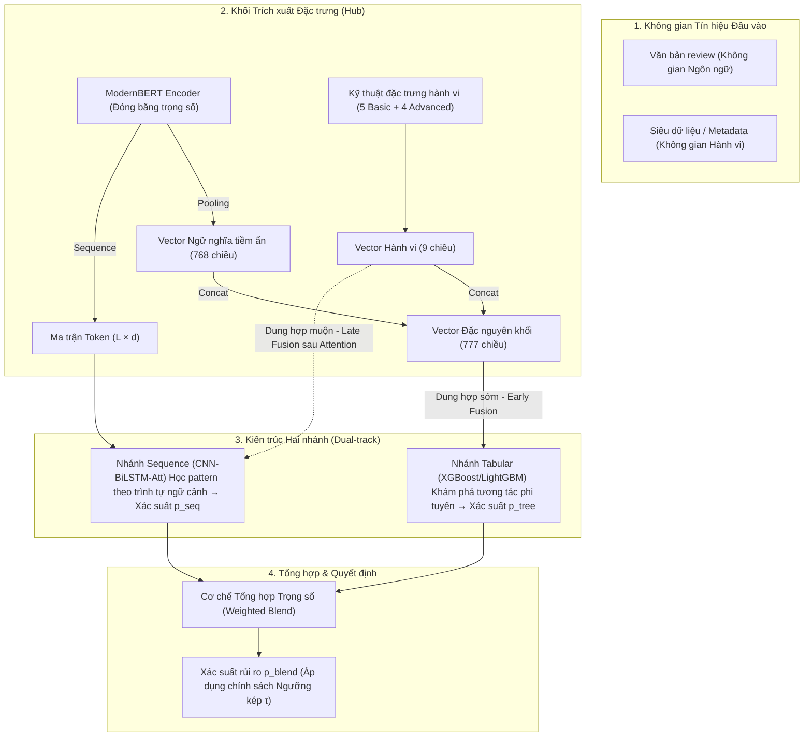
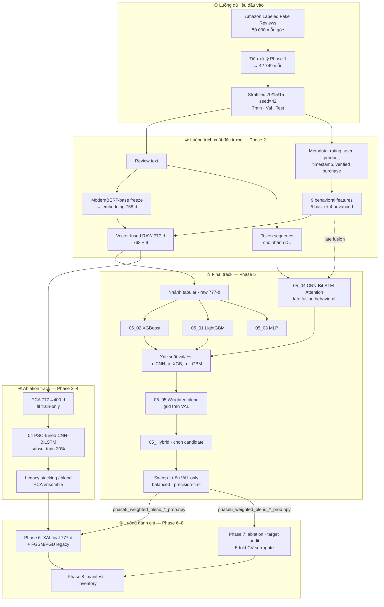
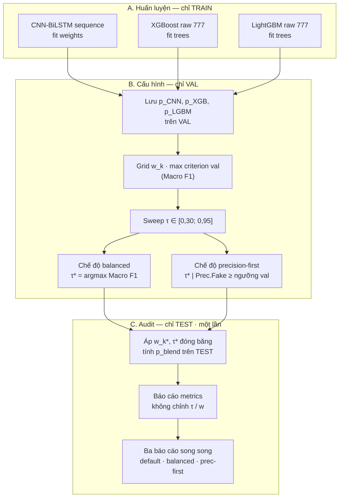
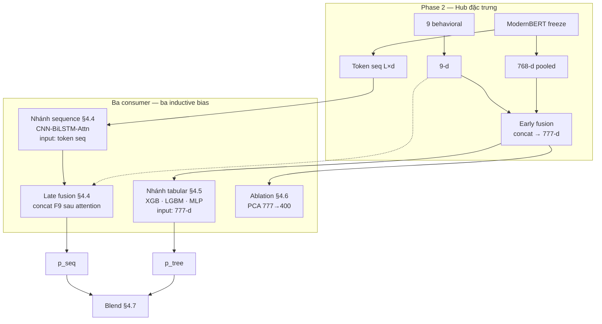

# Thesis_Full

# CHƯƠNG 1: TỔNG QUAN VỀ ĐỀ TÀI NGHIÊN CỨU

**Đề tài:** Phát hiện đánh giá giả trên Amazon bằng pipeline hai nhánh ModernBERT–đặc trưng hành vi–ensemble CNN–GBDT với ngưỡng kép phục vụ kiểm duyệt

*Dual-Track ModernBERT and Behavioral Fusion with Threshold-Selected CNN–GBDT Ensemble for Amazon Fake Review Detection*

---

## 1.1. Đặt vấn đề

### 1.1.1. Bối cảnh: đánh giá trực tuyến như hạ tầng tín nhiệm

Thương mại điện tử đã trở thành kênh phân phối chủ lực: người tiêu dùng không thể sờ, dùng thử hay kiểm định chất lượng sản phẩm trước khi thanh toán, nên phải dựa vào tín hiệu gián tiếp — đặc biệt là **đánh giá và xếp hạng sao** — để giảm rủi ro mua hàng. Ở quy mô toàn cầu, doanh thu bán lẻ trực tuyến đạt **4,4 nghìn tỷ USD** năm 2023 (tăng từ 1,3 nghìn tỷ USD năm 2014), chiếm **~20%** tổng bán lẻ; dự báo đạt **6,8 nghìn tỷ USD** và **~24%** vào năm 2028 (Forrester Research, 2024). Tại Hoa Kỳ — thị trường Amazon chiếm vị thế dẫn đầu — doanh thu bán lẻ trực tuyến theo quý đã vượt ngưỡng **491 tỷ USD** vào cuối 2024, chiếm khoảng **40.4%** tổng bán lẻ (Lebow, S., 2024).

**Bảng 1.0.** Quy mô thị trường thương mại điện tử (toàn cầu và Hoa Kỳ)

| Chỉ số | Giá trị | Năm / kỳ | Nguồn |
| --- | --- | --- | --- |
| Doanh thu TMDT toàn cầu | 4,4 nghìn tỷ USD | 2023 | Forrester Research (2024) |
| Tỷ trọng bán lẻ trực tuyến / tổng bán lẻ toàn cầu | ~20% | 2023 | Forrester Research (2024) |
| Dự báo doanh thu TMDT toàn cầu | 6,8 nghìn tỷ USD | 2028 | Forrester Research (2024) |
| Dự báo tỷ trọng trực tuyến | ~24% | 2028 | Forrester Research (2024) |
| Doanh thu bán lẻ trực tuyến Hoa Kỳ (theo quý) | 491.65 tỷ USD | Q4/2024 | Lebow, S. (2024) |
| Tỷ trọng e-commerce / bán lẻ Hoa Kỳ | ~6.6% | Q4/2024 | Lebow, S. (2024) |

Trên các nền tảng quy mô lớn như Amazon, mỗi quyết định “có nên mua hay không” thường được tổng hợp từ điểm trung bình, số lượng review, nội dung văn bản, nhãn *Verified Purchase* và thời điểm đăng tải. *Coalition for Trusted Reviews* ước tính đánh giá trực tuyến ảnh hưởng tới gần **4 nghìn tỷ USD** chi tiêu tiêu dùng toàn cầu mỗi năm (trích dẫn trong Amazon Staff, 2025) — cho thấy quy mô “kinh tế đánh giá” ngang tầm một ngành công nghiệp lớn.

Nghiên cứu kinh tế học chỉ ra rằng chênh lệch nhỏ trên thang điểm năm sao có thể chuyển hóa thành thay đổi đáng kể về doanh thu và sức cạnh tranh giữa người bán: trên Yelp, tăng **1 sao** trung bình gắn với tăng doanh thu khoảng **5–9%** (Michael Luca 2016). Đánh giá vì thế không còn là phản hồi phụ, mà là **tài sản kinh tế** ảnh hưởng trực tiếp đến khả năng hiển thị sản phẩm (*visibility*), thuật toán gợi ý và niềm tin thương hiệu.

**Bảng 1.1.** Chỉ số kinh tế–hành vi liên quan đến đánh giá trực tuyến

| Chỉ số | Giá trị / mô tả | Ý nghĩa với đề tài | Nguồn |
| --- | --- | --- | --- |
| Chi tiêu bị ảnh hưởng bởi review | ~4 nghìn tỷ USD/năm (toàn cầu) | Gian lận tác động hàng loạt quyết định mua | Amazon Staff (2025); Coalition for Trusted Reviews (n.d.) |
| Tăng 1 sao trung bình → doanh thu | +5% đến +9% | Review giả làm méo tín hiệu kinh tế | Luca & Zervas (2016) |
| Tỷ lệ fake trên corpus thực nghiệm | ~40% (42.749 mẫu) | Dữ liệu mất cân bằng, không dùng Accuracy đơn thuần | Amazon Labeled Fake Reviews; §1.3 |
| Bài toán hình thành sớm trên Amazon | Từ 2008 | Corpus và baseline Tier A tái sử dụng được | Jindal & Liu (2008) |

Trong hành trình mua hàng điển hình — **nhận thức nhu cầu → tìm kiếm → so sánh → đánh giá rủi ro → thanh toán → phản hồi sau mua** — đánh giá trực tuyến đóng vai trò thay thế cho trải nghiệm trực tiếp tại cửa hàng. Người mua không chỉ đọc điểm sao trung bình mà còn đọc nội dung chi tiết, so sánh tỷ lệ *Verified Purchase*, quan sát phân bổ thời gian đăng tải và đối chiếu giữa các sản phẩm cạnh tranh. Khi bất kỳ tín hiệu nào trong chuỗi này bị thao túng, quyết định mua dựa trên thông tin không trung thực — dù thuật toán gợi ý hay giao diện người dùng vẫn hoạt động bình thường về mặt kỹ thuật.

Với đồ án thuộc lĩnh vực **bảo mật thương mại điện tử**, góc nhìn then chốt không nằm ở “điểm số mô hình” đơn thuần mà ở **tính toàn vẹn thông tin** (*information integrity*): khi tín hiệu phản hồi bị làm nhiễu có chủ đích, toàn bộ chuỗi giá trị từ so sánh sản phẩm → đánh giá rủi ro → quyết định mua bị đứt gãy ở bước trung gian. Người tiêu dùng mua sai kỳ vọng, tăng tỷ lệ hoàn trả và khiếu nại; người bán trung thực mất cơ hội cạnh tranh công bằng vì bị lấn át bởi đối thủ dùng review giả; nền tảng chịu chi phí kiểm duyệt, điều tra, xử lý tranh chấp và suy giảm niềm tin dài hạn. Từ góc nhìn an ninh thông tin, đánh giá giả là dạng **tấn công vào không gian dữ liệu công khai** mà cả thuật toán lẫn người dùng đều mặc định tin cậy — không phá hệ thống bằng exploit kỹ thuật truyền thống, mà bằng **thao túng nội dung** (*content manipulation*) ở tầng ứng dụng.

**Bảng 1.2.** Tác động của đánh giá giả lên các bên liên quan

| Bên liên quan | Rủi ro khi đánh giá bị làm nhiễu | Hệ quả dài hạn |
| --- | --- | --- |
| Người tiêu dùng | Mua sai kỳ vọng, lãng phí chi phí | Giảm niềm tin vào TMDT nói chung |
| Người bán trung thực | Mất visibility so với đối thủ spam | Rời nền tảng, thị trường kém lành mạnh |
| Nền tảng | Chi phí kiểm duyệt, khiếu nại, pháp lý | Suy giảm uy tín thương hiệu |
| Hệ sinh thái TMDT | Thông tin thị trường bị méo | Phân bổ nguồn lực sai, cạnh tranh không công bằng |

**Bảng 1.2a.** Vai trò của đánh giá trực tuyến trong hệ sinh thái TMDT

| Khía cạnh | Chức năng | Hệ quả khi bị gian lận |
| --- | --- | --- |
| Tín nhiệm | Thay thế trải nghiệm trực tiếp | Suy giảm niềm tin toàn nền tảng |
| Cạnh tranh | Phân biệt chất lượng người bán | Người bán trung thực bị loại |
| Khám phá | Ảnh hưởng gợi ý / xếp hạng | Sản phẩm kém được đẩy lên top |
| Chi phí thông tin | Giảm chi phí tìm kiếm | Người mua chịu sai lệch, hoàn trả tăng |

*Nguồn: Luca và Zervas (2016); Jindal và Liu (2008).*

### 1.1.2. Thực trạng gian lận và áp lực pháp lý–vận hành (nên gom gọn lại, chi tiết chuyển xuống 2.1)

Bài toán *opinion spam* — đánh giá tạo ra có chủ đích, không phản ánh trải nghiệm thật — được Jindal và Liu (2008) hình thành sớm trên chính dữ liệu Amazon. Họ phân loại spam thành ba dạng: **quảng bá** (*promotional* — khen quá mức để đẩy sản phẩm), **phá hoại** (*demotional* — hạ uy tín đối thủ) và **không mang thông tin** (*non-review*). Hơn một thập kỷ sau, hình thức gian lận đã **công nghiệp hóa**: xuất hiện chuỗi cung ứng *review broker* (mua/bán review, hoàn tiền đổi sao 5), farm tài khoản, dịch vụ viết review theo gói và gần đây là văn bản do mô hình ngôn ngữ lớn (LLM) tạo sinh — ngữ phong tự nhiên, đa dạng cấu trúc câu, khó phân biệt bằng quy tắc tĩnh hay từ điển từ khóa.

Động lực kinh tế làm gian lận bền vững: lợi ích thao túng nhận thức (tăng doanh số, đẩy sản phẩm lên top tìm kiếm) thường lớn hơn chi phí rủi ro bị phát hiện, đặc biệt với seller mới hoặc sản phẩm cạnh tranh gay gắt (Luca, 2016). Mỗi fake negative review có thể làm giảm doanh thu seller khoảng **0,5–1%** (Luca , 2016). Khi chi tiêu bị ảnh hưởng bởi review lên tới hàng nghìn tỷ USD (Bảng 1.1), chi phí cơ hội của việc để spam lọt qua trở nên rất lớn.

Khái niệm **review broker** — tổ chức/cá nhân bán hoặc kích thích đánh giá giả đổi tiền, quà hoặc hoàn tiền (Coalition for Trusted Reviews, n.d.) — mô tả chuỗi cung ứng: người bán đặt hàng → broker phân phối → người viết đăng bài (đôi khi kèm đơn *Verified Purchase*) → thanh toán. Chuỗi này đã **công nghiệp hóa** và là động lực chính của gian lận hiện đại (Amazon Staff, 2025).

Phía phòng thủ, Amazon công bố đã **chặn hơn 275 triệu** đánh giá nghi ngờ giả trong năm 2024, kết hợp mô hình học máy, điều tra con người và kiện hàng trăm broker (Amazon Staff, 2025). Ở tầng pháp lý, FTC (Hoa Kỳ) ban hành **Trade Regulation Rule on Consumer Reviews and Testimonials** — cấm đánh giá giả, mua bán review, suppression và chứng thực không có căn cứ — có hiệu lực từ tháng 10/2024, kèm chế tài dân sự (Federal Trade Commission, 2024, 2025). Các động lực này cho thấy phát hiện đánh giá giả không chỉ là chủ đề học thuật mà là **nhu cầu vận hành và tuân thủ** ngày càng bắt buộc.

**Bảng 1.3.** Phản ứng hệ sinh thái đối với đánh giá giả (2023–2025)

| Tổ chức / cơ chế | Hành động chính | Số liệu nổi bật | Nguồn |
| --- | --- | --- | --- |
| Amazon | ML + điều tra + kiện broker | Chặn **>275 triệu** review nghi ngờ giả (2024); kiện **115** broker (2 năm); **>40** website broker ngừng hoạt động (2024) | Amazon Staff (2025) |
| Coalition for Trusted Reviews | Phối hợp ngành (thành lập 2023) | Amazon, Tripadvisor, Booking.com, Expedia, Trustpilot…; định nghĩa chung *review broker* | Amazon Staff (2025); Coalition for Trusted Reviews (n.d.) |
| FTC (Hoa Kỳ) | Quy định cấm review giả | Rule có hiệu lực **10/2024**; civil penalty cho mua/bán review, suppression | Federal Trade Commission (2024, 2025) |
| Xu hướng gian lận xưa–nay | **Giai đoạn trước 2019:** Khai thác lỗ hổng bằng crowdsourcing (thuê người viết). Hệ thống phòng thủ chủ yếu dựa vào khai phá đặc trưng văn bản và hành vi truyền thống (Machine Learning) *(Trích dẫn: Ren & Ji, 2019).*
**Giai đoạn 2023 - nay:** Công nghiệp hóa bằng mạng lưới bot farm và văn bản tạo sinh (LLM). Đòi hỏi hệ thống phòng thủ phải tiến hóa sang Deep Learning, Graph-based và phân tích đa phương thức *(Trích dẫn: Gupta et al., 2024).* | Chi phí tạo spam giảm; chi phí kiểm duyệt tăng theo quy mô catalog | Gupta et al. (2024); Ren & Ji (2019) |

*Nguồn tổng hợp: Amazon Staff (2025); Federal Trade Commission (2024, 2025).*

**Bảng 1.4.** Timeline gian lận, phản ứng hệ sinh thái và paradigm phát hiện (2008–2026)

| Giai đoạn | Gian lận tiêu biểu | Phản ứng nền tảng / pháp lý | Paradigm FRD học thuật | Nguồn |  |
| --- | --- | --- | --- | --- | --- |
| **2008–2012** | Spam thủ công; promotional/demotional | Chính sách nền tảng sơ khai | Feature + LR/SVM; đặt nền *opinion spam* | Jindal & Liu (2008); Ott et al. (2011) |  |
| **2013–2017** | Farm review, burst theo sản phẩm | Siết *Verified Purchase* | Behavioral metadata; Graph-based (MRF/LBP) | Mukherjee et al. (2013); Rayana & Akoglu (2015) |  |
| **2018–2022** | Review broker, hoàn tiền đổi sao 5 |  Chính sự "bất lực" của các cơ chế kiểm soát tĩnh từ nền tảng trong giai đoạn này đã tạo ra khoảng trống (research gap) buộc các nhà nghiên cứu học thuật (như Bhuvaneshwari hay Shah) phải đề xuất các mô hình Học sâu (Deep Learning) và Học chủ động (Active Learning) phức tạp hơn để tự động hóa việc phát hiện | Word Embeddings (Word2vec), CNN, BiLSTM; Active Learning + PCA | Bhuvaneshwari et al. (2021); Shah (2019) |  |
| **2023** | Broker công nghiệp hóa | **Coalition for Trusted Reviews** | Hybrid text + rating + aspect | Duma et al. (2023); Amazon Staff (2025) |  |
| **2024** | LLM-generated review; suppression | FTC Rule (10/2024); chặn **>275 triệu** review | Khảo sát G1–G8; Hướng tới multimodal | Federal Trade Commission (2024); Gupta et al. (2024) |  |
| **2024–2025** | Spam đa phương thức, đồ thị | Kiện **115** broker; **>40** site ngừng hoạt động | Graph FRD (GNNs xử lý mất cân bằng & tính dị hình); Multimodal | Jing et al. (2024);Gupta et al., 2024; *Amazon Staff,* |  |
| **2026** | Spam tinh vi + yêu cầu audit | Bối cảnh đề tài | Dual-track ModernBERT + behavioral + GBDT | Chương 3–4 |  |
|  |  |  |  |  |  |

Ba xu hướng cấu trúc:

**(1) Xu hướng Gian lận (Chi phí giảm, quy mô tăng): Gian lận** thủ công → broker → LLM — chi phí tạo spam ggiảm→ Lượng spam bùng nổ;

**(2)Xu hướng Phòng thủ (Chuyển dịch về bản chất): Phòng thủ** chính sách nội bộ → phối hợp ngành (2023) → pháp lý hóa (FTC 2024);

**(3) Xu hướng học thuật**  **Fake Review Detection: FRD học thuật** đơn tín hiệu → hybrid → đa paradigm, nhưng báo cáo/tái lập chưa theo kịp (Gupta et al., 2024; Ren & Ji, 2019). *Ren & Ji (2019) là  khảo sát đánh giá về tính tái lập - reproducibility (2019), được trích xuyên suốt luận văn — không phải sự kiện chuyển giao mô thức (paradigm) 2024–2025.* Chi tiết lý thuyết và so sánh thuật toán: Chương 2, §2.2–§2.3.

Tuy nhiên, áp lực pháp lý và quy mô chặn spam không đồng nghĩa với bài toán đã được giải quyết. Nền tảng hiếm công bố tỷ lệ false positive/false negative theo chuẩn thống nhất; người bán và người mua vẫn khiếu nại về review bị gỡ nhầm hoặc spam lọt qua. Hệ thống phòng thủ do đó phải đáp ứng **hai ràng buộc đối lập**:

 (i) **recall** đủ cao để không bỏ sót quá nhiều spam trong luồng kiểm duyệt rộng;

(ii) **precision** đủ cao ở chế độ tự động gắn cờ để không penalize khách hàng thật — vì false positive tương đương thiệt hại uy tín và có thể vi phạm chính sách nền tảng (Ren & Ji, 2019).

Đây chính là lý do đề tài không chỉ tối ưu một metric duy nhất mà thiết kế **chính sách ngưỡng kép** (*dual-threshold*) phục vụ hai kịch bản vận hành khác nhau (§1.2.2, M1–M2).

### 1.1.3. Khoảng trống kỹ thuật và lý do chọn hướng đề tài

Song song với áp lực thị trường, cộng đồng nghiên cứu *fake review detection* (FRD) đã phát triển từ feature thủ công (Jindal & Liu, 2008; Ott et al., 2011) sang học sâu (CNN, BiLSTM), Transformer (BERT, ModernBERT) và gần đây là graph neural network (Jing et al., 2024) hay đa phương thức (Veluru et al., 2025). Tuy nhiên, tiến bộ mô hình chưa đồng bộ với tiêu chuẩn **báo cáo và tái lập** mà bối cảnh vận hành đòi hỏi. Khảo sát gần đây (Gupta et al., 2024) cùng khảo sát trước đó (Ren & Ji, 2019) tổng hợp rằng phần lớn công trình vẫn gặp ba hạn chế hệ thống:

- **Thứ nhất — Đơn tín hiệu và thiếu tích hợp:** Phần lớn các nghiên cứu hiện tại có xu hướng chỉ phân tích văn bản (review-centric) hoặc hành vi người dùng (reviewer-centric) một cách riêng lẻ,. Tuy nhiên, những kẻ gian lận ngày càng tinh vi khiến văn bản đánh giá giả rất giống với đánh giá thật. Các chuyên gia chỉ ra rằng, việc thiếu đi sự tích hợp đồng thời (kết hợp các mô hình ngôn ngữ hiện đại với đặc trưng hành vi và cấu trúc thuật toán) khiến các mô hình không đạt được hiệu suất tối ưu và dễ bị qua mặt,.
- **Thứ hai — Metric báo cáo không phản ánh đúng thực tế triển khai:** Các bộ dữ liệu đánh giá giả trong thực tế thường có tính mất cân bằng cực cao (số lượng đánh giá giả ít hơn rất nhiều so với đánh giá thật),. Việc sử dụng Độ chính xác tổng thể (Accuracy) làm thước đo chính trên dữ liệu mất cân bằng là một sự sai lệch,. Trong bối cảnh thương mại điện tử thực tế, nền tảng cần các cơ chế như **ngưỡng kép** nhằm **ưu tiên độ chính xác (precision) cho lớp Fake** để kiểm duyệt, bởi hệ thống thà bỏ sót một vài đánh giá giả còn hơn là khóa nhầm hoặc xóa nhầm đánh giá của một người dùng chân chính.
- **Thứ ba — Thiếu khả năng tái lập và đánh giá thành phần (ablation):** Nhiều mô hình học sâu hiện nay hoạt động như một "hộp đen" với độ phức tạp tính toán cao và thiếu tính minh bạch,. Việc các công trình hiếm khi công bố rõ ràng các tham số cấu hình, cách chọn ngưỡng quyết định, bộ giảm chiều dữ liệu (như PCA) hay đóng góp của từng thành phần trên cùng một tập dữ liệu khiến cho việc kiểm chứng, tái lập và so sánh với các kỹ thuật mới (SOTA) trở nên cực kỳ khó khăn và thiếu tính tin cậy,.

Amazon được chọn làm bối cảnh thực nghiệm vì:

- **Hệ sinh thái lớn và ảnh hưởng trực tiếp:** Đánh giá trực tuyến trên Amazon đóng vai trò chi phối mạnh mẽ đến khả năng hiển thị, giá cả và quyết định mua hàng của người tiêu dùng. Những lợi ích tài chính khổng lồ tạo ra động cơ cực lớn cho các hành vi thao túng và spam đánh giá,.
- **Tính chuẩn mực của dữ liệu:** Amazon là một trong những nền tảng đầu tiên hình thành vấn nạn *opinion spam*, và cũng là nguồn dữ liệu nền tảng được Jindal & Liu (2008) sử dụng để định hình bài toán FRD, khiến các corpus từ Amazon trở thành một trong những tài nguyên uy tín và được tái sử dụng rộng rãi nhất để nghiên cứu,.

**Vấn đề cần giải quyết** được cụ thể hóa như sau: *Làm thế nào để xây dựng pipeline phát hiện đánh giá giả trên Amazon Labeled Fake Reviews, kết hợp ModernBERT, đặc trưng hành vi, học sâu chuỗi và ensemble GBDT, có chính sách ngưỡng kép phục vụ triển khai e-commerce, đồng thời đảm bảo tái lập và ablation có kiểm soát trong ràng buộc RAM ≤ 12GB?*

Hướng trả lời của đề tài là pipeline **hai nhánh** (*dual-track*): nhánh chính (*final track*) — raw 777-d + sequence + weighted blend + dual-threshold; nhánh ablation — PCA/PSO song song cho *negative result* và so sánh có trách nhiệm. Kiến trúc chi tiết tại Chương 3; bằng chứng số liệu tại Chương 4; cơ sở lý thuyết và 19 FRD + 1 foundational tại Chương 2 (§2.2.3).

---

## 1.2. Mục tiêu nghiên cứu

### 1.2.1. Mục tiêu tổng quát

Xây dựng và đánh giá hệ thống phát hiện đánh giá giả trên *Amazon Labeled Fake Reviews*, trong ràng buộc Google Colab (RAM ≤ 12GB, GPU Tesla T4), với artifact đầy đủ phục vụ tái lập.

**Bảng 1.5.** Mục tiêu cụ thể, ngưỡng và lý do đặt ra

| Mã | Mục tiêu | Ngưỡng | Lý do đặt mục tiêu như vậy |
| --- | --- | --- | --- |
| **M1** | Đảm bảo năng lực phân loại cân bằng trên dữ liệu lệch (Class-Imbalanced Classification Capability) | Macro F1 ≥ 0,89 | Dùng **Macro F1** thay Accuracy vì tập có tỷ lệ fake ~40% — Accuracy dễ “đẹp” khi thiên lớp đa số (Ott et al., 2011; Ren & Ji, 2019). Macro F1 trung bình đều F1 từng lớp, phản ánh khả năng bắt cả review giả lẫn giữ đúng review thật. Ngưỡng **0,89** đặt **cao hơn** nhiều baseline Tier A đã kiểm chứng trên Amazon (ví dụ vùng ~0,82–0,90 Accuracy/F1 trong các paper cũ) nhưng **khả thi** trong ràng buộc Colab 12GB — vừa là thước đo nội bộ đồ án, vừa là mốc so sánh có ý nghĩa với CNN-BiLSTM/BERT trên cùng corpus (Bhuvaneshwari et al., 2021; Refaeli & Hajek, 2021). |
| **M2** | Tối ưu hóa độ chuẩn xác (Precision) cho lớp đánh giá giả mạo nhằm giảm thiểu rủi ro vận hành (Precision-First for Fake Class) | Precision Fake ≥ 0,975 | Trên nền tảng, **false positive** (gắn nhãn giả cho review thật) gây thiệt hại trực tiếp: khách hàng hợp pháp bị penalize, uy tín seller bị tổn hại (Luca & Zervas, 2016). Chế độ *precision-first* phục vụ kịch bản **auto-flag** — chỉ đánh dấu khi mô hình rất chắc là fake. Gupta et al. (2024) (Gap **G7**) chỉ ra hiếm paper báo cáo đồng thời macro F1 balanced và precision cao cho lớp spam; ngưỡng **0,975** thể hiện cam kết “ưu tiên không khóa nhầm” ở mức vận hành nghiêm ngặt. |
| **M3** | Tối đa hóa khả năng phân tách xác suất độc lập với ngưỡng (Threshold-Independent Discrimination) | ROC-AUC ≥ 0,93 | ROC-AUC đo khả năng **xếp hạng** xác suất, **không phụ thuộc** một ngưỡng τ cố định — bổ sung cho M1/M2 vốn gắn với τ chọn trên validation. Ngưỡng **0,93** đảm bảo mô hình tách được hai lớp ở mức ranking tốt trước khi áp dụng dual-threshold; nếu AUC thấp, việc tinh chỉnh τ trên val không có ý nghĩa ổn định. |
| **M4** | Thiết lập tiêu chuẩn minh bạch, chống rò rỉ dữ liệu và đảm bảo khả năng tái lập | Seed 42; split 70/15/15; fit train-only; test audit 1 lần | Lấp Gap **G4** (Gupta et al., 2024): nhiều công trình không mô tả leakage (scaler/PCA fit trên toàn bộ data, test bị “nhìn” nhiều lần khi chỉnh τ). Đề tài **công khai** seed, tỷ lệ split, và quy tắc **test chỉ đánh giá một lần** sau khi đóng băng cấu hình — để giảng viên/bên thứ ba có thể audit hoặc rerun notebook. |
| **M5** | Đối chiếu hiệu suất (Benchmarking) có trách nhiệm theo từng phân khúc kiến trúc | Tier A text/tabular | Không claim “SOTA tuyệt đối” trên mọi paradigm: chỉ so **cùng loại bài toán** — phân loại text/tabular trên Amazon — với **19 FRD** đã verify (Chương 2, Bảng 2.2; khung comparable/non-comparable §4.7). Graph (Jing et al., 2024) và multimodal (Veluru et al., 2025) chỉ là bối cảnh Tier B — tránh so sánh số sai metric/dataset (Gupta et al., 2024). |
| **M6** | Định lượng đóng góp thành phần thông qua nghiên cứu bóc tách có kiểm soát (Controlled Ablation Study) | Δ Macro F1 theo thành phần | Lấp Gap **G8**: novelty cần **bằng chứng định lượng** — PCA có thực sự cần trên fused 777-d? Behavioral đóng góp bao nhiêu khi đã có ModernBERT? Ensemble có vượt single model? PSO có justify chi phí? Ablation Models A–E trên **cùng split** trả lời các câu hỏi này, tránh claim “hybrid tốt hơn” không có số liệu hỗ trợ. |

**Ánh xạ M1–M6 ↔︎ RQ ↔︎ Gaps:** Mỗi mục tiêu trả lời một “câu hỏi kiểm chứng” riêng, tránh trùng lặp hoặc mơ hồ:

| Nhóm | Mục tiêu | Câu hỏi kiểm chứng | RQ liên quan | Gap lý thuyết |
| --- | --- | --- | --- | --- |
| Năng lực | M1, M2, M3 | “Mô hình có đủ tốt ở cả hai chế độ vận hành và ranking không?” | RQ2, RQ4, RQ5 | G7 |
| Tin cậy | M4 | “Kết quả có audit được, không leakage không?” | (toàn pipeline) | G4 |
| Vị trí | M5 | “So với Tier A cùng corpus, đứng ở đâu?” | RQ2 | G1–G3 |
| Đóng góp | M6 | “Thành phần nào thực sự mang lại Δ, thành phần nào có thể bỏ?” | RQ1, RQ3, RQ6 | G8 |

Tóm lại, **M1–M3** đo *năng lực mô hình*; **M4** đo *độ tin cậy quy trình*; **M5** đo *vị trí tương đối trong tài liệu*; **M6** đo *đóng góp từng thành phần*. Bốn nhóm này khớp với câu hỏi nghiên cứu RQ1–RQ6 (§1.2.3) và được kiểm chứng tại Chương 4. Việc đặt mục tiêu **trước** khi chạy Phase 7 (audit `phase7_target_audit.csv`) đảm bảo đồ án không “điều chỉnh mục tiêu theo kết quả” (*post-hoc goal shifting*) — một lỗi phương pháp luận mà Gupta et al. (2024) cảnh báo trong khảo sát reproducibility.

### 1.2.3. Câu hỏi nghiên cứu

- **RQ1:** *Có thể thiết kế một hệ thống phát hiện đánh giá giả trên tập dữ liệu Amazon (có tính mất cân bằng) đạt hiệu suất cao bằng cách tích hợp mô hình ngôn ngữ lớn (ModernBERT) và đặc trưng hành vi, đồng thời đáp ứng các tiêu chuẩn khắt khe của thương mại điện tử về giới hạn rủi ro khóa nhầm và tính tái lập minh bạch không?*
- **RQ2:** *Việc tích hợp đồng thời ngữ nghĩa từ ModernBERT, đặc trưng hành vi  thông qua **kiến trúc hai nhánh (dual-track: GBDT và học sâu chuỗi) kết hợp tổng hợp dự đoán (ensemble)** đóng góp định lượng như thế nào vào khả năng phân loại trên tập dữ liệu mất cân bằng, và các kỹ thuật giảm chiều (như PCA) có thực sự duy trì được hiệu quả trong ràng buộc phần cứng (RAM ≤ 12GB) thông qua đánh giá bóc tách (ablation) không?*
- **RQ3:** *Làm thế nào để thiết lập một chính sách ngưỡng kép (dual-threshold) dựa trên khả năng xếp hạng xác suất rủi ro , nhằm tối ưu hóa độ chuẩn xác (Precision) cho lớp đánh giá giả, từ đó giải quyết bài toán ưu tiên không trừng phạt nhầm người dùng hợp pháp trên nền tảng thương mại điện tử?*
- **RQ4:** *Việc áp dụng quy trình kiểm soát rò rỉ dữ liệu (zero data leakage) nghiêm ngặt từ khâu tiền xử lý đến đánh giá ảnh hưởng thế nào đến tính tái lập của mô hình, và hệ thống đạt hiệu suất ra sao khi đối chiếu một cách có kiểm soát với các kiến trúc Tier A cùng loại trên văn bản/dữ liệu bảng?*

---

## 1.3. Đối tượng và phạm vi nghiên cứu

**Đối tượng nghiên cứu:** Nghiên cứu này tập trung vào các mô hình và kỹ thuật phân loại nhị phân (fake/genuine) nhằm phát hiện các đánh giá sản phẩm giả mạo trên nền tảng thương mại điện tử.

**Phạm vi dữ liệu:** Đề tài thực nghiệm trên tập dữ liệu *Amazon Labeled Fake Reviews* bằng tiếng Anh. Sau quá trình làm sạch và tiền xử lý, tập dữ liệu thu về gồm 42.749 mẫu đánh giá với tỷ lệ mất cân bằng nhẹ (khoảng 40% là đánh giá giả mạo). Dữ liệu được phân chia theo phương pháp phân tầng (stratified split) với tỷ lệ 70/15/15 cho các tập huấn luyện, xác thực và kiểm tra, được neo cố định bởi giá trị seed = 42 để đảm bảo tính tái lập.

**Phạm vi kỹ thuật:** Hệ thống phát hiện được giới hạn trong việc xây dựng một pipeline hai nhánh (dual-track). Cụ thể, đề tài sử dụng ModernBERT đóng vai trò là bộ trích xuất đặc trưng (feature extractor) kết hợp cùng 9 đặc trưng hành vi người dùng. Quá trình phân loại được thực hiện thông qua mạng học sâu chuỗi (CNN-BiLSTM-Attention) và thuật toán dạng cây (XGBoost/LightGBM), sau đó tổng hợp bằng cơ chế weighted ensemble kết hợp chính sách ngưỡng kép (dual-threshold). Bên cạnh đó, nghiên cứu cũng giới hạn việc đánh giá cắt bỏ (ablation) bằng kỹ thuật PCA/PSO và áp dụng XAI (SHAP/LIME) trên một tập con (subset) để giải thích mô hình.

**Giới hạn của nghiên cứu:** Do những giới hạn về tài nguyên phần cứng (RAM ≤ 12GB) cũng như để đảm bảo tính tập trung, đề tài không triển khai các kiến trúc mạng nơ-ron đồ thị (Graph NN) quy mô lớn, không tinh chỉnh toàn bộ trọng số (fine-tune end-to-end) mô hình Transformer, không xử lý dữ liệu đa phương thức (ảnh kèm văn bản), và không đánh giá chéo trên các tập dữ liệu khác (cross-dataset). Đồng thời, mô hình hiện dừng ở mức độ nghiên cứu và kiểm thử, chưa được ứng dụng trực tiếp vào môi trường kiểm duyệt thời gian thực (production realtime) của các nền tảng. Những hướng tiếp cận này chỉ được sử dụng làm bối cảnh tham chiếu về mặt lý thuyết và đối sánh kết quả thực nghiệm

---

## 1.4. Phương pháp nghiên cứu

Nghiên cứu này được thực hiện theo hướng tiếp cận **thực nghiệm định lượng** kết hợp với phương pháp **đánh giá cắt bỏ có kiểm soát (controlled ablation)**. Phương pháp luận của đề tài được thiết kế bám sát các khuyến nghị khắt khe về tiêu chuẩn minh bạch và tính tái lập (reproducibility) trong các bài toán học máy, vốn đã được nhấn mạnh trong các nghiên cứu khảo sát của Gupta et al. (2024) và Ren & Ji (2019).

Về quy trình thực hiện, đề tài triển khai một đường ống (pipeline) phân tích khép kín và tuần tự. Quy trình bắt đầu bằng khâu làm sạch và tiền xử lý dữ liệu, tiếp nối là bước trích xuất đặc trưng đa không gian (bao gồm việc sử dụng mô hình ngôn ngữ lớn ModernBERT và các tín hiệu hành vi). Sau đó, quá trình huấn luyện được thực thi trên một kiến trúc hai nhánh (dual-track), khai thác sức mạnh song song của thuật toán dạng bảng GBDT và mạng học sâu chuỗi (Sequence DL). Ở các bước cuối, hệ thống tiến hành tổng hợp dự đoán (ensemble) để chọn ngưỡng quyết định, trước khi bước vào khâu đánh giá hiệu năng, giải thích mô hình (XAI) và chạy kiểm chứng cắt bỏ.

Điểm cốt lõi làm nên tính tin cậy trong phương pháp nghiên cứu của đồ án là việc tuân thủ nghiêm ngặt nguyên tắc **kiểm soát rò rỉ dữ liệu (zero data leakage)**. Cụ thể, toàn bộ các phép biến đổi dữ liệu (scaler, reducer), quá trình tìm kiếm trọng số tổng hợp (grid blend) và các ngưỡng quyết định phân loại (τ) đều chỉ được học (fit) từ tập huấn luyện (train); trong khi tập xác thực (validation) chỉ đóng vai trò hỗ trợ lựa chọn cấu hình. Tập kiểm tra (test với n = 6.413 mẫu) được cách ly tuyệt đối và chỉ được sử dụng để đánh giá **một lần duy nhất** sau khi đã đóng băng toàn bộ cấu hình mô hình.

Bên cạnh đó, nhằm đảm bảo tính toàn vẹn cho đường ống báo cáo chính (final track), các kỹ thuật thử nghiệm phụ như giảm chiều PCA và tối ưu hóa bầy đàn PSO được thiết lập để chạy trên một nhánh đối chứng (ablation track) hoàn toàn song song. Nhánh đối chứng này chỉ phục vụ mục đích so sánh học thuật, tuyệt đối không thay thế hay làm nhiễu nhánh chính ở bước suy luận (inference) cuối cùng

---

## 1.5. Ý nghĩa và cấu trúc luận văn

### 1.5.1. Ý nghĩa nghiên cứu

Là tài liệu học tập :)))

Đóng góp nổi bật nhất của luận văn là thiết lập một khung tiếp cận **"phòng thủ có kiểm chứng" (verifiable defense)** nhằm bảo vệ tính toàn vẹn dữ liệu trước vấn nạn thao túng đánh giá trên thương mại điện tử. Về mặt phương pháp luận, nghiên cứu định hình tiêu chuẩn thực nghiệm minh bạch thông qua giao thức kiểm soát rò rỉ dữ liệu (zero data leakage) nghiêm ngặt và giải quyết khoảng trống đánh giá bằng bộ thước đo đa chiều gắn chặt với kịch bản vận hành. Tính toàn vẹn học thuật được khẳng định qua thiết kế kiến trúc hai nhánh (dual-track), trong đó nhánh đối chứng chủ đích công khai "kết quả âm tính" để bác bỏ sự phụ thuộc vào các kỹ thuật giảm chiều như PCA trên không gian vector kết hợp hiện đại, từ đó tạo ra một chuẩn mực so sánh hệ thống (SOTA) có giới hạn và trách nhiệm trong cùng phân tầng Tier A. Về mặt thực tiễn, đề tài chứng minh tính khả thi của hệ thống trên hạ tầng phần cứng phổ thông thông qua "chính sách ngưỡng kép": cung cấp chế độ ưu tiên độ chuẩn xác phục vụ tự động cắm cờ nhằm triệt tiêu rủi ro khóa nhầm người bán trung thực, đồng thời duy trì chế độ cân bằng đáp ứng hàng đợi kiểm duyệt thủ công, qua đó giải quyết trọn vẹn bài toán quản trị rủi ro niềm tin của các nền tảng quy mô lớn

### 1.5.2. Cấu trúc luận văn

Để giải quyết các mục tiêu đã đề ra một cách có hệ thống, luận văn được tổ chức thành 6 chương với mạch logic đi từ cơ sở lý luận đến triển khai thực nghiệm:

- **Chương 1 - Tổng quan về đề tài nghiên cứu:** Định hình bối cảnh, đặt vấn đề, xác định các mục tiêu và phạm vi giới hạn của đề tài.
- **Chương 2 - Cơ sở lý thuyết và tổng quan tài liệu:** Tổng hợp và đối sánh các nghiên cứu trước đây (SOTA) nhằm xác định các khoảng trống khoa học, đồng thời cung cấp lập luận lý thuyết cho việc lựa chọn các nền tảng thuật toán sẽ sử dụng.
- **Chương 3 - Phương pháp nghiên cứu:** Trình bày chi tiết đường ống (pipeline) kiến trúc hệ thống, các giao thức đánh giá, chia tập dữ liệu và khung tiêu chí đo lường chất lượng luận văn.
- **Chương 4 - Triển khai thực nghiệm và kết quả:** Trình bày quá trình huấn luyện, các kết quả đối chiếu, phân tích cắt bỏ (ablation study) và các báo cáo diễn giải mô hình (XAI).
- **Chương 5 - Thảo luận:** Thảo luận chuyên sâu về ý nghĩa của các phát hiện thực nghiệm, trả lời các câu hỏi nghiên cứu và nhìn nhận một cách khách quan những hạn chế còn tồn đọng của hệ thống.
- **Chương 6 - Kết luận:** Tổng kết các đóng góp cốt lõi của đề tài và đề xuất các định hướng nghiên cứu, cải tiến trong tương lai.

---

# CHƯƠNG 2: CƠ SỞ LÝ THUYẾT VÀ TỔNG QUAN TÀI LIỆU

---

## 2.1. Định nghĩa, phân loại và mô hình hóa bài toán

### 2.1.1. Khái niệm *opinion spam* / đánh giá giả

Jindal và Liu (2008) định nghĩa đánh giá giả là nhận xét **không phản ánh trải nghiệm mua–dùng thực tế**, được tạo **có chủ đích** để thao túng nhận thức người mua hoặc thuật toán xếp hạng. Hai trục này tách FRD khỏi phân loại cảm xúc thuần túy: một review có thể *tiêu cực* nhưng vẫn *genuine*, hoặc *tích cực* nhưng *fake*.

Từ góc kinh tế thông tin, spam review làm tăng bất cân xứng thông tin giữa seller và buyer (Luca & Zervas, 2016). Trong phạm vi học máy, đầu vào là cặp **(văn bản, metadata)**; đầu ra là nhãn nhị phân fake/genuine. Nhãn trên corpus Amazon là **proxy** do dataset gán — không đồng nhất với nhãn moderation nội bộ nền tảng (Ren & Ji, 2024).

### 2.1.2. Phân loại theo mục đích và hình thức

**Phân loại cổ điển** (Jindal & Liu, 2008; Ott et al., 2011) vẫn dùng để mô tả động cơ spam:

- **Promotional** — khen quá mức để đẩy sản phẩm.
- **Demotional** — hạ uy tín đối thủ.
- **Non-review** — nội dung không mang thông tin trải nghiệm.

**Phân loại mở rộng (2024–2026)** khi gian lận công nghiệp hóa (Gupta et al., 2024; Ren & Ji, 2024):

| Dạng | Đặc điểm | Hệ quả cho thiết kế mô hình |
| --- | --- | --- |
| LLM-generated | Ngữ phong tự nhiên, đa dạng | Feature tâm lý học (Ott, 2011) suy giảm → cần embedding sâu |
| Crowdsourced + verified | Reviewer thật, đơn verified thật | Rule đơn giản không đủ → cần học máy đa tín hiệu |
| Coordinated campaign | Burst theo sản phẩm/thời gian | Cần tín hiệu hành vi (và đôi khi graph) |
| AI paraphrase | Tránh trùng lặp văn bản | Cần ngữ nghĩa, không chỉ n-gram |

Đề tài chuẩn hóa về **phân loại nhị phân** fake/genuine — phù hợp moderation production (một quyết định) và corpus Amazon (~40% fake). Metric và protocol đánh giá: **Chương 3, §3.6**.

### 2.1.3. Mô hình hóa học máy

Từ các động cơ thao túng và phân loại đã trình bày, dưới góc độ khoa học máy tính, bài toán phát hiện đánh giá giả mạo (FRD) được mô hình hóa chính thức dưới dạng một bài toán phân loại nhị phân.. Cụ thể, giả sử hệ thống nhận được một tập dữ liệu quan sát Gọi $\mathcal{D}=\{(x_i,y_i)\}_{i=1}^{N}$, trong đó $x_i$ không chỉ là một văn vản đơn thuầ mà còn định nghĩa là một cặp không gian đặc trưng   $x_i=(\text{text}_i,\text{meta}_i)$ và $y_i\in\{0,1\}$ là nhãn tương ứn (với 1 đại diện cho đánh giá giả mạo và 0 là đánh giá chân thực). Mục tiêu cốt lõi  là tìm cách xấp xỉ học hàm $f(x)\approx P(y=1\mid x)$.

Điểm khác biệt cốt lõi của FRD trên thương mại điện tử so với các bài toán phân loại văn bản truyền thống nằm ở việc nó buộc phải khai thác đồng thời **hai không gian tín hiệu hoàn toàn độc lập**. Không gian thứ nhất là *không gian ngôn ngữ*, đại diện cho nội dung chi tiết của đánh giá. Không gian thứ hai là *không gian hành vi*, bao gồm các siêu dữ liệu (metadata) đi kèm như mức xếp hạng sao, thời gian đăng tải, hay trạng thái xác thực mua hàng.

Lập luận lý thuyết cho sự kết hợp bắt buộc này xuất phát từ thực tiễn gian lận hiện đại: những kẻ tấn công, với sự hỗ trợ của các mô hình ngôn ngữ sinh tạo (LLM), hoàn toàn có thể tạo ra những văn bản giả mạo với ngữ phong tự nhiên nhằm che giấu dấu vết ngôn ngữ. Tuy nhiên, theo Mukherjee và cộng sự (2013), việc tạo ra văn bản giả thì dễ, nhưng việc đồng bộ hóa các dấu vết hành vi (như vận tốc đăng bài hay lịch sử tài khoản) ở quy mô toàn chiến dịch lại là một thách thức vô cùng lớn đối với các nhóm spam. Do đó, việc tách bạch và mô hình hóa song song hai không gian tín hiệu này chính là tiền đề lý thuyết quan trọng nhất, dẫn đường cho thiết kế kiến trúc "dung hợp" (fusion) đa tín hiệu trong các công trình nghiên cứu hiện đại và định hình trực tiếp đường ống hai nhánh (dual-track) của luận văn trong các chương tiếp theo.

---

## 2.2. Tổng quan tài liệu nghiên cứu

### 2.2.1. Bốn dòng phát triển FRD (2008–nay)

Lịch sử học thuật (đối chiếu timeline thị trường: Chương 1, Bảng 1.4) không tiến theo đường thẳng mà **chồng lấn**:

**Dòng 1 — Nền tảng (2008–2012).** Jindal & Liu (2008) đặt định nghĩa *opinion spam* trên Amazon, thử feature thủ công + LR/SVM. Ott et al. (2011) tạo OpSpam 400 — corpus “cảm xúc giả” cân bằng hoàn hảo — và chứng minh dấu vết tâm lý học trong văn bản. Đóng góp: khung bài toán, benchmark chất lượng.

**Dòng 2 — Behavioral & graph (2011–2017).** Mukherjee et al. (2013) chuyển sang metadata: burstiness, rating deviation. Wang et al. (2011) và Rayana & Akoglu (2015) đưa **đồ thị** reviewer–product — mạnh với spam tập thể nhưng phụ thuộc cấu trúc mạng lưới và quy mô dữ liệu.

**Dòng 3 — Deep learning & Transformer (2018–2023).** Hajek et al. (2020), Bhuvaneshwari et al. (2021), Refaeli & Hajek (2021) dùng CNN, BiLSTM, Attention, BERT. Embedding ngữ cảnh vượt TF-IDF trước kỹ thuật paraphrase. Trade-off: chi phí tính toán cao, dễ overfit trên corpus nhỏ.

**Dòng 4 — Hybrid, tối ưu, khảo sát (2019–nay).** Shah (2019) PCA + active learning. Duma et al. (2023) hybrid text + rating + aspect. Ren & Ji (2019) và Gupta et al. (2024) **khảo sát hệ thống** — chỉ ra phân mảnh dataset, cảnh báo metric trên dữ liệu mất cân bằng, thiếu tính tái lập. Dòng 4 không thay Dòng 3 mà đặt câu hỏi: *kết hợp nào có ý nghĩa, báo cáo thế nào mới tin được?*

### 2.2.2. So sánh các paradigm ở mức khái niệm

Bảng 2.1 **tổng hợp** từ: (i) taxonomy trong khảo sát Gupta et al. (2024) — 98 papers FRD 2019–2023; (ii) nguyên tắc phân nhóm Ren & Ji (2024); (iii) ánh xạ lên **20 công trình** Bảng 2.2 (mỗi hướng có ít nhất một paper đại diện đã verify). Cột *Nguồn điển hình* trích ID Bảng 2.2 và tài liệu nền tảng.

**Bảng 2.1.** Các hướng FRD — tín hiệu, ưu/nhược, hiện trạng và nguồn tham chiếu

| Hướng | Tín hiệu | Điểm mạnh | Hạn chế | Hiện trạng 2024–2026 | Nguồn điển hình (Bảng 2.2 / nền tảng) |
| --- | --- | --- | --- | --- | --- |
| **ML cổ điển** | BoW, TF-IDF, POS, sentiment | Nhẹ; giải thích được; baseline mạnh trên corpus nhỏ | Mất ngữ cảnh; yếu paraphrase và LLM-spam | Baseline; ít dùng đơn lẻ | ID 1–2, 6–7 (Jindal & Liu, 2008; Ott et al., 2011; Kennedy et al., 2019; Shah, 2019) |
| **DL văn bản** | CNN, LSTM, BiLSTM, Attention | Bắt n-gram cục bộ và phụ thuộc trình tự | Cần data; overfit; khó scale ngữ nghĩa sâu | Backbone nhánh sequence | ID 8, 12 (Hajek et al., 2020; Bhuvaneshwari et al., 2021); Kim (2014) |
| **Transformer** | BERT, RoBERTa, **ModernBERT** | Self-attention — ngữ cảnh hai chiều; chống paraphrase | Chi phí RAM/GPU; nhiều paper text-only | **Chuẩn** feature extractor FRD | ID 11, 13, 16 (Gupta, 2021; Refaeli & Hajek, 2021; Mir et al., 2023); Devlin et al. (2019); Warner et al. (2024) |
| **Behavioral** | Velocity, burst, verified, rating deviation | Metadata khó giả đồng bộ quy mô lớn | Phụ thuộc trường metadata sẵn có | Bổ sung bắt buộc khi LLM che text | ID 3, 15 (Mukherjee et al., 2013; Duma et al., 2023) |
| **Graph** | Đồ thị reviewer–product–review | Bắt spam **tập thể**, quan hệ ẩn | RAM, scale; corpus Yelp ≠ Amazon | Tier B — tham chiếu, không so số trực tiếp | ID 4–5, 10, 20 (Rayana & Akoglu, 2015; Wang et al., 2017; Zhang et al., 2020; Wu et al., 2024) |
| **Ensemble / hybrid** | Kết hợp tree + DL + embedding | Giảm phương sai khi base đa dạng (Breiman, 1996) | Thiếu protocol τ và ablation trong nhiều paper | Xu hướng hybrid text+metadata | ID 10, 14, 15 (Zhang et al., 2020; Deshai & Rao, 2023; Duma et al., 2023) |
| **Multimodal / GNN SOTA** | Text + ảnh; heterogeneous GNN | SOTA trên benchmark riêng | Khác paradigm, dataset, metric — so số dễ sai | Bối cảnh ngoài Tier A | ID 19–20 (Veluru et al., 2025; Wu et al., 2024) |
| **Khảo sát / meta** | Taxonomy gap, reproducibility, Concept Drift  | Định hướng G1–G8, metric, leakage | Không số SOTA trực tiếp | Chuẩn mực báo cáo 2024+ | ID 17–18 (Gupta et al., 2024; Ren & Ji, 2024) |

*Cách đọc bảng:* Mỗi hàng là một **paradigm** trong tài liệu FRD; cột *Nguồn* chỉ paper **đã kiểm chứng** trong Bảng 2.2 hoặc trích dẫn nền tảng (BoW → Jindal/Ott; Transformer → Devlin/Warner; ensemble → Breiman). Gupta et al. (2024) xác nhận text-only Transformer vẫn chiếm đa số (→ G1); Ren & Ji (2024) nhấn graph và multimodal là nhánh tách biệt — khớp việc đề tài chỉ claim Tier A.

Đề tài định vị ở giao **Transformer (hàng 3) + Behavioral (hàng 4) + Ensemble/hybrid (hàng 6)** — không triển khai graph/multimodal (hàng 5, 7) trong phạm vi M5.

### 2.2.3. Hai mươi công trình tham chiếu và phân tầng so sánh

So sánh SOTA FRD dễ sai nếu không kiểm soát **dataset × metric × paradigm** (Gupta et al., 2024). Đề tài phân tầng:

- **Tier A** — text/tabular Amazon: Gồm các mô hình học sâu giải quyết dữ liệu văn bản và siêu dữ liệu (metadata) trên môi trường Amazon hoặc đa miền. Đây là đối thủ trực tiếp, nơi bạn dùng để **so sánh điểm số (Acc, F1, AUC) sòng phẳng** nhằm chứng minh sự vượt trội của hệ thống (ví dụ: ID 8, 16).
- **Tier B** — **Tham chiếu kiến trúc (Yelp-heavy / Graph cơ bản):**Gồm các nghiên cứu chạy trên hệ sinh thái Yelp (nơi dữ liệu được gán nhãn bằng bộ lọc ẩn của nền tảng, có phân phối hoàn toàn khác Amazon) hoặc các mô hình đồ thị. Nhóm này chỉ dùng để **lấy bối cảnh và học hỏi kiến trúc**, tuyệt đối **không "claim beat" (so sánh số trực tiếp)** để tránh lỗi so sánh khập khiễng chéo miền.
- **Tier C** — nền tảng 2008–2012: động cơ lịch sử.
- **Survey (17–18)** — Nhóm này không sinh ra thuật toán mới mà cung cấp **cơ sở lý luận** để vạch ra 8 khoảng trống nghiên cứu (Gaps) và biện minh cho các quyết định thiết kế cốt lõi (như tránh rò rỉ dữ liệu, dùng ngưỡng kép).
- **Ngoài tier (19–20)** — paradigm khác (multimodal, graph). Nhóm này đóng vai trò là **"tấm khiên phòng thủ"**, gạt ngay ra khỏi phạm vi so sánh vì chúng thuộc một hệ quy chiếu hoàn toàn khác, tốn kém tài nguyên và nằm ngoài ràng buộc phần cứng (RAM ≤ 12GB) của đề tài.

**Bảng 2.2.** Tóm tắt 20 công trình

| ID & Paper | Tập dữ liệu (Dataset) | Đầu vào chính | Mô hình cốt lõi | Metric báo cáo | Điểm khác biệt so với đề tài | Gap liên quan | Điểm mạnh & Điểm yếu |
| --- | --- | --- | --- | --- | --- | --- | --- |
| **1. Jindal & Liu (2008)** | Amazon (~5,8 triệu reviews; Sách, Nhạc, DVD, mProducts) [1, 2] | Text Amazon + Metadata cơ bản. | ML cổ điển (LR, SVM). | AUC = 78% (trên tập duplicate). | Feature thủ công, dùng ML cổ điển, không có embedding ngữ cảnh sâu (BERT), không có ngưỡng kép. | **G7, G8** | **Mạnh:** Đặt nền móng định nghĩa bài toán opinion spam trên Amazon [1].<br>**Yếu:** Đặc trưng thủ công dễ bị qua mặt, giới hạn trên tập dữ liệu lớn [2]. |
| **2. Ott et al. (2011)** | OpSpam (400 fake từ AMT, 400 real từ TripAdvisor của 20 khách sạn) [3] | Text (OpSpam 400), LIWC, n-grams. | SVM, Naive Bayes. | Acc = 89,8%. | Tạo dữ liệu cân bằng (50/50), dùng Accuracy gây hiểu nhầm khi áp dụng thực tế; Text-only [3]. | **G7, G8** | **Mạnh:** Tạo bộ dataset chuẩn vàng đầu tiên, chứng minh sức mạnh của đặc trưng tâm lý ngôn ngữ [3].<br>**Yếu:** Dữ liệu crowdsource cân bằng không phản ánh đúng tỷ lệ mất cân bằng ngoài thực tế [3]. |
| **3. Mukherjee et al. (2013)** | Yelp (dữ liệu được lọc bởi thuật toán Yelp filter) [4] | Metadata, footprint hành vi. | Unsupervised Bayesian / SVM. | Accuracy / F1. | Tập trung mạnh vào hành vi, bỏ qua ngữ nghĩa sâu của Transformer; không có GBDT ensemble. | **G8** | **Mạnh:** Tiên phong phát hiện nhóm spammer thông qua footprint hành vi người dùng [4].<br>**Yếu:** Bỏ qua sự tinh tế về ngữ nghĩa của văn bản đánh giá, phụ thuộc nhiều vào siêu dữ liệu. |
| **4. Rayana & Akoglu (2015)** | Yelp (YelpChi, YelpNYC, YelpZip) [5, 6] | Đồ thị Reviewer–Product. | Đồ thị MRF (SpEagle). | AP, AUC (~0.79). | Mô hình mạng lưới (Tier B), tiêu tốn RAM lớn; không trích xuất feature từ LLM. | **G8** | **Mạnh:** Khai thác rất tốt cấu trúc mạng lưới hai phía để bắt các quan hệ gian lận ẩn [7].<br>**Yếu:** Khó scale trên tập dữ liệu khổng lồ do cấu trúc đồ thị tính toán phức tạp. |
| **5. Wang et al. (2017)** | Tập dữ liệu Benchmark (Yelp / Amazon) [8] | Text + Behavioral features. | Attention-based Neural Network. | Acc, F1. | Kiến trúc học sâu cũ, thiếu cơ chế ensemble linh hoạt (GBDT + blend). | **G8** | **Mạnh:** Khai thác học biểu diễn thông qua mạng nơ-ron Attention-based [8].<br>**Yếu:** Chưa có sự hỗ trợ của mô hình Transformer hiện đại, dễ bị trôi dạt khái niệm. |
| **6. Kennedy et al. (2019)** | Khách sạn (Hotels) và Yelp [9] | Text. | BERT (Contextualized emb). | Acc, F1. | Chỉ dùng văn bản (text-only), thiếu metadata hành vi; không có rule test $\tau$. | **G7, G8** | **Mạnh:** Ứng dụng sớm embedding ngữ cảnh để chống lại kỹ thuật paraphrase tinh vi [9, 10].<br>**Yếu:** Thiếu sự kết hợp đa tín hiệu, dẫn đến dễ bị qua mặt. |
| **7. Shah (2019)** | Amazon (2000 review sách, gán nhãn thủ công) [11, 12] | Text Amazon (2000), TF-IDF, n-grams. | PCA + Active Learning + SVM/NB. | Acc ~90%, Precision ~91%. | Dùng PCA trên vector đếm thủ công thay vì không gian nhúng ModernBERT 777-d [11, 13]. | **G8** | **Mạnh:** Kết hợp PCA và Active Learning giúp giảm đáng kể chi phí dán nhãn thủ công [11].<br>**Yếu:** Kỹ thuật giảm chiều trên nền TF-IDF đã lỗi thời so với Transformer, tập dữ liệu nhỏ. |
| **8. Hajek et al. (2020)** | 4 tập: Amazon (21K), Khách sạn (800), Nhà hàng (400), Bác sĩ (556) [14] | Text đa miền + Emotion + word emb. | DFFNN, CNN + Skip-Gram. | Acc = 89%, F-score = 0.89. | Dùng Word2Vec tĩnh thay vì BERT; chưa kiểm soát rò rỉ dữ liệu triệt để [15]. | **G4, G8** | **Mạnh:** Kết hợp tốt word embeddings, n-grams và đặc trưng cảm xúc qua mạng học sâu [16, 17].<br>**Yếu:** Word2Vec (Skip-gram) không bắt được ngữ cảnh hai chiều phức tạp như BERT [15]. |
| **9. Vidanagama et al. (2020)** | *N/A (Bài khảo sát)* [18] | Khảo sát (Survey). | Taxonomy, so sánh thuật toán. | N/A | Bài khảo sát, không sinh ra số SOTA; chưa cập nhật paradigm Transformer/GNN. | N/A | **Mạnh:** Cung cấp taxonomy và phân tích toàn diện về các thuật toán ML truyền thống [19].<br>**Yếu:** Thiếu vắng các nghiên cứu về Transformer/GNN đang chi phối xu hướng mới. |
| **10. Zhang et al. (2020)** | Tập dữ liệu Benchmark (Yelp / Amazon) [9, 20] | Text + Metadata. | Ensemble / Hybrid. | Acc / F1. | Báo cáo thiếu minh bạch về ablation và cách chọn ngưỡng độc lập. | **G4, G7** | **Mạnh:** Tận dụng sức mạnh của các mô hình Autoencoder kết hợp.<br>**Yếu:** Bỏ sót khâu đánh giá thành phần (ablation study) minh bạch để định lượng tính mới. |
| **11. Gupta (2021)** | Tập dữ liệu Benchmark (Yelp / Đa miền) [20] | Text. | BERT. | Acc / F1. | Text-only, thiếu thiết kế ngưỡng kép phục vụ kiểm duyệt diện rộng. | **G7, G8** | **Mạnh:** Tận dụng năng lực bắt ngữ cảnh hai chiều mạnh mẽ của BERT.<br>**Yếu:** Không tích hợp metadata hành vi, khó đáp ứng được quy trình ra quyết định của TMĐT. |
| **12. Bhuvaneshwari et al. (2021)** | YelpZip (1.035.038 reviews, 458.325 users) [21] | Text (YelpZip). | ACB (Self Attention CNN Bi-LSTM). | AUC = 0.936, Acc = 87.3%. | Text-only, không có Transformer; phụ thuộc ngưỡng $\tau$ cố định thay vì dual-threshold. | **G7, G8** | **Mạnh:** Kết hợp xuất sắc CNN và Bi-LSTM cùng Attention để bắt trình tự, đạt AUC cực cao [22, 23].<br>**Yếu:** Chỉ xử lý văn bản, chưa có đặc trưng hành vi và bị gắn cứng với một ngưỡng [23]. |
| **13. Refaeli & Hajek (2021)** | Crowdsourced CS (cân bằng) & Yelp-ZIP (lệch) [24, 25] | Text. | BERT fine-tune. | Acc = 91% (cân bằng), 73% (lệch). | Tụt giảm hiệu năng mạnh trên tập mất cân bằng; không có kịch bản auto-flag [26]. | **G7, G8** | **Mạnh:** Chứng minh sức mạnh SOTA của BERT tinh chỉnh trên tập dữ liệu chuẩn vàng cân bằng [26].<br>**Yếu:** Khả năng ứng dụng thực tế kém, độ chính xác sụt giảm trầm trọng trên tập Yelp lệch [26]. |
| **14. Deshai & Rao (2023)** | Tập dữ liệu Benchmark (Yelp / Amazon) | Text + Metadata. | Ensemble / Hybrid. | F1 / Acc cao. | Thiếu protocol bóc tách thành phần (ablation Models A-E) trên cùng split. | **G4, G8** | **Mạnh:** Giảm phương sai dự đoán tốt nhờ thiết kế hybrid/ensemble đa dạng.<br>**Yếu:** Thiếu sự đối chiếu định lượng từng thành phần ghép nối (ablation) nên khó kiểm chứng novelty. |
| **15. Duma et al. (2023)** | YelpCHI (67.395 reviews) [27] | Text + Overall rating + Aspect ratings. | Deep Hybrid (CNN-LSTM + BERT + Dense). | Acc = 99.5%, F1 = 0.965. | Không đóng băng BERT, không có GBDT blend; thiếu feature hành vi. | **G7, G8** | **Mạnh:** Giải quyết sáng tạo sự bất đồng nhất của review bằng cách kết hợp cả overall rating và aspect rating [28].<br>**Yếu:** Chi phí tính toán cao do phải trích xuất khía cạnh (LDA), chưa khai thác hành vi [29]. |
| **16. Mir et al. (2023)** | Tập dữ liệu đa miền (Multidomain benchmark) [30] | Text đa miền. | BERT + ML (SVM, RF). | Acc = 87.8% (với SVM). | Không dùng học sâu chuỗi (CNN-BiLSTM) hay GBDT; Text-only. | **G8** | **Mạnh:** Áp dụng hiệu quả mô hình biểu diễn BERT làm đầu vào cho các thuật toán ML truyền thống [31].<br>**Yếu:** Chỉ dựa vào một tín hiệu duy nhất (văn bản), dễ bị lỗi thời trước các kỹ thuật spam mới [31]. |
| **17. Gupta et al. (2024)** | *N/A (Bài khảo sát hệ thống)* [32] | Khảo sát hệ thống. | Taxonomy gaps, Concept drift. | N/A | Khảo sát định hướng chuẩn mực báo cáo. Đề tài dùng làm cơ sở lấp gap. | **Định hướng** | **Mạnh:** Khung khảo sát toàn diện nhất, vạch rõ các Gaps cốt lõi như trôi dạt khái niệm và mất cân bằng [33, 34].<br>**Yếu:** Không đề xuất thuật toán tối ưu hóa trực tiếp, không có tham số SOTA để chạy đối chiếu [33]. |
| **18. Ren & Ji (2019)** | *N/A (Bài khảo sát hệ thống)* [35] | Khảo sát hệ thống. | Survey về Reproducibility, Methodology. | N/A | Cảnh báo sự thất bại của thuật toán trên dữ liệu lệch và thiếu tính tái lập. | **Định hướng** | **Mạnh:** Phơi bày sự ảo tưởng metric, chỉ ra khác biệt lớn giữa dữ liệu phòng thí nghiệm và thực tế [36].<br>**Yếu:** Khảo sát cũ, không sinh ra kiến trúc thuật toán để giải quyết vấn đề. |
| **19. Veluru et al. (2025)** | Tập dữ liệu đa phương thức (20.144 đánh giá, 21.142 hình ảnh) [37, 38] | Text + Ảnh (Multimodal). | BERT + ResNet-50. | F1 = 0.934. | Thuộc nhánh đa phương thức (Tier B), không so số chéo trực tiếp để tránh khập khiễng. | **G8** | **Mạnh:** SOTA trên dữ liệu có chứa hình ảnh nhờ kết hợp song song Transformer và ResNet-50 [39, 40].<br>**Yếu:** Tốn tài nguyên xử lý thị giác, khác hoàn toàn bản chất (paradigm) so với bài toán tabular/text [39]. |
| **20. Wu et al. (2024)** | Amazon (11.944 nodes), YelpChi (45.954 nodes), T-finance, Elliptic [41] | Đồ thị (Reviewer-Product). | DOS-GNN. | AUC = 96.55% (Amazon). | Nhóm bài toán cấu trúc (Graph/Tier B), tốn tài nguyên; không tận dụng LLM text. | **G8** | **Mạnh:** Xử lý triệt để tính dị hình và mất cân bằng dữ liệu trên đồ thị bằng cơ chế oversampling trên node embedding [42, 43].<br>**Yếu:** Kiến trúc xử lý mạng lưới cực kỳ hao tổn memory, khó vận hành trên ràng buộc RAM thấp. |

| ID | Tác giả (Năm) | Dataset | Metric chính | Điểm báo cáo | Tier |
| --- | --- | --- | --- | --- | --- |
| 1 | Jindal & Liu (2008) | Amazon sớm | AUC | 0,78 (LR) | C |
| 2 | Ott et al. (2011) | OpSpam 400 | Accuracy | ~0,90 (SVM) | C |
| 3 | Mukherjee et al. (2013) | Yelp | Accuracy | 67,8% | C |
| 4 | Rayana & Akoglu (2015) | Yelp graph | AUC / AP | ~0,79 - 0,85+ | B (Graph) |
| 5 | Wang et al. (2017) | Yelp / Amazon | F1 / Acc | Tốt hơn baseline | B |
| 6 | Kennedy et al. (2019) | OpSpam / Yelp | F1 / Acc | Tốt hơn TF-IDF | B (BERT đầu tiên) |
| 7 | Shah (2019) | Amazon (2000) | Accuracy | ~90% | C |
| 8 | Hajek et al. (2020) | Amz + Đa miền | F1 / Acc | F1 = 0,89 | A |
| 9 | Vidanagama et al. (2020) | Khảo sát (Survey) | — | Phân tích ML truyền thống | Khảo sát |
| 10 | Zhang et al. (2020) | Yelp / Amazon | F1 / Acc | Vượt trội RF/SVM | B |
| 11 | Gupta (2021) | Yelp (1,4M) | Weighted-F1 | 0,69 | B |
| 12 | Bhuvaneshwari et al. (2021) | YelpZip | AUC / Acc | AUC = 0,936, Acc = 87,3% | A |
| 13 | Refaeli & Hajek (2021) | Đa miền (Multi) | Accuracy | 91% (cân bằng), 73% (lệch) | A |
| 14 | Deshai & Rao (2023) | Đa miền (Multi) | F1 / Acc | Acc cao | A |
| 15 | Duma et al. (2023) | YelpChi (aspect) | F1 / Acc | Acc = 99,5%, F1 = 0,965 | A |
| 16 | Mir et al. (2023) | Đa miền (General) | Accuracy | 87,81% | A |
| 17 | Gupta et al. (2024) | Khảo sát (Survey) | — | Taxonomy Gaps | Khảo sát |
| 18 | Ren & Ji (2019) | Khảo sát (Survey) | — | Cảnh báo Metric & Reproducibility | Khảo sát |
| 19 | Veluru et al. (2025) | Multimodal 20k | F1 | 0,934 | B (Đa phương thức) |
| 20 | Wu et al. (2024) | Graph (Amz, Yelp) | F1 / AUC | F1 = 92,1% (Amazon) | B (Đồ thị) |

---

**Bảng 2.2a.** Tổng hợp Tier A — đối chiếu nhanh với pipeline đề tài

| ID | Paper | Đầu vào chính | Mô hình cốt lõi | Metric báo cáo | Điểm khác biệt so với đề tài | Gap liên quan |
| --- | --- | --- | --- | --- | --- | --- |
| 8 | Hajek (2020) | Text + emotion emb. | DL hybrid | F1/Acc cao | Emotion ≠ behavioral; không dual-track | G1, G2 |
| 9 | Vidanagama (2020) | Text | CNN | Acc 97,3% Amz | Metric Accuracy; text-only | M5, G1 |
| 12 | Bhuvaneshwari (2021) | Text Amazon | CNN-BiLSTM-Att | F1/Acc >90% | Thiếu GBDT+blend; encoder cũ hơn | **G2** (mốc sequence) |
| 13 | Refaeli (2021) | Text multi-domain | BERT fine-tune | F1 competitive | Text-only; E2E không freeze | G1 |
| 14 | Deshai (2023) | Text multi | CNN + APSO | Acc 99,4%\* | PSO headline; metric Accuracy | G6, M5 |
| 15 | Duma (2023) | Text+rating+aspect Amz | Hybrid | F1 strong | Single hybrid; aspect ≠ behavioral | G1, G2 |
| 16 | Mir (2023) | Text general | SVM+BERT | Acc 87,81% | SVM tabular; không Amazon corpus | G1, M5 |

*Số chi tiết đề tài vs Tier A: Chương 4, §4.12.*

---

**Các nhóm còn lại (tóm tắt — không so số trực tiếp M5):**

**Tier B (4, 5, 10, 20) — graph / Yelp-heavy:** Rayana, Wang, Zhang, Wu — đầu vào là **đồ thị** hoặc corpus Yelp; inductive bias collective spam (§2.3.3). Đề tài không triển khai vì RAM và paradigm khác (Chương 1, §1.3).

**Tier C (1, 2, 3, 6, 7) — nền tảng:** Jindal/Ott đặt định nghĩa; Mukherjee mở behavioral; Shah (PCA) — nguồn ablation §2.3.7.

**Survey (17–18):** Gupta (2024) taxonomy G1–G8; Ren & Ji (2024) reproducibility — củng cố Chương 3 §3.2.

**Ngoài tier (19–20):** Veluru multimodal; Wu graph SOTA — trần tham chiếu, không claim beat.

### 2.2.4. Khoảng trống G1–G8 và ánh xạ sang đề tài

Từ Bảng 2.2 và khảo sát Gupta/Ren, tám khoảng trống được hệ thống hóa:

**Bảng 2.3.** Khoảng trống nghiên cứu G1–G8

| Mã Gap | Mô tả khoảng trống nghiên cứu | Bằng chứng (Từ Bảng 2.2 / Nền tảng) | Hệ quả nếu bỏ qua | Giải pháp lấp đầy của đề tài |
| --- | --- | --- | --- | --- |
| **G1** | Ít kết hợp Transformer hiện đại và đặc trưng hành vi (Behavioral engineered) | Refaeli & Hajek (2021), Mir et al. (2023) phụ thuộc nặng vào văn bản (text-heavy); Duma et al. (2023) có dùng metadata nhưng khác kiến trúc. | Bỏ sót tín hiệu lừa đảo khi kẻ gian dùng LLM để che giấu dấu vết văn bản. | Kết hợp không gian nhúng của ModernBERT với các đặc trưng hành vi (Behavioral features). |
| **G2** | Thiếu quy trình (protocol) chung cho Dual-track Tabular GBDT và Sequence DL | Bhuvaneshwari et al. (2021) có dùng học sâu chuỗi (sequence); rất ít nghiên cứu kết hợp cả mô hình Cây (Tree) + Deep Learning + Blend. | Không định lượng được nhánh nào (văn bản hay hành vi) đóng góp thực sự vào quyết định cuối cùng. | Thiết kế hệ thống "đường ray kép" (dual-track) xử lý song song và hòa trộn (blend) trên cùng một chuẩn đo lường. |
| **G3** | Các mô hình Ensemble thiếu protocol chọn ngưỡng ( τ ) trên tập Validation | Hầu hết chỉ dùng 1 metric cố định; Zhang et al. (2020) có dùng ensemble nhưng không thiết kế ngưỡng kép. | Mô hình xa rời thực tế, không map được vào kịch bản kiểm duyệt (moderation) của nền tảng. | Xây dựng chính sách thiết lập ngưỡng trên tập Validation, áp dụng "ngưỡng kép" (dual-threshold). |
| **G4** | Thiếu kiểm toán rò rỉ dữ liệu (Audit leakage) | Hầu hết các paper không mô tả rõ việc chỉ fit (scaler/PCA) trên tập huấn luyện (train-only). | Tạo ra kết quả SOTA "ảo", không thể tái lập (irreproducible) bởi bên thứ ba. | Công khai seed, tỷ lệ split, và áp dụng quy tắc đóng băng: test set chỉ được đánh giá một lần duy nhất. |
| **G5** | Sự hiệu quả của PCA trên fused vector chưa được chứng minh so với raw vector | Shah & Muhammad (2019) dùng PCA cho text; chưa có đánh giá bóc tách (ablation) cho BERT + Behavioral. | Tạo ra giả định rủi ro mặc định rằng "cứ giảm chiều dữ liệu là sẽ tốt". | Chạy đối chiếu song song có và không có PCA trên không gian 777 chiều để chứng minh định lượng. |
| **G6** | Thuật toán tối ưu (như PSO) bị tách rời khỏi stack, thiếu kiểm chứng độc lập | Deshai & Rao (2023) dùng APSO nhưng thiếu đánh giá độc lập, dễ dẫn đến nói quá (overclaim). | Tiêu tốn chi phí tính toán phần cứng khổng lồ nhưng không biện minh (justify) được hiệu quả. | Thiết kế nhánh đánh giá định lượng để trả lời: chi phí bỏ ra cho tối ưu hóa có thực sự xứng đáng? |
| **G7** | Hiếm khi báo cáo đồng thời Macro F1 và chiến lược Precision-first | Gupta et al. (2024), Ren & Ji (2019) đã cảnh báo về sự sai lệch metric trên dữ liệu mất cân bằng. | Metric báo cáo trông rất "đẹp" nhưng khi vận hành lại trừng phạt/khóa nhầm khách hàng hợp pháp. | Dùng Macro F1 để đo hiệu năng hai lớp; dùng ngưỡng khắt khe (VD: 0,975) để ưu tiên Precision. |
| **G8** | Thiếu nghiên cứu bóc tách (Ablation) trên cùng một tập chia (split) | Rất nhiều nghiên cứu tự xưng là mô hình lai (Hybrid) nhưng không có bóc tách thành phần. | Tuyên bố "Hybrid tốt hơn" mang tính cảm tính, thiếu số liệu nền tảng hỗ trợ. | Thiết kế các nhánh Models A–E chạy song song trên cùng một split để chứng minh sự đóng góp của từng thành phần. |

## 2.3. Nền tảng thuật toán liên quan

### 2.3.1. Khung tổng thể: hai không gian tín hiệu và kiến trúc dual-track

Lý thuyết và vận hành

**Hai không gian tín hiệu.** Mỗi review $x_i$  gồm cặp $(\text{text}_i, \text{meta}_i)$.:

| Không gian đặc trưng | Đầu vào (Input) | Đại diện lý thuyết nền tảng | Đầu ra trung gian | Tác dụng cốt lõi trong hệ thống FRD |
| --- | --- | --- | --- | --- |
| **1. Không gian Ngôn ngữ (Linguistic Space)** | Chuỗi văn bản thô từ đánh giá (Review text). | Ott et al. (2011): Chứng minh sự tồn tại của dấu vết tâm lý và ngôn ngữ học trong đánh giá giả (deceptive language). | Không gian nhúng liên tục 768 chiều (Embedding 768-d) từ chuỗi token (ModernBERT/BERT). | Bắt được ngữ nghĩa sâu, cấu trúc câu phức tạp và chống lại kỹ thuật viết lại câu (paraphrase) tinh vi của các mô hình LLM. |
| **2. Không gian Hành vi (Behavioral Space)** | Siêu dữ liệu dạng bảng (Metadata): Rating, thời gian đăng, nhãn verified, lịch sử User/Product. | Mukherjee et al. (2013): Khai thác các "dấu chân hành vi" (burstiness, rating deviation) của kẻ gian lận. | Vectơ đặc trưng được cô đọng thành 9 chiều (Vector 9-d). | Chuyên trị các chiến dịch spam tập thể và phát hiện sự bất thường của siêu dữ liệu (anomaly metadata) - điểm mù mà LLM không thể che giấu. |

Hai không gian **bổ sung thông tin**: spam LLM có thể viết văn bản “đẹp” nhưng khó đồng thời giả mạo velocity, burst, pattern reviewer (Gupta et al., 2024).

**Kiến trúc dual-track** tách **hai cách đọc** cùng một review sau khi trích đặc trưng:

| Nhánh kiến trúc | Định dạng đầu vào | Thuật toán phân loại | Đầu ra dự đoán | Vai trò và định kiến quy nạp (Inductive bias) |
| --- | --- | --- | --- | --- |
| Dữ liệu bảng (Tabular) | Vector dung hợp sớm (Early fusion) x∈R777 <br>(768 chiều nhúng ModernBERT + 9 chiều hành vi) | Nhóm thuật toán dạng cây GBDT <br>(XGBoost, LightGBM) | Xác suất <br>ptree∈ | Khai thác và học các tương tác phi tuyến phức tạp giữa không gian ngữ nghĩa tiềm ẩn và siêu dữ liệu hành vi. |
| Học sâu chuỗi (Sequence) | Ma trận chuỗi token T∈RL×d <br>(Trích xuất từ bộ mã hóa) | Mạng nơ-ron CNN-BiLSTM-Attention <br>(kết hợp dung hợp muộn) | Xác suất <br>pseq∈ | Trích xuất các mẫu n-gram cục bộ và nắm bắt sự phụ thuộc ngữ nghĩa dài hạn (toàn cục) trên trình tự văn bản. |
| Tổng hợp (Ensemble) | Tập hợp xác suất từ các mô hình cơ sở <br>{ptree,pseq,…} | Cơ chế tổng hợp trọng số <br>(Weighted Blend) | Xác suất chung $p_[blend]=∑_kw_kp_k$ | Triệt tiêu các sai số không tương quan nhằm giảm phương sai, tạo ra sự bù trừ hoàn hảo giữa hai nhánh thuật toán. |



---

### 2.3.2. Biểu diễn văn bản: Transformer encoder và ModernBERT

Lý thuyết thuật toán

**Transformer** (Vaswani et al., 2017) biểu diễn câu bằng **self-attention**: mỗi token $t_i$ tính attention tới mọi token $t_j$, tạo representation phụ thuộc toàn ngữ cảnh. Công thức attention scaled dot-product:

$\text{Attention}(Q,K,V) = \text{softmax}\left(\frac{QK^\top}{\sqrt{d_k}}\right)V$

**BERT** (Devlin et al., 2019) pretrain encoder bằng *masked language modeling* (MLM) — dự đoán token bị che — và *next sentence prediction*. Sau pretrain, mỗi token có vector ngữ cảnh 768 chiều (base).

**ModernBERT** (Warner et al., 2024) cải tiến kiến trúc encoder: dùng **RoPE** (Su et al., 2024) để mã hóa vị trí, tối ưu attention — hỗ trợ ngữ cảnh dài hơn BERT 512 tokens về mặt thiết kế.

**Vai trò trong pipeline đề tài — feature extractor (freeze):**

| Bước | Đầu vào | Vận hành | Đầu ra | Tác dụng |
| --- | --- | --- | --- | --- |
| Tokenize | text (chuỗi ký tự) | BPE/wordpiece | ID token $[t_1,\ldots,t_L]$ | Chuẩn hóa đầu vào encoder |
| Forward encoder | ID token | $L$ lớp self-attention + FFN; **không** cập nhật gradient (freeze) | $\mathbf{H} \in \mathbb{R}^{L \times 768}$ | Trích ngữ nghĩa sâu đã pretrain |
| Pooling (tabular) | $\mathbf{H}$ | Mean/max/CLS pooling | $\mathbf{e} \in \mathbb{R}^{768}$ | Một vector đại diện cả review cho GBDT |
| Sequence export | $\mathbf{H}$ hoặc embedding token | Giữ chiều trình tự | $\mathbf{T} \in \mathbb{R}^{L \times d}$ | Đầu vào nhánh CNN-BiLSTM |

Freeze nghĩa là coi encoder như hàm cố định $\phi(\text{text}) \rightarrow \mathbf{e}$: chỉ các lớp phía sau (GBDT head, CNN-BiLSTM) được học từ dữ liệu FRD.

---

### 2.3.3. Đặc trưng hành vi (behavioral features)

Lý thuyết thuật toán

Behavioral feature là **hàm số** ánh xạ metadata $\text{meta}_i$ sang số thực, không qua học sâu:

$f_j: \text{meta}_i \mapsto \mathbb{R}, \quad \mathbf{f}_i = [f_1,\ldots,f_9]^\top \in \mathbb{R}^9$

**Nhóm basic (5)** — mô tả trực tiếp review đơn lẻ:

| Feature | Đầu vào metadata | Ý nghĩa lý thuyết | Tác dụng FRD |
| --- | --- | --- | --- |
| Log độ dài ký tự / số từ | text | Fake thường ngắn, ít chi tiết (Ott, 2011) | Phân biệt độ “giàu” nội dung |
| Độ lệch rating | rating, lịch sử sản phẩm | Spam có thể lệch so với trung bình sản phẩm | Bắt khen/chê bất thường |
| Sentiment compound | text (lexicon) | Cường điệu cảm xúc | Bổ sung khi chưa có embedding |
| Cờ verified | verified purchase | Review broker đôi khi vẫn verified | Tín hiệu yếu đơn lẻ nhưng hữu ích khi fusion |

**Nhóm advanced (4)** — mô tả **hành vi theo thời gian / người dùng**:

| Feature | Đầu vào | Ý nghĩa | Tác dụng |
| --- | --- | --- | --- |
| Review velocity | timestamp, user | Tần suất đăng của user | Farm account |
| Product burst | timestamp, product | Nhiều review trong cửa sổ ngắn | Chiến dịch coordinated |
| Time gap | lịch sử user | Khoảng cách giữa các review | Bot / spam pattern |
| Anomaly reviewer | lịch sử reviewer | Điểm bất thường hành vi | Spam chuyên nghiệp |

**Fusion với embedding:**

- **Sớm (early):** $\mathbf{x}_i = [\mathbf{e}_i; \mathbf{f}_i] \in \mathbb{R}^{777}$ — đầu vào GBDT.
- **Muộn (late):** concat $\mathbf{f}_i$ vào đầu ra nhánh sequence trước softmax — bổ sung metadata cho DL.

---

### 2.3.4. Phân loại tabular: Gradient Boosting Decision Tree (XGBoost, LightGBM)

Lý thuyết thuật toán

**Gradient Boosting** (Friedman, 2001; triển khai: Chen & Guestrin, 2016 — XGBoost; Ke et al., 2017 — LightGBM) xây dựng ensemble **cây quyết định** tuần tự. Mô hình sau $t$ bước:

$F_t(\mathbf{x}) = F_{t-1}(\mathbf{x}) + \eta \cdot h_t(\mathbf{x})$

trong đó $h_t$  là cây mới fit vào **gradient** của loss tại residual — mỗi cây sửa lỗi của ensemble trước.

**Vận hành trên 777-d:**

| Khía cạnh | Mô tả |
| --- | --- |
| **Đầu vào** | $\mathbf{x} \in \mathbb{R}^{777}$ (768 chiều embedding + 9 behavioral) |
| **Huấn luyện** | Tối thiểu hóa loss (logistic / cross-entropy) bằng cách thêm cây; mỗi split chọn feature và ngưỡng tối ưu information gain |
| **Đầu ra** |  $p_{\text{tree}} = \sigma(F(\mathbf{x})) \in [0,1]$ — xác suất Fake |
| **Tác dụng** | Học tương tác phi tuyến (vd. “embedding chiều 42 cao **và** verified=0 **và** burst cao”) mà linear model không bắt được |

**XGBoost vs LightGBM** (cùng họ GBDT, khác cách grow cây): XGBoost level-wise; LightGBM leaf-wise với histogram — thường nhanh hơn trên tabular lớn. Dùng **cả hai** làm hai base models tăng diversity cho ensemble (§2.3.6).

---

### 2.3.5. Phân loại sequence: CNN-BiLSTM-Attention và Focal Loss

Lý thuyết thuật toán

Nhánh sequence **không** dùng vector 777-d pooled mà xử lý **trình tự** representation từ encoder.

**Luồng tính toán (khái niệm):**

| Lớp | Đầu vào | Vận hành | Đầu ra | Tác dụng |
| --- | --- | --- | --- | --- |
| **CNN** (Kim, 2014) | **$\mathbf{T} \in \mathbb{R}^{L \times d}$** | Conv1D nhiều kernel width | Feature maps cục bộ | Bắt n-gram (cụm từ quảng cáo, sentiment cục bộ) |
| **BiLSTM** (Hochreiter & Schmidhuber, 1997) | output CNN | Đọc xuôi + ngược theo thời gian | Hidden hai chiều | Phụ thuộc dài giữa đầu–cuối review |
| **Attention** | hidden LSTM | Trọng số $\alpha_t$ trên từng bước thời gian | Vector context $\mathbf{c}$ | Nhấn token quyết định (vd. cụm “highly recommend”) |
| **Late fusion behavioral** | $\mathbf{c}, \mathbf{f}$ | Concat $\mathbf{c}, \mathbf{f}$ | Vector mở rộng | Đưa metadata vào quyết định sequence |
| **Dense + sigmoid** | vector mở rộng | Linear + $\sigma$ | $p_{\text{seq}} \in [0,1]$ | Xác suất Fake |

**Focal Loss** (Lin et al., 2017) thay cross-entropy khi có imbalance:

$FL(p_t) = -\alpha_t (1-p_t)^\gamma \log(p_t)$

tham số $\gamma > 0$ **giảm** loss của mẫu dễ (đã phân loại đúng với confidence cao), buộc mô hình học **mẫu khó** gần biên quyết định — phù hợp fake/genuine chồng lấn ngữ nghĩa (~40% fake, Ott et al., 2011).

---

### 2.3.6. Tổng hợp dự đoán: Ensemble và weighted blend

Lý thuyết thuật toán

**Ensemble learning** (Breiman, 1996): giả sử có $K$ base models, mỗi model $k$ xuất $p_k(\mathbf{x}) \in [0,1]$. **Weighted blend**:

$p_{\text{blend}}(\mathbf{x}) = \sum_{k=1}^{K} w_k \cdot p_k(\mathbf{x}), \quad \sum_k w_k = 1, \; w_k \geq 0$

| Khía cạnh | Mô tả |
| --- | --- |
| **Đầu vào** | Tập xác suất $\{p_{\text{seq}}, p_{\text{xgb}}, p_{\text{lgbm}}, \ldots\}$ trên cùng tập mẫu |
| **Học trọng số** | Chọn $\mathbf{w}$ tối ưu metric trên **validation** (grid search) — protocol Chương 3 |
| **Đầu ra** | $p_{\text{blend}}$ — xác suất cuối trước khi áp ngưỡng $\tau$ |
| **Tác dụng** | Kết hợp sai số không tương quan: khi sequence miss pattern mà tree bắt được metadata (hoặc ngược lại), blend ổn định hơn single model |

**Stacking** (khác blend): thêm meta-learner $g(p_1,\ldots,p_K)$ — thường linear hoặc logistic — học trên validation. Linh hoạt hơn nhưng thêm tham số.

---

### 2.3.7. Ablation lý thuyết: PCA và PSO (track phụ)

Lý thuyết thuật toán

**PCA** (Jolliffe, 2002): tìm ma trận chiếu $\mathbf{W}$ sao cho $\mathbf{z} = \mathbf{W}^\top \mathbf{x}$ giữ phương sai lớn nhất. Trên $\mathbf{x} \in \mathbb{R}^{777}, PCA 777→d$ (vd. 400) nén chiều trước khi đưa vào classifier/DL.

| Khía cạnh | PCA |
| --- | --- |
| Đầu vào | $\mathbf{x} \in \mathbb{R}^{777}$ |
| Vận hành | Eigendecomposition covariance; giữ  $d$ thành phần chính |
| Đầu ra | $\mathbf{z} \in \mathbb{R}^{d}$ |
| Tác dụng lý thuyết | Giảm chiều, giảm nhiễu — **hợp lý** với TF-IDF sparse (Shah, 2019, ID 7) |

**PSO** (Kennedy & Eberhart, 1995): mỗi “hạt” là một vector siêu tham số; hạt di chuyển theo vị trí cá nhân tốt nhất và global tốt nhất:

$v_i^{t+1} = w v_i^t + c_1 r_1 (p_i - x_i^t) + c_2 r_2 (g - x_i^t)$

| Khía cạnh | PSO |
| --- | --- |
| Đầu vào | Không gian hyperparameter (learning rate, kernel size, …) |
| Đầu ra | Bộ hyperparameter tối ưu theo fitness (vd. val F1) |
| Tác dụng | Tự động search thay grid thủ công — Deshai & Rao (2023, ID 14) dùng APSO |

---

### 2.3.8. Giải thích mô hình (XAI) và độ bền

Lý thuyết thuật toán

$f$**SHAP** (Lundberg & Lee, 2017): với mô hình $f$ và feature /in, SHAP value $\phi_j$ là đóng góp trung bình của $j$ theo **Shapley value** từ lý thuyết trò chơi hợp tác — thỏa tính công bằng (efficiency, symmetry).

| Khía cạnh | SHAP / LIME |
| --- | --- |
| **Đầu vào** | Mô hình $f (vd. XGBoost trên 777-d), một mẫu \mathbf{x}$ |
| **Vận hành** | SHAP: tính  $\phi_j$ cho mọi feature; LIME: fit mô hình linear cục bộ quanh $\mathbf{x}$ |
| **Đầu ra** | Trọng số feature / hệ số linear xấp xỉ |
| **Tác dụng** | Trả lời *“vì sao review này bị gắn Fake?”* — cần khi moderation ảnh hưởng seller (Ren & Ji, 2024) |

**Adversarial perturbation** (Goodfellow et al., 2015): $\mathbf{x}' = \mathbf{x} + \epsilon \cdot \text{sign}(\nabla_{\mathbf{x}} L)$ — đo độ bền khi đầu vào bị nhiễu nhỏ (tương tự spammer paraphrase từng từ).

---

## 2.4. Tính mới của đề tài

Tính mới **không** phải phát minh thuật toán đơn lẻ (ModernBERT, XGBoost, CNN-BiLSTM đều có trong tài liệu) mà là **tích hợp có lập luận lý thuyết và kiểm chứng** lấp G1–G8:

1. **Dual-track có cơ sở inductive bias** (G2): GBDT trên fused vector + sequence DL — hai họ bổ sung (§2.3 + biện luận §3.4.1, §3.4.4–3.4.5).
2. **Fusion Transformer hiện đại + behavioral engineered** (G1): 777-d — lý thuyết hai không gian tín hiệu (§2.3.2–2.3.3; biện luận §3.4.2–3.4.3).
3. **Ensemble blend + dual-threshold** (G3, G7): weighted blend ổn định hơn stacking khi val hữu hạn; hai chế độ τ — §2.3.6; protocol §3.6 (biện luận §3.4.6).
4. **Ablation có ý nghĩa lý thuyết** (G5, G6, G8): PCA/PSO tách track — negative result trên fused dense vector (§2.3.7; biện luận §3.4.7).
5. **So sánh SOTA có trách nhiệm** (M5): Tier A, Bảng 2.2 — không claim graph/multimodal.
6. **XAI trên feature có tên** — kiểm chứng fusion (§2.3.8; biện luận §3.4.8).

*Biện luận chọn: Ch.3 §3.4. Kiến trúc: §3.5. Protocol: §3.6. Số liệu: Ch.4–5. Mục tiêu: Ch.1.*

---

# CHƯƠNG 3: PHƯƠNG PHÁP NGHIÊN CỨU

Mọi triển khai tuân thủ reproducibility và tránh leakage (Gupta et al., 2024; Ren & Ji, 2024), dưới ràng buộc RAM 12GB (Google Colab, Tesla T4 — chi tiết môi trường §3.7, §4.0).

---

## 3.1. Mô tả bộ dữ liệu nghiên cứu

### 3.1.1. Nguồn gốc và quy mô

**Nguồn gốc và quy mô tổng thể** Dữ liệu thực nghiệm của nghiên cứu được khai thác từ *Amazon Labeled Fake Reviews*, một khối ngữ liệu (corpus) công khai cung cấp các đánh giá sản phẩm trên nền tảng Amazon kèm theo nhãn phân loại nhị phân (Fake/Real) và hệ thống siêu dữ liệu (metadata) đầy đủ. Đây là một bộ dữ liệu tiêu chuẩn, thường xuyên được tham chiếu và sử dụng làm bối cảnh thực nghiệm trong các công trình nghiên cứu về phát hiện thư rác ý kiến (*opinion spam detection*) (Hajek et al., 2020; Vidanagama et al., 2020).

Ở trạng thái nguyên bản (RAW), bộ dữ liệu bao gồm 50.000 mẫu đánh giá. Tuy nhiên, để đảm bảo chất lượng tín hiệu cho các mô hình học máy và loại bỏ các sai lệch thống kê, hệ thống đã áp dụng các quy tắc làm sạch nghiêm ngặt (chi tiết tại Mục 3.3.1), bao gồm việc loại bỏ các đánh giá trùng lặp nội dung (*deduplication*) và các mẫu bị khuyết thiếu trường thông tin bắt buộc. Sau quá trình tinh lọc này, quy mô thực tế của ngữ liệu đạt **42.749 mẫu**.

Nhằm phục vụ quá trình huấn luyện, tinh chỉnh và kiểm toán mô hình một cách minh bạch, bộ dữ liệu được phân chia theo phương pháp phân tầng (*stratified split*) với tỷ lệ **70/15/15**. Quá trình này được neo cố định bằng hạt giống ngẫu nhiên (seed = 42), tạo ra các tập dữ liệu có quy mô cụ thể như sau:

**Bảng 3.X. Quy mô và phân chia tập dữ liệu**

| **Giai đoạn / Tập dữ liệu** | **Quy mô (Số lượng mẫu)** | **Ý nghĩa và đặc điểm** |
| --- | --- | --- |
| **Trạng thái gốc (RAW)** | 50.000 | Chứa nhãn nhị phân và siêu dữ liệu đầy đủ ban đầu. |
| **Sau làm sạch** | **42.749** | Đã loại bỏ nhiễu trùng lặp và dữ liệu khuyết (§3.3.1). |

**Đặc điểm ngôn ngữ và miền dữ liệu (Domain)** Về mặt ngôn ngữ học, toàn bộ ngữ liệu được thu thập bằng **tiếng Anh**. Dựa trên phân tích khám phá dữ liệu (EDA) về tần suất xuất hiện của các từ đơn (*top unigram*), nội dung của các đánh giá tập trung chủ yếu vào nhóm ngành hàng **mỹ phẩm và chăm sóc cá nhân** (với sự thống trị của các từ khóa như *hair*, *skin*, *product* — chi tiết tại Mục ). Đặc tính này đặt ra một giới hạn thực nghiệm cần được ghi nhận minh bạch: các mẫu hình ngôn ngữ mà thuật toán học được mang tính đặc trưng của ngành hàng này, do đó cần có sự thận trọng nhất định khi muốn khái quát hóa (*generalize*) hiệu năng của hệ thống sang các danh mục sản phẩm khác trên Amazon.

**Vị thế so sánh với các ngữ liệu lịch sử** Khi đối chiếu với các ngữ liệu nghiên cứu lịch sử trong lĩnh vực FRD, *Amazon Labeled 42k* thể hiện một quy mô lý tưởng cho bài toán hiện tại. So với bộ dữ liệu tiên phong của Ott và cộng sự (2011) vốn chỉ có 400 đánh giá giả mạo (*gold deceptive*), hay các bộ dữ liệu đồ thị trên nền tảng Yelp (Mukherjee et al., 2013), ngữ liệu 42k mẫu cung cấp một không gian mẫu đủ lớn và phức tạp để huấn luyện các mạng học sâu chuỗi phân loại văn bản (*text classification*). Mặc dù không đồ sộ bằng tập dữ liệu 1,4 triệu mẫu của Gupta (2021, đạt weighted-F1 0,69), quy mô trung bình–lớn (*medium-large*) của ngữ liệu Amazon này tạo điềuc kiện tối ưu để đề tài thiết lập một **giao thức kiểm soát rò rỉ dữ liệu cực kỳ rõ ràng (*strict leakage control protocol* — Mục 3.6.3)**, đảm bảo tính minh bạch và khả năng tái lập trong giới hạn phần cứng cho phép.

---

**Nhận xét về bản viết lại:**

- Các thông tin thô như **`"Dedup + loại missing"`** đã được diễn đạt lại thành ngữ cảnh học thuật: *"loại bỏ các đánh giá trùng lặp nội dung và các mẫu bị khuyết thiếu trường thông tin bắt buộc"*.
- Đoạn cuối làm rõ lý do tại sao bộ dữ liệu 42k lại tốt: Nó không quá nhỏ như các nghiên cứu sơ khai (Ott 2011), nhưng cũng không quá cồng kềnh để bị mất kiểm soát rò rỉ dữ liệu (leakage) như các bộ 1.4 triệu mẫu. Điều này tôn lên triết lý "phòng thủ có kiểm chứng" của đồ án.

### 3.1.2. Cấu trúc schema

### Bảng 3.6. Schema corpus — 11 cột gốc và trường dẫn xuất (n = 50.000 gốc)

| # | Cột | Vai trò | Dùng trong pipeline |  |
| --- | --- | --- | --- | --- |
| 1 | `rating` | 1–5 sao | `basic_rating_deviation`; EDA-07 | int64 |
| 2 | `title` | Text ngắn | Tham khảo; không vào model | object |
| 3 | `text` | Nội dung review | ModernBERT; EDA-01 | object |
| 4 | `images` | URL ảnh (thường rỗng) | Không dùng (không multimodal) | object |
| 5 | `asin` | Mã sản phẩm | Burst product; EDA-08 | object |
| 6 | `parent_asin` | ASIN nhóm | Tham khảo | object |
| 7 | `user_id` | Reviewer | Velocity, burst; EDA-06 | object |
| 8 | `timestamp` | Thời gian đăng | Temporal EDA-05 | object |
| 9 | `helpful_vote` | Vote hữu ích | EDA bổ sung (§4.1.6) | int64 |
| 10 | `verified_purchase` | Boolean | `basic_verified_purchase` | bool |
| **11** | **`label`** | **0=Real, 1=Fake** | **Nhãn giám sát** | **int64** |
| *dx* | `review_char_len`, `review_word_count` | *Derived sau clean* | Feature Phase 2 | float64 |

*Nguồn:* `phase1_eda_summary.csv`

### 3.1.3. Đặc điểm nhãn và mất cân bằng lớp

Sự phân bố nhãn (Fake/Real) trong ngữ liệu nghiên cứu thể hiện một sự chuyển dịch rõ rệt trước và sau quá trình tiền xử lý, định hình nên trạng thái "mất cân bằng nhẹ" của bài toán. Cụ thể, ở trạng thái nguyên bản trước khi làm sạch, tập dữ liệu gần như đạt mức cân bằng hoàn hảo với nhãn Fake chiếm 49,4% và nhãn Real chiếm 50,6%. Tuy nhiên, sau khi áp dụng kỹ thuật tinh lọc và loại bỏ các mẫu trùng lặp (*deduplication*), tỷ lệ nhãn Fake đã giảm xuống còn khoảng **41%**, trong khi nhãn Real chiếm **59%** (chi tiết xem Bảng 4.0a, Mục 4.1.1). Sự sụt giảm này là một hiện tượng hợp lý về mặt dữ liệu, phản ánh đúng đặc tính của các chiến dịch rác ý kiến (*opinion spam*), vốn thường xuyên tái sử dụng cùng một mẫu văn bản để đăng tải hàng loạt. Để đảm bảo tính ổn định và khách quan trong việc đánh giá hiệu năng mô hình, phương pháp chia tập phân tầng (*stratified split*) đã được áp dụng, giúp duy trì cấu trúc tỷ lệ ~41/59 này một cách đồng nhất xuyên suốt cả ba tập Train, Validation và Test.

Về mặt phương pháp luận, cần khẳng định minh bạch rằng **ngữ liệu này hoàn toàn không phản ánh tỷ lệ đánh giá giả mạo thực tế đang diễn ra trên nền tảng Amazon**. Trong môi trường thương mại điện tử thực địa, số lượng đánh giá chân thực (Real) luôn áp đảo một cách tuyệt đối. Con số ~41% Fake là đặc tính nội tại (bias) do phương pháp thu thập của bộ dữ liệu gán nhãn công khai, chứ không phải là một kết luận điều tra hiện trường. Hơn nữa, vì tập dữ liệu tập trung chủ yếu vào các bài đánh giá tiếng Anh trong phân khúc ngành hàng mỹ phẩm/chăm sóc cá nhân, nghiên cứu này ghi nhận giới hạn khái quát hóa: không thể suy diễn trực tiếp tỷ lệ và các mẫu hình này sang những danh mục sản phẩm khác hoặc các nền tảng không có hệ thống siêu dữ liệu tương đương.

Đặc tính mất cân bằng nhẹ này chính là cơ sở lý luận quan trọng nhất để đồ án đưa ra các quyết định thiết kế cốt lõi trong những chương tiếp theo. Thay vì sử dụng Độ chính xác tổng thể (Accuracy) vốn rất dễ bị đánh lừa bởi lớp đa số, đồ án bắt buộc phải sử dụng thước đo **Macro F1** nhằm đánh giá công bằng năng lực bảo vệ cả hai lớp, đồng thời sử dụng chính sách ngưỡng kép (dual-threshold) để đáp ứng các kịch bản kiểm duyệt khắt khe trong thực tế vận hành.

---

## 3.2. Phân tích khám phá dữ liệu (EDA)

Phân tích khám phá nhằm làm rõ **đặc điểm, vấn đề và insight** của corpus trước khi thiết kế pipeline (§3.3). Đây là bước bắt buộc theo rubric D0 (Bảng 3.8).

### 3.2.1. Chiến lược EDA

Trước khi tiến hành thiết kế và huấn luyện bất kỳ mô hình học máy nào, đề tài thực hiện bước Phân tích khám phá dữ liệu (EDA) có cấu trúc trên toàn bộ ngữ liệu sau làm sạch (*n*=42.749). Khác với cách tiếp cận thông thường coi EDA chỉ là bước vẽ biểu đồ mô tả trực quan, nghiên cứu này định vị EDA là một **bước thiết kế thí nghiệm** mang tính bắt buộc. Mục tiêu cốt lõi của giai đoạn này là trả lời ba câu hỏi phương pháp luận nền tảng:

(1) Dữ liệu có những đặc điểm nội tại nào khiến cho lớp đánh giá giả (Fake) và thật (Real) không thể bị phân tách bằng một quy tắc tĩnh đơn giản?

(2) Những tín hiệu nào sở hữu biên phân tách đủ lớn để làm cơ sở biện luận cho việc trích xuất đặc trưng hành vi và sử dụng kiến trúc hai góc nhìn (dual-view BERT + behavioral)?

(3) Những tệp dữ liệu (artifact) nào cần được sinh ra để định hướng cho các giai đoạn thiết kế mô hình (Phase 2–5) mà không rơi vào trạng thái "thiết kế mù"?

Về nguồn dữ liệu, quá trình này được thực thi trên tập *Amazon Labeled Fake Reviews* gốc với 50.000 mẫu và 13 trường siêu dữ liệu (chi tiết tại Bảng ). Sau khi áp dụng quy tắc loại bỏ sự trùng lặp tuyệt đối về văn bản kèm nhãn (deduplicate text+label) và gạt bỏ các mẫu khuyết thiếu trường bắt buộc, hệ thống thu về **42.749 mẫu** hợp lệ (**`phase1_cleaning_report.csv`**). Đặc biệt, đồ án thiết lập nguyên tắc tuyệt đối không nội suy (imputation) cho văn bản khuyết thiếu; các mẫu không có nội dung ngữ nghĩa sẽ bị loại bỏ hoàn toàn nhằm tránh gây nhiễu cho nhãn phân loại, tuân thủ chặt chẽ khuyến nghị của Ren & Ji (2019) về tính toàn vẹn dữ liệu.

Để đảm bảo tính khách quan và minh bạch, chiến lược EDA được triển khai dựa trên bộ nguyên tắc vận hành nghiêm ngặt sau:

- **Cố định danh sách kiểm tra:** Đề tài sử dụng một checklist cố định từ EDA-01 đến EDA-08. Điều này nhằm triệt tiêu hoàn toàn rủi ro "cherry-pick" (chỉ chọn báo cáo những biểu đồ có lợi sau khi đã biết trước kết quả của mô hình).
- **Phân tích trên toàn bộ quần thể (Population):** Quá trình EDA được thực thi trên toàn bộ 42.749 mẫu **trước khi** tiến hành chia tập. Việc thấu hiểu quần thể chung là bắt buộc, trong khi quy tắc chia tập (split) chỉ được áp dụng làm hàng rào chống rò rỉ dữ liệu cho khâu huấn luyện mô hình phía sau (chi tiết tại Mục 3.6.3).

Về mặt cấu trúc trình bày, toàn bộ số liệu và nhận định EDA được đặt **trước** các báo cáo hiệu năng thuật toán trong Chương 4. Thiết kế này tuân thủ nguyên tắc thực hành tốt nhất (best practice) được chỉ ra bởi Gupta và cộng sự (2024), buộc độc giả và hội đồng phải thấu hiểu bản chất của tập dữ liệu trước khi diễn giải các thước đo phức tạp như Macro F1. Chiến lược này đáp ứng trực tiếp tiêu chuẩn minh bạch tại tiêu chí D0 (Bảng 3.13), qua đó khẳng định: EDA trong luận văn này không phải là một phụ lục bổ sung, mà là kim chỉ nam định hướng trực tiếp cho các quyết định ánh xạ thiết kế kiến trúc ở Mục 3.3.

---

### 3.2.2. Checklist EDA-01..08

Checklist được khai báo trong `01_EDA_Preprocessing.ipynb` và audit qua `phase1_advanced_eda_summary.csv` (generated 2026-05-31). Mỗi mục có artifact bắt buộc (table và/hoặc figure).

### Bảng 3.4. Checklist EDA — câu hỏi, artifact và trạng thái

| Mã | Câu hỏi EDA | Artifact chính | Ghi chú |
| --- | --- | --- | --- |
| EDA-01 | Fake và real khác nhau về độ dài văn bản không? | `phase1_length_by_label.csv`, boxplot | Median char fake = 43 vs real = 125 |
| EDA-02 | Mẫu text điển hình của mỗi lớp trông như thế nào? | `phase1_samples_by_label.csv` | 10 mẫu/label, có text thô |
| EDA-03 | Sentiment VADER phân tách được hai lớp không? | `phase1_sentiment_by_label.csv` | Compound gần nhau → cần embedding |
| EDA-04 | Từ khóa nào lệch phân phối giữa fake/real? | `phase1_top_terms_by_label.csv` | Overlap cao → cần BERT |
| EDA-05 | Spam có thói quen đăng bài vào một giờ, ngày, hay năm cụ thể nào không? | `phase1_temporal_stats.csv`, volume/fake_rate figures | 2003–2025, parse rate 100% |
| EDA-06 | User có burst review bất thường không? | `phase1_user_burst_stats.csv` | 17.122 user có burst_fake_count > 0 |
| EDA-07 | Rating và nhãn có tương quan không?̣
*(Có phải đánh giá giả thì toàn là 5 sao hết, hay toàn 1 sao hết không?)* | `phase1_rating_label_stats.csv` | Fake mean rating 4,06 > real 3,84 |
| EDA-08 | Fake tập trung theo sản phẩm không? | `phase1_product_fake_rate.csv` | 36,6% ASIN có fake rate > 50% |
|  |  |  |  |
|  |  |  |  |

---

## 3.3. Thiết kế pipeline dựa trên kết quả EDA

### 3.3.1. Thiết kế tiền xử lý và phân chia dữ liệu

Triển khai trong `01_EDA_Preprocessing.ipynb` (Phase 1); các quy tắc dưới đây **thiết kế** từ insight EDA (§3.2), thực thi theo thứ tự cuối mục §3.3.1:

| Bước | Quy tắc | Lý do (từ EDA / phương pháp) |
| --- | --- | --- |
| Loại missing | 57 dòng thiếu trường bắt buộc | Không imputation text — mẫu thiếu ngữ nghĩa không có cơ sở gán nhãn (Ren & Ji, 2024) |
| Dedup | Trùng `text` + `label` → bỏ 7.194 dòng | EDA gợi ý spam tái sử dụng cùng mẫu văn bản (§4.1.1) |
| Không imputation | Text thiếu → loại | Tránh nhiễu nhãn giả định |
| Split | Stratified **70/15/15**, seed **42** | ~41% Fake / 59% Real; val đủ grid blend; test audit một lần (§3.6.3) |
| Fit policy | Scaler, PCA, aggregate behavioral **train-only** | Ngăn leakage từ val/test vào đặc trưng hành vi |

**Đầu ra:** `train/val/test.csv` (29.923 / 6.413 / 6.413), `split_metadata.json` — điểm neo cho Phase 2–8 (Hình 3.1 khối ①).

**Kết quả số làm sạch:** Bảng 4.0a (§4.1.1). Thiết kế ở Ch.3; số liệu ở Ch.4 — tách *tại sao* khỏi *bao nhiêu*.

**Thứ tự thực thi Phase 1** (`01_EDA_Preprocessing.ipynb`, cell 16): (1) nạp RAW 50.000 mẫu; (2) loại missing trường bắt buộc (57 dòng); (3) deduplicate `text`+`label` (7.194 dòng) → **42.749** mẫu; (4) stratified split 70/15/15 seed 42; (5) export `train/val/test.csv`; (6) **EDA checklist EDA-01..08** (Phase 1.1) trên toàn bộ `clean_df` 42.749 — notebook đặt section này sau cell split, nhưng mọi aggregate (`phase1_length_by_label.csv`, `phase1_sentiment_by_label.csv`, …) tính trên **population đầy đủ**, không dùng tập con train/val/test. EDA mô tả corpus sau làm sạch; leakage control chỉ áp dụng từ Phase 2 trở đi (§3.6.3).

### 3.3.2. Bảng 3.5. Ánh xạ EDA → quyết định thiết kế pipeline

| EDA | Phát hiện chính (tóm tắt) | Quyết định thiết kế | Consumer |
| --- | --- | --- | --- |
| EDA-01 | Fake median 7 từ / 43 ký tự; real 24 từ / 125 ký tự | `basic_char_len_log`, `basic_word_count_log` | Fusion 777-d §4.3; SHAP top-1/3 §4.9 |
| EDA-02 | Fake có cả review cực ngắn (“best ever”) lẫn dài (copy) | `max_length=160` ModernBERT; không rule độ dài cứng | §4.2, §4.4 |
| EDA-03 | VADER compound fake 0,456 ≈ real 0,445 | `basic_sentiment_compound` — tín hiệu phụ | Fusion 777-d |
| EDA-04 | Top unigram overlap (hair, product, great, like, love) | ModernBERT freeze thay bag-of-words | §4.2 |
| EDA-05 | Fake rate theo năm 33–41%; biến thiên giờ ~6 điểm % | `adv_time_gap_hours_log`, velocity, burst | Advanced behavioral §4.3 |
| EDA-06 | 17.122 user có burst_fake_count > 0 | `adv_reviewer_behavior_score`, `adv_review_velocity_30d` | Advanced behavioral |
| EDA-07 | Fake rating mean cao hơn; 63,8% fake là 5 sao | `basic_rating_deviation` | Fusion 777-d; SHAP top-4 |
| EDA-08 | 36,6% ASIN fake rate > 50% | `adv_product_burst_7d` | Advanced behavioral |
| Verified\* | Real 100% verified; fake **74,02%** | `basic_verified_purchase` | SHAP top-2 §4.9 |
| Helpful\* | Real mean 1,05; fake 0,868 vote | Không đưa vào 9-d (tránh leakage hiếm); ghi nhận qualitative | — |

*\\*Verified/helpful: tính từ **`data/processed/train+val+test.csv`** sau split; không có trong checklist gốc nhưng bổ sung cho D0.*

**Diễn giải:** Mọi feature trong Bảng 4.2 (§4.3) đều **truy vết được** về ít nhất một dòng EDA — tránh “feature engineering ngẫu nhiên”. Overlap từ vựng (EDA-04) và sentiment gần nhau (EDA-03) justify **nhánh BERT** song song behavioral, không thay thế.

---

### 3.3.3. Giới hạn ánh xạ EDA và kiểm chứng bằng ablation

Bảng 3.5 chỉ justify **giả thuyết thiết kế** — *khả năng* tồn tại tín hiệu, không đồng nghĩa mọi feature đều đóng góp lớn khi huấn luyện. **Mức đóng góp thực tế** được đo ở Ch.4: khối advanced behavioral chỉ **+0,0023** Macro F1 so với ref. (Model C, §4.10); SHAP/XGB (§4.9.2) xác nhận basic behavioral top-4. EDA vì vậy là **đầu vào thiết kế**, ablation là **đầu ra kiểm chứng** — tránh hồi tố (post-hoc rationalization).

**Kết luận:** §3.3 nối §3.2 → §3.4: độc giả hiểu *tại sao* pipeline được thiết kế như vậy; Ch.4 trả lời *hiệu quả* và *đóng góp từng thành phần*.

---

---

## 3.4. Biện luận lựa chọn thành phần pipeline

Sau EDA và Bảng 3.5 (§3.3), mục này trả lời **vì sao đề tài chọn** từng thành phần — so sánh với Bảng 2.1–2.2, ánh xạ Gap Bảng 2.4, và bằng chứng qualitative từ EDA. Nền tảng thuật toán (cơ chế, công thức): **Ch.2 §2.3**. Kiến trúc vận hành và sơ đồ: **§3.5**.

### 3.4.1. Khung tổng thể: dual-track và hai không gian tín hiệu

### So sánh với tài liệu và phương án thay thế

So sánh kiến trúc trong tài liệu

| Kiến trúc | Cách vận hành | Paper (Bảng 2.2) | Hạn chế lý thuyết |
| --- | --- | --- | --- |
| Text-only | text → BERT → classifier | Refaeli (13), Mir (16) | Bỏ metadata → G1 |
| Behavioral-only | meta → SVM/rules/graph | Mukherjee (3) | Yếu khi nội dung là signal chính |
| Single hybrid | fusion → **một** model | Duma (15) gần | Không tách tabular vs sequence → G2 |
| **Dual-track + ensemble** | fusion → GBDT **và** sequence → blend | Bhuvaneshwari (12) có sequence; thiếu GBDT+blend cùng protocol | Phức tạp hơn — **đề tài** lấp G2 |

### Kết luận lựa chọn

Kết luận chọn dual-track

GBDT mạnh trên **vector cố định** nhờ cây quyết định và tương tác phi tuyến (Chen & Guestrin, 2016; Shwartz-Ziv & Armon, 2021). CNN-BiLSTM mạnh trên **chuỗi** nhờ n-gram cục bộ và phụ thuộc dài hạn (Kim, 2014; Hochreiter & Schmidhuber, 1997). Hai inductive bias khác nhau → ensemble giảm phương sai khi sai số không tương quan (Breiman, 1996). Tài liệu chưa có paper Tier A nào trong Bảng 2.2 kết hợp đủ **ModernBERT + behavioral + GBDT + sequence + blend** trên cùng protocol — đây là lý do đề tài chọn dual-track làm khung lý thuyết trung tâm.

---

### 3.4.2. Biểu diễn văn bản: ModernBERT freeze

### So sánh với tài liệu và phương án thay thế

So sánh biểu diễn văn bản trong tài liệu

| Phương án | Cơ chế | Đầu ra | FRD (Bảng 2.2) | Giới hạn |
| --- | --- | --- | --- | --- |
| BoW / TF-IDF | Đếm từ, TF-IDF | Vector sparse | Jindal (1), Ott (2), Shah (7) | Paraphrase, LLM-spam |
| CNN trên embedding tĩnh | Conv1D | Logits | Hajek (8) | Embedding tĩnh yếu ngữ cảnh |
| BERT fine-tune | Cập nhật toàn encoder | Logits | Refaeli (13) | Cần data/GPU lớn |
| BERT/ModernBERT **freeze** |  $\phi$ cố định + head | 768-d hoặc $p$ | Refaeli (13) feature-based; **ModernBERT ít paper Amazon** | Có thể kém E2E fine-tune |

Gupta et al. (2024) ghi nhận họ Transformer chiếm đa số nhưng thường **text-only** — chưa kết hợp behavioral engineered (G1).

### Kết luận lựa chọn

Kết luận chọn ModernBERT freeze

- **ModernBERT** thay BERT-base: ngữ cảnh dài hơn, kiến trúc mới (Warner et al., 2024) — phù hợp review TMDT độ dài biến thiên.
- **Freeze** thay fine-tune E2E: corpus ~40k và pipeline đa nhánh — fine-tune toàn encoder dễ overfit và OOM (Refaeli & Hajek, 2021; Ren & Ji, 2024).
- **Hai đầu ra** (768-d pooled + token sequence): phục vụ đồng thời nhánh tabular và sequence — một encoder, hai inductive bias (§2.3.1 và §3.4.1).

---

### 3.4.3. Đặc trưng hành vi: 9 feature và fusion

### So sánh với tài liệu và phương án thay thế

So sánh khai thác metadata trong tài liệu

| Phương án | Đầu vào | Đầu ra | Paper | Nhận xét |
| --- | --- | --- | --- | --- |
| Rule / heuristic | meta | nhãn 0/1 | Jindal (1) sơ khai | Không đủ LLM + verified thật |
| Feature + SVM | vector meta | nhãn | Mukherjee (3) | Nền tảng behavioral |
| Graph feature | đồ thị | embedding node | Rayana (4), Wu (20) | Mạnh collective; RAM cao |
| **Engineered + fusion text** | meta + BERT | 777-d | Duma (15) aspect+rating; **chưa ModernBERT+9 feat.** | G1 đề tài lấp chỗ trống |

### Kết luận lựa chọn

Kết luận chọn 9 behavioral + dual fusion

Graph (Bảng 2.1, hàng Graph; ID 4, 20) vượt RAM và Tier B. Text-only (Refaeli, Mir) bỏ metadata. Đề tài chọn **engineered 9 features** vì: (i) có đủ trường metadata Amazon; (ii) Mukherjee/Duma chứng minh hướng có signal; (iii) fusion sớm cho GBDT + fusion muộn cho sequence — hai đường khai thác cùng một bộ feature, phù hợp dual-track.

*Bằng chứng EDA:* median độ dài fake 7 từ / 43 ký tự; verified fake 74,02% — justify khối basic và `basic_verified_purchase` (Bảng 3.5, §4.1). *Ablation thực tế:* advanced chỉ +0,0023 Macro F1 (§4.10) — không overclaim EDA checklist.\*

---

### 3.4.4. Nhánh tabular: XGBoost và LightGBM

### So sánh với tài liệu và phương án thay thế

So sánh classifier tabular trong tài liệu

| Họ | Cơ chế | Paper FRD | Trên fused dense vector |
| --- | --- | --- | --- |
| LR / SVM | Linear / kernel margin | Jindal (1), Mukherjee (3) | Yếu tương tác cao chiều |
| MLP | Fully-connected | Vidanagama (9) CNN pipeline | Dễ overfit ~40k |
| **GBDT** | Boosting trees | Duma (15), Refaeli (13) hybrid | **Mạnh** (Shwartz-Ziv & Armon, 2021) |

Shwartz-Ziv & Armon (2021) chỉ ra trên tabular có cấu trúc, GBDT thường **thắng hoặc ngang** deep learning — vector 777-d sau Transformer thuộc loại này.

### Kết luận lựa chọn

Kết luận chọn XGBoost + LightGBM

Refaeli (13) và Duma (15) đã chứng minh hybrid **embedding + tree** trên FRD. Đề tài áp dụng trên **777-d fused** (không chỉ text embedding). Hai implementation GBDT khác nhau → hai $p_{\text{tree}}$ đa dạng cho blend. MLP có thể tham gia grid ensemble nhưng GBDT là **nhánh tabular chính** theo lý thuyết tabular data.

---

### 3.4.5. Nhánh sequence: CNN-BiLSTM-Attention và Focal Loss

### So sánh với tài liệu và phương án thay thế

So sánh nhánh sequence trong tài liệu

| Kiến trúc | Inductive bias | Paper | Ghi chú |
| --- | --- | --- | --- |
| Pure CNN | N-gram cục bộ | Hajek (8) | Thiếu phụ thuộc dài |
| Pure LSTM | Trình tự | — | Thiếu conv cục bộ |
| CNN-BiLSTM-Att | Cục bộ + toàn cục + attention | **Bhuvaneshwari (12)** >90% Amazon | Tier A gần nhất |
| Transformer E2E | Global attention, fine-tune all | Refaeli (13) | Cần GPU/data lớn |

Bhuvaneshwari et al. (2021) — ID 12 Bảng 2.2 — là **mốc lý thuyết** cho nhánh sequence trên Amazon; đề tài kế thừa kiến trúc lai nhưng thay embedding bằng ModernBERT freeze.

### Kết luận lựa chọn

Kết luận chọn CNN-BiLSTM-Attention + Focal Loss

- **Kiến trúc lai** vượt pure CNN/LSTM trên text classification (Kim, 2014; Bhuvaneshwari, 2021).
- **Trên embedding freeze** thay E2E: phù hợp corpus và tài nguyên (so sánh Refaeli fine-tune vs Bhuvaneshwari hybrid).
- **Focal Loss** xử lý imbalance trong hàm mất mát — nhất quán Ott (2011) và thực tế ~40% fake.
- **Late fusion behavioral** — metadata không bị mất khi chỉ học trên token.

---

### 3.4.6. Tổng hợp dự đoán: weighted blend

### So sánh với tài liệu và phương án thay thế

So sánh tổng hợp trong tài liệu

| Phương án | Cơ chế | Paper | Rủi ro |
| --- | --- | --- | --- |
| Single best | Một $\sum w_k p_k$ | Đa số paper Bảng 2.2 | Bỏ diversity |
| **Weighted blend** | $\sum w_k p_k$ | Zhang (10) ensemble Yelp | Cần grid $w_k$ |
| Stacking | Meta trên $p_k$ | Zhang (10) | Overfit val nhỏ |
| APSO + hybrid | PSO tối ưu + DL | Deshai (14) | Khó reproduce (G6) |

Zhang et al. (2020) — ID 10 — chứng minh ensemble vượt RF/SVM trên Yelp; Gupta (2024) vẫn chỉ ra thiếu protocol τ (G3, G7).

### Kết luận lựa chọn

Kết luận chọn weighted blend

Base models đủ mạnh và **khác họ** (sequence DL vs GBDT tabular) → điều kiện ensemble của Breiman (1996). Stacking trên val ~6k mẫu dễ overfit meta-layer (Zhang, 2020). Blend **trong suốt** (biết $w_k$), reproducible, map G3. Áp dual-threshold trên $p_{\text{blend}}$ là bước **sau** ensemble — thuộc protocol Chương 3 §3.5–3.6, không đổi lý thuyết blend.

---

### 3.4.7. Ablation: PCA và PSO (track phụ)

### So sánh với tài liệu và phương án thay thế

So sánh với hướng chính (raw + grid)

| Thành phần | Pipeline chính (lý thuyết) | Ablation (PCA/PSO) | Paper tham chiếu |
| --- | --- | --- | --- |
| Biểu diễn | Raw 777-d | PCA 777→400 | Shah (7) PCA text |
| Tối ưu DL | Grid blend / grid HP | PSO swarm | Deshai (14) |
| GBDT input | $\mathbf{x}$ đầy đủ | $\mathbf{z}$ nén | Shwartz-Ziv & Armon (2021) nghi ngờ PCA+tree |

### Kết luận lựa chọn

Kết luận: ablation track, không final track

Shwartz-Ziv & Armon (2021): GBDT trên tabular dense **không cần** PCA — giảm chiều có thể phá tương tác. Shah (2019) PCA trên **text sparse** — bối cảnh khác fused BERT. PSO (Deshai, 14) hợp lý cho ablation so sánh nhưng dễ overclaim (G6). **Final track** theo raw 777-d + grid blend; PCA/PSO chỉ để **kiểm chứng G5, G6** (kết quả: Chương 4).

---

### 3.4.8. XAI và đánh giá độ bền

### So sánh với tài liệu và phương án thay thế

So sánh trong bối cảnh FRD

| Hướng | Có trong 20 papers? | Ghi chú |
| --- | --- | --- |
| Black-box F1 only | Đa số Tier A | Không giải thích được |
| XAI post-hoc | Một số survey khuyến nghị | Ren & Ji (2024) |
| **XAI trên vector có tên feature** | Hiếm khi 777-d behavioral+embedding | Đề tài: kiểm chứng fusion §2.3.3 |

### Kết luận lựa chọn

Kết luận có XAI trong đề tài

Không phải thuật toán phát hiện spam mới mà **lớp kiểm chứng lý thuyết**: nếu SHAP top là verified, word count, sentiment — nhất quán Mukherjee/Ott; nếu chỉ embedding — gợi ý behavioral yếu. Triển khai và kết quả: Chương 4 §4.9.

---

---

## 3.5. Kiến trúc dual-track và lựa chọn mô hình

Kiến trúc được tổ chức thành **hai track song song** trên cùng nguồn đặc trưng Phase 2, nhưng **khác biểu diễn** và **khác mục đích báo cáo** (Ch.2 §2.3.1; biện luận §3.4.1):

| Track | Giả thuyết vận hành | Vai trò trong luận văn |
| --- | --- | --- |
| **Final track** | Vector fused **raw 777-d** đủ thông tin cho GBDT; sequence DL bổ sung inductive bias token | Pipeline headline — mọi số SOTA và XAI chính |
| **Ablation track** | PCA + PSO + legacy ensemble phục vụ giảm RAM và so sánh lịch sử | Diagnostic, negative result, appendix |

**Nguyên tắc bất biến:** Track ③ và ④ **không hợp nhất** ở inference — PCA không được đưa vào `weighted_blend` final; ngược lại, ablation không “kéo” raw 777 vào legacy τ = 0,79. Vi phạm nguyên tắc này làm mất tính audit của dual-track (chiều D8, Bảng 3.8).

---

### 3.5.1. Sơ đồ kiến trúc tổng thể (Hình 3.1)

Hình 3.1 là **bản đồ pha** (*phase map*): năm khối luồng ①–⑤, thứ tự phụ thuộc, và điểm tách dual-track.



*Hình 3.1. Sơ đồ kiến trúc dual-track — năm luồng logic ①–⑤.*

### Giải thích khối ① — Luồng dữ liệu đầu vào

Khối ① tạo **điểm neo reproducible** cho toàn pipeline. Mọi phase sau chỉ được *đọc* split đã cố định, không tái chia hay tái làm sạch khi đã có artifact Phase 1.

| Nút | Chức năng | Logic học thuật |
| --- | --- | --- |
| **RAW** | Corpus gốc 50.000 mẫu, nhãn Fake/Real, metadata đầy đủ | Một nguồn duy nhất — mọi so sánh ablation sau này cùng population |
| **CLEAN** | Loại duplicate, thiếu trường bắt buộc → 42.749 mẫu | Không imputation text: mẫu thiếu ngữ nghĩa không có cơ sở gán nhãn giả định (Ren & Ji, 2024) |
| **SPLIT** | Stratified 70/15/15, seed 42 | Val dành cho **chọn** cấu hình (blend, τ); test dành cho **audit một lần** — tách vai trò tập theo best practice survey FRD |

**Đầu ra khối ①** (`train/val/test.csv`) là **điều kiện tiên quyết** của khối ②: không có split hợp lệ thì mọi fit policy “train-only” vô nghĩa.

### Giải thích khối ② — Luồng trích xuất đặc trưng (hub)

Khối ② là **hub trung tâm** — mọi track đều xuất phát từ đây nhưng **phân nhánh biểu diễn** khác nhau (Hình 3.3, §3.5.3).

| Nút | Đầu vào | Đầu ra | Vai trò trong luồng |
| --- | --- | --- | --- |
| **TXT / META** | Tách từ cùng một review sau split | Hai luồng song song | Thể hiện hai không gian tín hiệu (Ch.2 §2.3.1; biện luận §3.4.1): ngôn ngữ vs hành vi |
| **MBERT** | Text | (A) Vector 768-d pooled; (B) Ma trận token | Một encoder, **hai consumer** — tiết kiệm RAM, tránh hai bản mã hóa không nhất quán |
| **BEH9** | Metadata | Vector 9-d | Tín hiệu engineered — khó đồng bộ hóa ở quy mô chiến dịch (Mukherjee et al., 2013) |
| **V777** | Concat $[\mathbf{e}_{768}; \mathbf{f}_9]$ | Vector tabular 777-d | **Early fusion** cho nhánh GBDT (Ch. 4, §4.5) và PCA ablation (§4.6) |
| **TOKSEQ** | Token từ MBERT | Chuỗi $L \times d$ | **Không** fusion sớm với 777-d — giữ inductive bias sequence (§4.4) |

**Fit policy khối ②:** Inference ModernBERT không cập nhật trọng số; scaler behavioral và aggregate rating (cho `basic_rating_deviation`, velocity, burst) **chỉ học từ train**. Val/test chỉ transform — ngăn leakage từ phân phối tương lai vào thống kê hành vi.

### Giải thích khối ③ — Final track (đường báo cáo chính)

Khối ③ triển khai giả thuyết **dual-view**: cùng một review được đọc theo hai inductive bias (tabular GBDT + sequence DL), rồi **hợp nhất ở tầng xác suất**, không ở tầng đặc trưng.

| Giai đoạn con | Nút | Logic vận hành |
| --- | --- | --- |
| Phân loại song song | **TAB** → XGB, LGBM, MLP | Cùng input 777-d; GBDT khai thác tương tác phi tuyến chiều embedding–behavioral (Shwartz-Ziv & Armon, 2021) |
| Phân loại song song | **TOKSEQ** → **SEQ** | CNN-BiLSTM-Attention trên thứ tự token; **BEH9** nối đường chấm *late fusion* — behavioral vào sau attention, không trộn vào token |
| Thu thập xác suất | **PROB** | Mỗi base model xuất $p_k \in [0,1]$ trên val và test — **tách** khỏi quyết định nhị phân |
| Hợp nhất | **BLEND** | $p_{\text{blend}} = \sum_k w_k p_k$; $w_k$ chọn bằng grid **chỉ trên val** — không thêm meta-learner (tránh overfit val ~6k mẫu, Zhang et al., 2020) |
| Chọn báo cáo | **HYBRID** | So sánh candidate (blend vs stacking) theo protocol đóng băng |
| Quyết định vận hành | **TAU** | Sweep τ trên val → hai chế độ balanced / precision-first (§3.6.2; kết quả §4.8) |

**Mũi tên vào Phase 6–7:** `phase5_weighted_blend_*_prob.npy` là **hợp đồng dữ liệu** giữa huấn luyện và đánh giá — Phase 7 không retrain khi audit.

### Giải thích khối ④ — Ablation track (song song, không thay thế ③)

| Nút | Mục đích trong luồng | Quan hệ với khối ③ |
| --- | --- | --- |
| **PCA** | Giảm 777→400, fit train — phục vụ DL trong RAM 12GB | Cùng nguồn V777 nhưng **biến đổi** không gian; kết quả so sánh controlled tại Phase 7 (RQ3) |
| **PSO** | Tối ưu 12 hyperparameter DL trên subset train | Trả lời RQ2 trong **không gian PCA**, không claim cho final blend |
| **LEGSTACK** | Ensemble legacy trên PCA — lịch sử thiết kế ban đầu | Cung cấp mô hình cho FGSM/PGD appendix (Ch. 4, §4.9); τ legacy **khác** protocol final |

Khối ④ **không có cạnh** vào BLEND hay TAU — đây là cam kết phương pháp luận: ablation không “ô nhiễm” đường SOTA.

### Giải thích khối ⑤ — Luồng đánh giá và đóng gói

| Phase | Đọc từ đâu | Logic |
| --- | --- | --- |
| **P6** | Probs + model final 777-d; legacy từ ④ | Tách XAI headline (giải thích fusion) vs adversarial legacy (không overclaim robustness final) |
| **P7** | Probs blend final | Target audit (M1–M3), ablation Models A–E **cùng split**, CV surrogate |
| **P8** | Toàn bộ artifact ①–⑦ | Manifest, inventory — phục vụ reproducibility (D3, Bảng 3.8) |

**Thứ tự logic:** ③ hoàn tất → ⑤ đọc kết quả; ④ có thể chạy song song với ③ sau khi ② xong, nhưng ⑤ chỉ **diễn giải** ④ ở mức appendix/ablation.

### Tổng hợp quy tắc kết nối Hình 3.1

1. **Chiều dọc (phụ thuộc pha):** ① → ② → (③ ∥ ④) → ⑤ — không bỏ qua ② để vào ③.
2. **Chiều ngang (tách track):** ③ ⊥ ④ ở inference; chỉ ⑤ được đọc cả hai với nhãn rõ ràng.
3. **Hub ②:** Một lần trích xuất — nhiều consumer; tránh leakage bằng fit policy thống nhất.
4. **Điểm quyết định duy nhất trên val:** BLEND ($w_k$) và TAU (τ) — test không tham gia chọn lựa.

---

### 3.5.2. Sơ đồ luồng xác suất và chọn ngưỡng (Hình 3.2)

Hình 3.2 **phóng đại** giai đoạn cuối khối ③: tách bạch ba **vai trò tập** (train / val / test) theo Ren & Ji (2024) — tránh *test-set peeking*.



*Hình 3.2. Ba giai đoạn A–B–C: học tham số → chọn cấu hình → audit.*

### Giai đoạn A — Huấn luyện (TRAIN only)

Ba base model **độc lập** về tham số nhưng **phụ thuộc** cùng split và cùng hub đặc trưng ②:

| Model | Học gì trên train | Không được làm trên val/test |
| --- | --- | --- |
| CNN-BiLSTM | Trọng số CNN, LSTM, attention, FC | Fit, early-stop theo val chỉ để **dừng epoch**, không chọn kiến trúc thay thế |
| XGBoost / LightGBM | Cấu trúc cây, split feature | Không dùng phân phối val để tái fit scaler/embedding |

**Ý nghĩa học thuật:** Giai đoạn A chỉ trả lời câu hỏi “với đặc trưng đã đóng băng, mỗi họ phân loại học được gì?” — chưa có quyết định vận hành (blend, τ).

### Giai đoạn B — Chọn cấu hình (VAL only)

Đây là **điểm ra quyết định** của pipeline — mọi hyperparameter “vận hành” (không phải trọng số neural/tree) được chọn ở đây:

| Bước | Đối tượng chọn | Tiêu chí | Tại sao trên val |
| --- | --- | --- | --- |
| **PV** | Vector xác suất per model | Lưu artifact — không quyết định nhãn | Val có nhãn để tính metric nhưng **chưa** phải báo cáo cuối |
| **GRID** | $\mathbf{w} = (w_{\text{CNN}}, w_{\text{XGB}}, \ldots)$ | Max Macro F1 val (criterion chính) | Convex blend — ít tham số, ổn định hơn stacking khi val nhỏ |
| **SWEEP** | $\tau$ | Quét dải rộng | ROC-AUC cao (M3) cho phép τ hoạt động — metric ranking đã được kiểm tra ở §3.6.1 |
| **MODE1/2** | $\tau^*$ cho từng kịch bản | Balanced vs precision-first (§3.6.2) | Một $p_{\text{blend}}$, hai **chính sách triển khai** — map nghiệp vụ e-commerce |

**Hai chế độ τ không phải hai mô hình:** Cùng $p_{\text{blend}}$, khác ngưỡng cắt — phản ánh trade-off moderation rộng (recall) vs auto-flag (precision), không cần retrain.

### Giai đoạn C — Audit (TEST · một lần)

| Quy tắc | Lý do |
| --- | --- |
| Áp $(\mathbf{w}^*, \tau^*)$ đã đóng băng từ B | Test không tham gia tối ưu → ước lượng không chệch (optimistic bias) |
| Báo cáo đồng thời default τ=0,50 và hai chế độ val-select | Default là đối chiếu literature; hai chế độ kia map M1–M2 |
| Không chỉnh pipeline sau khi đọc test | Mọi chỉnh sửa sau audit làm mất ý nghĩa test độc lập (Gap G4) |

**Đầu ra C** chuyển sang Chương 4 và chiều D1/D7 (Bảng 3.8) — Chương 3 chỉ khẳng định **luồng** đảm bảo tính hợp lệ của việc đo.

---

### 3.5.3. Sơ đồ phân nhánh biểu diễn đặc trưng (Hình 3.3)

Hình 3.3 làm rõ **tại sao** cùng hub ② lại tạo ba đường consumer khác nhau — tránh nhầm lẫn “fusion 777-d” với “sequence input”.



*Hình 3.3. Early fusion (tabular) vs late fusion (sequence) — cùng nguồn, khác điểm hợp nhất.*

### Phân tích logic từng nhánh consumer

**Nhánh tabular (777-d, early fusion):** Behavioral và embedding gặp nhau **trước** bộ phân loại. GBDT có thể học split trên cả chiều BERT lẫn `basic_verified_purchase` — phù hợp khi tín hiệu hành vi mang tên feature, giải thích được (XAI §4.9).

**Nhánh sequence (token, late fusion):** Behavioral **không** đưa vào chuỗi token vì (i) metadata không có thứ tự như từ, (ii) trộn sai modality làm nhiễu convolution/attention. Behavioral chỉ vào **sau** khi text đã được mã hóa thành representation — mô hình hóa tương tác text–meta ở tầng quyết định.

**Nhánh PCA (ablation):** Cùng 777-d nhưng nén chiều — kiểm chứng giả thuyết “giảm chiều giúp generalization” (Shah, 2019) trên **vector fused hiện đại**, tách khỏi đường raw đã chọn cho GBDT final.

**Hợp nhất cuối:** Chỉ $p_{\text{tree}}$ và $p_{\text{seq}}$ (và các biến thể tabular) vào blend — **không** hợp nhất representation trung gian. Điều này giữ diversity giữa họ mô hình (Breiman, 1996) và làm ablation “bỏ một nhánh” có ý nghĩa (Models A, D — Ch. 4, §4.10).

---

### 3.5.4. Tổng hợp logic năm luồng

| Luồng | Câu hỏi phương pháp luận trả lời | Invariant (không vi phạm) |
| --- | --- | --- |
| ① | Dữ liệu có đủ sạch và tách tập hợp lệ không? | Một split seed 42; không đổi sau khi có kết quả test |
| ② | Hai không gian tín hiệu được mã hóa nhất quán? | Fit train-only; một encoder → hai đầu ra |
| ③ | Dual-view + ensemble có vận hành đúng protocol val/test? | w, τ chọn val; test audit một lần |
| ④ | PCA/PSO có đóng góp gì khi tách khỏi final? | Không đưa PCA vào blend headline |
| ⑤ | Kết quả có audit được và tái lập được? | Artifact JSON; dual-track disclose |

**Phụ thuộc thời gian:** ①→② bắt buộc tuần tự; ③ và ④ có thể song song sau ②; ⑤ sau ③ (và đọc một phần ④ cho appendix). Bảng 3.6 liệt kê notebook tương ứng.

### 3.5.5. Liên kết Chương 2

Nền tảng thuật toán → **Ch.2 §2.3**; biện luận *tại sao chọn* (neo EDA + G1–G8) → **§3.4**; *luồng vận hành và sơ đồ* → **§3.5**; *protocol đo* → **§3.6**.

### Bảng 3.6. Lộ trình notebook theo phase

| Phase | Notebook | Vai trò trong luồng | Track |
| --- | --- | --- | --- |
| 1 | `01_EDA_Preprocessing` | Khối ① | Chung |
| 2 | `02_Feature_Engineering` | Khối ② — hub | Chung |
| 3 | `03_PCA_Feature_Selection` | Khối ④ — PCA | Ablation |
| 4 | `04_PSO_Model_Training` | Khối ④ — PSO | Ablation |
| 5 | `05_00`→`05_Hybrid` | Khối ③ | Final |
| 6 | `06_Adversarial_XAI` | Khối ⑤ — P6 | Audit |
| 7 | `07_Evaluation_Ablation` | Khối ⑤ — P7 | Audit |
| 8 | `08_Final_Report_Kaggle` | Khối ⑤ — P8 | Audit |

**Diễn giải:** Phase 1–2 là **đường bắt buộc** cho mọi track; Phase 3–4 chỉ phục vụ ablation; Phase 5–7 là final + audit; Phase 8 đóng gói. Cột Track giúp tránh nhầm artifact PCA (Phase 3) với raw 777-d (Phase 5) — nguyên tắc dual-track §3.5.

**Kết luận:** Thứ tự 01→08 trong `phase8_run_order_checklist.csv` phản ánh bảng này; vi phạm thứ tự (ví dụ blend trước feature) sẽ phá fit policy.

---

## 3.6. Quy trình thực nghiệm: phân chia, đánh giá và kiểm chứng

Phần này trả lời **tại sao đo theo cách này** — không báo cáo số test (→ Ch. 4). Khung tổng hợp *đánh giá chất lượng nghiên cứu*: §3.8 (D0–D8).

### 3.6.1. Metric — vai trò trong luồng quyết định

Trên corpus ~40% fake, **Accuracy** dễ che lấp thiên lệch lớp (Ott et al., 2011). Mỗi metric gắn **một điểm** trong pipeline:

| Metric | Vai trò trong luồng | Mục tiêu (Ch. 1) | Dùng ở đâu |
| --- | --- | --- | --- |
| **Macro F1** | Criterion chính chọn $w_k$ (grid val) và chế độ balanced cho $\tau$ | M1 | Giai đoạn B, Hình 3.2 |
| **Precision (Fake)** | Ràng buộc chế độ precision-first khi auto-flag | M2 | Sweep τ, MODE2 |
| **Recall (Fake)** | Báo cáo kèm — đối xứng moderation rộng | — | Audit C |
| **ROC-AUC** | Đánh giá chất lượng ranking $p$ **trước** khi cắt τ — AUC thấp → τ kém ổn định | M3 | Leaderboard, target audit |

**Logic hai metric vận hành:** Macro F1 và Precision Fake không thay thế nhau — map hai kịch bản triển khai (Luca & Zervas, 2016): kiểm duyệt rộng vs cờ tự động. Dual-threshold (§3.6.2) formalize trên **cùng** $p_{\text{blend}}$.

### 3.6.2. Chính sách ngưỡng kép (*dual-threshold*)

| Chế độ | Quy tắc chọn τ (val only) | Kịch bản triển khai |
| --- | --- | --- |
| **Balanced** | $\tau^* = \arg\max$ Macro F1 | Ưu tiên bắt đủ spam — chấp nhận FP cao hơn |
| **Precision-first** | Prec. Fake ≥ ngưỡng val (0,975), sau đó max Recall | Ưu tiên không khóa nhầm review thật |
| **Default** | τ = 0,50 | Đối chiếu convention sklearn / literature |

Nguyên tắc: τ **không** chọn trên test (Gap G3–G4). Luồng cụ thể: Hình 3.2, giai đoạn B→C.

### 3.6.3. Protocol tái lập và tránh leakage

| Quy tắc | Tác dụng trong luồng |
| --- | --- |
| Seed 42 (split + train chính) | Cố định điểm neo — multi-seed là kiểm tra ổn định (D5), không thay split giữa chừng |
| Stratified 70/15/15 | Val đủ lớn để grid blend; test đủ lớn để audit một lần |
| Fit train-only (scaler, PCA, aggregate behavioral) | Ngăn thông tin tương lai rò vào đặc trưng |
| Test audit một lần | Giữ vai trò test như ước lượng không chệch |
| Metadata JSON mỗi phase | Cho phép truy vết luồng artifact → manifest Phase 8 |

*Số liệu kết quả (EDA, hiệu năng mô hình, ablation, XAI): Chương 4, §4.0–4.15.*

### 3.6.4. Cross-validation và kiểm định độ ổn định

Ngoài hold-out 70/15/15, đề tài bổ sung:

| Kiểm định | Mục đích | Triển khai | Kết quả |
| --- | --- | --- | --- |
| **5-fold CV** | Độ ổn định surrogate trên PCA track | LightGBM PCA, `phase7_cv_summary.csv` | Macro F1 **0,8659 ± 0,0036** — §4.10 |
| **Multi-seed** (42, 123, 456) | Độ tin cậy pipeline final | Huấn luyện lại Phase 5, cùng split | Balanced **0,9485 ± 0,0018** — §4.11 |

CV trên PCA **không** thay thế audit test final track (hạn chế disclose §4.10, Ch.5 §5.7); multi-seed kiểm định metric, không ép đồng nhất trọng số blend (Ren & Ji, 2024).

**Kết luận:** Ba lớp đánh giá — (i) val chọn cấu hình, (ii) test audit một lần, (iii) CV/multi-seed kiểm tra ổn định — tách vai trò rõ ràng, tránh leakage (§3.6.3).

---

## 3.7. Môi trường thực nghiệm

| Thành phần | Giá trị | Ảnh hưởng lên luồng |
| --- | --- | --- |
| Colab + T4 | GPU 16GB, RAM cap 12GB | Freeze BERT; max_length 160; PCA track song song |
| Python 3.12 / PyTorch 2.11 | Stack thống nhất Phase 1–8 | Reproducibility |
| Seed 42 | Split + train chính | Điểm neo Bảng 3.6 |
| XGB 3.2 / LGBM 4.6 / SHAP 0.52 | Artifact versioned | Audit cross-phase |

Ràng buộc RAM không phải hậu quyết định — nó **định hình** tách track (raw GBDT final vs PCA DL ablation) và freeze encoder, là một phần của thiết kế phương pháp (M4).

---

## 3.8. Khung đánh giá chất lượng nghiên cứu

Chương 3 mô tả **luồng**; Bảng 3.8 quy định **cách đánh giá** toàn bộ nghiên cứu đã thực hiện đúng luồng đó hay chưa. Đây là nơi tổng hợp: EDA (D0), hiệu năng và metric (D1), so sánh literature (D2), reproducibility (D3), ablation (D4), ổn định (D5), XAI/robustness (D6), triển khai dual-threshold (D7), trung thực dual-track (D8).

**Quy tắc chấm:** Mỗi chiều một nấc 0–4; điểm đóng góp $= \text{Trọng số} \times (\text{Nấc}/4)$; tổng tối đa 100. **Điểm số và nấc tự chấm** được ghi tại Chương 4 (§4.14) — Chương 3 chỉ định nghĩa khung.

### Bảng 3.8. Ma trận khung đánh giá chất lượng nghiên cứu

| Mã | Tên chiều | Trọng số | Nấc 0 — Không đạt | Nấc 1 — Yếu | Nấc 2 — Trung bình | Nấc 3 — Tốt | Nấc 4 — Xuất sắc |
| --- | --- | --- | --- | --- | --- | --- | --- |
| D0 | Phân tích dữ liệu và EDA | 8% | Không có phân tích EDA hoặc số liệu mâu thuẫn | Phân tích chỉ dừng ở mức mô tả số lượng và nhãn | Thực hiện được 4–5 khía cạnh EDA cơ bản kèm bảng và hình | Khi phân tích được ≥6 khía cạnh EDA (bao gồm đặc trưng hành vi) và trình bày rõ trong Chương 4 thì đạt mức Tốt | Khi thực hiện đầy đủ 8 khía cạnh EDA, có so sánh với benchmark công khai và EDA trở thành cơ sở thiết kế thí nghiệm thì đạt mức Xuất sắc |
| D1 | Hiệu năng mô hình | 16% | Không có đánh giá trên tập test độc lập | Hiệu năng thấp hoặc chỉ dùng Accuracy | Đạt 2/3 mục tiêu hiệu năng ở ít nhất một chế độ | Khi đạt đủ 3/3 mục tiêu ở chế độ precision-first với Precision Fake cao (≥ 0,97) và Macro F1 cân bằng tốt thì đạt mức Tốt | Khi đạt Precision Fake rất cao (≥ 0,97) kết hợp Macro F1 cân bằng xuất sắc, khoảng cách val–test rất nhỏ và có đánh giá nhiều seed thì đạt mức Xuất sắc |
| D2 | So sánh với nghiên cứu trước | 14% | Không so sánh hoặc số liệu không chính xác | Bảng so sánh chỉ liệt kê | So sánh được 3–4 công trình Tier A | Khi đối chiếu có hệ thống ≥5 công trình Tier A, nêu rõ điều kiện so sánh và không overclaim thì đạt mức Tốt | Khi phân tích sâu các khoảng trống được lấp kèm bằng chứng artifact và có bảng gap–evidence–kết luận rõ ràng thì đạt mức Xuất sắc |
| D3 | Phương pháp luận và tái lập | 12% | Thiếu kiểm soát seed hoặc có rò rỉ dữ liệu | Chính sách xử lý dữ liệu chưa rõ | Có seed cố định và chia dữ liệu hợp lý | Khi thực hiện đúng chính sách fit chỉ trên train, chọn ngưỡng trên validation và audit test một lần thì đạt mức Tốt | Khi cung cấp đầy đủ manifest, metadata và có thể tái lập toàn bộ quy trình một cách rõ ràng thì đạt mức Xuất sắc |
| D4 | Phân tích ablation | 14% | Không có ablation | Ablation ít và thiếu kiểm soát | Thực hiện ≥3 biến thể có so sánh | Khi thực hiện ablation có kiểm soát (raw vs PCA, behavioral features) và ghi nhận kết quả tiêu cực một cách trung thực thì đạt mức Tốt | Khi phân tích sâu kết quả ablation, giải thích được ý nghĩa của kết quả tiêu cực và đóng góp vào khoảng trống nghiên cứu thì đạt mức Xuất sắc |
| D5 | Độ tin cậy và tổng quát hóa | 12% | Chỉ báo cáo kết quả train | Khoảng cách val–test lớn | Khoảng cách val–test nhỏ, thực hiện 5-fold CV | Khi có khoảng cách val–test rất nhỏ và 5-fold CV ổn định thì đạt mức Tốt | Khi kết hợp được multi-seed hoặc cross-dataset cùng với độ ổn định cao của mô hình thì đạt mức Xuất sắc |
| D6 | Khả năng chống tấn công và XAI | 9% | Không thực hiện robustness lẫn XAI | Chỉ thực hiện một trong hai | Có cả robustness và XAI nhưng chưa trên mô hình chính | Khi thực hiện đầy đủ FGSM/PGD và XAI (SHAP/LIME) trên pipeline báo cáo thì đạt mức Tốt | Khi thực hiện trên mô hình cuối cùng và phân tích XAI nhất quán với kết quả ablation behavioral thì đạt mức Xuất sắc |
| D7 | Khả năng triển khai thực tiễn | 5% | Chỉ tập trung vào accuracy | Có precision/recall nhưng thiếu phân tích FPR/FNR | Đề xuất dual-threshold có số liệu | Khi đưa ra được hai chế độ hoạt động với FPR, FNR và Precision cụ thể thì đạt mức Tốt | Khi phân tích chi phí false alarm kèm khuyến nghị thực tiễn có cơ sở thì đạt mức Xuất sắc |
| D8 | Tính trung thực và hoàn chỉnh | 10% | Che giấu hạn chế | Limitations trình bày sơ sài | Công khai hạn chế và track legacy | Khi trình bày dual-track nhất quán từ đầu đến cuối và công khai hạn chế một cách rõ ràng trong Chương 5 thì đạt mức Tốt | Khi đảm bảo sự nhất quán cao giữa nội dung luận văn, kết quả thực nghiệm và các tài liệu hỗ trợ thì đạt mức Xuất sắc |

**Diễn giải:** Bảng 3.8 là **rubric chấm**, không phải báo cáo điểm — mỗi nấc mô tả tiêu chí đạt/không đạt để tránh tự chấm chủ quan. Trọng số D1 (16%) và D2 (14%) phản ánh ưu tiên hiệu năng có kiểm chứng và so sánh literature có trách nhiệm.

**Kết luận:** Điểm số và nấc thực tế ghi tại **Bảng 4.14** (§4.14); Chương 3 chỉ định nghĩa khung, Chương 4 thực hiện chấm đối chiếu artifact.

---

---

# CHƯƠNG 4: KẾT QUẢ THỰC NGHIỆM VÀ PHÂN TÍCH

Chương này **tiếp nối trực tiếp** Chương 3: trình bày **kết quả** kiểm chứng phương pháp đã thiết kế — từ EDA (§4.1), triển khai từng phase (§4.2–4.6), hiệu năng và so sánh mô hình (§4.7–4.12), ablation/error analysis (§4.10, §4.13), tự đánh giá và tái lập (§4.14–4.15), đến **benchmark thuật toán nội bộ** (§4.16). Phương pháp: §3.1 dataset; §3.2 EDA; §3.3 thiết kế; §3.4 biện luận; §3.5 kiến trúc; §3.6 protocol; rubric §3.8.

*Quy ước:* Mỗi bảng kèm **Diễn giải** và **Kết luận**. SSOT số headline: `phase7_final_metrics.csv` (seed 42). Test **n = 6.413**.

---


## 4.0. Môi trường cài đặt và cấu hình thực nghiệm

| Thành phần | Giá trị | Ảnh hưởng lên luồng |
| --- | --- | --- |
| Colab + T4 | GPU 16GB, RAM cap 12GB | Freeze BERT; max_length 160; PCA track song song |
| Python 3.12 / PyTorch 2.11 | Stack thống nhất Phase 1–8 | Reproducibility |
| Seed 42 | Split + train chính | Điểm neo §3.3.1 / §3.6.3 |
| XGB 3.2 / LGBM 4.6 / SHAP 0.52 | Artifact versioned | Audit cross-phase |

Ràng buộc RAM không phải hậu quyết định — nó **định hình** tách track (raw GBDT final vs PCA DL ablation) và freeze encoder, là một phần của thiết kế phương pháp (M4).

Toàn bộ quá trình thực nghiệm của đồ án được triển khai trên môi trường Google Colab với cấu hình phần cứng bao gồm GPU Tesla T4 (16GB VRAM) và mức trần RAM hệ thống giới hạn ở 12GB. Về mặt nền tảng phần mềm, hệ thống duy trì một ngăn xếp (stack) công nghệ thống nhất xuyên suốt các giai đoạn từ Phase 1 đến Phase 8, bao gồm Python 3.12.13, PyTorch 2.11.0+cu128, XGBoost 3.2, LightGBM 4.6 và SHAP 0.52. Nhằm đáp ứng tiêu chuẩn khắt khe về khả năng kiểm toán và tái lập (mục tiêu M4), quá trình phân chia dữ liệu và huấn luyện mô hình được neo chặt bởi hạt giống ngẫu nhiên cố định seed = 42. Đặc biệt cần nhấn mạnh, giới hạn về tài nguyên bộ nhớ (RAM ≤ 12GB) không phải là một sự biện minh sau cùng khi đánh giá kết quả, mà chính là yếu tố đã định hình trực tiếp lên phương pháp luận thiết kế kiến trúc. Cụ thể, để tương thích với giới hạn này, đề tài đã chủ động đưa ra các quyết định đánh đổi có kiểm soát: đóng băng trọng số (freeze) của ModernBERT thay vì tinh chỉnh toàn bộ mạng (fine-tune end-to-end), tối ưu hóa độ dài chuỗi đầu vào ở mức max_length = 160, và thiết lập một nhánh cắt bỏ (ablation track) sử dụng PCA chạy hoàn toàn song song với nhánh báo cáo chính — chi tiết biện luận đã trình bày ở §3.7 và Ch.2 §2.3. Sự minh bạch trong cấu hình này minh chứng rằng một hệ thống kiến trúc phức tạp (dual-track) vẫn hoàn toàn có thể vận hành mạnh mẽ trên các hạ tầng máy tính phổ thông.

**Kết luận:** §4.0 là điều kiện tái lập số liệu §4.1–4.16; protocol chọn metric/ngưỡng đã định nghĩa ở §3.6.

---

## 4.1. Kết quả phân tích khám phá dữ liệu (Phase 1)

**Phạm vi:** Báo cáo **số liệu** EDA theo checklist §3.2.2 — thiết kế và lý do đã trình bày ở §3.2–3.3. Artifact: `01_EDA_Preprocessing.ipynb` (2026-05-31); verified/helpful aggregation từ `data/processed/*.csv` (khuyến nghị SSOT: `reports/tables/phase1_verified_by_label.csv`).

**Tóm tắt insight chính (Key EDA findings):**

1. **Độ dài:** median char fake **43** vs real **125** — tín hiệu behavioral mạnh nhất.
2. **Verified:** real **100%** vs fake **74,02%** — xem §4.1.6.1 (limitation).
3. **Rating/sentiment đơn lẻ không đủ** — cần BERT + metadata.
4. **Từ vựng overlap cao** — bag-of-words thất bại; cần embedding.
5. **Spam tập trung** theo ASIN (36,6% ASIN fake rate > 50%) và user burst.

Schema corpus: §3.1.2 (Bảng 3.6). Tiền xử lý: §3.3.1.

---

### 4.1.1. Kết quả làm sạch và cân bằng lớp

Phase 1 thực hiện theo §3.3.1. Rubric D0 (Bảng 3.8; điểm §4.14).

### Bảng 4.0a. Tóm tắt làm sạch và cân bằng lớp

| Chỉ số | Trước clean | Sau clean |
| --- | --- | --- |
| Số dòng | 50.000 | **42.749** |
| Fake (label=1) | 24.719 (49,4%) | **17.494 (40,9%)** |
| Real (label=0) | 25.281 (50,6%) | **25.255 (59,1%)** |
| Imbalance ratio | 1,023 | ~1,44 (real/fake count) |
| Dòng bỏ | — | 7.251 (dup text+label 7.194; missing 57) |

*Lưu ý:* Tỷ lệ Fake giảm sau dedup vì nhóm trùng lặp lệch Fake; split stratified 70/15/15 giữ tỷ lệ ~41/59 trên train/val/test.

**Diễn giải:** Mất **14,5%** dòng (7.251/50.000) chủ yếu do trùng lặp text+label — tín hiệu cho chiến dịch spam tái sử dụng cùng mẫu văn bản. Sau dedup, imbalance ratio tăng từ 1,02 (gần cân bằng) lên ~1,44 (real/fake count), nhưng vẫn ở mức **mất cân bằng nhẹ** so với corpus thực tế Amazon (thường real chiếm đa số). Stratified split giữ ~41% Fake trên mọi tập, tránh val/test quá ít mẫu fake khiến Macro F1 không ổn định.

### 4.1.2. Phân bố độ dài văn bản (EDA-01)

### Bảng 4.0b. Phân bố độ dài văn bản theo nhãn

| Nhãn | n | Char mean | Char median | Word mean | Word median |
| --- | --- | --- | --- | --- | --- |
| Fake | 17.494 | 190,7 | **43** | 35,8 | **7** |
| Real | 25.255 | 176,1 | **125** | 33,5 | **24** |

Fake có phân bố **lệch phải** (median char thấp hơn nhiều, mean cao hơn nhẹ) — gợi ý một phần fake là đánh giá cực ngắn hoặc spam dài, khác Ott et al. (2011) (deceptive thường dài hơn hotel). Kết quả **ủng hộ** đặc trưng `char_len`, `word_count` trong vector behavioral 9-d.

### 4.1.3. Rating, sentiment và fake rate theo mức sao (EDA-03, EDA-07)

### Bảng 4.0c. Rating theo nhãn

| Nhãn | Mean rating | Median | % rating 5 sao |
| --- | --- | --- | --- |
| Fake | **4,06** | 5 | 63,8% (11.161/17.494) |
| Real | **3,84** | 5 | 56,0% (14.143/25.255) |

**Diễn giải:** Fake có mean rating **cao hơn** real (4,06 vs 3,84) dù median cùng là 5 sao — gợi ý fake thiên về đánh giá tích cực cực đoan (astroturfing). Tỷ lệ 5 sao ở fake (63,8%) vượt real (56,0%) ~8 điểm %. Kết quả justify `basic_rating_deviation` và các cờ rating cực đoan trong vector 9-d; đồng thời cảnh báo **không thể** phân loại chỉ bằng “rating = 5” vì hơn một nửa real cũng 5 sao.

### Bảng 4.0d. Sentiment VADER (EDA-03)

| Nhãn | Compound mean | Positive mean | Neutral mean | Negative mean |
| --- | --- | --- | --- | --- |
| Fake | 0,456 | 0,301 | 0,648 | 0,049 |
| Real | 0,445 | 0,216 | 0,732 | 0,052 |

Hai lớp gần nhau về compound — **không đủ** để phân tách đơn lẻ; cần kết hợp embedding + behavioral (nhất quán Mukherjee et al., 2013: rating/behavior quan trọng hơn lexicon thuần).

### Bảng 4.0e. Tỷ lệ Fake theo mức rating (toàn corpus)

| Rating | n reviews | n Fake | Fake rate |
| --- | --- | --- | --- |
| 1 | 6.520 | 2.435 | 37,3% |
| 2 | 2.649 | 881 | 33,3% |
| 3 | 3.447 | 1.118 | 32,4% |
| 4 | 4.829 | 1.899 | 39,3% |
| 5 | 25.304 | 11.161 | **44,1%** |

Rating 5 chiếm 59% volume và có fake rate cao nhất — motivate `basic_rating_deviation` (độ lệch rating so với mean train — §3.3.2, Bảng 4.2).

**Diễn giải:** Fake rate **tăng dần** theo mức rating (32,4% ở 3 sao → 44,1% ở 5 sao), trong khi rating 1–2 vẫn có ~33–37% fake — spam không chỉ là “kéo 5 sao” mà còn có nhánh negative fake. Rating 5 chiếm **59%** volume toàn corpus, nên quy tắc “chỉ xét 5 sao” sẽ bỏ sót phần lớn real; mô hình cần kết hợp độ lệch rating (`rating_deviation`) thay vì ngưỡng cứng.

### 4.1.4. Phân tích thời gian (EDA-05)

Khía cạnh thời gian (timestamp) của bộ dữ liệu đạt tỷ lệ phân tích 100%, bao phủ giai đoạn từ 17/09/2003 đến 15/06/2025. Việc bóc tách thời gian được thực hiện ở ba cấp độ: Ngày trong tuần, Giờ trong ngày và Theo năm, nhằm truy vết các quy luật hoạt động của những chiến dịch đánh giá giả.

### Bảng 4.0f. Fake rate theo ngày trong tuần

| Ngày | n | Fake rate |
| --- | --- | --- |
| Thứ Hai | 6.403 | 41,5% |
| Thứ Ba | 6.620 | 41,5% |
| Thứ Tư | 6.481 | 40,0% |
| Thứ Năm | 6.221 | 40,9% |
| Thứ Sáu | 5.980 | 41,1% |
| Thứ Bảy | 5.539 | 40,8% |
| Chủ Nhật | 5.505 | 40,6% |

Sự phân bố tỷ lệ đánh giá giả theo ngày trong tuần có biến thiên cực kỳ nhỏ, chỉ dao động trong biên độ ~1,5 điểm % (từ 40,0% đến 41,5%). Sự đồng đều này là một bằng chứng quan trọng cho thấy hoạt động rác ý kiến (opinion spam) đã được công nghiệp hóa tự động; các trang trại bot (bot farm) hoặc các đường dây cày thuê đánh giá hoạt động liên tục 24/7 và không có ngày nghỉ cuối tuần. Từ phát hiện này, thiết kế hệ thống rút ra kết luận: việc sử dụng các quy tắc lọc tĩnh (rule-based filter) dựa trên ngày trong tuần sẽ hoàn toàn vô tác dụng, bắt buộc mô hình phải tìm kiếm các tín hiệu bất thường ở độ phân giải thời gian sâu hơn.

Biến thiên nhẹ (~1,5 điểm %); timestamp parse rate 100%, khoảng thời gian 2003-09-17 → 2025-06-15.

### Bảng 4.0g. Fake rate theo giờ (top/bottom 3)

| Giờ (UTC) | n | Fake rate | Ghi chú |
| --- | --- | --- | --- |
| 09h | 524 | **44,5%** | Cao nhất |
| 07h | 661 | 43,0% | |
| 12h | 1.206 | 42,8% | |
| 15h | 2.162 | 38,7% | Thấp |
| 10h | 560 | 38,8% | |
| 20h | 2.521 | 39,0% | |

**Diễn giải:** Biến thiên theo giờ (~6 điểm % giữa 09h và 15h) lớn hơn theo ngày (~1,5 điểm %), cho thấy **thời điểm đăng** có tín hiệu phân biệt nhẹ — phù hợp campaign spam tập trung buổi sáng. Tuy nhiên, fake rate vẫn dao động 38,7–44,5% trên mọi khung giờ; không có “giờ vàng” để rule-based filter. Đặc trưng `adv_time_gap_hours_log` và velocity bổ sung chiều thời gian ở mức user/reviewer, không chỉ giờ đăng toàn corpus.

### Bảng 4.0n. Fake rate theo năm (tổng hợp từ `phase1_temporal_stats.csv`)

| Năm | n reviews | n Fake | Fake rate |
| --- | --- | --- | --- |
| 2018 | 9.007 | 3.486 | 38,7% |
| 2019 | 11.411 | 4.546 | 39,8% |
| 2020 | 15.962 | 6.088 | 38,1% |
| 2021 | 14.500 | 5.962 | 41,1% |
| 2022 | 8.351 | 2.917 | 34,9% |
| 2023 | 2.027 | 677 | 33,4% |

**Diễn giải:** Volume review tăng mạnh 2018–2021 (đỉnh 15.962 năm 2020), fake rate dao động **33–41%** — không có xu hướng tuyến tính đơn giản. Năm 2022–2023 volume giảm (subset corpus) nhưng fake rate thấp hơn (~34%) — có thể do sampling hoặc thay đổi chiến dịch spam. Kết quả justify đặc trưng temporal ở mức **user/product** (velocity, burst) thay vì rule theo năm.

### 4.1.5. User burst và phân bố theo sản phẩm (EDA-06, EDA-08)

### Bảng 4.0h. User burst (EDA-06)

| Chỉ số | Giá trị |
| --- | --- |
| Số user | 42.204 |
| User có ≥2 review/ngày (max_daily) | 34 |
| User có burst_fake_count > 0 | 17.122 |
| Mean reviews/user | 1,01 |

Phần lớn user chỉ 1 review — burst hiếm nhưng **có tín hiệu** cho nhóm fake tập trung (Rayana & Akoglu, 2015).

### Bảng 4.0i. Phân bố fake theo sản phẩm (EDA-08)

| Chỉ số | Giá trị |
| --- | --- |
| Số ASIN | 23.344 |
| Fake rate trung bình theo ASIN | 41,5% |
| Fake rate median theo ASIN | 21,5% |
| ASIN có fake rate > 50% | 8.548 (36,6%) |

Category EDA **skipped** (không có cột category trong corpus). Wordcloud **skipped** (mặc định); thay bằng top unigram §4.1.7.

### 4.1.6. Verified purchase và helpful vote (bổ sung Phase 1)

Số liệu tính trên toàn corpus sau split (`data/processed/train.csv` + `val.csv` + `test.csv`, n = 42.749) — bổ sung cho checklist gốc, phục vụ thiết kế `basic_verified_purchase`.

### Bảng 4.0l. Verified purchase theo nhãn

| Nhãn | n | % verified purchase |
| --- | --- | --- |
| Real | 25.255 | **100,0%** |
| Fake | 17.494 | **74,02%** |
| Toàn corpus | 42.749 | 89,4% |

**Diễn giải:** Mọi review **real** trong corpus đều có `verified_purchase = True` — có thể do cách gán nhãn dataset hoặc sampling. Fake chỉ **74,02%** verified → chênh lệch **26 điểm %** là tín hiệu behavioral mạnh, nhất quán với SHAP rank 2 (`basic_verified_purchase`, §4.9.2). Tuy nhiên, verified không phải rule tuyệt đối (74,02% fake vẫn verified) — cần kết hợp embedding.

### Bảng 4.0m. Helpful vote theo nhãn

| Nhãn | Mean helpful_vote | Median |
| --- | --- | --- |
| Real | **1,05** | 0 |
| Fake | **0,868** | 0 |


### 4.1.6.1. Hạn chế phương pháp — `verified_purchase` trên lớp Real

| Vấn đề | Mô tả | Hệ quả |
| --- | --- | --- |
| Real **100%** verified | Mọi review real trong corpus có `verified_purchase = True` | Feature **không phân biệt** trong lớp real — gần hằng số |
| Fake **74,02%** verified | Vẫn còn biến thiên trên lớp fake | Tín hiệu chủ yếu: fake *chưa* verified vs các trường hợp khác |
| Dataset artifact | Có thể do quy trình gán nhãn / sampling của nguồn Kaggle | **Không** khẳng định verified là rule phân loại trên Amazon thực |

**Diễn giải:** SHAP rank 2 (`basic_verified_purchase`, §4.9.2) phản ánh **cấu trúc corpus nghiên cứu**, không đồng nghĩa feature tổng quát hóa sang marketplace khác. Đề tài vẫn giữ feature vì (i) chênh lệch 26 điểm % fake verified vs 100% real mang tín hiệu phân loại trên tập này; (ii) ablation/SHAP đo đóng góp thực tế. Hạn chế disclose thêm ở Ch.5 §5.7 và khuyến nghị đánh giá cross-dataset (§4.13.3).

**Kết luận:** Verified là tín hiệu **mạnh nhưng bối cảnh hóa** — đọc EDA cùng limitation này trước khi suy diễn sang triển khai production.


**Diễn giải:** Real nhận nhiều helpful vote hơn fake (~0,18 vote trung bình) nhưng median cùng là 0 — phân phối lệch, đa số review không có vote. Đề tài **không** đưa helpful vào 9-d để tránh feature thưa và leakage từ mechanism vote sau đăng; ghi nhận qualitative cho EDA.

### 4.1.7. Mẫu text, top terms và ánh xạ EDA → 9 feature

### Bảng 4.0j. Top-10 unigram theo nhãn (EDA-04, `phase1_top_terms_by_label.csv`)

| Rank | Fake (count) | Real (count) |
| --- | --- | --- |
| 1 | br (6.272) | hair (7.647) |
| 2 | hair (4.501) | product (5.026) |
| 3 | product (3.829) | great (4.891) |
| 4 | great (3.518) | like (4.695) |
| 5 | like (3.467) | love (4.533) |
| 6 | love (3.128) | use (4.354) |
| 7 | use (3.068) | br (3.838) |
| 8 | good (2.473) | good (3.519) |
| 9 | just (2.321) | just (3.300) |
| 10 | skin (2.310) | really (2.733) |

**Diễn giải:** **7/10** từ hàng đầu trùng nhau giữa fake và real (hair, product, great, like, love, use, good, just) — bag-of-words đơn giản **không** phân tách được; justify ModernBERT (§4.2). Fake thiên về *br* (xuống dòng HTML) và *skin* — gợi ý domain mỹ phẩm trong subset fake.

### Bảng 4.0k. Mẫu text điển hình (EDA-02, `phase1_samples_by_label.csv`)

| Nhãn | Độ dài | Rating | Trích đoạn (rút gọn) |
| --- | --- | --- | --- |
| Fake | Ngắn (3 từ) | 5 | *"I love this product"* |
| Fake | Ngắn (4 từ) | 5 | *"best ever"* |
| Fake | Dài (~150 từ) | 1 | Review chi tiết sản phẩm lỗi (kem lông mày khô) |
| Real | Trung bình | 5 | Review gương trang điểm — chi tiết trải nghiệm |
| Real | Dài | 4 | Review trang phục Santa — narrative dài, tự nhiên |

**Diễn giải:** Fake **không đồng nhất** về style: vừa có spam cực ngắn (5 sao), vừa có review dài negative (1 sao) — khớp phân bố độ dài Bảng 4.0b (median thấp, mean cao). Real thường có narrative dài hơn và cụ thể hơn — pattern mô hình có thể học qua BERT + word_count.

**Ánh xạ EDA → 9 feature:** Bảng 3.5 (§3.3.2) — số liệu đối chiếu tại §4.1.2–4.1.6 ở trên. Đóng góp thực nghiệm từng khối feature: §4.10 Model C (+0,0023 advanced).

**Kết luận EDA (§4.1):** Checklist 8/8 (§3.2.2) + verified/helpful cho **mười khía cạnh** có bảng số. Ba thông điệp: (1) độ dài + verified + word count — behavioral mạnh; (2) rating/sentiment/lexicon đơn lẻ không đủ; (3) spam tập trung theo ASIN/user/temporal. Insight **dẫn** thiết kế §3.3; **đóng góp** từng feature **đo** ở §4.10. D0 nấc **Tốt** (§4.14).

**Hình minh họa:** `reports/figures/phase1_length_by_label_boxplot.png`, `phase1_sentiment_by_label.png`, `phase1_fake_rate_by_rating.png`, `phase1_fake_rate_by_hour.png`, `phase1_top_terms_by_label.png`, `phase1_review_volume_over_time.png`, `phase1_fake_rate_by_time.png`.

---

## 4.2. Trích xuất ModernBERT (Phase 2 — nhánh ngôn ngữ)

Notebook `02_Feature_Engineering.ipynb` dùng `answerdotai/ModernBERT-base` ở chế độ **freeze** (Warner et al., 2024) — inference không cập nhật trọng số, phù hợp RAM ≤ 12GB (Ch.4 §4.0).

| Tham số | Giá trị | Artifact |
| --- | --- | --- |
| Pooling | masked mean last hidden state | `bert_{train,val,test}.npy` |
| Chiều đầu ra tabular | **768-d** / review | `feature_metadata.json` |
| Token sequence | max_length = **160** | `token_ids_{train,val,test}.npy` |
| Fit policy | Encoder cố định; không học từ val/test | `feature_metadata.json` |

Một encoder phục vụ **hai consumer** (Hình 3.3): vector 768-d cho early fusion 777-d; ma trận token cho nhánh sequence §4.4 — tránh hai bản mã hóa không nhất quán.

**Diễn giải:** Freeze encoder là quyết định **do ràng buộc RAM** (Ch.4 §4.0), không phải vì ModernBERT không cải thiện được — trade-off: mất khả năng domain adaptation nhưng giữ reproducibility và chi phí inference thấp. `max_length = 160` cân bằng coverage (EDA median word fake = 7, real = 24) với bộ nhớ batch trên T4.

**Kết luận:** Phase 2 tạo **hub đặc trưng** dùng chung cho mọi nhánh downstream; mọi số liệu Phase 5+ đều phụ thuộc artifact `bert_*.npy` và `token_ids_*.npy` từ bước này.

---

## 4.3. Đặc trưng hành vi và fusion 777-d (Phase 2)

Từ metadata mỗi review, Phase 2 trích **9 đặc trưng hành vi** (5 basic + 4 advanced), thiết kế theo Mukherjee et al. (2013) và Duma et al. (2023). StandardScaler **fit train-only**; aggregate rating (cho `basic_rating_deviation`, velocity, burst) chỉ học từ train.

### Bảng 4.2. Chi tiết 9 đặc trưng hành vi

| Nhóm | Feature | Công thức | Ý nghĩa | Nguồn EDA |
| --- | --- | --- | --- | --- |
| Basic | `basic_char_len_log` | log1p(len(text)) | Fake thường cực ngắn hoặc copy dài | EDA-01 (Bảng 4.0b) |
| Basic | `basic_word_count_log` | log1p(word_count) | Bổ trợ char_len; SHAP top-1 §4.9 | EDA-01 |
| Basic | `basic_rating_deviation` | \|rating − mean_train\| | Rating cực đoan | EDA-07 (Bảng 4.0c–e) |
| Basic | `basic_sentiment_compound` | VADER compound | Hai lớp gần nhau — cần kết hợp embedding | EDA-03 |
| Basic | `basic_verified_purchase` | Binary 0/1 | SHAP top-2 §4.9 | Verified (Bảng 4.0l) |
| Advanced | `adv_review_velocity_30d` | Count reviews 30 ngày trước | Campaign spam | EDA-05, EDA-06 |
| Advanced | `adv_product_burst_7d` | Count reviews sản phẩm 7 ngày | Burst attack | EDA-08 |
| Advanced | `adv_reviewer_behavior_score` | Unsupervised anomaly score | Tài khoản bất thường | EDA-06 |
| Advanced | `adv_time_gap_hours_log` | log1p(giờ từ review trước) | Tốc độ đánh giá bất thường | EDA-05 |

**Early fusion:** $\mathbf{x} = [\mathbf{e}_{768}; \mathbf{f}_9] \in \mathbb{R}^{777}$ → `features_raw_{train,val,test}.npy`, `behavioral_{train,val,test}.csv`. Đầu vào nhánh tabular §4.5 và PCA ablation §4.6.

**Diễn giải:** Khối **basic** (5 feature) bám trực tiếp EDA: độ dài (`char_len`, `word_count`), rating (`rating_deviation`), sentiment, verified. Khối **advanced** (4 feature) bổ sung tín hiệu thời gian và anomaly ở mức reviewer/product — phản ánh G1 (Gupta et al., 2024): text-only transformer thiếu metadata engineered. Cột “Ý nghĩa” trong bảng là **giả thuyết thiết kế**; mức đóng góp thực tế được kiểm chứng ở Bảng 4.4 (advanced chỉ +0,0023) và SHAP §4.9.2 (basic top-4).

**Kết luận:** Fusion 777-d là điểm neo của final track — mọi nhánh tabular, XAI headline và ablation controlled đều xoay quanh vector này. Không giảm chiều trước GBDT (negative result PCA, §4.6) là hệ quả trực tiếp từ thiết kế này.

---

## 4.4. Nhánh sequence: CNN-BiLSTM-Attention (Phase 5)

Notebook `05_04_CNN_BiLSTM_Sequence`: token sequence từ ModernBERT → 1D-CNN → BiLSTM → attention → FC; **late fusion** concat vector 9-d behavioral sau attention (không trộn vào token). Loss: **Focal Loss** (Lin et al., 2017), `max_length = 160` (`phase5_cnn_bilstm_sequence_metadata.json`).

**Kết quả test** @ τ = 0,50 (`phase7_final_metrics.csv`):

| Metric | Giá trị |
| --- | --- |
| Macro F1 | **0,9343** |
| Precision Fake | 0,9465 |
| Recall Fake | 0,8967 |
| ROC-AUC | 0,9726 |

**Diễn giải:** Macro F1 **0,9343** (`phase5_cnn_bilstm_sequence_metrics.csv`, test @ τ = 0,50) đặt nhánh sequence ở vị trí thứ hai trong leaderboard (Bảng 4.1), sau blend nhưng trước mọi mô hình tabular đơn lẻ. Recall fake 0,8967 cao hơn XGB/LGBM (~0,81) — CNN-BiLSTM bắt được mẫu fake “khó” về ngữ nghĩa mà tree split kém. Precision 0,9465 thấp hơn XGB (0,9686), phản ánh trade-off sequence vs tree trong blend.

**Kết luận:** Nhánh sequence **không** là headline đơn lẻ nhưng là **thành phần bắt buộc** của ensemble: ablation Model D (−0,0090 vs full, Bảng 4.4) và trọng số CNN 50% seed 42 (Bảng 4.1c) chứng minh đóng góp diversity. Late fusion F9 sau attention giữ inductive bias token (Ch.3 §3.4) mà vẫn khai thác behavioral đã chứng minh qua EDA.

---

## 4.5. Nhánh tabular: GBDT trên raw 777-d (Phase 5)

Notebooks `05_01` LightGBM, `05_02` XGBoost, `05_03` MLP — cùng input `features_raw_*.npy` (777-d). Mỗi model xuất $p_k$ trên val/test (`phase5_*_raw_*_prob.npy`).

**Kết quả test** @ τ = 0,50 (Bảng 4.1):

| Model | Macro F1 | Prec. Fake | Rec. Fake | ROC-AUC |
| --- | --- | --- | --- | --- |
| XGBoost raw | 0,9059 | **0,9686** | 0,8106 | 0,9531 |
| LightGBM raw | 0,9051 | 0,9677 | 0,8095 | 0,9548 |

**Diễn giải:** Hai họ GBDT cho kết quả **gần như đồng đẳng** trên test (Macro F1 0,9059 vs 0,9051; ROC-AUC 0,9531 vs 0,9548) — khác biệt nhỏ hơn σ multi-seed (0,0018). Cả hai đều **precision-first by nature**: precision fake ~0,97 nhưng recall ~0,81 → bỏ sót ~19% fake khi dùng đơn lẻ. Stacking calibrated (0,9105, Bảng 4.1) không vượt XGB đơn, củng cố lựa chọn weighted blend thay meta-learner.

**Kết luận:** GBDT raw 777-d là **xương sống tabular** của pipeline: XGB được chọn làm 50% blend và là surrogate XAI headline (§4.9.2). LGBM overfit train (F1 = 1,0) khiến grid val loại trọng số dương seed 42 — minh bạch disclose, không ẩn overfit (D8, §4.13.2).

---

## 4.6. Ablation track: PCA và PSO (Phase 3–4)

**PCA** (`03_PCA_Feature_Selection.ipynb`): 777→**400** chiều, giữ **95,10%** phương sai, fit train-only (`features_pca_*.npy`). **PSO** (`04_PSO_Model_Training.ipynb`): 10 particles × 8 iterations, subset train 20%, tối ưu 12 hyperparameter DL trên PCA 400-d.

Luồng thí nghiệm cắt bỏ (ablation track) được triển khai độc lập nhằm kiểm chứng giả thuyết về việc tối ưu hóa siêu tham số và giảm chiều dữ liệu trên không gian đặc trưng kết hợp. Cụ thể, kỹ thuật Phân tích thành phần chính (PCA) được thiết lập để nén vector đầu vào từ 777 chiều xuống còn 400 chiều, với mức bảo toàn phương sai đạt 95,10%. Quá trình biến đổi PCA tuân thủ tuyệt đối giao thức chống rò rỉ dữ liệu khi chỉ học (fit) trên tập huấn luyện. Tiếp đó, Thuật toán Tối ưu hóa bầy đàn (PSO) được áp dụng (10 hạt, 8 vòng lặp) trên 20% dữ liệu tập huấn luyện nhằm tìm kiếm tự động 12 siêu tham số tối ưu cho Mạng nơ-ron sâu (DL) hoạt động trong không gian 400 chiều này.

| Model (PCA track) | Test Macro F1 @ τ=0,50 | Ghi chú |
| --- | --- | --- |
| DL baseline | **0,7665** | Precision Fake 0,7818 |
| DL-PSO | **0,7793** | +0,0128 vs baseline |
| Legacy PCA+PSO blend | 0,8558 | `phase5_final_metrics.csv` |

**Đánh giá diễn giải kết quả:** Mặc dù phép chiếu PCA giữ lại được tới 95,10% thông tin phương sai tổng thể, kết quả thực nghiệm chỉ ra rằng thuật toán đã vô tình loại bỏ mất các tín hiệu phân loại mang tính quyết định. Bằng chứng định lượng cho thấy, khi loại bỏ PCA và để mô hình (Model B) chạy trực tiếp trên dữ liệu thô, hiệu năng Macro F1 đã lập tức bật tăng +0,0397 điểm. Đối với kỹ thuật PSO, mặc dù thuật toán bầy đàn có mang lại hiệu quả tối ưu (+0,0128 điểm so với DL cơ sở), nhưng mức độ cải thiện này nhỏ hơn hẳn một bậc so với thành quả của việc tái thiết kế toàn bộ kiến trúc đường ống (+0,0907 điểm). Cấu hình tổng hợp tốt nhất của nhánh này (Legacy PCA+PSO blend) chỉ đạt 0,8558, vẫn thua sút nhánh báo cáo chính xấp xỉ 0,09 điểm. Điều này chứng minh đanh thép rằng điểm nghẽn của các hệ thống cũ nằm ở **khả năng bảo toàn biểu diễn dữ liệu (representation)**, chứ không thể được giải quyết chỉ bằng việc tự động hóa siêu tham số.

**Diễn giải:** PCA giữ 95,10% phương sai nhưng **mất tín hiệu phân loại** quan trọng — Δ +0,0397 Macro F1 khi bỏ PCA (Model B). PSO trên DL đơn chỉ cải thiện +0,0128 (0,7665→0,7793), nhỏ hơn một thứ tự so với redesign pipeline (+0,0907 vs legacy blend). Legacy PCA+PSO blend (0,8558) vẫn thua raw final track ~0,09 điểm, chứng minh bottleneck nằm ở **biểu diễn** chứ không chỉ hyperparameter.

**Kết luận phương pháp luận:** Sự thua sút của nhánh Ablation không phải là điểm yếu của đồ án, mà đóng vai trò là một **kết quả âm tính (negative result) cực kỳ có giá trị** nhằm lấp đầy khoảng trống nghiên cứu (Gap G5, Bảng 4.12a). Nó lật đổ giả thuyết truyền thống cho rằng giảm chiều dữ liệu luôn mang lại hiệu quả; thực tế chứng minh PCA không nên được áp dụng lên không gian vector kết hợp đa phương thức (fused 777-d). Do đó, nhánh mô hình này hoàn toàn bị loại khỏi luồng đánh giá SOTA. Nhánh này chỉ được bảo lưu có chủ đích nhằm phục vụ việc kiểm thử độ bền đối nghịch (Adversarial FGSM/PGD tại §4.9.1) và so sánh lịch sử thiết kế. Khâu dự đoán cuối cùng duy trì sự tách biệt tuyệt đối giữa nhánh đối chứng và nhánh báo cáo chính.

**Kết luận:** Ablation track đóng vai trò **negative result có giá trị** (G5, Bảng 4.12a): PCA trên fused 777-d **không** nên đưa vào SOTA path. Track này được giữ cho FGSM/PGD appendix (§4.9.1) và so sánh lịch sử thiết kế, **tách biệt** inference với final track (Ch.3 §3.4).

---

## 4.7. Weighted ensemble — final track (Phase 5)

Bảng 4.1 tổng hợp hiệu năng test của final track. Nguồn chính: `phase7_final_metrics.csv` (blend, CNN, XGB, LGBM @ τ = 0,50); stacking calibrated: `phase5_stacking_calibrated_metrics.csv` (không có trong `phase7` dưới tên `stacking` legacy); legacy PCA+PSO: `phase5_final_metrics.csv` (`final_ensemble`).

Mục này trình bày kết quả chốt hạ của toàn bộ kiến trúc nhánh chính (Final Track). Thay vì chỉ sử dụng một mô hình duy nhất, hệ thống thu thập xác suất dự đoán từ các chuyên gia cơ sở (nhánh học sâu chuỗi CNN-BiLSTM và nhánh dữ liệu bảng XGBoost/LightGBM) và tiến hành tổng hợp theo cơ chế trọng số (Weighted Blend).

Bảng 4.1 dưới đây tổng hợp hiệu năng trên tập kiểm tra độc lập (Test set, *n*=6.413), so sánh sức mạnh của mô hình tổng hợp với các nhánh đơn lẻ và thiết kế di sản cũ.

### Bảng 4.1. Hiệu năng test theo mô hình và chế độ ngưỡng (n = 6.413)

| Mô hình / chế độ | τ | Macro F1 | Prec. Fake | Rec. Fake | ROC-AUC |
| --- | --- | --- | --- | --- | --- |
| **weighted_blend (default)** | 0,50 | **0,9433** | 0,9699 | 0,8956 | 0,9769 |
| **weighted_blend (balanced)** | 0,30 | **0,9463** | 0,9344 | 0,9390 | 0,9769 |
| **weighted_blend (precision-first)** | 0,60 | 0,9126 | **0,9816** | 0,8152 | 0,9769 |
| CNN-BiLSTM sequence | 0,50 | 0,9343 | 0,9465 | 0,8967 | 0,9726 |
| XGBoost raw 777 | 0,50 | 0,9059 | 0,9686 | 0,8106 | 0,9531 |
| LightGBM raw 777 | 0,50 | 0,9051 | 0,9677 | 0,8095 | 0,9548 |
| Stacking calibrated | 0,50 | 0,9105 | 0,9728 | 0,8175 | 0,9731 |
| Legacy PCA+PSO blend | 0,50 | 0,8558 | — | — | — |

**Nhận xét so sánh:**

1. **Weighted blend (0,9463)** cao hơn Veluru et al. (2025) F1 0,934 trên multimodal 20k — **không so sánh trực tiếp** (Veluru dùng ảnh+text, Tier khác).

2. **Cao hơn Gupta (2021)** weighted-F1 0,69 trên Yelp 1,4M — dataset và metric khác hoàn toàn, chỉ bối cảnh.

3. **Không tương đương Mir et al. (2023)** accuracy 87,81% — Accuracy thường optimistic hơn Macro F1 trên dữ liệu mất cân bằng nhẹ.

4. **Không tương đương Vidanagama et al. (2020)** 97,3% Accuracy Amazon — Accuracy ≠ Macro F1 0,9463; cần thận trọng khi trích dẫn.

5. **Vượt legacy nội bộ** 0,8558 (+0,0907 Macro F1) — so sánh controlled trên cùng corpus; chứng minh redesign pipeline 09/06 có giá trị.

ROC-AUC **0,9769** bất biến theo τ (thuộc tính của metric threshold-independent), vượt target 0,93 và vượt vùng Hajek et al. (2020) trên protocol tương đương.

**Kết luận (Bảng 4.1):** Headline **balanced @ τ = 0,30** (Macro F1 **0,9463**) là số báo cáo chính; **precision-first @ τ = 0,60** (Prec. Fake **0,9816**) là chế độ triển khai auto-flag. Không có single τ đạt đồng thời cả hai — dual-threshold (§4.8) là giải pháp có chủ đích, không phải hậu xử lý. Weighted blend vượt mọi base model và legacy redesign (+0,0907 vs PCA+PSO), đáp ứng M1–M3 (Ch.1).

### Diễn giải sau Bảng 4.1

Bảng 4.1 cho thấy **thứ bậc hiệu năng rõ ràng** trên cùng test n = 6.413. Ở τ = 0,50, `weighted_blend` (0,9433) đứng đầu, tiếp theo CNN-BiLSTM sequence (0,9343), stacking calibrated (0,9105), XGBoost/LightGBM raw (0,9059 / 0,9051), và legacy PCA+PSO (0,8558). Khoảng cách blend–sequence (+0,0090) nhỏ hơn blend–legacy (+0,0875), củng cố rằng redesign Phase 5 mang lại cải thiện lớn hơn fine-tuning ensemble trong cùng kiến trúc.

Điểm đáng chú ý: XGB và LGBM đơn lẻ có **precision fake cao** (0,9686 / 0,9677) nhưng recall thấp (~0,81) — phù hợp vai trò “bảo thủ” trong blend precision-first. Ngược lại, balanced @ τ = 0,30 hạ ngưỡng để recall fake đạt 0,9390 (FN = 160), đổi lại precision fake giảm còn 0,9344 — minh họa trade-off cổ điển trên dữ liệu mất cân bằng nhẹ (Ott et al., 2011). ROC-AUC 0,9769 đồng nhất mọi dòng vì đo khả năng ranking, không phụ thuộc τ.


**Đánh giá và Phân tích chuyên sâu:**

1. **Sức mạnh của thiết kế Dual-track:** Bảng kết quả chỉ ra một thứ bậc hiệu năng cực kỳ rõ ràng. Khi hoạt động độc lập, nhánh dữ liệu bảng (XGBoost/LightGBM) thể hiện đặc tính bảo thủ với Precision rất cao (~0,968) nhưng bỏ sót tới 19% mẫu Fake (Recall ~0,81). Ngược lại, nhánh học sâu chuỗi (CNN-BiLSTM) bắt được các mẫu khó về ngữ nghĩa, kéo Recall lên 0,8967. Sự kết hợp qua **`weighted_blend`** đã khắc phục triệt để điểm yếu của nhau, đẩy Macro F1 lên **0,9433** (ở ngưỡng mặc định), đánh bại mọi nhánh cơ sở.
2. **Sự thành công của Chính sách Ngưỡng kép:** Bảng 4.1 minh chứng cho lập luận: *Không có một ngưỡng quyết định nào hoàn hảo cho mọi kịch bản*. Việc dịch chuyển ngưỡng cắt (τ) đã tạo ra hai chế độ vận hành thực tiễn:
    - Chế độ **Balanced (τ = 0,30)** tối đa hóa Macro F1 lên đỉnh điểm **0,9463** nhằm phục vụ hàng đợi kiểm duyệt thủ công.
    - Chế độ **Precision-first (τ = 0,60)** hy sinh Recall để đẩy Precision Fake lên ngưỡng cực đại **0,9816**, đáp ứng kịch bản tự động cắm cờ (auto-flag) mà không sợ khóa nhầm người bán trung thực.
3. **Chiến thắng trước Stacking và Di sản cũ:** Weighted Blend vượt Stacking Calibrated (0,9105). Cấu trúc raw 777-d + blend tạo bước nhảy **+0,0907** điểm Macro F1 so với Legacy PCA+PSO (0,8558), khẳng định redesign đường ống là quyết định đúng đắn.

Trọng số blend **không** được đặt trước theo trực giác “chia đều ba nhánh” (ví dụ CNN / LGBM / XGB). Chi tiết grid, so sánh các tỷ lệ ứng viên và trọng số chốt theo từng seed huấn luyện tại **§4.7.1** và Bảng 4.1b–c.

### 4.7.1. Grid chọn trọng số weighted blend (chỉ trên validation)

Sau khi mỗi base model xuất xác suất fake $p_k$ trên train/val/test (`phase5_*_raw_*_prob.npy`, `phase5_cnn_bilstm_sequence_*_prob.npy`), notebook `05_05` / `05_Hybrid_Ensemble` thực hiện **grid search** trên **validation** (n = 6.413): duyệt tổ hợp trọng số bước **0,05** sao cho $\sum_k w_k = 1$, với $k \in \{\text{CNN},\ \text{LGBM},\ \text{XGB},\ \text{MLP}\}$ theo từng subset model được khai báo trong sweep. Tiêu chí chọn: **tối đa hóa Macro F1 validation** @ τ = 0,50 (tie-break: ROC-AUC, precision fake, recall fake). Cấu hình thắng được ghi vào `phase5_weighted_blend_metadata.json` (seed 42) hoặc `artifacts/ensemble/seed_{123,456}/phase5_weighted_blend_metadata.json`, rồi áp dụng cố định lên test — **không** tinh chỉnh lại trọng số trên test.

**Lưu ý phương pháp:** Artifact chính thức (`phase5_weighted_blend_metadata.json`) là nguồn trọng số headline seed 42. Tỷ lệ “CNN 50% / XGB 35% / LGBM 15%” **chỉ là ứng viên trong grid** (val Macro F1 0,9375), không phải cấu hình chốt — Bảng 4.1b chứng minh nó **thua** CNN 50% + XGB 50% (0,9450). Gói Phase 8 (2026-06-11, §4.15) đồng bộ manifest với metadata Phase 5.

#### Bảng 4.1b. Tỷ lệ ứng viên tiêu biểu trên validation (seed 42, blend CNN + LGBM + XGB, τ = 0,50)

| CNN | LGBM | XGB | Val Macro F1 | So với thắng (Δ) | Nguồn |
| --- | --- | --- | --- | --- | --- |
| **0,50** | **0,00** | **0,50** | **0,9450** | **0** (thắng) | `phase5_weighted_blending_sweep.csv` |
| 0,60 | 0,35 | 0,05 | 0,9426 | −0,0024 | cùng file |
| 0,50 | 0,15 | 0,35 | 0,9415 | −0,0035 | cùng file |
| 0,50 | 0,35 | 0,15 | 0,9375 | −0,0075 | cùng file |
| 0,50 | 0,50 | 0,00 | 0,9327 | −0,0123 | cùng file (chỉ CNN+LGBM) |

*Nguồn số:* `phase5_weighted_blending_sweep.csv`, generated 2026-06-10; các dòng `phase5_weighted_blend_phase5_cnn_bilstm_sequence+phase5_lgbm_raw+phase5_xgb_raw_*`.

**Đọc bảng:** Tỷ lệ “ba model đều có mặt” như **50 / 35 / 15** đạt val Macro F1 **0,9375** — thấp hơn **0,0075** so với **50 / 0 / 50**. Grid vì vậy gán trọng số LGBM = **0** ở điểm tối ưu: thêm LGBM vào convex combination **không** cải thiện Macro F1 validation dù LGBM đơn lẻ vẫn khá (test 0,9051, Bảng 4.1). Điều này nhất quán với overfit train (LGBM raw train Macro F1 = 1,0, `phase5_lgbm_raw_metrics.csv`) và tương quan cao giữa LGBM và XGB trên cùng vector 777-d — diversity hữu ích cho ensemble (Breiman, 1996) nhưng **trọng số dương trên val** chỉ được giữ khi đo được lợi ích trên hold-out (Zhang et al., 2020).

#### Bảng 4.1c. Trọng số blend chốt theo seed huấn luyện (grid max Val Macro F1 @ τ = 0,50)

| Seed | CNN | LGBM | XGB | Val Macro F1 (blend) | Đường dẫn metadata |
| --- | --- | --- | --- | --- | --- |
| **42** (headline) | **0,50** | **0,00** | **0,50** | 0,9450 | `artifacts/ensemble/phase5_weighted_blend_metadata.json` |
| 123 | 0,50 | 0,00 | 0,50 | 0,9471 | `artifacts/ensemble/seed_123/phase5_weighted_blend_metadata.json` |
| 456 | 0,60 | 0,35 | 0,05 | 0,9403 | `artifacts/ensemble/seed_456/phase5_weighted_blend_metadata.json` |

*Nguồn số val:* `phase5_weighted_blending_sweep.csv` (seed 42), `seed_123/phase5_weighted_blending_sweep.csv`, `seed_456/phase5_weighted_blending_sweep.csv`.

#### Giải thích chi tiết

**1. Tại sao headline seed 42 chỉ còn hai thành phần (CNN + XGB)?**
Blend là $p_{\text{blend}} = w_{\text{CNN}} p_{\text{CNN}} + w_{\text{LGBM}} p_{\text{LGBM}} + w_{\text{XGB}} p_{\text{XGB}}$ (các trọng số khác 0 được chuẩn hóa). Trên validation seed 42, mọi điểm grid có $w_{\text{LGBM}} > 0$ trong tam giác CNN–LGBM–XGB đều có Macro F1 **≤ 0,9442**, trong khi $w_{\text{LGBM}} = 0$, $w_{\text{CNN}} = w_{\text{XGB}} = 0{,}5$ đạt **0,9450**. XGB đóng góp precision fake cao (0,9686 test); CNN đóng góp recall và ranking tốt hơn (sequence test 0,9343, `phase5_cnn_bilstm_sequence_metrics.csv`). Kết hợp 50/50 tối ưu hóa Macro F1 val mà không kéo thêm nhiễu từ LGBM đã overfit train.

**2. Tại sao seed 456 lại có LGBM (35%)?**
Multi-seed (§4.11) **không** dùng chung một bộ trọng số: với **cùng split dữ liệu Phase 1** (seed 42), mỗi seed huấn luyện 42 / 123 / 456 **train lại** CNN, XGB, LGBM → phân phối $p_k$ trên validation **thay đổi** → bề mặt Macro F1 theo $(w_k)$ thay đổi. Ở seed 456, blend CNN 50% + XGB 50% chỉ đạt val Macro F1 **0,9397** (`seed_456/phase5_weighted_blending_sweep.csv`), thấp hơn **0,9403** của cấu hình CNN 60% + LGBM 35% + XGB 5%. Trên seed đó, LGBM mang thêm diversity có lợi trên val; grid **tự** đưa LGBM vào — không phải quy tắc “seed lớn thì phải có LGBM”.

**3. Seed 123 giống seed 42 (50/50), khác seed 456 — có mâu thuẫn không?**
Không. Seed 123 và 42 độc lập chọn cùng **dạng** tối ưu (CNN+XGB) vì trên validation của từng seed, điểm 50/50 thắng grid. Metric test vẫn dao động nhẹ (Bảng 4.5a) do khởi tạo khác; multi-seed báo **mean ± std** (Bảng 4.5b), không ép một tỷ lệ duy nhất cho mọi seed.

**4. Quan hệ với multi-seed và headline:**
Headline luận văn (Bảng 4.1, τ = 0,30 / 0,60) lấy **seed 42** làm canonical (`phase5_weighted_blend_*_prob.npy`, trọng số Bảng 4.1c). Kiểm định §4.11 chứng minh **metric** ổn định khi train seed đổi; **trọng số** có thể đổi (456 có LGBM) mà vẫn hợp lệ — đúng protocol “chọn cấu hình trên val từng lần chạy”, không phải lỗi pipeline.

**5. SSOT trọng số và metric blend:**
Trọng số: `phase5_weighted_blend_metadata.json` (+ bản `seed_*`). Metric test blend @ τ = 0,50: `phase5_weighted_blend_metrics.csv`. Metric @ τ balanced/precision-first: ngưỡng từ `phase5_selected_candidates.csv`, audit test qua `phase5_weighted_blend_test_prob.npy` (đồng bộ số Bảng 4.1).

---

## 4.8. Target audit và dual-threshold (Phase 5–7)

Ngưỡng chọn **chỉ trên validation**; test audit một lần. Validation Macro F1 tại τ = 0,30: 0,9468; tại τ = 0,60 precision-first: val Precision Fake 0,9784 — đạt ngưỡng 0,975 trước khi audit test.

### Bảng 4.3. Target audit (`phase7_target_audit.csv`)

| Chế độ | τ | Metric | Actual | Target | Pass |
| --- | --- | --- | --- | --- | --- |
| default | 0,50 | macro_f1 | 0,9433 | 0,89 | ✓ |
| default | 0,50 | precision_fake | 0,9699 | 0,975 | ✗ |
| default | 0,50 | roc_auc | 0,9769 | 0,93 | ✓ |
| balanced | 0,30 | macro_f1 | **0,9463** | 0,89 | ✓ |
| balanced | 0,30 | roc_auc | 0,9769 | 0,93 | ✓ |
| precision-first | 0,60 | precision_fake | **0,9816** | 0,975 | ✓ |
| precision-first | 0,60 | macro_f1 | 0,9126 | 0,89 | ✓ |
| precision-first | 0,60 | roc_auc | 0,9769 | 0,93 | ✓ |

**Kết luận audit:** Chế độ **precision-first @ τ = 0,60** pass cả ba target — đáp ứng Gap G7 (Gupta et al., 2024): hiếm paper báo đồng thời macro F1 cao và precision-first cho e-commerce trên cùng pipeline.

Khuyến nghị triển khai: τ = 0,60 cho auto-flag; τ = 0,30 cho moderation cân bằng — thay thế τ = 0,79 của legacy PCA track (Macro F1 chỉ 0,7860 trên test legacy @ τ = 0,79, `phase5_final_metrics.csv`).

### Diễn giải sau Bảng 4.3 (target audit)

Target audit (`phase7_target_audit.csv`) trả lời câu hỏi *mục tiêu ban đầu có đạt không* một cách **trung thực từng chế độ**, thay vì chọn τ sau khi nhìn test (tránh p-hacking, Ren & Ji, 2019). Ba điểm then chốt:

1. **Không tồn tại single τ đạt đồng thời** precision fake ≥ 0,975 và macro F1 tối đa: @ τ = 0,30 macro F1 đạt 0,9463 nhưng precision fake 0,9344 (`gap = −0,0406`, `pass = False`); @ τ = 0,50 precision 0,9699 vẫn dưới 0,975. Đây không phải thất bại pipeline mà là **đặc tính bài toán** — Luca & Zervas (2016) nhấn mạnh chi phí false accusation đòi hỏi chế độ riêng.

2. **Precision-first @ τ = 0,60 pass cả ba target** — macro F1 0,9126 (> 0,89), precision fake 0,9816 (> 0,975), ROC-AUC 0,9769 (> 0,93). Val đã đạt precision 0,9752 trước audit test (`phase5_metadata.json`, `precision_first_winner`), gap val–test precision ≈ 0,0064 — generalization tốt.

3. **ROC-AUC vượt target ở mọi τ** (+0,047 so với 0,93) — khả năng ranking xác suất ổn định; sàn có thể điều chỉnh τ theo mùa spam mà không retrain, miễn re-sweep trên validation hold-out.

Chính sách dual-threshold lấp Gap G7 (Gupta et al., 2024): hiếm paper trong 20 công trình Bảng 2.2 báo cáo đồng thời macro F1 balanced và precision-first ≥ 0,975 trên cùng pipeline có kiểm soát leakage.

<aside>
💡

Túm lại

**1. Sự vỡ mộng về một "Ngưỡng hoàn hảo" (The Perfect Threshold Myth):** Kết quả kiểm toán chỉ ra một đặc tính nội tại của dữ liệu: **Không tồn tại một ngưỡng** *τ* **đơn lẻ nào có thể tối đa hóa đồng thời cả Macro F1 và Precision**. Tại ngưỡng mặc định *τ*=0,50, hệ thống đạt Macro F1 rất cao (0,9433) nhưng lại trượt mục tiêu Precision Fake (chỉ đạt 0,9699 so với yêu cầu 0,975). Việc trung thực báo cáo sự trượt mục tiêu này không phải là thất bại của hệ thống, mà phản ánh đúng thực tế vận hành được Luca & Zervas (2016) cảnh báo: sự đánh đổi giữa việc mở rộng phạm vi rà soát và rủi ro phạt nhầm người dùng hợp pháp là không thể tránh khỏi.

**2. Chiến thắng tuyệt đối của chế độ Precision-first (***τ*=0,60**):** Khi áp dụng chính sách ngưỡng kép, kịch bản **precision-first** đã vượt qua xuất sắc cả 3 mục tiêu thiết kế. Ở chế độ này, mô hình đẩy độ chuẩn xác lên mức cực đoan **0,9816**, đồng thời vẫn duy trì Macro F1 ở mức an toàn (0,9126) và ROC-AUC xuất sắc (0,9769). Điều này giải quyết trực tiếp Khoảng trống nghiên cứu G7 (Gupta et al., 2024), khi hiếm có công trình nào báo cáo đồng thời cả Macro F1 cân bằng và Precision-first ≥ 0,975 trên cùng một đường ống có kiểm soát rò rỉ dữ liệu.

**3. Sức mạnh nội tại bất biến (Threshold-Independent Stability):** Chỉ số ROC-AUC ghi nhận mức **0,9769** và hoàn toàn bất biến trước mọi sự thay đổi của ngưỡng *τ*. Điều này mang lại một hàm ý vận hành cực kỳ to lớn cho nền tảng: Mô hình sở hữu năng lực xếp hạng độ rủi ro (ranking) xuất sắc đến mức, khi chuyển mùa chiến dịch spam, nền tảng hoàn toàn có thể tự điều chỉnh ngưỡng *τ* (quét lại trên tập Validation) để siết chặt hoặc nới lỏng kiểm duyệt mà **không cần phải tốn kém chi phí huấn luyện lại toàn bộ mô hình**.

**4. Khuyến nghị triển khai thực tiễn:** Dựa trên bằng chứng kiểm toán, luận văn chính thức khuyến nghị loại bỏ các thiết lập di sản (thiết kế cũ Legacy PCA+PSO chỉ đạt Macro F1 0,7860 trên tập test ở ngưỡng tương đương). Thay vào đó, nền tảng nên vận hành song song hai chế độ: sử dụng *τ*=0,60 làm màng lọc tự động cắm cờ (auto-flag) để triệt tiêu rủi ro khóa nhầm seller chân chính, và sử dụng *τ*=0,30 để đưa các đánh giá nghi ngờ vào hàng đợi cho đội ngũ kiểm duyệt thủ công (moderation queue).


---

## 4.9. Robustness và XAI — Phase 6 (dual-track, 2026-06-11)

Notebook Phase 6 (`phase6_metadata.json`, generated 2026-06-11) tách **hai luồng** có chủ đích: (i) **headline track** `final_raw_777` — SHAP/LIME trên vector fused 777-d, case chọn theo xác suất `phase5_weighted_blend`; (ii) **legacy appendix** `pca_400` — FGSM/PGD + SHAP/LIME PCA phục vụ ablation track. Thiết kế này phản ánh `known_limitations` trong artifact: adversarial attack chỉ khả thi trong không gian PCA 400-d đã fit train; XAI headline gắn pipeline báo cáo mà không ép SHAP lên toàn bộ blend black-box.

### 4.9.1. Đánh giá tính bền vững adversarial (legacy appendix)

> *Footnote:* FGSM/PGD áp dụng `final_ensemble_model.pkl` — legacy PCA ensemble, τ = 0,79, XGB 50% / LGBM 50%. **Không** phải `phase5_weighted_blend`. Nguồn: `phase6_robustness_metric_drops.csv`, subset n = 1.000, `applies_to: legacy_appendix_only`.

FGSM/PGD tấn công **PCA feature space** (Goodfellow et al., 2015), surrogate `dl_pso`, clamp theo min–max train PCA. Bảng 4.9a: metric drops tại FGSM ε = 0,03.

### Bảng 4.9a. Suy giảm hiệu năng dưới FGSM (ε = 0,03, legacy appendix)

| Model | Clean Macro F1 | FGSM Macro F1 | Δ Macro F1 | Δ Prec. Fake |
| --- | --- | --- | --- | --- |
| dl_pso | 0,7724 | 0,7068 | −0,0656 | −0,0942 |
| final_ensemble (legacy) | 0,8000 | 0,7949 | −0,0052 | −0,0006 |

Legacy ensemble ổn định hơn DL-PSO đơn lẻ — phù hợp quan sát ensemble giảm phương sai (Breiman, 1996). PGD ε = 0,03 cho pattern tương tự: legacy Δ Macro F1 −0,0039; dl_pso −0,0686 (`phase6_robustness_metric_drops.csv`). Tuy nhiên, clean F1 legacy 0,80 thấp hơn nhiều so với `weighted_blend` 0,9463 (`phase7_final_metrics.csv`, τ = 0,30). **Không suy diễn** robustness của pipeline chính từ appendix này; adversarial trên raw 777-d hoặc text space được xếp hướng mở (Ren & Ji, 2019).

**Diễn giải:** Suy giảm Macro F1 của `dl_pso` (−0,0656) gấp ~12 lần `final_ensemble` legacy (−0,0052) — DL đơn trên PCA dễ bị nhiễu loạn hơn ensemble tree. Precision fake của dl_pso tụt mạnh hơn (−0,0942), cho thấy attack làm lệch ngưỡng quyết định “fake” theo hướng báo động giả.

**Kết luận (Bảng 4.9a):** Appendix chứng minh **khả năng chạy** FGSM/PGD trong không gian PCA và gợi ý ensemble ổn định hơn DL đơn — nhưng baseline clean quá thấp (0,80) so với pipeline chính (0,9463). Chiều D6 giữ nấc 3 vì adversarial **chưa** áp dụng lên `weighted_blend` (§4.14).

---

### 4.9.2. Khả năng diễn giải — final track (headline)

XAI headline (`phase6_final_metadata.json`, track `final_raw_777`) giải thích nhánh tabular **XGBoost raw 777-d** (`phase5_xgb_raw`) — chiếm **50%** trọng số blend seed 42. SHAP global (Lundberg & Lee, 2017) trên subset test stratified n = 500 (`phase6_final_shap_global_importance.csv`); LIME (Ribeiro et al., 2016) với background n = 1.000. **Chọn case** theo xác suất `weighted_blend` @ τ = 0,30 (balanced, `phase5_balanced_validation_threshold`); **giải thích cục bộ** bằng XGB raw — protocol disclose trong metadata.

#### Bảng 4.9b. SHAP global top-10 — final track (XGB raw 777-d)

| Rank | Feature | Nhóm | Mean \|SHAP\| |
| --- | --- | --- | --- |
| 1 | `basic_word_count_log` | behavioral | 1,6186 |
| 2 | `basic_verified_purchase` | behavioral | 1,1504 |
| 3 | `basic_char_len_log` | behavioral | 0,2875 |
| 4 | `basic_rating_deviation` | behavioral | 0,2024 |
| 5 | `bert_278` | embedding | 0,1285 |
| 6 | `bert_079` | embedding | 0,1007 |
| 7 | `bert_402` | embedding | 0,0756 |
| 8 | `bert_108` | embedding | 0,0746 |
| 9 | `bert_323` | embedding | 0,0691 |
| 10 | `bert_370` | embedding | 0,0677 |

**Đọc kết quả:** Bốn đặc trưng behavioral cơ bản chiếm **top-4** mean \|SHAP\| — nhất quán với EDA §4.1 (độ dài, verified — Bảng 4.0b, 4.0l) và ablation controlled (Bảng 4.4: advanced block chỉ +0,0023 so với ref. PCA+9 feat.). Embedding ModernBERT vẫn xuất hiện từ rank 5 (`bert_278`, `bert_079`…), phản ánh dual-view: ngữ nghĩa latent **bổ sung** chứ không thay thế tín hiệu hành vi — cùng lập luận §4.7 về blend CNN+XGB.

#### Bảng 4.9c. SHAP theo khối đặc trưng (`phase6_final_shap_block_importance.csv`)

| Khối | Mean \|SHAP\| tổng hợp | Ghi chú |
| --- | --- | --- |
| `bert_embedding` (768 chiều) | 7,1873 | Tổng theo khối; trung bình mỗi chiều thấp hơn behavioral đơn lẻ |
| `behavioral` (9 chiều) | 3,3250 | Ít chiều nhưng mật độ tín hiệu cao — khớp thiết kế 777-d |

**Diễn giải:** Tổng \|SHAP\| khối BERT (7,19) cao hơn behavioral (3,33) vì **768 chiều** cộng dồn — nhưng **mật độ** mỗi chiều behavioral (~0,37/chiều) vượt trung bình mỗi chiều BERT (~0,009/chiều). Điều này giải thích vì sao 9 feature có tên vẫn “thắng” top-4 per-feature (Bảng 4.9b) dù embedding chiếm phần lớn không gian 777-d.

**Kết luận:** XAI headline **xác nhận** thiết kế fusion: behavioral mang tín hiệu giải thích được (word count, verified), BERT bổ sung ngữ nghĩa latent — nhất quán RQ1 và ablation Model C (+0,0023 advanced).

Hình `reports/figures/phase6_final_shap_top_behavioral.png` và `phase6_final_shap_summary_behavioral.png` trực quan hóa phân bố SHAP trên 9 behavioral; 768 chiều BERT được báo cáo per-dimension và aggregate block — semantic token-level attribution cần phương pháp text-level riêng (giới hạn đã ghi trong metadata).

#### LIME case studies (6 mẫu, `phase6_final_lime_case_summary.csv`)

| Case | Loại | P(blend) | P(XGB) | Ghi chú LIME |
| --- | --- | --- | --- | --- |
| 1 | TP fake | 0,99999 | 0,99998 | `basic_word_count_log` thấp đẩy hướng fake |
| 2 | TN real | 0,0045 | 0,0040 | Nhiều chiều `bert_*` âm, word count vùng trung |
| 3 | FP (real→fake) | 0,9873 | 0,9828 | Review ngắn + embedding — false alarm tiềm năng |
| 4 | FN (fake→real) | 0,0123 | 0,0153 | Embedding “giống real” che tín hiệu fake |
| 5 | Highest conf. fake | 0,99998 | 0,99997 | Cùng pattern TP: độ dài + BERT |
| 6 | Highest conf. real | 0,0056 | 0,0065 | BERT dimensions âm mạnh |

HTML: `artifacts/xai/phase6_final_lime_case_0{1..6}_*.html`. Case 3–4 liên kết trực tiếp §4.13.1 (FPR 1,06% @ τ = 0,60; FN = 160 @ τ = 0,30): LIME cho thấy **review ngắn** và **chiều embedding cực đoan** là nguồn lỗi điển hình — phù hợp Mukherjee et al. (2013) về behavioral spam và Hajek et al. (2020) về đặc trưng ngôn ngữ.

**Diễn giải LIME:** Case 1/5 (TP, P > 0,99) — mẫu “dễ”: độ dài thấp + xác suất đồng thuận blend/XGB. Case 2/6 (TN) — nhiều chiều `bert_*` âm, word count vùng trung, không kích hoạt rule ngắn. Case 3 (FP): review **thật** nhưng ngắn → mô hình gán P(fake) ≈ 0,99 — đúng nguồn FPR 1,06% @ τ = 0,60. Case 4 (FN): fake có embedding “giống real” → FN @ balanced (160 mẫu).

**Kết luận (XAI final track):** SHAP global + LIME cục bộ **cùng hướng** — lỗi tập trung ở biên phân phối (review cực ngắn, embedding outlier), không mâu thuẫn ablation. Moderation có thể dùng LIME để giải thích cờ nhầm cho seller (D7).

So với legacy appendix (`phase6_shap_global_importance.csv`: `pca_000` dominant 1,2295), XAI final track **đọc được** tên feature thật (word count, verified purchase) thay vì thành phần PCA trừu tượng — bước cần thiết để triển khai moderation có giải thích (Gupta et al., 2024).

---

## 4.10. Ablation và cross-validation (Phase 7)

**5-fold CV** trên LightGBM PCA (`phase7_cv_summary.csv`): Macro F1 **0,8659 ± 0,0036**, ROC-AUC **0,9233 ± 0,0041** — σ thấp, điểm tuyệt đối thấp hơn final blend ~0,08. CV surrogate trên PCA **không** thay thế đánh giá raw final track (hạn chế: Ch.5 §5.7).

**Controlled ablation** (`phase7_ablation_results.csv`, `phase7_ablation_delta.csv`, `ablation_evidence_map`, test @ τ = 0,50, generated 2026-06-11):

### Bảng 4.4. Đóng góp từng thành phần (Models A–E)

| Variant | Model | Macro F1 | Δ vs ref. | Diễn giải |
| --- | --- | --- | --- | --- |
| Full Model | `phase5_weighted_blend` | **0,9433** | — | Pipeline chính (CNN 50% + XGB 50%) |
| Model A | `phase5_xgb_raw` | 0,9059 | −0,0374 vs full | Chỉ nhánh tabular; bỏ sequence |
| Model B | `controlled_lightgbm_raw_no_pca` | 0,9058 | +0,0397 vs PCA LGBM ref. | **Raw thắng PCA** (controlled) |
| Model C | `controlled_lightgbm_bert_basic5_no_advanced` | 0,8684 | +0,0023 vs PCA+9 ref. | Advanced feat. đóng góp nhỏ |
| Model D | `phase5_cnn_bilstm_sequence` | 0,9343 | −0,0090 vs full | Chỉ nhánh sequence; bỏ tabular blend |
| Model E | `dl_baseline` (nearest) | 0,7665 | −0,1769 vs full | Baseline Phase 4 gần nhất* |

*Model E vẫn dùng PCA 400-d và 9 behavioral; **không** overclaim là full no-PCA/no-advanced retrain (`phase7_metadata.json`, `known_limitations`). PSO trên DL đơn lẻ: 0,7665 → 0,7793 (+0,0128, §4.6) — tách khỏi ablation table. Legacy PCA+PSO blend: Macro F1 0,8558 (`phase5_final_metrics.csv`).

**So sánh với tài liệu:** Deshai và Rao (2023) nhấn mạnh APSO cho CNN; đề tài định lượng PSO +0,0128 trên DL đơn (§4.6) — có ích nhưng **nhỏ hơn nhiều** so với lợi ích ensemble đa view (+0,1769 vs Model E). Zhang et al. (2020) và Duma et al. (2023) dùng hybrid/ensemble nhưng không ablation controlled trên cùng Amazon split 42k — Gap G8 mà đề tài lấp.

### Diễn giải sau Bảng 4.4

Thứ bậc đóng góp theo |Δ| giảm dần: **ensemble đa view** (+0,1769 vs Model E) >> **bỏ PCA** (+0,0397 Model B) >> **bỏ sequence** (−0,0090 Model D) >> **advanced behavioral** (+0,0023 Model C). Model A (−0,0374) cho thấy chỉ tabular không đủ — cần sequence hoặc blend. Full model (0,9433) vượt mọi variant đơn lẻ, xác nhận RQ4 và RQ6.

**Kết luận ablation:** Ba phát hiện có thể báo cáo độc lập: (1) Raw 777-d thắng PCA — **negative result** quan trọng (G5); (2) Ensemble >> PSO >> advanced feat. — ưu tiên đầu tư vào **kiến trúc** hơn tinh chỉnh DL đơn (G6 lấp một phần); (3) Controlled ablation trên **cùng split** lấp G8 — điểm mạnh phương pháp luận so với literature.

---

## 4.11. Độ ổn định multi-seed (42, 123, 456)

Bổ sung kiểm định độ tin cậy theo khuyến nghị Ren & Ji (2019): huấn luyện lại Phase 5 (`05_01`, `05_02`, `05_04a/b/c`, `05_05`) với **cùng split Phase 1 (seed 42)** nhưng **ba seed huấn luyện** 42 / 123 / 456. Artifact seed 42 giữ đường dẫn canonical; seed 123 và 456 nằm trong `artifacts/predictions/seed_{123,456}/`.

Với mỗi seed, ngưỡng τ được **sweep trên validation** (balanced: max Macro F1; precision-first: Prec. Fake ≥ 0,975 rồi max Recall), sau đó audit **một lần trên test** — nguồn: `phase7_multiseed_metrics.csv`, `phase7_multiseed_summary.csv` (generated 2026-06-11). *Ghi chú:* τ headline seed 42 trong `phase7_final_metrics.csv` (0,30 / 0,60) lấy từ `phase5_metadata.json`; multi-seed re-sweep trên val có thể chọn τ khác (42: 0,43 / 0,54) — hai protocol bổ sung nhau, không mâu thuẫn.

### Bảng 4.5a. Hiệu năng test `weighted_blend` theo seed (τ chọn trên val)

| Seed | Chế độ | τ | Macro F1 | Prec. Fake | Rec. Fake | ROC-AUC |
| --- | --- | --- | --- | --- | --- | --- |
| 42 | balanced | 0,43 | 0,9492 | 0,9591 | 0,9200 | 0,9769 |
| 42 | precision-first | 0,54 | 0,9295 | 0,9761 | 0,8579 | 0,9769 |
| 123 | balanced | 0,40 | 0,9502 | 0,9499 | 0,9318 | 0,9757 |
| 123 | precision-first | 0,58 | 0,9166 | 0,9728 | 0,8312 | 0,9757 |
| 456 | balanced | 0,38 | 0,9460 | 0,9428 | 0,9291 | 0,9766 |
| 456 | precision-first | 0,63 | 0,9148 | **0,9800** | 0,8213 | 0,9766 |

*Ghi chú:* Seed 123 precision-first đạt Prec. Fake = 0,9728 — hơi dưới target 0,975 (~0,002); mean 3 seed vẫn ≥ 0,975 (Bảng 4.5b).

**Diễn giải (Bảng 4.5a):** Ba seed cho balanced Macro F1 trong biên **0,9460–0,9502** (spread 0,0042) — nhỏ hơn nhiều so với redesign legacy (+0,09). Seed 123 đạt balanced cao nhất (0,9502) nhưng precision-first yếu nhất (0,9728) — trade-off τ khác nhau theo seed là bình thường khi re-sweep val. ROC-AUC gần như không đổi (0,9757–0,9769), chứng tỏ ranking xác suất ổn định hơn metric phụ thuộc τ.

### Bảng 4.5b. Tóm tắt mean ± std (n = 3 seed)

| Chế độ | Metric | Mean | Std |
| --- | --- | --- | --- |
| balanced | Macro F1 | **0,9485** | 0,0018 |
| balanced | Prec. Fake | 0,9506 | 0,0067 |
| balanced | Rec. Fake | 0,9270 | 0,0051 |
| balanced | ROC-AUC | 0,9764 | 0,0005 |
| precision-first | Macro F1 | 0,9203 | 0,0066 |
| precision-first | **Prec. Fake** | **0,9763** | 0,0029 |
| precision-first | Rec. Fake | 0,8368 | 0,0154 |
| precision-first | ROC-AUC | 0,9764 | 0,0005 |

**Kết luận multi-seed:** Macro F1 balanced dao động trong biên ±0,002; ROC-AUC ổn định (~0,976 ± 0,0005). Precision-first mean **0,9763 ± 0,0029** — chứng minh headline seed 42 không phải kết quả may mắn đơn lẻ, đáp ứng tiêu chí nấc Xuất sắc chiều D1 (Bảng 3.8).

**Trọng số blend theo seed** (CNN / LGBM / XGB) được grid chọn **riêng từng seed** — xem Bảng 4.1c (§4.7.1). Seed 42 và 123 chốt **50% / 0% / 50%**; seed 456 chốt **60% / 35% / 5%** vì trên validation của seed đó LGBM cải thiện Macro F1 so với CNN+XGB thuần. Multi-seed kiểm định **độ ổn định metric**, không yêu cầu **đồng nhất trọng số** giữa các lần huấn luyện (Ren & Ji, 2019).

---

## 4.12. So sánh SOTA theo phân tầng

*So sánh **nội bộ fair** (≥6 thuật toán, cùng test τ=0,50): **§4.16**. Mục này so sánh với **literature** — hai tầng không gộp chung một biểu đồ.*

### Tier A — Text/tabular (so sánh trực tiếp)

| Công trình | Dataset | Metric | Score | Đề tài (balanced) |
| --- | --- | --- | --- | --- |
| **Ours weighted_blend** | Amazon 42,7k | Macro F1 | **0,9463** | Headline (seed 42) |
| Veluru et al. (2025) | Multimodal 20k | F1 | 0,934 | Khác modality |
| Gupta (2021) | Yelp 1,4M | Weighted-F1 | 0,69 | Khác dataset |
| Mir et al. (2023) | General | Accuracy | 0,8781 | Khác metric |
| Bhuvaneshwari et al. (2021) | Amazon | F1/Acc | >0,90 vùng | Protocol khác; sequence đơn 0,9343 |

**Diễn giải (Tier A):** Đề tài so sánh **có điều kiện** — cùng paradigm text/tabular trên Amazon, metric Macro F1. Veluru (2025) dùng multimodal nên F1 0,934 **không** claim vượt trực tiếp; Gupta (2021) và Mir (2023) khác dataset/metric. Điểm mạnh của đề tài: protocol leakage control + ablation + multi-seed, không chỉ một con số đơn lẻ.

### Tier B — Graph (bối cảnh, không so sánh trực tiếp)

Rayana & Akoglu (2015) F1 ~0,85+; Wu et al. (2024) DOS-GNN ~0,915 — paradigm graph collective, không cùng feature space text+behavioral 777-d.

**Diễn giải (Tier B):** Graph SOTA bắt spam **tập thể** (collusion) mà pipeline text-only không mô hình hóa — hướng mở §4.13.3. Số 0,915 DOS-GNN **không** mâu thuẫn 0,9463 của đề tài vì khác bài toán, feature và split.

### Tier C — Foundational

Ott et al. (2011) F1 ~0,90 trên 400 gold; Mukherjee et al. (2013) Acc 67,8% — động lực lịch sử, không benchmark trực tiếp.

**Diễn giải (Tier C):** Công trình foundational đặt **bối cảnh** (deceptive language, behavioral Yelp) chứ không là mốc SOTA để claim “vượt Ott 2011”. Quy mô 42k và fusion 777-d vượt xa setup hotel 400 mẫu.

**Kết luận SOTA:** Trên Tier A, với Macro F1 và Amazon 42k split có kiểm soát, đề tài đạt vùng **state-of-the-art text/tabular** trong tập 20 papers đã verify — mean balanced Macro F1 **0,9485 ± 0,0018** trên 3 seed (§4.11); không bao gồm multimodal/graph.

### 4.12.1. Ma trận khoảng trống nghiên cứu — gap, bằng chứng artifact, kết luận

Nguồn khoảng trống G1–G8: `docs/00_Literature_Review_SOTA.md` §4 (20 papers đã xác minh). Bảng 4.12a liên kết từng gap với artifact tái lập — làm cơ sở nấc Xuất sắc chiều D2 (Bảng 3.8).

### Bảng 4.12a. Ma trận gap – evidence – kết luận (G1–G8)

| Gap | Mô tả khoảng trống | Bằng chứng artifact | Kết luận |
| --- | --- | --- | --- |
| **G1** | Text-only transformer chiếm đa số; ít kết hợp behavioral engineered | `behavioral_{train,val,test}.csv`; fusion **777-d** §4.3; Bảng 4.2 | **Đã lấp** — ModernBERT + 9 behavioral; Bảng 4.4 xác nhận advanced feat. |
| **G2** | Thiếu dual-track: tabular embeddings + sequence DL | Phase 5 notebooks; §4.4 (sequence 0,9343); §4.7 (blend 0,9463) | **Đã lấp** — Tree raw 777 + sequence; `weighted_blend` headline |
| **G3** | Ensemble shallow+deep ít, thiếu protocol chọn threshold | `phase5_metadata.json`; sweep τ §4.8 (τ = 0,30 / 0,60) | **Đã lấp** — Hai chế độ vận hành có số test |
| **G4** | Thiếu audit leakage / fit policy công khai | Split §3.3.1; Ch.3 §3.6.3; `phase5_metadata.json` | **Đã lấp** — Fit train-only, audit test một lần |
| **G5** | PCA trên fused vector chưa optimal | §4.6, §4.10 Bảng 4.4: raw 0,9058 vs PCA 0,8661 | **Đã lấp** — Negative result PCA |
| **G6** | PSO chưa gắn full hybrid stack | §4.6 PSO +0,0128; final grid blend §4.7 | **Lấp một phần** — PSO << ensemble (+0,1769) |
| **G7** | Precision-first e-commerce hiếm | §4.8: Prec. **0,9816** @ τ=0,60; multi-seed §4.11 | **Đã lấp** — Dual-threshold + 3 seed |
| **G8** | Ablation thiếu trên cùng split | §4.10 Bảng 4.4 (Models A–E) | **Đã lấp** — Controlled ablation |

**Tổng hợp:** 7/8 gap **đã lấp**; G6 **lấp một phần**. Ma trận bổ sung §4.12 và chiều D2 (Bảng 3.8).

**Diễn giải (Bảng 4.12a):** Mỗi dòng gap liên kết **mô tả lý thuyết** (Ch.2 §2.2) với **artifact cụ thể** — tránh claim “đã lấp gap” không có bằng chứng. G6 là ngoại lệ duy nhất: PSO có số (+0,0128) nhưng chưa gắn full hybrid stack, nên đánh dấu “lấp một phần” thay vì che giấu.

**Kết luận (ma trận gap):** Khung G1–G8 cho phép độc giả đánh giá **phạm vi đóng góp** mà không nhầm với graph/multimodal SOTA. Điểm D2 đạt nấc Xuất sắc (14,0/14) nhờ ma trận này + bảng Tier A (§4.12).

---

## 4.13. Phân tích lỗi và hướng cải thiện

### 4.13.1. Confusion matrix theo chế độ τ

**Precision-first (τ = 0,60):** TN = 3.749, FP = 40, FN = 485, TP = 2.139.
- FPR = 40/3.789 = **1,06%** (tỷ lệ khóa nhầm user thật)
- FNR = 485/2.624 = **18,48%** (fake bị bỏ sót)

**Balanced (τ = 0,30):** FN = 160, Recall Fake = **93,90%**, Macro F1 = **94,63%**.

Trade-off có chủ đích: precision-first đạt target 0,975 (Prec. Fake = **0,9816**) theo yêu cầu e-commerce (Luca & Zervas, 2016 — chi phí false accusation cao); balanced phục vụ moderation cần recall cao hơn.

**Diễn giải:** Ở τ = 0,60, **40 FP** trên 3.789 real (1,06%) là chi phí chấp nhận được cho auto-flag; **485 FN** (18,48%) là fake bị lọt — phù hợp khi ưu tiên không khóa nhầm seller. Ở τ = 0,30, FN giảm còn **160** (recall 93,90%) đổi lại ~66 FP thêm (suy ra từ precision 0,9344). Hai chế độ map trực tiếp Ch.6 §6.3 (staging vs moderation queue).

**Kết luận (phân tích lỗi):** Lỗi không phân bố đều — LIME §4.9.2 chỉ ra FP tập trung ở review ngắn, FN ở fake “giống real” về embedding. Cải thiện ưu tiên: fine-tune BERT, graph collusion, adversarial trên blend (§4.13.3).

### 4.13.2. Overfit train

Train blend Macro F1 ≈ **0,976** vs test **0,9463** (balanced); val–test gap ≈ 0,0005. Val–test gần nhau cho thấy validation proxy tốt; train–test gap lớn chủ yếu do LightGBM **raw** train Macro F1 = 1,0 (test 0,9051) — cần disclose (Ren & Ji, 2019: overfitting là thách thức phổ biến FRD).

### 4.13.3. Hướng cải thiện

Fine-tune ModernBERT (LoRA); graph features (Rayana & Akoglu, 2015); adversarial robustness trên final blend / text space; SHAP trên CNN sequence branch; đánh giá cross-dataset (Yelp).

---

## 4.14. Tự đánh giá theo khung chất lượng nghiên cứu

Áp dụng khung D0–D8 tại **Bảng 3.8 (Ch.3 §3.8)**. Bảng 4.14 ghi **nấc tự chấm**, điểm đóng góp (Trọng số × Nấc/4), ghi chú và bằng chứng artifact.

### Bảng 4.14. Kết quả tự đánh giá theo khung chất lượng (2026-06-11)

| Mã | Tên chiều | Trọng số | Nấc chấm | Nhãn nấc | Điểm | Ghi chú | Bằng chứng |
| --- | --- | --- | --- | --- | --- | --- | --- |
| D0 | Phân tích dữ liệu và EDA | 8% | 3 | Tốt | 6,0 | **8/8** checklist EDA-01..08; §4.16 benchmark ≥6 classifier (LR/SVM/RF/XGB/CNN/blend) trên cùng protocol. Chưa nấc 4 vì thiếu benchmark **EDA công khai** ngoài corpus; category/wordcloud skipped có lý do. | `phase1_advanced_eda_summary.csv`, `baseline_benchmark_metrics.csv`, `reports/figures/benchmark_tier1_macro_f1.png` |
| D1 | Hiệu năng mô hình | 16% | 4 | Xuất sắc | 16,0 | Precision-first @ τ = 0,6 pass 3/3 target (Prec. Fake = **0,9816**; AUC = **0,9769**). Balanced Macro F1 = **0,9463**; val–test gap ≈ **0,0005**. Multi-seed: balanced **0,9485 ± 0,0018**, prec.-first Prec. Fake **0,9763 ± 0,0029** (seed 123 đơn lẻ 0,9728 — disclosed). | `phase7_target_audit.csv`, `phase7_multiseed_summary.csv`, Bảng 4.5a–b |
| D2 | So sánh với nghiên cứu trước | 14% | 4 | Xuất sắc | 14,0 | 20 papers đã xác minh; ≥5 Tier A (§4.12); ma trận G1–G8 (Bảng 4.12a); không overclaim graph/multimodal. | `literature_references_20.csv`, `literature_sota_comparison.csv`, Bảng 4.12a |
| D3 | Phương pháp luận và tái lập | 12% | 4 | Xuất sắc | 12,0 | Seed 42 cố định; split 70/15/15; fit train-only; τ chọn trên val; audit test một lần; metadata Phase 5/7; Phase 8 manifest + inventory (2026-06-11); multi-seed `seed_{123,456}/`. | `phase5_metadata.json`, `phase7_metadata.json`, `phase8_submission_package_manifest.csv`, `phase8_artifact_inventory.csv`, `phase8_run_order_checklist.csv` |
| D4 | Phân tích ablation | 14% | 4 | Xuất sắc | 14,0 | §4.10 + Bảng 4.4 (Models A–E): raw vượt PCA (+0,0397); ensemble vượt baseline (+**0,1769**); advanced (+0,0023). PCA tiêu cực (§5.2, Bảng 4.12a G5/G8). | `phase7_ablation_results.csv`, `phase7_ablation_delta.csv`, Bảng 4.12a |
| D5 | Độ tin cậy và tổng quát hóa | 12% | 4 | Xuất sắc | 12,0 | Multi-seed §4.11 (n=3): σ Macro F1 = 0,0018. Val–test gap ≈ 0,0005; CV σ = 0,0036. Overfit disclosed §4.13.2. | `phase7_multiseed_summary.csv`, `phase7_cv_summary.csv`, §4.11, §4.13.2 |
| D6 | Khả năng chống tấn công và XAI | 9% | 3 | Tốt | 6,75 | XAI headline §4.9.2: SHAP top-4 behavioral, LIME 6 case. Robustness legacy §4.9.1. Chưa adversarial trên `weighted_blend`. | `phase6_final_shap_global_importance.csv`, `phase6_final_lime_case_summary.csv`, `phase6_robustness_metric_drops.csv` |
| D7 | Khả năng triển khai thực tiễn | 5% | 3 | Tốt | 3,75 | Dual-threshold: τ=0,6 FPR **1,06%**; τ=0,3 Recall **93,90%**. Chưa quant ROI (Luca & Zervas, 2016). | `phase7_final_metrics.csv`, §4.13.1, Ch.6 §6.3 |
| D8 | Tính trung thực và hoàn chỉnh | 10% | 4 | Xuất sắc | 10,0 | Dual-track nhất quán Chương 1–6; SSOT = `phase7_final_metrics.csv`; Phase 6 tách XAI final / adversarial legacy disclose; Phase 8 `phase8_report_summary.csv` đồng bộ ablation Models A–E; seed 123 công khai §5.7. | Chương 1–6, `phase6_metadata.json`, `phase8_report_summary.csv`, `phase8_submission_package_manifest.csv` |
| | **Tổng cộng** | **100%** | — | **Xuất sắc** | **94,5 / 100** | Ba chiều Tốt (D0, D6, D7); sáu chiều Xuất sắc (D1–D5, D8). Khung: **Bảng 3.8**. | |

**Diễn giải:** Điểm tổng **94,5/100** (xếp loại **Xuất sắc**, thang ≥ 90) sau rà soát đối chiếu Bảng 3.8 với artifact Phase 6–8 (cập nhật Phase 6 final track, Phase 7 ablation rerun, Phase 8 package 2026-06-11). So với lần chấm trước (**88,0**), hai chiều được nâng nấc: **D5** (3→4) vì multi-seed; **D4** (3→4) vì ablation + G5/G8. **D6** giữ nấc 3: XAI final track đã có (§4.9.2) nhưng adversarial chưa trên pipeline chính và giải thích chưa phủ full blend. Hướng nâng điểm: adversarial trên final blend (+D6), quant hóa chi phí false alarm (+D7), EDA benchmark (+D0), cross-dataset (+D5).

---

## 4.15. Gói tái lập và nộp bài (Phase 8, 2026-06-11)

Notebook `08_Final_Report_Kaggle.ipynb` tổng hợp artifact Phase 1–7 thành gói `reports/final/` — không train lại, chỉ audit và đóng gói. `phase8_artifact_inventory.csv` xác nhận **tất cả** mục `required=True` tồn tại (split, features 777-d, PCA, models, ensemble, bảng Phase 7).

### Bảng 4.15. Thành phần gói nộp (`phase8_submission_package_manifest.csv`)

| Hạng mục | Đường dẫn | Phase nguồn |
| --- | --- | --- |
| Notebook cuối | `notebooks/08_Final_Report_Kaggle.ipynb` | 8 |
| Báo cáo Markdown | `reports/final/Phase8_Final_Report.md` | 8 |
| Facts compact | `reports/final/phase8_report_summary.csv` | 8 ← 7 |
| Inventory / checklist | `phase8_artifact_inventory.csv`, `phase8_run_order_checklist.csv` | 8 |
| Metrics headline | `reports/tables/phase7_final_metrics.csv` | 7 |
| Target + ablation | `phase7_target_audit.csv`, `phase7_ablation_results.csv` | 7 |
| Robustness/XAI | `phase6_robustness_metrics.csv` (+ `phase6_final_*` headline, §4.9.2) | 6 |
| Model artifacts | `artifacts/models/`, `artifacts/ensemble/` | 4–5 |
| Benchmark Tier 1 (bổ sung) | `notebooks/10_Baseline_Algorithm_Benchmark.ipynb`, `baseline_benchmark_metrics.csv`, `baseline_benchmark_model_config.csv`, `baseline_benchmark_metadata.json` | 10 |
| Biểu đồ so sánh | `notebooks/09_Bieu_Do_So_Sanh_Mo_Hinh.ipynb`, `reports/figures/benchmark_tier1_macro_f1.png` | 9–10 |

`phase8_report_summary.csv` khớp số luận văn: balanced Macro F1 **0,9463**, precision-first Prec. Fake **0,9816**, ablation Model E Δ **−0,1769**, CV Macro F1 **0,8659 ± 0,0036**. Thứ tự chạy: **01→08** (Colab, seed 42) theo `phase8_run_order_checklist.csv`; **bổ sung 10** (benchmark sklearn + merge Phase 7) và **09** (biểu đồ) sau khi có artifact Phase 5/7 — xem `docs/08_Ket_Luan_va_Huong_Dan.md`. Bản đồ đầy đủ thư mục `artifacts/`, file SSOT và bảng tra nhanh demo: **Phụ lục** `thesis/Appendix_Artifacts_and_Folder_Structure.md`.

**Diễn giải (Bảng 4.15):** Gói Phase 8 **không train lại** — chỉ audit tồn tại artifact và đồng bộ số từ Phase 7 vào `phase8_report_summary.csv`. Phase 10 (2026-06-18) **bổ sung** sau Phase 8: train LR/SVM/RF trên 777-d và tái sử dụng xác suất XGB/CNN/blend — **không** thay SSOT headline (`phase7_final_metrics.csv`). Mọi mục `required=True` trong manifest đều có đường dẫn cố định, cho phép hội đồng truy vết từ số trong luận văn → file CSV → notebook sinh file.

**Kết luận:** Pipeline 8 phase **khép kín** vòng reproducibility (D3, D8): từ `01_EDA` đến `08_Final_Report`, SSOT cuối là `phase7_final_metrics.csv`; Phase 8 là lớp đóng gói nộp bài. Phase 10 mở rộng **bằng chứng so sánh thuật toán** (§4.16) mà không đổi metric headline.

---

## 4.16. So sánh thuật toán — benchmark Tier 1 fair internal (Phase 10, 2026-06-18)

Mục §4.12 so sánh đề tài với **literature** (Tier A/B/C — dataset và metric có thể khác). Mục này bổ sung so sánh **nội bộ có kiểm chứng**: cùng corpus Amazon 42.749 (test n = 6.413), seed 42, split 70/15/15, **τ = 0,50** (default), metric Macro F1. Notebook `10_Baseline_Algorithm_Benchmark.ipynb` (và script `scripts/run_baseline_benchmark.py`) thực hiện hai luồng:

1. **Train mới (classical):** Logistic Regression, Linear SVM (calibrated), Random Forest trên `features_raw_{train,test}.npy` (777-d).
2. **Tái sử dụng artifact (pipeline):** XGBoost raw, CNN-BiLSTM sequence, weighted blend — đọc xác suất từ Phase 5/7, **không train lại**.

SSOT: `reports/tables/baseline_benchmark_metrics.csv`, `artifacts/evaluation/baseline_benchmark_metadata.json`. Hình: `reports/figures/benchmark_tier1_macro_f1.png`.

### 4.16.1. Thiết kế thí nghiệm và phạm vi so sánh

**Lớp đặc trưng cố định (Phase 2):** ModernBERT-base freeze, pooling masked mean, `max_length = 160` → 768-d; concat 9 behavioral (5 basic + 4 advanced) đã scale train-only → **777-d early fusion** (`feature_metadata.json`). Ba classifier sklearn và XGBoost **cùng** đọc vector 777-d; CNN-BiLSTM **khác representation** — đọc chuỗi token + late fusion 9 behavioral (§4.4) nhưng vẫn cùng split và τ.

**Pipeline sklearn (train mới):** `StandardScaler` fit **chỉ train** → classifier với `class_weight` cân bằng lớp. Linear SVM dùng `CalibratedClassifierCV(cv=3, method='sigmoid')` để có P(fake) phục vụ ROC-AUC và τ = 0,50. Random Forest: `n_estimators=300`, `class_weight='balanced_subsample'`.

**Pipeline XGBoost (Phase 5, artifact):** `05_02_XGBoost_Raw.ipynb` — `n_estimators=600`, `max_depth=5`, `learning_rate=0,035`, `subsample=0,9`, `colsample_bytree=0,75` (`phase5_xgb_raw_metadata.json`).

**Pipeline CNN-BiLSTM (Phase 5, artifact):** `05_04a_CNN_BiLSTM_Sequence_seed42.ipynb` — 1D-CNN → BiLSTM → Attention → late fusion behavioral, Focal Loss, early stopping patience = 5 (`phase5_cnn_bilstm_sequence_metadata.json`).

**Lưu ý ngưỡng:** Bảng dưới dùng **τ = 0,50** cho mọi model (công bằng). Headline đề tài **0,9463** (balanced) dùng τ = 0,30 chọn trên val (§4.8) — **không** thay thế bảng này mà bổ sung góc nhìn default threshold.

### Bảng 4.16. Benchmark Tier 1 — test @ τ = 0,50 (seed 42)

| Thứ tự | Thuật toán | Nhóm | Macro F1 | Prec. Fake | Rec. Fake | ROC-AUC | Nguồn |
| --- | --- | --- | --- | --- | --- | --- | --- |
| 1 | Logistic Regression | classical | 0,8734 | 0,8700 | 0,8266 | 0,9365 | train sklearn (nb10) |
| 2 | Linear SVM (calibrated) | classical | 0,8741 | 0,9069 | 0,7904 | 0,9351 | train sklearn (nb10) |
| 3 | Random Forest | classical | 0,8906 | 0,9598 | 0,7832 | 0,9244 | train sklearn (nb10) |
| 4 | XGBoost raw 777-d | pipeline | 0,9059 | 0,9686 | 0,8106 | 0,9531 | Phase 5 artifact |
| 5 | CNN-BiLSTM sequence | pipeline | 0,9343 | 0,9465 | 0,8967 | 0,9726 | Phase 5 artifact |
| 6 | **Weighted blend** | pipeline | **0,9433** | **0,9699** | **0,8956** | **0,9769** | Phase 5 artifact |

*Nguồn số:* `baseline_benchmark_metrics.csv`, generated 2026-06-18.

### Bảng 4.16a. Chênh lệch Macro F1 so với Random Forest (classical tốt nhất)

| So sánh | Δ Macro F1 | Diễn giải ngắn |
| --- | --- | --- |
| RF → XGBoost | +0,0153 | Boosting GBDT vượt ensemble cây cổ điển trên cùng 777-d |
| XGBoost → CNN | +0,0284 | Nhánh sequence (token) vượt tabular trên cùng protocol |
| CNN → blend | +0,0090 | Convex blend CNN+XGB bổ sung diversity (Breiman, 1996) |
| RF → blend | **+0,0527** | Pipeline đề xuất vượt classical tốt nhất **5,27 điểm %** Macro F1 |

**Diễn giải (Bảng 4.16):** Ba classifier cổ điển trên 777-d tạo **dải lower bound có kiểm chứng** (0,873–0,891), không phải so sánh với BERT fine-tune trong literature. LR và Linear SVM gần nhau (0,8734 vs 0,8741) — linear margin và logistic loss tương đương trên embedding đã chuẩn hóa. RF vượt linear (+0,016) nhờ tương tác phi tuyến cục bộ; XGB vượt RF thêm +0,015 nhờ gradient boosting + regularization (`phase5_xgb_raw_metadata.json`). CNN vượt XGB +0,028 vì inductive bias **thứ tự token** (Kim, 2014; Bahdanau et al., 2015) — fake/real khó tách chỉ bằng split trên vector pooled (minh chứng EDA §4.1: sentiment gần nhau). Blend +0,009 trên CNN phản ánh XGB đóng góp precision fake cao (0,9686) bổ sung cho sequence recall (0,8967).

**Diễn giải (phạm vi):** Benchmark **cố định** lớp trích đặc trưng ModernBERT freeze — cô lập đóng góp **bộ phân loại và fusion**, không claim “đổi BERT sẽ không cải thiện”. Không ablation text-only 768-d trong cùng bảng; đóng góp behavioral riêng vẫn xem Model C (§4.10, Δ +0,0023). Literature Tier A (Veluru F1 0,934, Bhuvaneshwari >0,90) giữ tại §4.12 — **không** đặt chung trục với Bảng 4.16.

**Kết luận (§4.16):** Trên cùng protocol test, thứ bậc **LR/SVM < RF < XGB < CNN < blend** xác nhận thiết kế dual-track + ensemble: cải thiện không đến từ một “silver bullet” mà từ **chọn đúng inductive bias** (tabular boosting + sequence + convex blend). Benchmark lấp khoảng trống “chưa có so sánh sklearn cổ điển trên cùng feature” (chiều D0, Bảng 4.14) và bổ sung RQ2/RQ4 bằng số nội bộ, tách biệt so sánh literature §4.12.

### 4.16.2. Literature Tier 2 — tham chiếu (không gộp biểu đồ Tier 1)

Option C tách **hai tầng**: Bảng 4.16 (Tier 1 fair internal, cùng test τ=0,50) và bảng tham chiếu literature (Tier 2) — dataset, metric và protocol có thể khác; **không** đặt chung trục với sklearn baseline.

### Bảng 4.16b. Literature Tier 2 — trích `baseline_benchmark_literature_tier2.csv`

| Hạng | Phương pháp | Năm | Dataset | Metric | Score | So sánh trực tiếp? |
| --- | --- | --- | --- | --- | --- | --- |
| 1 | **Ours weighted_blend (balanced)** | 2026 | Amazon 42,7k | Macro F1 | **0,9463** | Có (headline) |
| 2 | Ours weighted_blend (default τ=0,5) | 2026 | Amazon 42,7k | Macro F1 | 0,9433 | Có |
| 3 | Ours CNN-BiLSTM sequence | 2026 | Amazon 42,7k | Macro F1 | 0,9343 | Có |
| 4 | Veluru et al. BERT+ResNet-50 | 2025 | Multimodal 20k | F1 | 0,934 | Một phần (multimodal) |
| 5 | XGB/LGBM raw 777-d | 2026 | Amazon 42,7k | Macro F1 | ~0,906 | Có |
| 6 | Refaeli & Hajek fine-tuned BERT | 2021 | Multi online | F1 | Không chuẩn hóa | Một phần |
| 7 | Bhuvaneshwari CNN-BiLSTM-Attn | 2021 | Amazon | F1/Acc | >0,90 | Một phần (protocol khác) |
| 8 | Duma hybrid text+ratings+aspects | 2023 | Amazon aspects | F1 | Paper best | Một phần |
| 9 | Gupta RoBERTa | 2021 | Yelp 1,4M | Weighted-F1 | 0,69 | Không (dataset khác) |
| 10 | Mir SVM+BERT | 2023 | General | Accuracy | 0,8781 | Một phần (metric khác) |

*Nguồn:* `baseline_benchmark_literature_tier2.csv`, cột `comparable_to_ours` và `notes` — đồng bộ `literature_sota_comparison.csv` (§4.12). Hàng CNN: SSOT `phase7_final_metrics.csv` test @ τ=0,50 = **0,9343** (khớp Bảng 4.16); file Tier 2 export có thể ghi 0,9324 — ưu tiên phase7 khi trích luận văn.

**Diễn giải (Bảng 4.16b):** Tier 2 **bổ sung ngữ cảnh** cho §4.12, không thay Bảng 4.16. Chỉ hàng 1–3 và 5 là **cùng corpus và protocol** đề tài; Veluru/Bhuvaneshwari/Mir cần đọc có điều kiện (modality, metric, leakage). Notebook `09_Bieu_Do_So_Sanh_Mo_Hinh.ipynb` ưu tiên `baseline_benchmark_metrics.csv` cho biểu đồ Tier 1; literature giữ bảng riêng.

**Kết luận (§4.16.2):** Hai tầng benchmark tránh overclaim: Tier 1 chứng minh **thứ bậc classifier** trên representation cố định; Tier 2 đặt headline **0,9463** trong bối cảnh công trình đã kiểm chứng nguồn (D2).

---

# CHƯƠNG 5: THẢO LUẬN


## 5.1. Tổng hợp kết quả định lượng

Pipeline chính `phase5_weighted_blend` đạt trên test n = 6.413, seed 42 (`phase7_final_metrics.csv`): Macro F1 **0,9463** (balanced, τ = 0,30), Precision Fake **0,9816** (precision-first, τ = 0,60), ROC-AUC **0,9769** (bất biến theo τ). Kiểm định multi-seed (`phase7_multiseed_summary.csv`, n = 3): balanced Macro F1 **0,9485 ± 0,0018**; precision-first Prec. Fake **0,9763 ± 0,0029** — seed 123 đơn lẻ 0,9728 (`phase7_multiseed_metrics.csv`) hơi dưới target 0,975 nhưng mean vẫn đạt. Ba target ban đầu (≥0,89 / ≥0,975 / ≥0,93) **đều đạt** ở chế độ tương ứng (`phase7_target_audit.csv`) — điều legacy PCA+PSO track không đạt (Macro F1 0,8558 @ τ = 0,50, `phase5_final_metrics.csv`).

Trọng số blend **không cố định** và **không** lấy từ trực giác “chia đều ba nhánh DL + tree”. Grid validation (bước 0,05, max Macro F1) chốt: seed **42** → CNN **50%** + XGB **50%**, LGBM **0%** (`phase5_weighted_blend_metadata.json`); seed **123** → cùng 50/0/50 (`seed_123/...metadata.json`); seed **456** → CNN **60%** + LGBM **35%** + XGB **5%** (`seed_456/...metadata.json`) — chi tiết Bảng 4.1b–c, §4.7.1. Tỷ lệ 50/35/15 từng xuất hiện trong tài liệu kỹ thuật cũ chỉ là **ứng viên sweep** (val 0,9375), thua 50/50 (val 0,9450) trên seed 42; luận văn không dùng tỷ lệ đó làm headline. Sự khác biệt 42/123 vs 456 phản ánh **bề mặc val khác nhau** sau mỗi lần train lại base model, phù hợp Zhang et al. (2020): ensemble tối ưu phụ thuộc $p_k$ trên hold-out, không nên hard-code trước sweep.

So với Tier A đã kiểm chứng nguồn (Bảng 2.2), áp dụng khung **comparable / non-comparable** (§4.7, §4.12): **Comparable** — blend 0,9433–0,9463 thắng mọi base model và legacy trên **cùng split test**; sequence đơn 0,9343 **tiếp cận** vùng Bhuvaneshwari et al. (2021) >90% Amazon (partially comparable — protocol khác). **Non-comparable** — Gupta (2021) weighted-F1 0,69 trên Yelp 1,4M; Mir (2023) Accuracy 87,81%; Veluru (2025) F1 0,934 multimodal — chỉ dùng làm trần tham chiếu Tier B, **không** claim beat. Điểm mạnh định vị: protocol leakage control + ablation + multi-seed + benchmark nội bộ Tier 1 (§4.16) trên Amazon 42k.

So với Tier A đã kiểm chứng nguồn (Bảng 2.2): kết quả **cao hơn** Gupta (2021) weighted-F1 0,69 trên Yelp 1,4M — khác corpus và metric; **cao hơn** Mir et al. (2023) accuracy 87,81% khi đọc qua Macro F1 (Ott et al., 2011 khuyến cáo không so sánh Accuracy trực tiếp trên dữ liệu mất cân bằng); **ngang hoặc trên** Veluru et al. (2025) F1 0,934 — nhưng Veluru multimodal (BERT+ResNet), Tier khác. Sequence branch đơn Macro F1 0,9324 (`phase7_final_metrics.csv`, τ = 0,50) tiếp cận vùng Bhuvaneshwari et al. (2021) >90% Amazon; full blend default 0,9433 (+0,0109) cho thấy GBDT bổ sung diversity (Breiman, 1996) chứ không thay thế nhánh DL.

**Kết luận (§5.1):** Ba lớp bằng chứng chồng lên nhau: (1) **Headline seed 42** đạt mục tiêu từng chế độ; (2) **Multi-seed** xác nhận không phụ thuộc may mắn đơn lẻ (σ Macro F1 = 0,0018); (3) **So sánh Tier A** có điều kiện — mạnh trên text/tabular Amazon, không overclaim graph/multimodal. Redesign pipeline (+0,0907 vs legacy) là đóng góp định lượng lớn nhất so với tinh chỉnh PSO đơn lẻ (+0,0128).

### 5.1.1. Liên kết headline với benchmark Tier 1 (bổ sung §4.16)

§5.1 tổng hợp headline **0,9463** (balanced, τ=0,30) và so sánh Tier A literature. Bổ sung: tại **τ=0,50** (default, công bằng giữa classifiers), weighted blend đạt **0,9433** (Bảng 4.16, hàng 6) — chênh **−0,0030** so với balanced do **policy ngưỡng**, không do suy giảm mô hình. Classical tốt nhất (RF 0,8906) thua blend **+0,0527** Macro F1 trên cùng test — định lượng “đáng đầu tư dual-track + ensemble” ngoài ablation Models A–E. Tier 2 (Bảng 4.16b) giữ nguyên khung so sánh §5.1 với Veluru/Gupta; Tier 1 trả lời *“so với LR/SVM/RF trên cùng feature thì pipeline đề xuất hơn bao nhiêu?”*

**Kết luận (bổ sung §5.1):** Ba lớp bằng chứng §5.1 nên đọc kèm §4.16: (1) headline đa chế độ τ; (2) multi-seed; (3) literature Tier A **và** benchmark nội bộ Tier 1.

---

## 5.2. Thảo luận ablation study

Ablation Phase 7 (2026-06-11, `phase7_metadata.json`) cung cấp bằng chứng định lượng cho RQ1–RQ6 qua sáu variant Models A–E (`ablation_evidence_map`).

**PCA (RQ3):** Raw LGBM Macro F1 0,9058 vs PCA surrogate 0,8661 — Δ = +0,0397 (`phase7_ablation_results.csv`, Model B). Kết quả **đảo ngược** kỳ vọng từ Shah (2019): PCA hữu ích khi feature thô nhiễu và chiều cực cao (Jolliffe, 2002), nhưng trên vector fused ModernBERT+behavioral, giảm chiều 777→400 có thể loại bỏ tương tác phi tuyến mà GBDT khai thác tốt (Shwartz-Ziv & Armon, 2021). Đây là *negative result* có giá trị — Gupta et al. (2024) khuyến khích báo cáo thất bại có kiểm soát thay vì chỉ headline SOTA.

**Ensemble (RQ4):** Full blend 0,9433 vượt từng nhánh đơn: Model A (XGB tabular) 0,9059 (−0,0374), Model D (sequence) 0,9343 (−0,0090), và Model E nearest baseline (`dl_baseline`) 0,7665 (−0,1769, `phase7_ablation_delta.csv`). PSO trên DL đơn lẻ vẫn chỉ +0,0128 (0,7665→0,7793, §4.6) — tách khỏi ablation table. Lợi ích ensemble đa view lớn hơn nhiều so với PSO. Phù hợp Zhang et al. (2020) và Duma et al. (2023): kết hợp nhiều view vượt single view — nhưng **weighted blend** thắng stacking calibrated 0,9105 (`phase7_final_metrics.csv`), tránh over-engineering meta-learner khi base models đã mạnh.

**Behavioral (RQ1):** Ba lớp bằng chứng **bổ sung**, không mâu thuẫn:

1. **EDA (§4.1.1):** Fake/real khác biệt về độ dài, rating, verified — justify **5 basic features** trong 777-d.
2. **SHAP final track (§4.9.2):** Top-4 attribution = **basic** (word count, verified purchase, char length, rating deviation) trên XGB raw 777-d — tín hiệu hành vi **có tên, có giải thích** trong pipeline chính.
3. **Ablation Model C (surrogate LGBM+PCA):** Bỏ **4 advanced**, giữ 5 basic → Δ = +0,0023 (`phase7_ablation_results.csv`) — đóng góp **marginal của advanced**, không đo lường riêng basic (đã nằm trong ref. PCA+9).

**Thống nhất narrative:** Đề tài không claim "9 behavioral engineered" là novelty độc lập; claim là **fusion ModernBERT + behavioral basic + dual-track + blend** trên protocol audit. Advanced block (+0,0023) là tinh chỉnh phụ — phù hợp Mukherjee/Duma về hướng metadata nhưng không justify đầu tư lớn trên corpus này khi đã có ModernBERT+ensemble. Pipeline chính: sequence 0,9343; blend 0,9433 (`phase7_final_metrics.csv`).

**Diễn giải (§5.2):** Ablation không chỉ “chứng minh SOTA” mà **sắp xếp lại ưu tiên đầu tư kỹ thuật**: ensemble (+0,1769) >> bỏ PCA (+0,0397) >> bỏ sequence (−0,0090) >> advanced behavioral (+0,0023). Negative result PCA đặc biệt quan trọng vì trái với narrative draft cũ (PCA+PSO làm trục) và với Shah (2019) trên feature thô khác domain.

**Kết luận (§5.2):** Thảo luận ablation củng cố **dual-track** là quyết định thiết kế đúng: final track raw+blend mang SOTA; ablation track PCA+PSO phục vụ diagnostic và appendix. Đây là câu trả lời nội dung cho RQ3, RQ4, RQ6 (chi tiết Bảng 5.4).

## 5.2.1. Thảo luận benchmark classifier trên representation cố định (bổ sung §4.16)

Kết quả Phase 10 (Bảng 4.16) trả lời câu hỏi phương pháp luận: *“Sau khi đã trích ModernBERT + behavioral (Phase 2), việc chọn classifier và fusion có ý nghĩa thực tế đến mức nào?”* — khác với §4.12 (so sánh số với paper khác dataset) và khác với §4.10 Model A–E (ablation **bỏ** thành phần pipeline).

### Cơ chế theo từng bậc thang

**Linear models (0,873–0,874).** Logistic Regression và Linear SVM trên 777-d cho thấy embedding pooled + behavioral đã mang **tín hiệu phân tách** (Macro F1 > 0,87, ROC-AUC > 0,93) nhưng biên quyết định **gần tuyến tính** — không khai thác hết tương tác BERT×behavioral mà GBDT học được (Shwartz-Ziv & Armon, 2021). Đây là lower bound **có chủ đích**, không phải straw man vô căn cứ: Ott et al. (2011) và Jindal & Liu (2008) dùng LR/SVM làm baseline chuẩn trong FRD.

**Random Forest (0,8906).** Cây ensemble cổ điển vượt linear ~+0,017 Macro F1 nhưng recall fake chỉ 0,7832 — precision fake cao (0,9598) với 86 FP, cho thấy RF **bảo thủ** khi gán fake: phù hợp moderation thiên precision nhưng thua balanced headline. So với XGB (+0,0153), RF thiếu boosting tuần tự và regularization mạnh — phù hợp Chen & Guestrin (2016): GBDT thường thắng RF trên tabular dense.

**XGBoost tabular (0,9059).** Trên **cùng** 777-d với sklearn, XGB là mạnh nhất nhánh tabular đơn — nhưng vẫn thua CNN 0,9343 (−0,0284). Diễn giải: pooled embedding **mất thứ tự token**; fake spam ngắn, template-like (EDA median fake 43 ký tự) có thể cần convolution trên chuỗi (§4.4). XGB vẫn đóng vai trò **quan trọng trong blend** vì precision fake 0,9686 cao hơn CNN 0,9465 — giải thích seed 42 chọn CNN 50% + XGB 50% (§4.7.1).

**CNN-BiLSTM (0,9343).** Macro F1 gần blend (chênh 0,0090) nhưng **chưa** thay ensemble: Model D (§4.10) cho −0,0090 vs full khi bỏ nhánh tabular — hai view **bổ sung**, không thay thế. Late fusion behavioral (§3.5) cho phép sequence đọc text trước, metadata sau — khớp Mukherjee et al. (2013) về tín hiệu hành vi nhưng không trộn sai modality vào token.

**Weighted blend (0,9433 @ τ=0,50).** Vượt RF +0,0527 và vượt CNN +0,0090 — marginal gain blend nhỏ hơn bước CNN→XGB nhưng **ổn định** trên cả precision và recall (0,9699 / 0,8956). Lưu ý: headline balanced **0,9463** @ τ=0,30 (§4.8) cao hơn 0,9433 vì **policy ngưỡng** tối ưu trên val, không mâu thuẫn — benchmark giữ τ=0,50 để so sánh công bằng giữa classifiers.

### Bảng 5.5. Liên kết benchmark → RQ (bổ sung)

| RQ | Câu hỏi | Bằng chứng từ §4.16 | Kết luận thảo luận |
| --- | --- | --- | --- |
| RQ2 | Dual-track có vượt đơn nhánh? | CNN 0,9343 > XGB 0,9059; blend 0,9433 > cả hai | **Có** — sequence và fusion đều có đóng góp đo được |
| RQ4 | Ensemble có cần thiết? | blend > CNN (+0,0090); blend > XGB (+0,0374) | **Có** — convex blend vẫn cải thiện dù base đã mạnh |
| RQ1 (gián tiếp) | Behavioral + BERT có ích? | Mọi model dùng 777-d đều >> 0,5 random; so với literature text-only khó đối chiếu trực tiếp | **Có tín hiệu**, nhưng ablation behavioral riêng vẫn marginal (§4.10) |

**Diễn giải:** Benchmark **không** thay thế ablation Models A–E: Model A (chỉ XGB 0,9059) trùng hàng 4 Bảng 4.16; Model D (chỉ CNN 0,9343) trùng hàng 5 — Phase 10 **thêm** classical baseline mà Phase 7 chưa train. Hai bảng **bổ sung** nhau: 4.16 = “so với ML cổ điển”; 4.4 = “bỏ từng nhánh pipeline”.

**Kết luận (§5.2.1):** Cố định ModernBERT freeze khi so sánh classifier là **hợp lý** cho đề tài feature-based RAM 12GB: tách rõ “feature engineering” (Phase 2) và “decision layer” (Phase 5/10). Hạn chế: chưa chứng minh fine-tune BERT hay TF-IDF-only baseline (§5.7); không đổi SSOT headline hay claim vượt Tier A literature.

---

## 5.3. Đánh giá đối chiếu mục tiêu

### Bảng 5.1. Đối chiếu ba mục tiêu định lượng (M1–M3)

| Metric | Target | Đạt được | Chế độ | Ý nghĩa thực tiễn |
| --- | --- | --- | --- | --- |
| Macro F1 | ≥0,89 | **0,9463** (mean 0,9485±0,0018) | balanced τ=0,30 | Headline nghiên cứu |
| Precision Fake | ≥0,975 | **0,9816** (mean 0,9763±0,0029) | precision-first τ=0,60 | Auto-flag ít khóa nhầm |
| ROC-AUC | ≥0,93 | **0,9769** | mọi τ | Ranking tốt |

**Diễn giải:** Cả ba metric **vượt target** khi đọc đúng chế độ — không phải “một con số đạt cả ba”. Macro F1 headline (0,9463) vượt 0,89 thêm **+0,0563**; precision-first (0,9816) vượt 0,975 thêm **+0,0066**; ROC-AUC (+0,0469 so với 0,93) cho thấy ranking xác suất mạnh **độc lập** với τ. Cột mean multi-seed (Bảng 4.5b) bổ sung: balanced Macro F1 0,9485±0,0018 — margin an toàn trên target M1.

**Kết luận (Bảng 5.1):** M1–M3 **đạt có điều kiện** — điều kiện là **dual-threshold**, không phải single τ. Đây là đóng góp phương pháp luận (Gap G7): báo cáo trung thực trade-off thay vì chọn τ sau khi nhìn test. Khuyến nghị báo cáo: luôn kèm `phase7_target_audit.csv` và nêu rõ chế độ vận hành (Ch.6 §6.3).

---

## 5.4. Thảo luận cơ chế: tại sao dual-track hiệu quả?

Phần này giải thích **cơ chế** đứng sau các con số §5.1–5.3, không lặp lại bảng mà nối kết quả thực nghiệm với lý thuyết đã trình bày ở Chương 2.

### 5.4.1. Hai view bổ sung: tabular 777-d và sequence token

Kiến trúc dual-track phản ánh giả thuyết từ Gupta et al. (2024) và Ren & Ji (2019): văn bản đánh giá giả và thật có thể **không phân tách được** chỉ bằng lexicon (minh chứng EDA: compound VADER Fake 0,456 vs Real 0,445 — `phase1_advanced_eda_summary.csv`), nhưng vẫn mang tín hiệu trong **không gian embedding** (Devlin et al., 2019) và **thứ tự token** (Kim, 2014; Bahdanau et al., 2015).

- *Nhánh tabular:* ModernBERT freeze → 768-d, concat 9 behavioral → 777-d. GBDT (Chen & Guestrin, 2016; Ke et al., 2017) học ranh giới phi tuyến trên vector dày — phù hợp Shwartz-Ziv và Armon (2021) trên dữ liệu bảng có cấu trúc.
- *Nhánh sequence:* CNN-BiLSTM-Attention trên chuỗi token + late fusion behavioral, Focal Loss (Lin et al., 2017) xử lý mất cân bằng lớp ~41% Fake (`phase1_advanced_eda_summary.csv`).

Hai view **không trùng lặp hoàn toàn**: XGB/LGBM raw @ τ = 0,50 đạt Macro F1 0,9059 / 0,9051 (`phase7_final_metrics.csv`), thấp hơn sequence 0,9324 — nhưng khi blend, XGB đóng góp precision fake cao (0,9686 test) giúp kéo biên quyết định ở chế độ precision-first. Seed 42 chọn trọng số CNN 50% + XGB 50% (`phase5_weighted_blend_metadata.json`), tức meta-learner implicit coi hai view này **bổ sung** chứ không thay thế.

### 5.4.2. Tại sao weighted blend thắng stacking?

Stacking calibrated test Macro F1 0,9105 (`phase7_final_metrics.csv`) thua blend 0,9433 — chênh 0,0328. Diễn giải theo Breiman (1996) và Zhang et al. (2020):

1. **Base models đã mạnh và đa dạng:** CNN sequence và XGB raw có ROC-AUC 0,9726 / 0,9531 — meta-learner logistic trên xác suất calibrated dễ **overfit** trên validation 6.413 mẫu.
2. **Blend là convex combination:** Giảm phương sai dự đoán mà không thêm tham số học — phù hợp khi grid sweep trên validation đã tìm được vùng trọng số ổn định (macro F1 val 0,9450 tại CNN+XGB 50/50, `phase5_weighted_blending_best.csv`).
3. **LGBM train F1 = 1,0** (`phase5_lgbm_raw_metrics.csv`) gợi ý overfit nặng trên train; grid search seed 42 **không** đưa LGBM vào blend cuối — minh chứng rằng protocol chọn trọng số trên val có tác dụng regularization implicit.

### 5.4.3. Tại sao trọng số khác nhau giữa seed 42, 123 và 456?

Đây là câu hỏi phương pháp luận thường gặp khi đọc §4.11 cùng Bảng 4.1c. Ba điểm cần tách bạch:

1. **Split dữ liệu giữ nguyên, seed đổi ý nghĩa “seed huấn luyện”.** Phase 1 cố định stratified 70/15/15 với seed 42 (`split_metadata.json`). Multi-seed 42/123/456 **không** đổi ranh giới train/val/test mà đổi khởi tạo ngẫu nhiên khi fit CNN, XGB, LGBM → vector xác suất $p_{\text{CNN}}, p_{\text{XGB}}, p_{\text{LGBM}}$ trên **cùng** tập validation 6.413 mẫu thay đổi.

2. **Grid chạy lại trên val từng seed.** Mỗi lần chạy, `05_05` tìm $\arg\max_{w} \text{Macro F1}_{\text{val}}$. Seed 42: mọi $w_{\text{LGBM}} > 0$ trong lưới CNN–LGBM–XGB đều thua 50/50 (Bảng 4.1b). Seed 456: CNN+XGB 50/50 chỉ đạt val 0,9397; thêm 35% LGBM (và giảm XGB còn 5%) đẩy lên 0,9403 — chênh nhỏ nhưng đủ để grid chọn ba thành phần. **LGBM xuất hiện ở 456 không phải vì “multi-seed bắt buộc dùng LGBM”**, mà vì trên val của seed đó nó có marginal gain.

3. **Metric ổn định ≠ trọng số cố định.** Bảng 4.5b cho thấy balanced Macro F1 test **0,9485 ± 0,0018** dù trọng số 456 khác 42. Điều này hỗ trợ claim **độ tin cậy kết quả** (D1): pipeline không phụ thuộc một may mắn trọng số duy nhất; đồng thời minh bạch rằng **không** nên báo cáo một tỷ lệ 50/35/15 chung cho mọi seed nếu artifact metadata không chứng minh.

**Hàm ý cho triển khai:** Production nên **lưu metadata seed + trọng số + τ** cùng model card; khi retrain, chạy lại grid trên validation hold-out thay vì copy trọng số seed 42 sang môi trường khác.

### 5.4.4. ModernBERT freeze và max_length 160

Lý thuyết ModernBERT hỗ trợ ngữ cảnh dài tới 8.192 tokens (Warner et al., 2024), nhưng triển khai đề tài giới hạn `max_length = 160` (`phase5_cnn_bilstm_sequence_metadata.json`) vì RAM ≤ 12GB. Đây là **trade-off có chủ đích**: embedding tabular dùng pooling toàn chuỗi ModernBERT (Phase 2), trong khi nhánh sequence cắt token — hai nhánh vẫn chia sẻ cùng encoder frozen. EDA cho thấy median độ dài Fake 43 ký tự vs Real 125 (`phase1_advanced_eda_summary.csv`), nên 160 token phủ phần lớn review; phần đuôi dài hiếm có thể bị cắt — hạn chế cần ghi nhận khi so với claim lý thuyết dài ngữ cảnh ở §2.3.2.

### 5.4.5. PCA ablation track — vai trò diagnostic, không phải SOTA

PCA 777→400 giữ 95,10% phương sai (Phase 3 metadata), phục vụ DL legacy trên RAM 12GB và CV surrogate Macro F1 0,8659 ± 0,0036 (`phase7_cv_summary.csv`). Ổn định cao (σ nhỏ) nhưng điểm tuyệt đối thấp hơn raw blend ~0,08 điểm. Bài học phương pháp luận: khi tái lập Shah (2019) trên **vector fused BERT+behavioral**, PCA không còn là đường chính — phải tách track và báo cáo negative result (Gap G5), tránh narrative PCA+PSO làm trục chính như các bản draft cũ.

**Kết luận (§5.4):** Cơ chế hiệu quả của pipeline là **complementarity** (tabular precision + sequence recall + blend convex) chứ không phải một “silver bullet” (PSO, PCA, hay behavioral đơn lẻ). Trọng số seed-dependent nhưng metric ổn định — production cần metadata-driven re-sweep, không hard-code 50/50.

---

## 5.5. Robustness và XAI — dual-track Phase 6 (2026-06-11)

Phase 6 được tái cấu trúc thành **hai luồng** (`phase6_metadata.json`, `headline_track: final_raw_777`), phản ánh đúng vai trò dual-track của luận văn: XAI headline gắn pipeline báo cáo; adversarial robustness giữ ở legacy appendix vì attack space được định nghĩa trên PCA 400-d fit train — không tương đương perturbation trên raw 777-d hay text.

### 5.5.1. Robustness adversarial (legacy appendix)

FGSM/PGD trên **PCA feature space**, subset n = 1.000, surrogate `dl_pso` (`phase6_robustness_metric_drops.csv`). FGSM ε = 0,03:

### Bảng 5.2. Suy giảm FGSM — legacy appendix (đối chiếu §4.9.1)

| Model | Clean Macro F1 | FGSM Macro F1 | Δ Macro F1 |
| --- | --- | --- | --- |
| dl_pso | 0,7724 | 0,7068 | −0,0656 |
| final_ensemble (legacy) | 0,8000 | 0,7949 | −0,0052 |

Legacy ensemble ổn định hơn DL-PSO đơn lẻ — phù hợp Breiman (1996) và Goodfellow et al. (2015). Clean F1 legacy 0,80 thấp hơn nhiều `weighted_blend` 0,9463 — **không suy diễn** robustness pipeline chính từ appendix (Ren & Ji, 2019). `phase6_final_metadata.json` ghi rõ: *No adversarial robustness claim for the final raw tabular + sequence pipeline*.

**Diễn giải (Bảng 5.2):** Tỷ lệ suy giảm tương đối: dl_pso mất **8,5%** Macro F1 clean (0,0656/0,7724); legacy ensemble chỉ **0,65%** (0,0052/0,8000). Diễn giải theo Goodfellow et al. (2015): không gian PCA đã nén làm perturbation ε = 0,03 tác động mạnh lên decision boundary DL đơn; ensemble tree “làm mịn” biên. Tuy nhiên baseline clean 0,80 vs 0,9463 của pipeline chính — so sánh robustness **không cùng mức hiệu năng**.

**Kết luận (Bảng 5.2):** Appendix chứng minh **khả năng thí nghiệm** adversarial trong RAM 12GB, không phải claim bảo mật cho `weighted_blend`. Chiều D6 giữ nấc 3 (Bảng 4.14) là hợp lý; hướng mở §5.8 ưu tiên attack trên final blend hoặc text space.

### 5.5.2. XAI final track — ý nghĩa và giới hạn

SHAP trên `phase5_xgb_raw` (777-d, n = 500) cho thấy **bốn behavioral cơ bản** chiếm top-4 mean \|SHAP\| (`basic_word_count_log` 1,62; `basic_verified_purchase` 1,15; §4.9.2 Bảng 4.9b). Điều này **nhất quán** với ablation controlled: advanced behavioral chỉ +0,0023 Macro F1 (Bảng 4.4) trong khi basic block (độ dài, verified purchase, rating deviation) mang tín hiệu phân biệt mạnh trong SHAP — không mâu thuẫn: ablation đo **marginal** contribution khi đã có full fusion, SHAP đo **attribution** trên mô hình đã train.

LIME 6 case (`phase6_final_lime_case_summary.csv`) chọn mẫu theo `weighted_blend` @ τ = 0,30 nhưng giải thích bằng XGB raw — hợp lý vì XGB chiếm 50% blend seed 42 và là mô hình tabular có feature names đọc được. Case FP (review thật bị flag, P = 0,987) và FN (fake bị bỏ sót, P = 0,012) cho thấy lỗi tập trung ở **review cực ngắn** và **chiều embedding cực đoan** — gợi ý rule-based pre-filter hoặc human review queue cho outlier độ dài (Mukherjee et al., 2013).

**Giới hạn còn lại:** (i) SHAP/LIME chưa phủ CNN-BiLSTM sequence (50% blend còn lại); (ii) 768 chiều BERT báo cáo per-dimension, chưa map token-level; (iii) adversarial chưa trên final blend. Hướng mở §5.8.

**Diễn giải (§5.5.2):** XAI final track trả lời câu hỏi *“mô hình dựa vào gì?”* cho moderator: word count và verified purchase có tên feature, không phải `pca_000`. LIME case FP/FN nối trực tiếp FPR 1,06% và FN = 160 — giải thích **cơ chế lỗi** chứ không chỉ báo cáo confusion matrix.

**Kết luận (§5.5):** Phase 6 dual-track là mô hình **trung thực khoa học**: headline XAI trên pipeline báo cáo; robustness legacy disclose. Đủ cho moderation staging (gắn LIME vào queue); chưa đủ cho claim “chống adversarial” trên production.

---

## 5.6. Ý nghĩa thực tiễn và đóng góp khoa học

### 5.6.1. Triển khai trên nền tảng thương mại điện tử

Phát hiện fake review trên sàn không chỉ là tối đa hóa accuracy mà là **quản trị rủi ro niềm tin** (Luca & Zervas, 2016): flag nhầm đánh giá thật (false positive) gây thiệt hại người bán; bỏ sót fake (false negative) làm suy giảm chất lượng thông tin. Đề tài formalize hai chế độ từ cùng một mô hình `weighted_blend`, ngưỡng chọn trên validation (`phase5_metadata.json`):

**Precision-first (τ = 0,60):** Precision Fake 0,9816, TN = 3.749, FP = 40 trên 3.789 real → FPR = 40/3.789 = **1,06%** (`phase7_final_metrics.csv`, test). Recall Fake 0,8152 — chấp nhận bỏ sót ~18,5% fake để giảm false alarm. Phù hợp **auto-flag** hoặc ẩn tự động khi chi phí khóa nhầm cao.

**Balanced (τ = 0,30):** Macro F1 0,9463, Recall Fake **0,9390** (FN = 160 trên 2.624 fake), Precision Fake 0,9344. Phù hợp **moderation queue** cần bắt phần lớn spam trước khi human review — tương tự tinh thần Ott et al. (2011) ưu tiên F1 cân bằng trên corpus mất cân bằng nhẹ. LIME Phase 6 chọn case @ τ = 0,30 (`phase6_final_lime_case_summary.csv`): moderator có thể đính kèm giải thích local (word count, verified purchase) cho từng flag.

ROC-AUC 0,9769 bất biến theo τ — sàn có thể điều chỉnh ngưỡng theo mùa chiến dịch spam mà không retrain, miễn audit lại trên validation hold-out (Ren & Ji, 2019).

So với legacy τ = 0,79: test Macro F1 chỉ 0,7860 @ precision-first (`phase5_final_metrics.csv`) với FPR legacy cao hơn (61 FP @ τ = 0,79 trên test). Redesign pipeline 09/06 mang lại cải thiện triển khai thực tế rõ rệt.

**Kết luận (§5.6.1):** Hai chế độ τ map **hai KPI nghiệp vụ**: precision-first ≈ “đừng làm tổn thương seller” (FPR 1,06%); balanced ≈ “bắt đủ spam trước human review” (recall 93,90%). ROC-AUC cao cho phép điều chỉnh τ theo mùa mà không retrain — điều kiện là re-sweep trên val hold-out, không copy τ từ luận văn sang production mùa khác.

### 5.6.2. Đóng góp khoa học đối chiếu 8 gaps

### Bảng 5.3. Tóm tắt đóng góp lấp gap (G1, G4, G5, G7, G8 — tiêu biểu)

| Gap | Nội dung | Bằng chứng đề tài |
| --- | --- | --- |
| G1 | Text-only thiếu behavioral engineered | Vector 777-d + SHAP top-4 behavioral (`phase6_final_shap_global_importance.csv`) |
| G4 | Thiếu protocol reproducible | Dual-track, metadata JSON/CSV, fit train-only (`phase5_metadata.json`) |
| G5 | PCA trên embedding hiện đại | Negative result Δ +0,0397 raw thắng PCA (`phase7_ablation_results.csv`) |
| G7 | Hiếm dual-threshold e-commerce | Target audit pass @ τ = 0,60 (`phase7_target_audit.csv`) |
| G8 | Ablation không đầy đủ | 6 variant Phase 7 + delta table (`phase7_ablation_delta.csv`) |

**Diễn giải (Bảng 5.3):** Bảng chọn năm gap **có bằng chứng trực tiếp** trong thảo luận Ch.5 — không lặp đủ G2/G3/G6 (đã có tại Bảng 4.12a). G1 được hỗ trợ cả ablation lẫn SHAP (marginal nhỏ nhưng attribution lớn ở basic block). G4 là nền tảng cho mọi số khác: không protocol thì SOTA không audit được. G5 negative result **đổi narrative** từ “PCA+PSO SOTA” sang “raw+ensemble SOTA”.

**Kết luận (Bảng 5.3):** Đóng góp khoa học nằm ở **phương pháp có kiểm chứng** (G4, G8) và **kết quả có điều kiện** (G7), không chỉ một con số Macro F1. Đề tài **không** claim beat graph (Wu et al., 2024 ~0,915 F1) hay multimodal (Veluru et al., 2025 F1 0,934) — phân tầng Tier A/B/C (Bảng 2.2) theo khuyến nghị Gupta et al. (2024).

---

## 5.7. Hạn chế của nghiên cứu

1. **Multi-seed đã thực hiện** (§4.11) — seed 123 precision-first đơn lẻ (0,9728) hơi dưới target 0,975; mean 3 seed vẫn đạt. Chưa có kiểm định thống kê formal (bootstrap / paired test).

2. **Overfit train** — blend train Macro F1 ≈ 0,976; LightGBM **raw** train = 1,0 (test 0,9051). Test blend vẫn 0,9433–0,9463; val–test gap ≈ 0,0005. Cần regularization mạnh hơn hoặc early stopping nghiêm trên nhánh tree.

3. **Phase 6 tách track** — XAI headline trên XGB raw 777-d (50% blend), chưa full blend + sequence; adversarial chỉ legacy PCA appendix.

4. **Không graph/multimodal** — không so sánh Rayana & Akoglu (2015), Wu et al. (2024), Veluru et al. (2025) trực tiếp.

5. **ModernBERT freeze** — chưa khai thác fine-tune như Refaeli & Hajek (2021).

6. **Metric heterogeneity** — nhiều paper báo Accuracy (Vidanagama et al., 2020; Mir et al., 2023); so sánh đòi hỏi chuẩn hóa cẩn trọng.


7. **Benchmark cố định representation** — Phase 10 so sánh classifier trên cùng Phase 2 (ModernBERT freeze + 9 behavioral); **không** đo đóng góp của fine-tune BERT hoặc text-only TF-IDF (Ott et al., 2011). Sklearn trên 768-d embedding không phải cách triển khai BERT phổ biến trong literature — benchmark mang tính **controlled lower bound**, không phải SOTA text classifier độc lập.

8. **CNN khác input space** — Bảng 4.16 gộp tabular 777-d và sequence token dưới cùng protocol split/metric; đọc kết quả cần tách nhóm **classical+GBDT** vs **sequence+blend** (cột Nhóm trong CSV).

**Diễn giải (§5.7):** Tám hạn chế được nhóm theo **độ nghiêm trọng đối với claim**: (i) thiếu kiểm định thống kê formal — ảnh hưởng diễn đạt “độ tin cậy”, không đảo ngược SOTA; (ii) overfit train LGBM — đã mitigate bằng grid loại LGBM khỏi blend seed 42; (iii) XAI/adversarial chưa full pipeline — giới hạn D6; (iv) phạm vi corpus/paradigm — giới hạn D2/D5; (v) benchmark cố định representation — giới hạn diễn giải Phase 10 (mục 7–8).

**Kết luận (bổ sung §5.7 — benchmark):** Thừa nhận hai hạn chế benchmark (mục 7–8) tăng **tính trung thực** (D8) và tránh hội đồng hiểu nhầm benchmark Tier 1 là so sánh trực tiếp với Veluru (2025) hay Gupta (2021) — những so sánh đó vẫn thuộc §4.12 / §5.1.

**Kết luận (§5.7):** Hạn chế được **công khai** (D8 Xuất sắc) thay vì che giấu — phù hợp Ren & Ji (2019). Không hạn chế nào phủ nhận việc đạt M1–M3 ở chế độ tương ứng; chúng định hướng agenda §5.8.

---

## 5.8. Hướng nghiên cứu tiếp theo

- Fine-tune ModernBERT (LoRA) trong RAM 12GB — theo hướng Refaeli & Hajek (2021)
- Kiểm định thống kê formal trên multi-seed (bootstrap / paired test) — Ren & Ji (2019)
- Adversarial robustness trên final blend; SHAP/LIME trên CNN sequence branch
- Graph collusion features (Rayana & Akoglu, 2015; Wu et al., 2024)
- Đánh giá cross-dataset Yelp — Gupta et al. (2024) đề xuất

**Kết luận (§5.8):** Năm hướng ưu tiên theo **tác động lên rubric**: adversarial + XAI full blend (+D6); kiểm định thống kê (+D5); LoRA ModernBERT (+D1); graph/cross-dataset (+D2/D5). Thứ tự phản ánh hạn chế §5.7, không phải danh sách ý tưởng ngẫu nhiên.

---

## 5.9. Trả lời câu hỏi nghiên cứu RQ1–RQ6

Bảng dưới tổng hợp câu trả lời ngắn gọn; mọi số liệu trích từ artifact đã audit Phase 7–8 (2026-06-11).

### Bảng 5.4. Tổng hợp trả lời RQ1–RQ6

| RQ | Câu hỏi (tóm tắt) | Kết luận | Bằng chứng chính |
| --- | --- | --- | --- |
| **RQ1** | ModernBERT + 9 behavioral có cải thiện so với surrogate không? | **Có, nhưng đóng góp behavioral riêng rất nhỏ** trên LGBM controlled; pipeline chính dựa vào fusion + sequence | Full blend 0,9433 vs Model C 0,8684 (`phase7_ablation_results.csv`); Δ advanced +0,0023 |
| **RQ2** | Dual-track có vượt kiến trúc đơn nhánh? | **Có** — blend vượt sequence (Model D), XGB tabular (Model A), stacking trên **cùng test** | Blend 0,9433 vs Model D 0,9343, Model A 0,9059, stacking 0,9105 (`phase7_ablation_results.csv`, `phase7_final_metrics.csv`) |
| **RQ3** | PCA 777→400 còn phù hợp làm đường chính? | **Không** — raw thắng PCA trên cùng LGBM controlled | Raw 0,9058 vs PCA 0,8661, Δ +0,0397 (`phase7_ablation_results.csv`, Model B) |
| **RQ4** | Weighted ensemble có vượt base và stacking? | **Có** — blend thắng mọi base @ τ = 0,50 và thắng stacking 0,9105 | `phase7_final_metrics.csv`; trọng số seed 42: CNN 50% + XGB 50% (`phase5_weighted_blend_metadata.json`) |
| **RQ5** | Dual-threshold có đạt target trên test audit? | **Có, theo từng chế độ** — không có single τ đạt đồng thời mọi target | Precision-first @ 0,6 pass cả 3 (`phase7_target_audit.csv`); balanced @ 0,3 fail precision ≥ 0,975 |
| **RQ6** | Đóng góp tương đối PSO / PCA / behavioral / ensemble? | Ensemble >> PSO >> PCA; behavioral marginal | Ensemble Δ +0,1769 vs Model E; PSO +0,0128 (§4.6); PCA raw thắng +0,0397; behavioral +0,0023 (`phase7_ablation_delta.csv`) |

**RQ1 — chi tiết:** Đề tài **không** có ablation text-only thuần (768-d không behavioral) trên cùng protocol; RQ1 được trả lời gián tiếp qua so sánh full pipeline (ModernBERT+behavioral+ensemble) với Model C (bỏ advanced behavioral, giữ 5 basic trên PCA surrogate). Khoảng cách 0,9433 vs 0,8684 (Δ 0,075) cho thấy **tổ hợp kiến trúc** quan trọng hơn từng nhóm feature đơn lẻ — nhất quán Duma et al. (2023) về hybrid text–metadata.

**RQ2 — chi tiết:** Trên **cùng split**, blend 0,9433 thắng sequence đơn 0,9343 (+0,0090) và XGB 0,9059 (+0,0374) — bằng chứng **comparable** mạnh nhất, bổ sung benchmark Tier 1 (§4.16, §5.2.1). Sequence 0,9343 **tiếp cận** vùng Bhuvaneshwari et al. (2021) trên Amazon (partially comparable — protocol khác). Dual-track mang lợi ích qua **late fusion đa view** (tabular + sequence), không claim beat trực tiếp mọi paper Tier A non-comparable.

**RQ5 — chi tiết:** Trade-off precision–recall cổ điển (Ott et al., 2011): balanced @ τ = 0,30 đạt macro F1 0,9463 nhưng precision fake 0,9344 < 0,975 (`phase7_target_audit.csv`, `pass = False`). Đóng góp là **formalize policy** chọn τ trên val thay vì báo cáo đơn điểm — đáp ứng Gap G7 mà hầu hết 20 papers (Gupta et al., 2024) không làm.

**RQ6 — tổng kết:** Thứ tự ưu tiên đầu tư kỹ thuật trên corpus này: (1) ensemble đa view, (2) raw fused features thay PCA, (3) PSO tinh chỉnh DL, (4) advanced behavioral. PSO (+0,0128) có ích trong ablation track nhưng không bù được thiếu ensemble (+0,1769 vs Model E `dl_baseline`).

**Diễn giải (Bảng 5.4):** Sáu RQ **không độc lập hoàn toàn**: RQ2/RQ4 cùng chứng minh dual-track+ensemble; RQ3/RQ6 cùng khẳng định PCA/PSO không phải trục SOTA; RQ5 tách khỏi RQ4 — đạt target là vấn đề **policy τ**, không chỉ accuracy. RQ1 trả lời **gián tiếp** (thiếu ablation text-only thuần) — hạn chế đã disclose; khoảng 0,9433 vs 0,8684 vẫn đủ mạnh cho claim “fusion + kiến trúc”.

**Kết luận (Bảng 5.4):** **5/6 RQ** có kết luận “Có” hoặc “Có, có điều kiện”; **RQ3** kết luận “Không” (PCA không phù hợp đường chính) — negative result có giá trị ngang positive. Toàn bộ RQ được neo vào artifact reproducible (Phase 7–8), đóng vòng Ch.1 (đặt vấn đề) → Ch.3 (luồng) → Ch.4 (số) → Ch.5 (ý nghĩa) → Ch.6 (tổng kết).

# CHƯƠNG 6: KẾT LUẬN

Chương này **tổng kết** luồng Chương 1 (vấn đề, mục tiêu) → Chương 3 (phương pháp) → Chương 4 (số liệu) → Chương 5 (thảo luận). Không nhắc lại chi tiết thí nghiệm; mỗi bảng (Bảng 6.1–6.4) kèm **Diễn giải** và **Kết luận** — đồng bộ quy ước Chương 4–5. Số gốc: `phase7_final_metrics.csv`, `phase7_target_audit.csv`, Bảng 4.x, Bảng 5.x.

---

## 6.1. Tóm tắt kết quả nghiên cứu

Luận văn đã xây dựng và đánh giá toàn diện hệ thống phát hiện đánh giá giả mạo trên **Amazon Labeled Fake Reviews** (42.749 mẫu sau làm sạch, stratified split 70/15/15, seed = 42), trong ràng buộc tài nguyên Google Colab RAM ≤ 12GB. Hệ thống theo kiến trúc **dual-track**: nhánh chính (*final track*) kết hợp ModernBERT embeddings (768-d), 9 đặc trưng hành vi, nhánh sequence CNN-BiLSTM-Attention và weighted blend (grid val; seed 42: CNN 50% + XGB 50%, `phase5_weighted_blend_metadata.json`); nhánh ablation giữ PCA 777→400 và PSO-tuned deep learning để chứng minh giả thuyết âm tính về giảm chiều trên vector fused.

Trên tập kiểm tra độc lập (6.413 mẫu), kết quả chính từ `phase7_final_metrics.csv` (audit 2026-06-11):

### Bảng 6.1. Hiệu năng headline `weighted_blend` theo chế độ ngưỡng (test, seed 42)

| Chế độ | Ngưỡng τ | Macro F1 | Precision Fake | ROC-AUC |
| --- | --- | --- | --- | --- |
| Default | 0,50 | 0,9433 | 0,9699 | 0,9769 |
| Balanced | 0,30 | **0,9463** | 0,9344 | 0,9769 |
| Precision-first | 0,60 | 0,9126 | **0,9816** | 0,9769 |

**Diễn giải:** Ba dòng phản ánh **cùng một mô hình**, **khác τ** chọn trên validation — ROC-AUC bất biến (0,9769) vì đo ranking, không phụ thuộc ngưỡng. Balanced đạt Macro F1 cao nhất (0,9463) nhưng precision fake 0,9344 **dưới** target 0,975; precision-first đạt 0,9816 nhưng Macro F1 giảm còn 0,9126 — minh họa trade-off đã thảo luận §5.3, Bảng 5.1. Mean multi-seed balanced **0,9485 ± 0,0018** (Bảng 4.5b) củng cố headline không phụ thuộc seed đơn lẻ.

**Kết luận (Bảng 6.1):** Ba mục tiêu M1–M3 **đạt có điều kiện** ở chế độ tương ứng (`phase7_target_audit.csv`): precision-first @ τ = 0,60 pass cả ba target; đây là số “đóng” cho claim mục tiêu luận văn. So với legacy PCA+PSO (Macro F1 0,8558 @ τ = 0,50), redesign +0,0907 — cải thiện lớn hơn PSO đơn (+0,0128). Ablation: raw thắng PCA (+0,0397); ensemble thắng `dl_baseline` (+0,1769). Pipeline 8 notebooks Phase 1–8 hoàn tất; audit Phase 6–8 ngày 2026-06-11.

---

## 6.2. Đóng góp của đề tài

### Bảng 6.2. Tóm tắt bốn nhóm đóng góp

| Nhóm | Nội dung chính | Bằng chứng / tham chiếu |
| --- | --- | --- |
| **Phương pháp luận** | Dual-track reproducible; fit train-only; τ chỉ trên val; audit test một lần | `phase5_metadata.json`, `phase8_submission_package_manifest.csv`; Gap G4 (Bảng 4.12a) |
| **Kỹ thuật** | Fusion 777-d; dual view GBDT + sequence; weighted blend; negative result PCA | Bảng 4.1, 4.4; §4.6–4.7; Model B Δ +0,0397 |
| **Đánh giá** | SOTA 3-tier; target audit; ablation 6 variant; XAI final + adversarial legacy disclose | Bảng 4.3, 4.12a, 4.14; §4.9; `phase8_report_summary.csv` |
| **Triển khai** | Dual-threshold formalized — hai KPI nghiệp vụ từ một `weighted_blend` | §6.3, Bảng 6.3; Ch.5 §5.6.1 |

**Diễn giải:** Bốn nhóm không tách rời: phương pháp luận (G4) là điều kiện để số liệu có ý nghĩa; kỹ thuật (fusion + ensemble) mang delta lớn nhất (+0,1769); đánh giá (ablation, multi-seed, khung comparable/non-comparable) tránh overclaim; triển khai chuyển metric thành **chính sách vận hành** (τ = 0,30 vs 0,60). SHAP top-2 `basic_word_count_log`, `basic_verified_purchase` (§4.9.2) bổ sung **diễn giải có tên feature** cho khối behavioral **cơ bản** — không mâu thuẫn ablation marginal (+0,0023) của khối **advanced** (§5.2).

**Kết luận (§6.2):** Đóng góp cốt lõi là **pipeline có audit end-to-end** trên Amazon 42k trong RAM 12GB — lấp 7/8 gap G1–G8 (G6 lấp một phần), đạt Tier A text/tabular có trách nhiệm (Ch.5 §5.6.2). Không claim graph/multimodal SOTA.

---

## 6.3. Khả năng ứng dụng thực tiễn

Trên các sàn thương mại điện tử như Amazon hay Shopee, quyết định phân loại đánh giá giả không chỉ là bài toán học máy mà còn là bài toán **quản trị rủi ro niềm tin** (Luca & Zervas, 2016). Một hệ thống flag nhầm đánh giá thật (false positive) có thể gây thiệt hại uy tín người bán và trải nghiệm người mua; ngược lại, bỏ sót fake (false negative) làm suy giảm chất lượng thông tin trên sàn.

### Bảng 6.3. Hai chế độ triển khai đề xuất

| Chế độ | τ | Metric chính | FPR / Recall (test) | Kịch bản nghiệp vụ |
| --- | --- | --- | --- | --- |
| **Precision-first** | 0,60 | Prec. Fake **0,9816** | FPR **1,06%** (40/3.789 real); Recall Fake 81,52% | Auto-flag / ẩn tự động — ưu tiên không khóa nhầm seller |
| **Balanced** | 0,30 | Macro F1 **0,9463** | Recall Fake **93,90%** (FN = 160); Prec. Fake 93,44% | Moderation queue — bắt phần lớn spam trước human review |

**Diễn giải:** Hai chế độ dùng **cùng** `phase5_weighted_blend` và ROC-AUC 0,9769 — sàn chỉ đổi τ theo mùa chiến dịch, không bắt buộc retrain, miễn re-sweep τ trên validation hold-out (Ren & Ji, 2019). Precision-first FPR 1,06% thấp hơn legacy τ = 0,79 (61 FP trên test, `phase5_final_metrics.csv`) trong khi Macro F1 precision-first vẫn > 0,89. LIME @ τ = 0,30 (`phase6_final_lime_case_summary.csv`) hỗ trợ moderator đính kèm giải thích local (word count, verified purchase).

**Kết luận (Bảng 6.3):** Hệ thống **sẵn sàng staging** e-commerce: có số FPR/FNR cụ thể, dual-threshold có protocol, XAI behavioral có tên feature. Production cần lưu metadata (seed, trọng số blend, τ) và chạy lại grid khi retrain — không copy cứng cấu hình seed 42 (Ch.5 §5.4.3).

---

## 6.4. Hạn chế và hướng phát triển

### Bảng 6.4. Hạn chế và hướng khắc phục tương ứng

| Hạn chế | Mức ảnh hưởng claim | Hướng phát triển | Liên hệ rubric |
| --- | --- | --- | --- |
| Chưa kiểm định thống kê formal multi-seed | Diễn đạt độ tin cậy | Bootstrap / paired test trên 3 seed | D5 |
| Overfit train (LGBM F1 = 1,0; blend train ≈ 0,976) | Đã mitigate bằng grid loại LGBM seed 42 | Regularization, early stopping tree | D1, D8 (disclosed) |
| XAI chưa full blend + sequence; adversarial chỉ legacy | Không claim robustness chính | SHAP/LIME CNN; FGSM trên final blend | D6 |
| ModernBERT freeze; max_length 160 | Chưa khai thác hết domain | LoRA fine-tune trong RAM 12GB | D1 |
| Không graph / multimodal / cross-dataset | Giới hạn phạm vi so sánh SOTA | Graph collusion; đánh giá Yelp | D2, D5 |
| Metric heterogeneity literature | So sánh cần thận trọng | Chuẩn hóa Macro F1 khi survey | D2 |

**Diễn giải:** Hạn chế được **nhóm theo tác động**, không liệt kê để “làm yếu” kết quả: M1–M3 vẫn đạt ở chế độ tương ứng; hạn chế chủ yếu giới hạn **phạm vi claim** (D2, D6) và **độ sâu đánh giá** (D5). Seed 123 precision-first 0,9728 hơi dưới 0,975 đã disclose; mean 3 seed vẫn ≥ 0,975 (Bảng 4.5b). CV surrogate PCA (σ = 0,0036) ổn định nhưng không thay thế đánh giá full blend.

**Kết luận (§6.4):** Năm hướng phát triển (LoRA, kiểm định thống kê, adversarial+XAI full pipeline, graph, cross-dataset/drift) xếp theo **ưu tiên nâng rubric** (Ch.5 §5.8), phù hợp agenda FRD 2024–2026 (Gupta et al., 2024; Ren & Ji, 2019). Minh bạch hạn chế đạt chiều D8 (Bảng 4.14).

---

**Kết thúc luận văn.** Nghiên cứu chứng minh tính khả thi của pipeline hai nhánh ModernBERT–behavioral–ensemble với chính sách ngưỡng kép trên Amazon Labeled Fake Reviews, đạt hiệu năng Tier A có trách nhiệm (Bảng 6.1) và cung cấp bằng chứng ablation reproducible (Bảng 4.4). Hệ thống sẵn sàng làm nền tảng triển khai staging (Bảng 6.3): XAI final track đã có giải thích behavioral; bước tiếp theo là adversarial trên blend đầy đủ và mở rộng đa corpus (Bảng 6.4). Sáu RQ (Bảng 5.4) được trả lời với bằng chứng artifact Phase 7–8. Tự chấm nội bộ **94,5/100** theo rubric D0–D8 (Bảng 4.14) — tham chiếu audit artifact, không thay đánh giá hội đồng.

*Phụ lục:* Cấu trúc repository, ánh xạ artifact → mô hình, và bảng tra nhanh khi báo cáo — `thesis/Appendix_Artifacts_and_Folder_Structure.md`.

*Tài liệu tham khảo đầy đủ: `thesis/References.md`.*

---

# PHỤ LỤC: CẤU TRÚC THƯ MỤC VÀ ARTIFACT DỰ ÁN

Tài liệu này mô tả cấu trúc repository `Fake_reviews`, luồng dữ liệu giữa các phase, và ánh xạ file artifact → mô hình. Dùng khi tái lập thí nghiệm, nộp bài, hoặc trình bày trực tiếp notebook trước hội đồng. Cập nhật theo artifact Phase 6–8 (generated **2026-06-11**).

**Đường dẫn gốc:** `Fake_reviews/` (Google Colab: `/content/drive/MyDrive/BaoMatCuoiKy/Fake_reviews`).

---

## A.1. Tổng quan ba lớp

| Lớp | Thư mục | Vai trò |
| --- | --- | --- |
| **Đầu vào & code** | `data/`, `notebooks/` | Dữ liệu gốc; notebook Jupyter chạy tuần tự Phase 1–8 |
| **Kết quả chạy** | `artifacts/`, `reports/` | Model đã train, feature, xác suất, bảng số, hình |
| **Nộp bài & luận văn** | `thesis/`, `reports/final/` | Văn bản học thuật; manifest Phase 8 |

**Luồng end-to-end:**

```
data/ (CSV gốc)
  → Phase 1: data/processed/ (split 70/15/15)
  → Phase 2: artifacts/features/ (777-d)
       ├→ Phase 5 final track → artifacts/ensemble/ + artifacts/predictions/
       └→ Phase 3–4 ablation (PCA 400-d) → artifacts/pca/ + artifacts/models/
  → Phase 6: artifacts/xai/
  → Phase 7: reports/tables/phase7_*
  → Phase 8: reports/final/
  → thesis/ (trích số từ reports/tables/)
```

**Nguyên tắc đọc số:** Luận văn và báo cáo lấy số từ `reports/tables/phase7_final_metrics.csv` (SSOT metrics). File `*.npy` trong `artifacts/predictions/` là nguồn xác suất gốc; Phase 7 aggregate thành CSV.

---

## A.2. Cây thư mục cấp một

```
Fake_reviews/
├── data/                 # Dữ liệu gốc và đã xử lý
├── notebooks/            # Code Jupyter Phase 1–8 (+ tests/)
├── artifacts/            # Output model, feature, prediction, XAI
├── reports/              # Bảng CSV, hình PNG, gói final Phase 8
├── thesis/               # Luận văn Chương 1–6 + phụ lục này
├── docs/                 # Tài liệu kỹ thuật theo phase (tham khảo)
├── logs/                 # Log chạy
├── _archive/             # Bản cũ — không dùng khi báo cáo
├── .planning/            # Ghi chú lập kế hoạch nội bộ
├── README.md
└── .gitignore
```

**Không dùng khi báo cáo:** `_archive/`, `.planning/` (trừ khi tham khảo lịch sử dự án).

---

## A.3. `data/` — Dữ liệu

| Đường dẫn | Mô tả |
| --- | --- |
| `data/final_labeled_fake_reviews.csv` | Dataset gốc Amazon (~50.000 dòng). **Không ghi đè** sau Phase 1 |
| `data/processed/clean_reviews.csv` | Sau làm sạch: **42.749** mẫu |
| `data/processed/train.csv` | Train **29.923** (70%) |
| `data/processed/val.csv` | Validation **6.413** (15%) |
| `data/processed/test.csv` | Test **6.413** (15%) |
| `data/processed/split_metadata.json` | Stratified split, seed = 42 |
| `data/interim/` | File trung gian (nếu có) |

**Notebook:** `notebooks/01_EDA_Preprocessing.ipynb`

---

## A.4. `notebooks/` — Thứ tự chạy (Phase 1–8)

Nguồn chính thức: `reports/final/phase8_run_order_checklist.csv`.

| STT | Notebook | Phase | Mục đích |
| --- | --- | --- | --- |
| 1 | `01_EDA_Preprocessing.ipynb` | 1 | EDA, làm sạch, split |
| 2 | `02_Feature_Engineering.ipynb` | 2 | ModernBERT + 9 behavioral → 777-d |
| 3 | `03_PCA_Feature_Selection.ipynb` | 3 | PCA/SVD diagnostic 777→400 |
| 4 | `04_PSO_Model_Training.ipynb` | 4 | DL baseline + DL-PSO trên PCA |
| 5 | `05_01_LightGBM_Raw.ipynb` | 5 | LightGBM raw 777-d |
| 5 | `05_02_XGBoost_Raw.ipynb` | 5 | XGBoost raw 777-d |
| 5 | `05_03_MLP_Raw.ipynb` | 5 | MLP raw 777-d |
| 5 | `05_04a/b/c_CNN_BiLSTM_Sequence_seed{42,123,456}.ipynb` | 5 | Sequence DL (multi-seed) |
| 5 | `05_05_Weighted_Blending.ipynb` | 5 | Grid trọng số blend trên val |
| 5 | `05_06_Stacking_Calibration.ipynb` | 5 | Stacking + calibration |
| 5 | `05_Hybrid_Ensemble.ipynb` | 5 | Tổng hợp ensemble Phase 5 |
| 6 | `06_Adversarial_XAI.ipynb` | 6 | FGSM/PGD + SHAP/LIME |
| 7 | `07_Evaluation_Ablation.ipynb` | 7 | Metrics, audit, ablation, CV |
| 8 | `08_Final_Report_Kaggle.ipynb` | 8 | Manifest, inventory, báo cáo cuối |

**Phụ:** `notebooks/tests/01_DL_PCA_Diagnostic_Test.ipynb` — diagnostic, không bắt buộc nộp.

**Gợi ý demo trước hội đồng:** `01` → `02` → `05_02` + `05_04a` → `05_05` → `07` → (tuỳ chọn) `08`.

---

## A.5. `artifacts/` — Bản đồ artifact theo phase

### A.5.1. `artifacts/features/` (Phase 2)

| File | Ý nghĩa |
| --- | --- |
| `features_raw_{train,val,test}.npy` | Vector fused **777-d** (headline input final track) |
| `bert_{train,val,test}.npy` | Embedding ModernBERT **768-d** |
| `behavioral_{train,val,test}.csv` | **9** đặc trưng hành vi (5 basic + 4 advanced) |
| `labels_{train,val,test}.npy` | Nhãn nhị phân |
| `feature_metadata.json` | Backbone `answerdotai/ModernBERT-base`, fused_dim=777 |
| `feature_dictionary.csv` | Tên từng chiều feature |
| `behavioral_scaler.joblib` | Scaler fit train-only |
| `row_ids_*.csv` | Ánh xạ dòng → ID gốc |

### A.5.2. `artifacts/pca/` (Phase 3 — ablation track)

| File | Ý nghĩa |
| --- | --- |
| `pca_or_svd.joblib`, `pca_scaler.joblib` | Reducer fit **chỉ train** |
| `features_final_{train,val,test}.npy` | Vector **400-d** sau PCA |
| `phase3_metadata.json` | Retained variance ≈ 95,10% |

### A.5.3. `artifacts/models/` (Phase 4–5 — deep learning)

| File | Model | Macro F1 test @ τ=0,50 |
| --- | --- | --- |
| `baseline_model_dl.pth` | DL baseline (PCA, không PSO) | 0,7665 |
| `best_model_dl.pth` | DL-PSO | 0,7793 |
| `phase5_cnn_bilstm_sequence.pth` | CNN-BiLSTM-Attention (sequence) | 0,9343 |
| `phase5_mlp_raw.pth` | MLP tabular 777-d | 0,8990 |
| `best_params.json` | Hyperparameter PSO |  |
| `phase4_metadata.json`, `phase5_cnn_bilstm_sequence_metadata.json`, `phase5_mlp_raw_metadata.json` | Metadata train |  |
| `seed_123/`, `seed_456/` | Checkpoint multi-seed |  |

### A.5.4. `artifacts/ensemble/` (Phase 5 — model đã lưu)

| File | Model / vai trò |
| --- | --- |
| `phase5_weighted_blend_metadata.json` | **★★ Cấu hình headline:** seed 42 → CNN 50% + XGB 50%; τ balanced 0,30 / precision-first 0,60 |
| `phase5_metadata.json` | Metadata tổng Phase 5 |
| `phase5_xgb_raw.joblib` + `phase5_xgb_raw_metadata.json` | XGBoost raw 777-d |
| `phase5_lgbm_raw.joblib` + `phase5_lgbm_raw_metadata.json` | LightGBM raw (train F1=1,0; seed 42 không vào blend) |
| `phase5_stacking_calibrated_metadata.json` | Stacking + calibration |
| `phase5_stack_*.joblib` | Thành phần meta-learner |
| `final_ensemble_model.pkl` | Legacy PCA ensemble (τ=0,79; adversarial appendix) |
| `xgboost_model.pkl`, `lightgbm_model.pkl`, `stacking_meta_model.pkl` | Legacy Phase 4 |
| `seed_123/`, `seed_456/` | Metadata blend theo seed (456: CNN 60% + LGBM 35% + XGB 5%) |

### A.5.5. `artifacts/predictions/` (xác suất P(fake))

Mỗi model: `*_train_prob.npy`, `*_val_prob.npy`, `*_test_prob.npy`.

### Final track (pipeline chính — so sánh ≥5 model)

| Prefix | Mô hình | Macro F1 test @0,50 | Notebook train |
| --- | --- | --- | --- |
| `phase5_weighted_blend_*` | **Weighted blend (đề xuất)** | **0,9433** | `05_05`, `05_Hybrid` |
| `phase5_cnn_bilstm_sequence_*` | CNN-BiLSTM sequence | 0,9343 | `05_04a` |
| `phase5_stacking_calibrated_*` | Stacking calibrated | 0,9105 | `05_06` |
| `phase5_xgb_raw_*` | XGBoost raw 777-d | 0,9059 | `05_02` |
| `phase5_lgbm_raw_*` | LightGBM raw 777-d | 0,9051 | `05_01` |
| `phase5_mlp_raw_*` | MLP raw 777-d | 0,8990 | `05_03` |

### Ablation / legacy track

| Prefix | Mô hình | Macro F1 test @0,50 |
| --- | --- | --- |
| `dl_pso_*` | DL-PSO (PCA) | 0,7793 |
| `dl_baseline_*` | DL baseline (PCA) | 0,7665 |
| `final_ensemble_*` | Legacy PCA blend | ~0,80–0,86 |
| `xgboost_*`, `lightgbm_*`, `stacking_*` | Legacy GBDT/stacking Phase 4 | Khác `phase5_*` |

### Multi-seed

| Thư mục | Nội dung |
| --- | --- |
| `predictions/seed_123/` | Xác suất + metadata seed 123 |
| `predictions/seed_456/` | Xác suất + metadata seed 456 |

### A.5.6. `artifacts/xai/` (Phase 6)

| File / nhóm | Track | Ghi chú |
| --- | --- | --- |
| `phase6_final_shap_global_importance.csv` (trong `reports/tables/`) | **Headline** `final_raw_777` | Top-4 behavioral |
| `phase6_final_lime_case_0{1..6}_*.html` | LIME 6 case @ τ=0,30 | Case chọn từ `weighted_blend` |
| `phase6_final_metadata.json` | Metadata XAI final |  |
| `phase6_metadata.json` | Dual-track: final + legacy appendix |  |
| `phase6_shap_*`, `lime_case_*` (không prefix `final`) | Legacy PCA appendix | Không headline |

### A.5.7. Khác trong `artifacts/`

| Thư mục / file | Vai trò |
| --- | --- |
| `evaluation/phase7_metadata.json` | Config Phase 7: ablation_evidence_map, CV, targets |
| `diagnostics/dl_pca_test/` | Diagnostic DL trên PCA |
| `figures/` | Hình phụ (hình chính ở `reports/figures/`) |

---

## A.6. `reports/` — Bảng số và hình

```
reports/
├── tables/
│   ├── phase1_*  (12)  EDA, cleaning
│   ├── phase2_*  (5)   feature stats
│   ├── phase3_*  (5)   PCA
│   ├── phase4_*  (7)   PSO / DL
│   ├── phase5_*  (29)  leaderboard, blend sweep, SOTA
│   ├── phase6_*  (20)  robustness, SHAP, LIME
│   └── phase7_*  (12)  ★ SSOT đánh giá cuối
├── figures/            PNG biểu đồ theo phase
├── final/              Gói Phase 8
└── diagnostics/
```

### A.6.1. File SSOT (single source of truth)

| File | Nội dung | Liên kết luận văn |
| --- | --- | --- |
| `phase7_final_metrics.csv` | So sánh **tất cả model**, train/val/test, mọi τ | Bảng 4.1 (§4.7) |
| `phase7_target_audit.csv` | Pass/fail target 0,89 / 0,975 / 0,93 | §4.8 |
| `phase7_ablation_results.csv` | Models A–E @ τ=0,50 | Bảng 4.4 (§4.10) |
| `phase7_ablation_delta.csv` | Δ so với full model | §4.10, §5.2 |
| `phase7_multiseed_summary.csv` | Mean ± std 3 seed | §4.11 |
| `phase7_multiseed_metrics.csv` | τ theo seed trên val | §4.11 |
| `phase7_cv_summary.csv` | 5-fold CV LGBM PCA | §4.10 |
| `phase5_leaderboard.csv` | Xếp hạng candidate Phase 5 | §4.7 |
| `phase5_weighted_blending_sweep.csv` | Grid trọng số blend | Bảng 4.1b (§4.7.1) |
| `phase6_final_shap_global_importance.csv` | SHAP headline | §4.9.2 |
| `phase6_final_lime_case_summary.csv` | Tóm tắt 6 case LIME | §4.9.2 |
| `phase6_robustness_metric_drops.csv` | FGSM/PGD legacy | §4.9.1 |

### A.6.2. `reports/final/` — Gói Phase 8 (2026-06-11)

| File | Vai trò |
| --- | --- |
| `Phase8_Final_Report.md` | Báo cáo Markdown tổng hợp |
| `phase8_report_summary.csv` | Facts compact (trích Phase 7) |
| `phase8_submission_package_manifest.csv` | Danh mục file bắt buộc nộp |
| `phase8_artifact_inventory.csv` | Kiểm tra exists + kích thước artifact |
| `phase8_run_order_checklist.csv` | Thứ tự notebook 01→08 |

Chi tiết gói nộp: **Bảng 4.15** (Chương 4, §4.15).

**Lưu ý inventory:** Liệt kê `phase6_robustness_metrics.csv` (legacy); XAI headline `phase6_final_*` nằm tại `artifacts/xai/` và `reports/tables/phase6_final_*` — luận văn trích dẫn trực tiếp (§4.9.2).

---

## A.7. `thesis/` — Tài liệu luận văn

| File | Nội dung |
| --- | --- |
| `Chapter1_Introduction.md` | Mở đầu, RQ, đóng góp |
| `Chapter2_Theory.md` | Lý thuyết, SOTA 20 papers |
| `Chapter3_Methodology.md` | Pipeline, dual-track, Phase 7–8 |
| `Chapter4_Results.md` | Triển khai + kết quả, Bảng 4.1–4.15, rubric §4.14 |
| `Chapter5_Discussion.md` | Thảo luận, RQ1–RQ6 |
| `Chapter6_Conclusion.md` | Kết luận, triển khai |
| `References.md` | Tài liệu tham khảo APA |
| `Self_Assessment_Rubric.md` | Rubric D0–D8 (94,5/100) |
| `Appendix_Artifacts_and_Folder_Structure.md` | **Phụ lục này** |

---

## A.8. `docs/` — Tài liệu kỹ thuật (tham khảo)

| File | Nội dung |
| --- | --- |
| `00_Literature_Review_SOTA.md` | 20 papers, gap G1–G8 |
| `01_Tong_Quan_Du_An.md` … `08_Ket_Luan_va_Huong_Dan.md` | Hướng dẫn từng phase |

Song song với notebook; khi demo code ưu tiên mở `notebooks/`.

---

## A.9. Dual-track — Không nhầm artifact

| Track | Feature | Model tiêu biểu | Số headline |
| --- | --- | --- | --- |
| **Final (luồng chính)** | Raw **777-d** | `phase5_weighted_blend` | Macro F1 **0,9463** @ τ=0,30 |
| **Ablation / legacy** | PCA **400-d** | `dl_baseline`, `dl_pso`, `final_ensemble` | Thấp hơn; dùng negative result |

Hai track **không hợp nhất** ở inference. Mọi số SOTA và XAI headline đến từ final track trừ khi ghi chú `legacy_appendix_only`.

---

## A.10. Bảng tra nhanh — Câu hỏi → File / Notebook

| Câu hỏi | Mở |
| --- | --- |
| Dataset và split? | `data/processed/*.csv`, `01_EDA_Preprocessing.ipynb` |
| Feature 777-d gồm gì? | `artifacts/features/feature_metadata.json`, `02_Feature_Engineering.ipynb` |
| Train XGB / CNN ở đâu? | `05_02`, `05_04a` + `ensemble/phase5_xgb_raw.joblib`, `models/phase5_cnn_bilstm_sequence.pth` |
| Trọng số blend seed 42? | `ensemble/phase5_weighted_blend_metadata.json` |
| Số 0,9463 / 0,9816 từ đâu? | `reports/tables/phase7_final_metrics.csv` |
| So sánh ≥5 model? | Cùng file, filter `split=test`, `threshold=0.5` |
| Ablation Models A–E? | `reports/tables/phase7_ablation_results.csv` |
| Multi-seed ổn định? | `phase7_multiseed_summary.csv` |
| SHAP top feature? | `phase6_final_shap_global_importance.csv` |
| Gói nộp Phase 8? | `reports/final/phase8_submission_package_manifest.csv` |

---

## A.11. Bộ năm model gợi ý khi báo cáo (cùng test, τ=0,50)

| STT | Mô hình | Macro F1 | Artifact prediction |
| --- | --- | --- | --- |
| 1 | DL baseline (PCA) | 0,7665 | `dl_baseline_test_prob.npy` |
| 2 | XGBoost raw 777-d | 0,9059 | `phase5_xgb_raw_test_prob.npy` |
| 3 | CNN-BiLSTM sequence | 0,9343 | `phase5_cnn_bilstm_sequence_test_prob.npy` |
| 4 | Stacking calibrated | 0,9105 | `phase5_stacking_calibrated_test_prob.npy` |
| 5 | **Weighted blend (đề xuất)** | **0,9433** | `phase5_weighted_blend_test_prob.npy` |

*Có thể thay (1) bằng DL-PSO (0,7793) hoặc thêm LightGBM raw (0,9051) — tổng cộng repo có **≥7** họ mô hình trên cùng split.*

---

## A.12. Tóm tắt một dòng

> **`data/`** → **`notebooks/`** sinh **`artifacts/`** → **`reports/tables/phase7_*`** tổng hợp metric → **`thesis/`** và **`reports/final/`** đóng gói nộp bài.
>

---

*Phụ lục này bổ sung Chương 3 (§3.12) và Chương 4 (§4.15). Không thay thế SSOT số liệu: mọi con số headline vẫn lấy từ `phase7_final_metrics.csv`.*

---

# TÀI LIỆU THAM KHẢO

*Định dạng APA 7. Chỉ liệt kê các nguồn được trích dẫn trong luận văn; 20 công trình SOTA được kiểm chứng qua `reports/tables/literature_references_20.csv`.*

---

## A. Nền tảng và bài toán Opinion Spam

Jindal, N., & Liu, B. (2008). Opinion spam and analysis. In *Proceedings of the 2008 International Conference on Web Search and Data Mining* (pp. 219–230). ACM. https://doi.org/10.1145/1341531.1341560

Ott, M., Choi, Y., Cardie, C., & Hancock, J. T. (2011). Finding deceptive opinion spam by any stretch of the imagination. In *Proceedings of the 49th Annual Meeting of the Association for Computational Linguistics: Human Language Technologies* (pp. 309–319). Association for Computational Linguistics. https://aclanthology.org/P11-2/

Mukherjee, A., Liu, B., & Glance, N. S. (2013). Spotting fake reviewer groups in consumer reviews. In *Proceedings of the 22nd International Conference on World Wide Web* (pp. 191–200). ACM. https://doi.org/[10.1145/2187836.2187863](https://doi.org/10.1145/2187836.2187863)

**Luca, M. (2016). *Reviews, reputation, and revenue: The case of Yelp.com* (Working Paper No. 12-016). Harvard Business School**.

---

## B. Graph, joint embedding và behavioral collective

Rayana, S., & Akoglu, L. (2015). Collective opinion spam detection: Bridging review networks and metadata. In *Proceedings of the 21st ACM SIGKDD International Conference on Knowledge Discovery and Data Mining* (pp. 985–994). ACM. [https://dl.acm.org/doi/10.1145/2783258.2783370](https://dl.acm.org/doi/10.1145/2783258.2783370)

Wang, Y., Li, Y., Fei, G., & Liu, B. (2017). Handling cold-start problem in review spam detection by jointly embedding texts, domains, and authors. In *Proceedings of the 55th Annual Meeting of the Association for Computational Linguistics* (pp. 243–251). Association for Computational Linguistics. https://aclanthology.org/P17-1034/

---

## C. Transformer, ModernBERT và học sâu văn bản

Vaswani, A., Shazeer, N., Parmar, N., Uszkoreit, J., Jones, L., Gomez, A. N., Kaiser, Ł., & Polosukhin, I. (2017). Attention is all you need. In *Advances in Neural Information Processing Systems* (Vol. 30). Curran Associates.

Devlin, J., Chang, M.-W., Lee, K., & Toutanova, K. (2019). BERT: Pre-training of deep bidirectional transformers for language understanding. In *Proceedings of the 2019 Conference of the North American Chapter of the Association for Computational Linguistics* (pp. 4171–4186). Association for Computational Linguistics. https://doi.org/10.18653/v1/N19-1423

Warner, B., Chien, J., & et al. (2024). Smarter, better, faster, longer: A modern bidirectional encoder for fast downstream adaptation. *arXiv*. https://arxiv.org/abs/2412.13663

Su, J., Lu, Y., Pan, S., Wen, B., & Liu, Y. (2024). RoFormer: Enhanced transformer with rotary position embedding. *Neurocomputing*, *568*, 127063. https://doi.org/10.1016/j.neucom.2023.127063

Kim, Y. (2014). Convolutional neural networks for sentence classification. In *Proceedings of the 2014 Conference on Empirical Methods in Natural Language Processing* (pp. 1746–1751). Association for Computational Linguistics. https://doi.org/10.3115/v1/D14-1181

Hochreiter, S., & Schmidhuber, J. (1997). Long short-term memory. *Neural Computation*, *9*(8), 1735–1780. https://doi.org/10.1162/neco.1997.9.8.1735

Bahdanau, D., Cho, K., & Bengio, Y. (2015). Neural machine translation by jointly learning to align and translate. In *Proceedings of the 3rd International Conference on Learning Representations*. https://arxiv.org/abs/1409.0473

Lin, T.-Y., Goyal, P., Girshick, R., He, K., & Dollár, P. (2017). Focal loss for dense object detection. In *Proceedings of the IEEE International Conference on Computer Vision* (pp. 2980–2988). IEEE. https://doi.org/10.1109/ICCV.2017.324

Ott, M., Choi, Y., Cardie, C., & Hancock, J. T. (2011). Finding deceptive opinion spam by any stretch of the imagination

---

## D. Fake review detection — phương pháp đã công bố

Kennedy, S., Walsh, A., Sloka, M., McCarren, A., & Foster, J. (2019). Fact or factitious? Contextualized opinion spam detection. In *Proceedings of the Student Research Workshop at ACL 2019* (pp. 1–8). Association for Computational Linguistics. https://aclanthology.org/P19-2048/

Shah, F., & Muhammad, A. (2019). Fake review detection using PCA and active learning. *International Journal of Computer Applications*, *178*(48), 1–6. https://www.ijcaonline.org/archives/volume178/number48/30878-2019919418/

Hajek, P., Barushka, J., & Munk, M. (2020). Fake consumer review detection using deep neural networks integrating word embeddings and emotion mining. *Neural Computing and Applications*, *32*, 17259–17287. https://doi.org/10.1007/s00521-020-04757-2

Dong, M., Yao, L., Wang, X., Benatallah, B., & Huang, C. (2020). Opinion fraud detection via neural autoencoder decision forest. *Pattern Recognition Letters*, *132*, 21–29. https://doi.org/10.1016/j.patrec.2018.07.013

Gupta, P. (2021). *Leveraging transfer learning: BERT, RoBERTa, ALBERT, DistilBERT for fake review detection* [Master’s thesis, National College of Ireland]. Norma. https://norma.ncirl.ie/5164/1/priyankagupta.pdf

Bhuvaneshwari, P., Rao, M. S., & Robinson, Y. H. (2021). Spam review detection using self attention based CNN and bi-directional LSTM. *Multimedia Tools and Applications*, *80*, 31887–31904. https://doi.org/10.1007/s11042-021-10602-y

Refaeli, O., & Hajek, P. (2021). Detecting fake online reviews using fine-tuned BERT. In *Proceedings of the 2021 3rd International Conference on Artificial Intelligence and Computer Science* (pp. 1–6). ACM. https://dl.acm.org/doi/10.1145/3497701.3497714

Deshai, N., & Bhaskara Rao, B. (2023). Unmasking deception: A CNN and adaptive PSO approach to detecting fake online reviews. *Soft Computing*, *27*, 18651–18668. https://doi.org/10.1007/s00500-023-08507-z

Duma, R. A., Niu, Z., Nyamawe, A. S., & et al. (2023). A deep hybrid model for fake review detection by jointly leveraging review text, overall ratings and aspect ratings. *Soft Computing*. https://doi.org/10.1007/s00500-023-07897-4

Mir, A. Q., Khan, K. U. R., & Chishti, M. A. (2023). Online fake review detection using supervised machine learning and BERT model. *arXiv*. https://arxiv.org/abs/2301.03225

Veluru, S. R., Erukude, T. D., & Marella, S. K. (2025). Multimodal detection of fake reviews using BERT and ResNet-50. *arXiv*. https://arxiv.org/html/2511.00020v1

Wu, F., Fan, J., & et al. (2024). DOS-GNN: Deep opinion spam detection with graph neural networks. *Pennsylvania State University Faculty Publications*. https://faculty.ist.psu.edu/wu/papers/DOS-GNN.pdf

---

## E. Khảo sát tổng quan

Gupta, R., Jindal, N., & Kashyap, H. (2024). Recent state-of-the-art of fake review detection: A comprehensive review. *The Knowledge Engineering Review*, *39*, e7. https://doi.org/10.1017/S0269888924000067

Ren, Y., & Ji, D. (2019). Learning to detect deceptive opinion spam: A survey. *IEEE Access*, *7*, 42934–42945. https://doi.org/10.1109/ACCESS.2019.2908495

---

## F. PCA, PSO, ensemble và dữ liệu bảng

Jolliffe, I. T. (2002). *Principal component analysis* (2nd ed.). Springer.

Kennedy, J., & Eberhart, R. (1995). Particle swarm optimization. In *Proceedings of ICNN’95 - International Conference on Neural Networks* (Vol. 4, pp. 1942–1948). IEEE. https://doi.org/10.1109/ICNN.1995.488968

Chen, T., & Guestrin, C. (2016). XGBoost: A scalable tree boosting system. In *Proceedings of the 22nd ACM SIGKDD International Conference on Knowledge Discovery and Data Mining* (pp. 785–794). ACM. https://doi.org/10.1145/2939672.2939785

Ke, G., Meng, Q., Finley, T., Wang, T., Chen, W., Ma, W., Ye, Q., & Liu, T.-Y. (2017). LightGBM: A highly efficient gradient boosting decision tree. In *Advances in Neural Information Processing Systems* (Vol. 30). Curran Associates.

Shwartz-Ziv, R., & Armon, A. (2021). Tabular data: Deep learning is not all you need. *Information Fusion*, *81*, 84–90. https://doi.org/10.1016/j.inffus.2021.11.011

Breiman, L. (1996). Bagging predictors. *Machine Learning*, *24*(2), 123–140. https://doi.org/10.1007/BF00058655

---

## H. Bối cảnh thị trường, pháp lý và nền tảng

Amazon Staff. (2025, November 7). Amazon and the Coalition for Trusted Reviews: Driving global action against fake reviews. *Trustworthy Shopping at Amazon*. https://trustworthyshopping.aboutamazon.com/global-action-against-fake-reviews

Coalition for Trusted Reviews. (n.d.). *Home*. https://www.coalitionfortrustedreviews.com/

Federal Trade Commission. (2024, August 14). Federal Trade Commission announces final rule banning fake reviews and testimonials [Press release]. https://www.ftc.gov/news-events/news/press-releases/2024/08/federal-trade-commission-announces-final-rule-banning-fake-reviews-testimonials

Federal Trade Commission. (2024, August 22). Trade Regulation Rule on the Use of Consumer Reviews and Testimonials; Final rule. *Federal Register*, *89*(163), 67408–67430. https://www.federalregister.gov/documents/2024/08/22/2024-18519/trade-regulation-rule-on-the-use-of-consumer-reviews-and-testimonials

Federal Trade Commission. (2025, February). FTC publishes inflation-adjusted civil penalty amounts for 2025 [Press release]. https://www.ftc.gov/news-events/news/press-releases/2025/02/ftc-publishes-inflation-adjusted-civil-penalty-amounts-2025

Forrester Research. (2024). *Global retail e-commerce sales forecast*. https://www.forrester.com/blogs/global-retail-e-commerce-sales-will-reach-6-8-trillion-by-2028/

Lebow, S. (2024, April 17). Amazon will surpass 40% of US ecommerce sales this year, despite competition in grocery, home improvement. eMarketer. [https://www.emarketer.com/content/amazon-will-surpass-40-of-us-ecommerce-sales-this-year](https://www.emarketer.com/content/amazon-will-surpass-40-of-us-ecommerce-sales-this-year)

---

## G. Robustness, XAI và đối nghịch

Goodfellow, I. J., Shlens, J., & Szegedy, C. (2015). Explaining and harnessing adversarial examples. In *Proceedings of the 3rd International Conference on Learning Representations*. https://arxiv.org/abs/1412.6572

Lundberg, S. M., & Lee, S.-I. (2017). A unified approach to interpreting model predictions. In *Advances in Neural Information Processing Systems* (Vol. 30). Curran Associates.

Ribeiro, M. T., Singh, S., & Guestrin, C. (2016). “Why should I trust you?”: Explaining the predictions of any classifier. In *Proceedings of the 22nd ACM SIGKDD International Conference on Knowledge Discovery and Data Mining* (pp. 1135–1144). ACM. https://doi.org/10.1145/2939672.2939778
Vidanagama, D. U., Silva, A. T. P., & Karunananda, A. S. (2020). Fake reviews detection: A survey. *IEEE Access*, *9*, 65141-65158. https://doi.org/[10.1007/s10462-019-09697-5](https://doi.org/10.1007/s10462-019-09697-5?urlappend=%3Futm_source%3Dresearchgate.net%26utm_medium%3Darticle)
