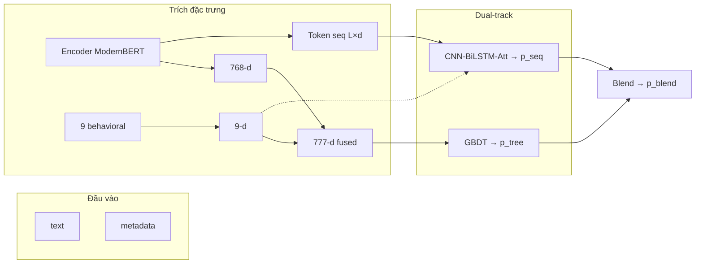
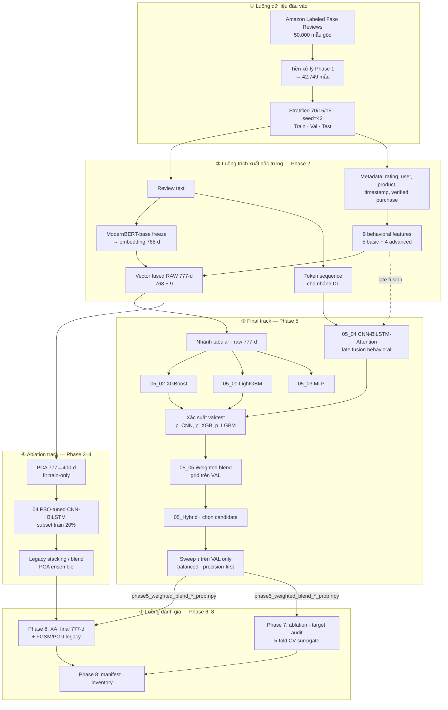
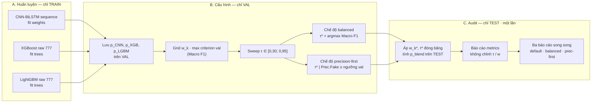
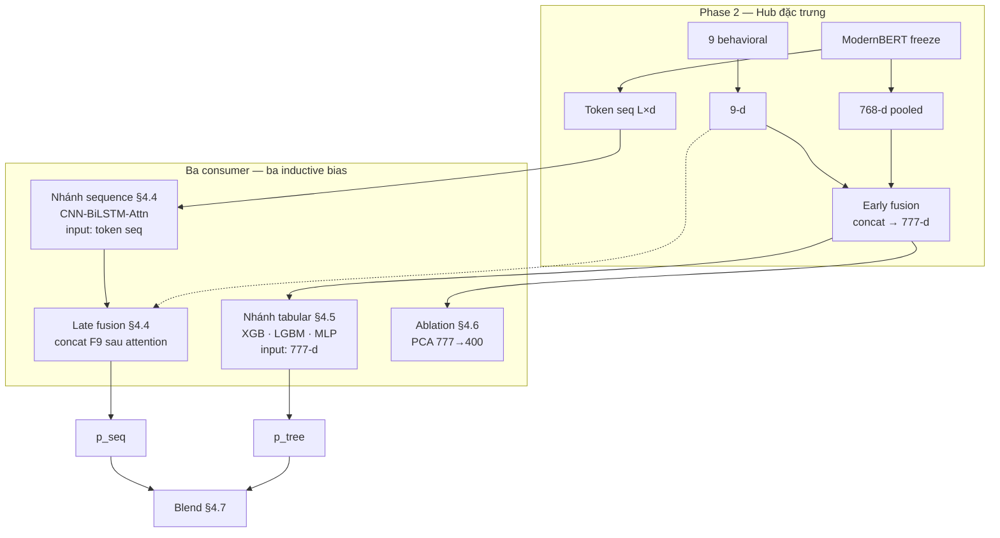

# CHƯƠNG 2: CƠ SỞ LÝ THUYẾT VÀ TỔNG QUAN TÀI LIỆU

*Chương này trả lời ba câu hỏi học thuật: (1) Bài toán FRD được định nghĩa và phân loại thế nào? (2) Tài liệu hiện có đi đến đâu, còn thiếu gì (G1–G8)? (3) **Nền tảng thuật toán** các họ dùng trong pipeline là gì? **Biện luận lựa chọn** cụ thể của đề tài (neo EDA + gap): **Chương 3, §3.4**; triển khai: §3.5–3.6. Bối cảnh thị trường: Ch.1 §1.1.*

| Mục | Nội dung |
|-----|----------|
| **§2.1** | Định nghĩa, phân loại, mô hình hóa bài toán |
| **§2.2** | Tổng quan tài liệu: lịch sử → 20 công trình → khoảng trống G1–G8 |
| **§2.3** | Nền tảng thuật toán (định nghĩa, cơ chế) — biện luận chọn → Ch.3 §3.4 |
| **§2.4** | Tính mới của đề tài |

---

## 2.1. Định nghĩa, phân loại và mô hình hóa bài toán

### 2.1.1. Khái niệm *opinion spam* / đánh giá giả

Jindal và Liu (2008) định nghĩa đánh giá giả là nhận xét **không phản ánh trải nghiệm mua–dùng thực tế**, được tạo **có chủ đích** để thao túng nhận thức người mua hoặc thuật toán xếp hạng. Hai trục này tách FRD khỏi phân loại cảm xúc thuần túy: một review có thể *tiêu cực* nhưng vẫn *genuine*, hoặc *tích cực* nhưng *fake*.

Từ góc kinh tế thông tin, spam review làm tăng bất cân xứng thông tin giữa seller và buyer (Luca & Zervas, 2016). Trong phạm vi học máy, đầu vào là cặp **(văn bản, metadata)**; đầu ra là nhãn nhị phân fake/genuine. Nhãn trên corpus Amazon là **proxy** do dataset gán — không đồng nhất với nhãn moderation nội bộ nền tảng (Ren & Ji, 2019).

### 2.1.2. Phân loại theo mục đích và hình thức

**Phân loại cổ điển** (Jindal & Liu, 2008; Ott et al., 2011) vẫn dùng để mô tả động cơ spam:

- **Promotional** — khen quá mức để đẩy sản phẩm.
- **Demotional** — hạ uy tín đối thủ.
- **Non-review** — nội dung không mang thông tin trải nghiệm.

**Phân loại mở rộng (2024–2026)** khi gian lận công nghiệp hóa (Gupta et al., 2024; Ren & Ji, 2019):

| Dạng | Đặc điểm | Hệ quả cho thiết kế mô hình |
|------|----------|------------------------------|
| LLM-generated | Ngữ phong tự nhiên, đa dạng | Feature tâm lý học (Ott, 2011) suy giảm → cần embedding sâu |
| Crowdsourced + verified | Reviewer thật, đơn verified thật | Rule đơn giản không đủ → cần học máy đa tín hiệu |
| Coordinated campaign | Burst theo sản phẩm/thời gian | Cần tín hiệu hành vi (và đôi khi graph) |
| AI paraphrase | Tránh trùng lặp văn bản | Cần ngữ nghĩa, không chỉ n-gram |

Đề tài chuẩn hóa về **phân loại nhị phân** fake/genuine — phù hợp moderation production (một quyết định) và corpus Amazon (~40% fake). Metric và protocol đánh giá: **Chương 3, §3.6**.

### 2.1.3. Mô hình hóa học máy

Gọi $\mathcal{D} = \{(x_i, y_i)\}_{i=1}^{N}$, $x_i = (\text{text}_i, \text{meta}_i)$, $y_i \in \{0,1\}$. Mục tiêu học $f(x) \approx P(y=1 \mid x)$. Khác phân loại văn bản đơn thuần, FRD trên TMDT khai thác **hai không gian tín hiệu độc lập**:

1. **Không gian ngôn ngữ** — nội dung review.
2. **Không gian hành vi** — metadata (rating, thời gian, verified, …).

Lập luận lý thuyết cho việc kết hợp hai không gian: spam LLM có thể che dấu ngôn ngữ nhưng **khó đồng bộ hóa hành vi** ở quy mô chiến dịch (Mukherjee et al., 2013) — dẫn tới thiết kế fusion (§2.3; biện luận §3.4).

---

## 2.2. Tổng quan tài liệu nghiên cứu

*Mục này gom lịch sử FRD, so sánh paradigm, 20 công trình tham chiếu và khoảng trống G1–G8 — trình bày liền mạch để mỗi gap có căn cứ từ tài liệu, không tách rời §2.3/2.4/2.5.*

### 2.2.1. Bốn dòng phát triển FRD (2008–nay)

Lịch sử học thuật (đối chiếu timeline thị trường: Chương 1, Bảng 1.4) không tiến theo đường thẳng mà **chồng lấn**:

**Dòng 1 — Nền tảng (2008–2012).** Jindal & Liu (2008) đặt định nghĩa *opinion spam* trên Amazon, thử feature thủ công + LR/SVM. Ott et al. (2011) tạo OpSpam 400 — corpus “cảm xúc giả” — và chứng minh dấu vết tâm lý học trong văn bản. Đóng góp: khung bài toán, benchmark chất lượng, cảnh báo metric trên dữ liệu mất cân bằng.

**Dòng 2 — Behavioral & graph (2013–2017).** Mukherjee et al. (2013) chuyển sang metadata: burstiness, rating deviation, verified ratio. Rayana & Akoglu (2015), Wang et al. (2017) đưa **đồ thị** reviewer–product — mạnh với spam tập thể nhưng phụ thuộc cấu trúc đồ thị và quy mô dữ liệu.

**Dòng 3 — Deep learning & Transformer (2018–2023).** Hajek et al. (2020), Bhuvaneshwari et al. (2021), Refaeli & Hajek (2021) dùng CNN, BiLSTM, Attention, BERT. Embedding ngữ cảnh vượt TF-IDF trước paraphrase và LLM-spam. Trade-off: chi phí tính toán, overfit trên corpus nhỏ.

**Dòng 4 — Hybrid, tối ưu, khảo sát (2019–nay).** Shah (2019) PCA + active learning trên Amazon. Duma et al. (2023) hybrid text + rating + aspect. Gupta et al. (2024), Ren & Ji (2019) **khảo sát hệ thống** — chỉ ra phân mảnh dataset, metric, reproducibility. Dòng 4 không thay Dòng 3 mà đặt câu hỏi: *kết hợp nào có ý nghĩa, báo cáo thế nào mới tin được?*

### 2.2.2. So sánh các paradigm ở mức khái niệm

Bảng 2.1 **không** phải phân loại tự đặt mà **tổng hợp** từ: (i) taxonomy trong khảo sát Gupta et al. (2024) — 98 papers FRD 2019–2023; (ii) nguyên tắc phân nhóm Ren & Ji (2019); (iii) ánh xạ lên **20 công trình** Bảng 2.2 (mỗi hướng có ít nhất một paper đại diện đã verify). Cột *Nguồn điển hình* trích ID Bảng 2.2 và tài liệu nền tảng.

**Bảng 2.1.** Các hướng FRD — tín hiệu, ưu/nhược, hiện trạng và nguồn tham chiếu

| Hướng | Tín hiệu | Điểm mạnh | Hạn chế | Hiện trạng 2024–2026 | Nguồn điển hình (Bảng 2.2 / nền tảng) |
|-------|----------|-----------|---------|----------------------|----------------------------------------|
| **ML cổ điển** | BoW, TF-IDF, POS, sentiment | Nhẹ; giải thích được; baseline mạnh trên corpus nhỏ | Mất ngữ cảnh; yếu paraphrase và LLM-spam | Baseline; ít dùng đơn lẻ | ID 1–2, 6–7 (Jindal & Liu, 2008; Ott et al., 2011; Kennedy et al., 2019; Shah, 2019) |
| **DL văn bản** | CNN, LSTM, BiLSTM, Attention | Bắt n-gram cục bộ và phụ thuộc trình tự | Cần data; overfit; khó scale ngữ nghĩa sâu | Backbone nhánh sequence | ID 8, 12 (Hajek et al., 2020; Bhuvaneshwari et al., 2021); Kim (2014) |
| **Transformer** | BERT, RoBERTa, **ModernBERT** | Self-attention — ngữ cảnh hai chiều; chống paraphrase | Chi phí RAM/GPU; nhiều paper text-only | **Chuẩn** feature extractor FRD | ID 11, 13, 16 (Gupta, 2021; Refaeli & Hajek, 2021; Mir et al., 2023); Devlin et al. (2019); Warner et al. (2024) |
| **Behavioral** | Velocity, burst, verified, rating deviation | Metadata khó giả đồng bộ quy mô lớn | Phụ thuộc trường metadata sẵn có | Bổ sung bắt buộc khi LLM che text | ID 3, 15 (Mukherjee et al., 2013; Duma et al., 2023) |
| **Graph** | Đồ thị reviewer–product–review | Bắt spam **tập thể**, quan hệ ẩn | RAM, scale; corpus Yelp ≠ Amazon | Tier B — tham chiếu, không so số trực tiếp | ID 4–5, 10, 20 (Rayana & Akoglu, 2015; Wang et al., 2017; Zhang et al., 2020; Wu et al., 2024) |
| **Ensemble / hybrid** | Kết hợp tree + DL + embedding | Giảm phương sai khi base đa dạng (Breiman, 1996) | Thiếu protocol τ và ablation trong nhiều paper | Xu hướng hybrid text+metadata | ID 10, 14, 15 (Zhang et al., 2020; Deshai & Rao, 2023; Duma et al., 2023) |
| **Multimodal / GNN SOTA** | Text + ảnh; heterogeneous GNN | SOTA trên benchmark riêng | Khác paradigm, dataset, metric — so số dễ sai | Bối cảnh ngoài Tier A | ID 19–20 (Veluru et al., 2025; Wu et al., 2024) |
| **Khảo sát / meta** | Taxonomy gap, reproducibility | Định hướng G1–G8, metric, leakage | Không số SOTA trực tiếp | Chuẩn mực báo cáo 2024+ | ID 17–18 (Gupta et al., 2024; Ren & Ji, 2019) |

*Cách đọc bảng:* Mỗi hàng là một **paradigm** trong tài liệu FRD; cột *Nguồn* chỉ paper **đã kiểm chứng** trong Bảng 2.2 hoặc trích dẫn nền tảng (BoW → Jindal/Ott; Transformer → Devlin/Warner; ensemble → Breiman). Gupta et al. (2024) xác nhận text-only Transformer vẫn chiếm đa số (→ G1); Ren & Ji (2019) nhấn graph và multimodal là nhánh tách biệt — khớp việc đề tài chỉ claim Tier A.

Đề tài định vị ở giao **Transformer (hàng 3) + Behavioral (hàng 4) + Ensemble/hybrid (hàng 6)** — không triển khai graph/multimodal (hàng 5, 7) trong phạm vi M5.

### 2.2.3. Hai mươi công trình tham chiếu và phân tầng so sánh

So sánh SOTA FRD dễ sai nếu không kiểm soát **dataset × metric × paradigm** (Gupta et al., 2024). Đề tài phân tầng:

- **Tier A** — text/tabular Amazon: so sánh số trực tiếp (M5).
- **Tier B** — graph / Yelp-heavy: bối cảnh, không claim beat.
- **Tier C** — nền tảng 2008–2012: động cơ lịch sử.
- **Survey (17–18)** — taxonomy gap.
- **Ngoài tier (19–20)** — paradigm khác (multimodal, graph).

**Bảng 2.2.** Tóm tắt 20 công trình (nguồn: `docs/00_Literature_Review_SOTA.md`)

| ID | Tác giả (Năm) | Dataset | Metric | Điểm báo cáo | Tier |
|----|---------------|---------|--------|--------------|------|
| 1 | Jindal & Liu (2008) | Amazon sớm | Accuracy | ~0,78 LR | C |
| 2 | Ott et al. (2011) | OpSpam 400 | F1 | ~0,90 | C |
| 3 | Mukherjee et al. (2013) | Yelp | Accuracy | 67,8% | C |
| 4 | Rayana & Akoglu (2015) | Yelp graph | F1 | ~0,85+ | B |
| 5 | Wang et al. (2017) | Yelp | F1 | > baseline | B |
| 6 | Kennedy et al. (2019) | OpSpam | Accuracy | > ML | C |
| 7 | Shah (2019) | Amazon | Accuracy | ~82% | C |
| 8 | Hajek et al. (2020) | Amz+Yelp | F1/Acc | Cao | A |
| 9 | Vidanagama et al. (2020) | Amz+Yelp | **Accuracy** | 97,3% Amz | A |
| 10 | Zhang et al. (2020) | Yelp | F1 | > RF/SVM | B |
| 11 | Gupta (2021) | Yelp 1,4M | Weighted-F1 | 0,69 | — |
| 12 | Bhuvaneshwari et al. (2021) | Amazon | F1/Acc | >90% | A |
| 13 | Refaeli & Hajek (2021) | Multi | F1 | Competitive | A |
| 14 | Deshai & Rao (2023) | Multi | Accuracy | đến 99,4%* | A |
| 15 | Duma et al. (2023) | Amazon aspect | F1 | > baseline | A |
| 16 | Mir et al. (2023) | General | Accuracy | 87,81% | A |
| 17 | Gupta et al. (2024) | Survey 98 | — | Gap taxonomy | — |
| 18 | Ren & Ji (2019) | Survey | — | Principles | — |
| 19 | Veluru et al. (2025) | Multimodal 20k | F1 | 0,934 | — |
| 20 | Wu et al. (2024) | Graph | F1 | ~0,915 | B |

**Phân tích sâu Tier A (ID 8, 9, 12, 13, 14, 15, 16)** — các paper **text/tabular** có corpus Amazon hoặc multi-domain gồm Amazon, là tầng so sánh số trực tiếp (M5). Mỗi paper theo khung: *(1) Thuật toán & I/O → (2) So sánh với pipeline đề tài → (3) Hàm ý / gap*.

---

#### ID 8 — Hajek et al. (2020) | Amazon + Yelp | Tier A

**(1) Thuật toán và vận hành**

| Khía cạnh | Mô tả |
|-----------|-------|
| **Đầu vào** | Văn bản review; emotion embeddings (vector cảm xúc); có thể kèm metadata tùy thí nghiệm |
| **Biểu diễn** | Kết hợp word embedding và **emotion embedding** — không dùng BERT/Transformer hiện đại |
| **Mô hình** | Học sâu (CNN / LSTM / hybrid) trên vector đã ghép |
| **Đầu ra** | Nhãn fake/genuine; báo cáo F1 và Accuracy cao trên cả Amazon và Yelp |
| **Tác dụng** | Chứng minh **đa nguồn tín hiệu** (text + emotion) vượt text đơn thuần trên FRD |

Hajek et al. (2020) thuộc Dòng 3 (Bảng 2.1) — DL văn bản — nhưng tín hiệu phụ là **emotion** chứ không phải behavioral metadata TMDT (velocity, verified, burst).

**(2) So sánh với đề tài**

| Tiêu chí | Hajek et al. (2020) | Pipeline đề tài |
|----------|---------------------|-----------------|
| Encoder | Emotion + word embedding | **ModernBERT** 768-d (Transformer) |
| Metadata | Emotion vector | **9 behavioral** engineered (Mukherjee/Duma) |
| Nhánh tabular | Một luồng DL | **GBDT** trên 777-d |
| Nhánh sequence | Không tách dual-track | **CNN-BiLSTM-Att** + ensemble |
| Corpus Amazon | Có (cùng hệ Amazon) | Amazon Labeled 42.749 |

**(3) Hàm ý.** Hajek củng cố lập luận **fusion đa tín hiệu** (§2.3.1) nhưng khác **loại** tín hiệu phụ. Đề tài thay emotion bằng behavioral TMDT và thêm GBDT + ensemble — lấp G1, G2 so với kiến trúc Hajek.

---

#### ID 9 — Vidanagama et al. (2020) | Amazon + Yelp | Tier A

**(1) Thuật toán và vận hành**

| Khía cạnh | Mô tả |
|-----------|-------|
| **Đầu vào** | Văn bản review (Amazon và Yelp) |
| **Biểu diễn** | Word embedding / feature CNN đầu vào |
| **Mô hình** | **CNN** — convolution trích n-gram cục bộ (Kim, 2014) |
| **Đầu ra** | Accuracy **97,3%** trên Amazon — metric chính là **Accuracy**, không Macro F1 |
| **Tác dụng** | Cho thấy CNN đơn giản đã mạnh trên Amazon khi metric là Accuracy |

**(2) So sánh với đề tài**

| Tiêu chí | Vidanagama (2020) | Pipeline đề tài |
|----------|-------------------|-----------------|
| Metric | **Accuracy** 97,3% | **Macro F1** 0,9433 (M1); Precision Fake 0,9816 (M2) |
| Kiến trúc | CNN đơn | ModernBERT + CNN-BiLSTM-Att + GBDT + blend |
| Metadata | Text-only | 9 behavioral fused |
| Imbalance | Accuracy dễ “đẹp” trên tập mất cân bằng | Macro F1 + dual-threshold (Ch. 3 §3.2) |

**(3) Hàm ý.** Paper minh họa **cảnh báo M5**: số Accuracy cao **không so trực tiếp** với Macro F1 đề tài (Ott et al., 2011; Gupta et al., 2024). Về mặt thuật toán, đề tài **bao trùm** CNN thuần bằng stack sâu hơn + đa tín hiệu — nhưng claim phải nêu rõ metric và split.

---

#### ID 12 — Bhuvaneshwari et al. (2021) | Amazon | Tier A ★ mốc sequence

**(1) Thuật toán và vận hành**

| Khía cạnh | Mô tả |
|-----------|-------|
| **Đầu vào** | Chuỗi token / embedding review Amazon |
| **Mô hình** | **CNN → BiLSTM → Attention** — kiến trúc lai ba lớp (§2.3.5) |
| **Cơ chế** | CNN: n-gram cục bộ; BiLSTM: phụ thuộc trình tự; Attention: trọng số token quyết định |
| **Đầu ra** | F1 / Accuracy **>90%** trên Amazon |
| **Tác dụng** | **Mốc Tier A** gần nhất với nhánh sequence đề tài trên cùng nền tảng Amazon |

Đây là paper đề tài **kế thừa trực tiếp** về kiến trúc sequence (§2.3.5), khác ở encoder đầu vào.

**(2) So sánh với đề tài**

| Tiêu chí | Bhuvaneshwari (2021) | Pipeline đề tài |
|----------|----------------------|-----------------|
| Encoder | Embedding/BERT-era (paper gốc) | **ModernBERT freeze** |
| Kiến trúc sequence | CNN-BiLSTM-Att | **Cùng họ** + late fusion behavioral |
| Nhánh tabular GBDT | Không báo cáo | **XGB + LGBM** trên 777-d |
| Ensemble | Single model (hoặc không blend đa họ) | **Weighted blend** CNN + GBDT |
| Loss / τ | Không dual-threshold | Focal Loss; dual-τ (G3, G7) |

**(3) Hàm ý.** Bhuvaneshwari chứng minh CNN-BiLSTM-Att **khả thi trên Amazon** — đề tài sequence Macro F1 ~0,93 có căn cứ Tier A. Gap **G2**: Bhuvaneshwari **không** có dual-track GBDT + blend cùng protocol — đó là đóng góp tích hợp đề tài, không phải thay thế kiến trúc sequence.

---

#### ID 13 — Refaeli & Hajek (2021) | Multi-domain (gồm Amazon) | Tier A

**(1) Thuật toán và vận hành**

| Khía cạnh | Mô tả |
|-----------|-------|
| **Đầu vào** | Văn bản review đa miền (nhiều dataset, có Amazon) |
| **Biểu diễn** | **BERT fine-tune end-to-end** — cập nhật toàn bộ trọng số Transformer |
| **Mô hình** | Classifier trên [CLS] hoặc pooling BERT |
| **Đầu ra** | F1 competitive trên multi-domain |
| **Tác dụng** | Chứng minh **fine-tune BERT** mạnh cross-domain FRD |

**(2) So sánh với đề tài**

| Tiêu chí | Refaeli & Hajek (2021) | Pipeline đề tài |
|----------|------------------------|-----------------|
| BERT | **Fine-tune E2E** | **Freeze** + head (§2.3.2) |
| Behavioral | **Text-only** | 9 behavioral → 777-d (G1) |
| Kiến trúc | Một nhánh Transformer | Dual-track + ensemble |
| Tài nguyên | Giả định GPU đủ cho fine-tune | RAM ≤ 12GB Colab |

**(3) Hàm ý.** Refaeli là **đối chứng lý thuyết** cho quyết định freeze: fine-tune mạnh hơn về mặt lý thuyết nhưng khó kết hợp GBDT + sequence trong một pipeline 12GB. Đề tài chấp nhận trade-off để có **fusion behavioral + dual-track** — gap G1 Refaeli chưa lấp.

---

#### ID 14 — Deshai & Rao (2023) | Multi-dataset (gồm Amazon) | Tier A

**(1) Thuật toán và vận hành**

| Khía cạnh | Mô tả |
|-----------|-------|
| **Đầu vào** | Văn bản review trên nhiều dataset |
| **Mô hình** | **CNN** + tối ưu **APSO** (Adaptive Particle Swarm Optimization) |
| **Vận hành PSO** | Quần thể hạt tìm hyperparameter CNN trong không gian liên tục (Kennedy & Eberhart, 1995) |
| **Đầu ra** | Accuracy tới **99,4%** trên một số cấu hình multi-dataset |
| **Tác dụng** | Cho thấy PSO có thể đẩy metric khi kết hợp CNN |

**(2) So sánh với đề tài**

| Tiêu chí | Deshai & Rao (2023) | Pipeline đề tài |
|----------|---------------------|-----------------|
| Tối ưu | **PSO/APSO** toàn pipeline | **Grid** blend trên val; PSO chỉ **ablation** (§2.3.7, G6) |
| Metric | **Accuracy** đến 99,4% | Macro F1 + Precision Fake |
| Kiến trúc | CNN + PSO | ModernBERT + GBDT + CNN-BiLSTM + blend |
| Reproducibility | Swarm — khó audit | Seed 42, protocol G4 |

**(3) Hàm ý.** Deshai là nguồn cho **hàng PSO** Bảng 2.1 và ablation track đề tài — không dùng làm pipeline chính vì overclaim và metric khác (M5). So số 99,4% Accuracy **không** đặt làm mục tiêu M1–M3.

---

#### ID 15 — Duma et al. (2023) | Amazon (aspect-level) | Tier A ★ mốc hybrid Amazon

**(1) Thuật toán và vận hành**

| Khía cạnh | Mô tả |
|-----------|-------|
| **Đầu vào** | Văn bản review + **rating** + **aspect** (phân tích theo khía cạnh sản phẩm) |
| **Biểu diễn** | Embedding text kết hợp vector rating/aspect |
| **Mô hình** | Hybrid classifier — khai thác **đa tín hiệu** trên Amazon |
| **Đầu ra** | F1 vượt baseline text-only |
| **Tác dụng** | Paper **gần nhất** với hướng text + metadata trên Amazon (Bảng 2.1 hàng Behavioral + Ensemble) |

**(2) So sánh với đề tài**

| Tiêu chí | Duma et al. (2023) | Pipeline đề tài |
|----------|-------------------|-----------------|
| Metadata | Rating + **aspect** | **9 behavioral** (velocity, burst, verified, …) |
| Encoder | Embedding era (không ModernBERT) | **ModernBERT** 768-d |
| Kiến trúc | Single hybrid | **Dual-track** GBDT + sequence + blend (G2) |
| Mức review | Aspect-level | Review-level nhị phân |

**(3) Hàm ý.** Duma **ủng hộ lý thuyết G1** (không text-only). Đề tài khác ở **loại metadata** (behavioral hành vi thay aspect) và **tách hai inductive bias** (tree vs sequence) thay một classifier duy nhất — đóng góp kiến trúc, không phủ nhận hướng hybrid của Duma.

---

#### ID 16 — Mir et al. (2023) | General reviews | Tier A

**(1) Thuật toán và vận hành**

| Khía cạnh | Mô tả |
|-----------|-------|
| **Đầu vào** | Văn bản review (corpus general, không chỉ Amazon) |
| **Mô hình** | **SVM + BERT** — pipeline cổ điển: embedding BERT → SVM margin |
| **Vận hành** | BERT trích feature; SVM phân lớp tuyến tính/kernel trên vector |
| **Đầu ra** | Accuracy **87,81%** |
| **Tác dụng** | Baseline hybrid **shallow (SVM) + deep (BERT)** trên review tổng quát |

**(2) So sánh với đề tài**

| Tiêu chí | Mir (2023) | Pipeline đề tài |
|----------|------------|-----------------|
| Classifier tabular | **SVM** | **GBDT** (XGB, LGBM) — mạnh hơn trên tabular dense (Shwartz-Ziv & Armon, 2021) |
| Behavioral | Không 9 feat. engineered | 777-d fused (G1) |
| Corpus | General | **Amazon Labeled** 42.749 |
| Metric | Accuracy 87,81% | Macro F1 0,94+ |

**(3) Hàm ý.** Mir đại diện paradigm **BERT + shallow learner** (Bảng 2.1). Đề tài **nâng cấp** nhánh tabular từ SVM lên GBDT và thêm behavioral + sequence — có lý do lý thuyết (§2.3.4), không so Accuracy trực tiếp.

---

**Bảng 2.2a.** Tổng hợp Tier A — đối chiếu nhanh với pipeline đề tài

| ID | Paper | Đầu vào chính | Mô hình cốt lõi | Metric báo cáo | Điểm khác biệt so với đề tài | Gap liên quan |
|----|-------|--------------|-----------------|----------------|------------------------------|---------------|
| 8 | Hajek (2020) | Text + emotion emb. | DL hybrid | F1/Acc cao | Emotion ≠ behavioral; không dual-track | G1, G2 |
| 9 | Vidanagama (2020) | Text | CNN | Acc 97,3% Amz | Metric Accuracy; text-only | M5, G1 |
| 12 | Bhuvaneshwari (2021) | Text Amazon | CNN-BiLSTM-Att | F1/Acc >90% | Thiếu GBDT+blend; encoder cũ hơn | **G2** (mốc sequence) |
| 13 | Refaeli (2021) | Text multi-domain | BERT fine-tune | F1 competitive | Text-only; E2E không freeze | G1 |
| 14 | Deshai (2023) | Text multi | CNN + APSO | Acc 99,4%* | PSO headline; metric Accuracy | G6, M5 |
| 15 | Duma (2023) | Text+rating+aspect Amz | Hybrid | F1 strong | Single hybrid; aspect ≠ behavioral | G1, G2 |
| 16 | Mir (2023) | Text general | SVM+BERT | Acc 87,81% | SVM tabular; không Amazon corpus | G1, M5 |

*Số chi tiết đề tài vs Tier A: Chương 4, §4.12.*

---

**Các nhóm còn lại (tóm tắt — không so số trực tiếp M5):**

**Tier B (4, 5, 10, 20) — graph / Yelp-heavy:** Rayana, Wang, Zhang, Wu — đầu vào là **đồ thị** hoặc corpus Yelp; inductive bias collective spam (§2.3.3). Đề tài không triển khai vì RAM và paradigm khác (Chương 1, §1.3).

**Tier C (1, 2, 3, 6, 7) — nền tảng:** Jindal/Ott đặt định nghĩa; Mukherjee mở behavioral; Shah (PCA) — nguồn ablation §2.3.7.

**Survey (17–18):** Gupta (2024) taxonomy G1–G8; Ren & Ji (2019) reproducibility — củng cố Chương 3 §3.2.

*Ren & Ji (2019) là khảo sát reproducibility/leakage trên IEEE Access; Gupta et al. (2024) là khảo sát taxonomy G1–G8 gần hơn — hai nguồn bổ sung nhau, không thay thế.*

**Ngoài tier (19–20):** Veluru multimodal; Wu graph SOTA — trần tham chiếu, không claim beat.

### 2.2.4. Khoảng trống G1–G8 và ánh xạ sang đề tài

Từ Bảng 2.2 và khảo sát Gupta/Ren, tám khoảng trống được hệ thống hóa:

**Bảng 2.3.** Khoảng trống nghiên cứu G1–G8

| Gap | Mô tả | Bằng chứng từ Bảng 2.2 | Hệ quả nếu bỏ qua |
|-----|-------|--------------------------|-------------------|
| **G1** | Ít kết hợp Transformer hiện đại + behavioral engineered | Refaeli, Mir text-heavy; Duma có metadata nhưng khác kiến trúc | Bỏ sót signal khi LLM che text |
| **G2** | Thiếu dual-track tabular GBDT + sequence DL cùng protocol | Bhuvaneshwari có sequence; ít paper có cả tree + DL + blend | Không biết nhánh nào đóng góp |
| **G3** | Ensemble thiếu protocol chọn τ trên val | Hầu hết 1 metric; Zhang ensemble nhưng không dual-threshold | Không map moderation |
| **G4** | Thiếu audit leakage | Hầu hết không mô tả train-only fit | SOTA không tái lập |
| **G5** | PCA fused vector chưa chứng minh vs raw | Shah PCA text; chưa ablation BERT+behavioral | Giả định “giảm chiều = tốt” |
| **G6** | PSO tách rời stack | Deshai APSO; dễ overclaim | Chi phí không justify |
| **G7** | Hiếm macro F1 + precision-first đồng thời | Gupta survey | Metric lệch vận hành |
| **G8** | Thiếu ablation cùng split | Nhiều paper không ablate | Claim hybrid không kiểm chứng |

**Bảng 2.4.** Ánh xạ Gap → lựa chọn lý thuyết (§2.3) → mục tiêu

| Gap | Hướng lý thuyết §2.3 | Mục tiêu | Kiểm chứng |
|-----|----------------------|----------|------------|
| G1 | §2.3.2–2.3.3 + biện luận §3.4.2–3.4.3 | M1–M3; RQ1 | Ch. 3–4 |
| G2 | §2.3.1, §2.3.4–2.3.5 + biện luận §3.4.1, §3.4.4–3.4.5 | RQ2 | Ch. 3–4 |
| G3, G7 | §2.3.6 + biện luận §3.4.6; protocol τ → Ch.3 §3.6 | RQ5; M1–M2 | Ch. 3–5 |
| G4 | — (phương pháp Ch.3 §3.6.3) | M4 | Ch. 3–4 |
| G5, G6 | §2.3.7 + biện luận §3.4.7 | RQ3, RQ6; M6 | Ch. 4–5 |
| G8 | Biện luận §3.4 + ablation Ch.4 | RQ6; M6 | Ch. 4 |
| G1–G3 | Tier A; Bảng 2.2 | M5 | Ch. 2, 4 |

Bảng 2.4 ánh xạ gap → hướng thuật toán (§2.3) và **biện luận lựa chọn** (Ch.3 §3.4) sau EDA (§3.2–3.3).

---

---

## 2.3. Nền tảng thuật toán liên quan

*Phần này trình bày **định nghĩa và cơ chế** các họ thuật toán dùng trong pipeline — không biện luận lựa chọn cụ thể của đề tài. So sánh với tài liệu và kết luận chọn thành phần (neo G1–G8, EDA): **Chương 3, §3.4**. Chi tiết triển khai: §3.5–3.6.*

### 2.3.1. Khung tổng thể: hai không gian tín hiệu và kiến trúc dual-track

Lý thuyết và vận hành

**Hai không gian tín hiệu.** Mỗi review $x_i$ gồm cặp $(\text{text}_i, \text{meta}_i)$:

| Không gian | Đầu vào | Đại diện lý thuyết | Đầu ra trung gian | Tác dụng trong FRD |
|------------|---------|-------------------|-------------------|-------------------|
| **Ngôn ngữ** | Chuỗi từ review | Ott et al. (2011): deceptive language | Embedding 768-d; chuỗi token | Bắt ngữ nghĩa, paraphrase, cấu trúc câu |
| **Hành vi** | Rating, thời gian, verified, user, product | Mukherjee et al. (2013): burst, deviation | Vector 9-d | Bắt chiến dịch, anomaly metadata |

Hai không gian **bổ sung thông tin**: spam LLM có thể viết văn bản “đẹp” nhưng khó đồng thời giả mạo velocity, burst, pattern reviewer (Gupta et al., 2024).

**Kiến trúc dual-track** tách **hai cách đọc** cùng một review sau khi trích đặc trưng:

| Nhánh | Đầu vào | Bộ phân loại | Đầu ra | Vai trò |
|-------|---------|--------------|--------|---------|
| **Tabular** | Vector fused $\mathbf{x} \in \mathbb{R}^{777}$ (768 embedding + 9 behavioral) | GBDT (XGBoost, LightGBM) | $p_{\text{tree}} \in [0,1]$ | Học tương tác phi tuyến giữa chiều embedding và metadata |
| **Sequence** | Ma trận token $\mathbf{T} \in \mathbb{R}^{L \times d}$ từ encoder | CNN-BiLSTM-Attention | $p_{\text{seq}} \in [0,1]$ | Học pattern cục bộ/toàn cục trên trình tự |
| **Ensemble** | $\{p_{\text{tree}}, p_{\text{seq}}, \ldots\}$ | Weighted blend | $p_{\text{blend}} = \sum_k w_k p_k$ | Giảm phương sai khi hai nhánh sai khác nhau |

---

### 2.3.2. Biểu diễn văn bản: Transformer encoder và ModernBERT

Lý thuyết thuật toán

**Transformer** (Vaswani et al., 2017) biểu diễn câu bằng **self-attention**: mỗi token $t_i$ tính attention tới mọi token $t_j$, tạo representation phụ thuộc toàn ngữ cảnh. Công thức attention scaled dot-product:

$$\text{Attention}(Q,K,V) = \text{softmax}\left(\frac{QK^\top}{\sqrt{d_k}}\right)V$$

**BERT** (Devlin et al., 2019) pretrain encoder bằng *masked language modeling* (MLM) — dự đoán token bị che — và *next sentence prediction*. Sau pretrain, mỗi token có vector ngữ cảnh 768 chiều (base).

**ModernBERT** (Warner et al., 2024) cải tiến kiến trúc encoder: dùng **RoPE** (Su et al., 2024) để mã hóa vị trí, tối ưu attention — hỗ trợ ngữ cảnh dài hơn BERT 512 tokens về mặt thiết kế.

**Vai trò trong pipeline đề tài — feature extractor (freeze):**

| Bước | Đầu vào | Vận hành | Đầu ra | Tác dụng |
|------|---------|----------|--------|----------|
| Tokenize | text (chuỗi ký tự) | BPE/wordpiece | ID token $[t_1,\ldots,t_L]$ | Chuẩn hóa đầu vào encoder |
| Forward encoder | ID token | $L$ lớp self-attention + FFN; **không** cập nhật gradient (freeze) | $\mathbf{H} \in \mathbb{R}^{L \times 768}$ | Trích ngữ nghĩa sâu đã pretrain |
| Pooling (tabular) | $\mathbf{H}$ | Mean/max/CLS pooling | $\mathbf{e} \in \mathbb{R}^{768}$ | Một vector đại diện cả review cho GBDT |
| Sequence export | $\mathbf{H}$ hoặc embedding token | Giữ chiều trình tự | $\mathbf{T} \in \mathbb{R}^{L \times d}$ | Đầu vào nhánh CNN-BiLSTM |

Freeze nghĩa là coi encoder như hàm cố định $\phi(\text{text}) \rightarrow \mathbf{e}$: chỉ các lớp phía sau (GBDT head, CNN-BiLSTM) được học từ dữ liệu FRD.

---

### 2.3.3. Đặc trưng hành vi (behavioral features)

Lý thuyết thuật toán

Behavioral feature là **hàm số** ánh xạ metadata $\text{meta}_i$ sang số thực, không qua học sâu:

$$f_j: \text{meta}_i \mapsto \mathbb{R}, \quad \mathbf{f}_i = [f_1,\ldots,f_9]^\top \in \mathbb{R}^9$$

**Nhóm basic (5)** — mô tả trực tiếp review đơn lẻ:

| Feature | Đầu vào metadata | Ý nghĩa lý thuyết | Tác dụng FRD |
|---------|------------------|-------------------|--------------|
| Log độ dài ký tự / số từ | text | Fake thường ngắn, ít chi tiết (Ott, 2011) | Phân biệt độ “giàu” nội dung |
| Độ lệch rating | rating, lịch sử sản phẩm | Spam có thể lệch so với trung bình sản phẩm | Bắt khen/chê bất thường |
| Sentiment compound | text (lexicon) | Cường điệu cảm xúc | Bổ sung khi chưa có embedding |
| Cờ verified | verified purchase | Review broker đôi khi vẫn verified | Tín hiệu yếu đơn lẻ nhưng hữu ích khi fusion |

**Nhóm advanced (4)** — mô tả **hành vi theo thời gian / người dùng**:

| Feature | Đầu vào | Ý nghĩa | Tác dụng |
|---------|---------|---------|----------|
| Review velocity | timestamp, user | Tần suất đăng của user | Farm account |
| Product burst | timestamp, product | Nhiều review trong cửa sổ ngắn | Chiến dịch coordinated |
| Time gap | lịch sử user | Khoảng cách giữa các review | Bot / spam pattern |
| Anomaly reviewer | lịch sử reviewer | Điểm bất thường hành vi | Spam chuyên nghiệp |

**Fusion với embedding:**

- **Sớm (early):** $\mathbf{x}_i = [\mathbf{e}_i; \mathbf{f}_i] \in \mathbb{R}^{777}$ — đầu vào GBDT.
- **Muộn (late):** concat $\mathbf{f}_i$ vào đầu ra nhánh sequence trước softmax — bổ sung metadata cho DL.

---

### 2.3.4. Phân loại tabular: Gradient Boosting Decision Tree (XGBoost, LightGBM)

Lý thuyết thuật toán

**Gradient Boosting** (Friedman, 2001; triển khai: Chen & Guestrin, 2016 — XGBoost; Ke et al., 2017 — LightGBM) xây dựng ensemble **cây quyết định** tuần tự. Mô hình sau $t$ bước:

$$F_t(\mathbf{x}) = F_{t-1}(\mathbf{x}) + \eta \cdot h_t(\mathbf{x})$$

trong đó $h_t$ là cây mới fit vào **gradient** của loss tại residual — mỗi cây sửa lỗi của ensemble trước.

**Vận hành trên 777-d:**

| Khía cạnh | Mô tả |
|-----------|-------|
| **Đầu vào** | $\mathbf{x} \in \mathbb{R}^{777}$ (768 chiều embedding + 9 behavioral) |
| **Huấn luyện** | Tối thiểu hóa loss (logistic / cross-entropy) bằng cách thêm cây; mỗi split chọn feature và ngưỡng tối ưu information gain |
| **Đầu ra** | $p_{\text{tree}} = \sigma(F(\mathbf{x})) \in [0,1]$ — xác suất Fake |
| **Tác dụng** | Học tương tác phi tuyến (vd. “embedding chiều 42 cao **và** verified=0 **và** burst cao”) mà linear model không bắt được |

**XGBoost vs LightGBM** (cùng họ GBDT, khác cách grow cây): XGBoost level-wise; LightGBM leaf-wise với histogram — thường nhanh hơn trên tabular lớn. Dùng **cả hai** làm hai base models tăng diversity cho ensemble (§2.3.6).

---

### 2.3.5. Phân loại sequence: CNN-BiLSTM-Attention và Focal Loss

Lý thuyết thuật toán

Nhánh sequence **không** dùng vector 777-d pooled mà xử lý **trình tự** representation từ encoder.

**Luồng tính toán (khái niệm):**

| Lớp | Đầu vào | Vận hành | Đầu ra | Tác dụng |
|-----|---------|----------|--------|----------|
| **CNN** (Kim, 2014) | $\mathbf{T} \in \mathbb{R}^{L \times d}$ | Conv1D nhiều kernel width | Feature maps cục bộ | Bắt n-gram (cụm từ quảng cáo, sentiment cục bộ) |
| **BiLSTM** (Hochreiter & Schmidhuber, 1997) | output CNN | Đọc xuôi + ngược theo thời gian | Hidden hai chiều | Phụ thuộc dài giữa đầu–cuối review |
| **Attention** | hidden LSTM | Trọng số $\alpha_t$ trên từng bước thời gian | Vector context $\mathbf{c}$ | Nhấn token quyết định (vd. cụm “highly recommend”) |
| **Late fusion behavioral** | $\mathbf{c}$, $\mathbf{f}$ | Concat $[\mathbf{c}; \mathbf{f}]$ | Vector mở rộng | Đưa metadata vào quyết định sequence |
| **Dense + sigmoid** | vector mở rộng | Linear + $\sigma$ | $p_{\text{seq}} \in [0,1]$ | Xác suất Fake |

**Focal Loss** (Lin et al., 2017) thay cross-entropy khi có imbalance:

$$FL(p_t) = -\alpha_t (1-p_t)^\gamma \log(p_t)$$

tham số $\gamma > 0$ **giảm** loss của mẫu dễ (đã phân loại đúng với confidence cao), buộc mô hình học **mẫu khó** gần biên quyết định — phù hợp fake/genuine chồng lấn ngữ nghĩa (~40% fake, Ott et al., 2011).

---

### 2.3.6. Tổng hợp dự đoán: Ensemble và weighted blend

Lý thuyết thuật toán

**Ensemble learning** (Breiman, 1996): giả sử có $K$ base models, mỗi model $k$ xuất $p_k(\mathbf{x}) \in [0,1]$. **Weighted blend**:

$$p_{\text{blend}}(\mathbf{x}) = \sum_{k=1}^{K} w_k \cdot p_k(\mathbf{x}), \quad \sum_k w_k = 1, \; w_k \geq 0$$

| Khía cạnh | Mô tả |
|-----------|-------|
| **Đầu vào** | Tập xác suất $\{p_{\text{seq}}, p_{\text{xgb}}, p_{\text{lgbm}}, \ldots\}$ trên cùng tập mẫu |
| **Học trọng số** | Chọn $\mathbf{w}$ tối ưu metric trên **validation** (grid search) — protocol Chương 3 |
| **Đầu ra** | $p_{\text{blend}}$ — xác suất cuối trước khi áp ngưỡng $\tau$ |
| **Tác dụng** | Kết hợp sai số không tương quan: khi sequence miss pattern mà tree bắt được metadata (hoặc ngược lại), blend ổn định hơn single model |

**Stacking** (khác blend): thêm meta-learner $g(p_1,\ldots,p_K)$ — thường linear hoặc logistic — học trên validation. Linh hoạt hơn nhưng thêm tham số.

---

### 2.3.7. Ablation lý thuyết: PCA và PSO (track phụ)

Lý thuyết thuật toán

**PCA** (Jolliffe, 2002): tìm ma trận chiếu $\mathbf{W}$ sao cho $\mathbf{z} = \mathbf{W}^\top \mathbf{x}$ giữ phương sai lớn nhất. Trên $\mathbf{x} \in \mathbb{R}^{777}$, PCA 777→$d$ (vd. 400) nén chiều trước khi đưa vào classifier/DL.

| Khía cạnh | PCA |
|-----------|-----|
| Đầu vào | $\mathbf{x} \in \mathbb{R}^{777}$ |
| Vận hành | Eigendecomposition covariance; giữ $d$ thành phần chính |
| Đầu ra | $\mathbf{z} \in \mathbb{R}^{d}$ |
| Tác dụng lý thuyết | Giảm chiều, giảm nhiễu — **hợp lý** với TF-IDF sparse (Shah, 2019, ID 7) |

**PSO** (Kennedy & Eberhart, 1995): mỗi “hạt” là một vector siêu tham số; hạt di chuyển theo vị trí cá nhân tốt nhất và global tốt nhất:

$$v_i^{t+1} = w v_i^t + c_1 r_1 (p_i - x_i^t) + c_2 r_2 (g - x_i^t)$$

| Khía cạnh | PSO |
|-----------|-----|
| Đầu vào | Không gian hyperparameter (learning rate, kernel size, …) |
| Đầu ra | Bộ hyperparameter tối ưu theo fitness (vd. val F1) |
| Tác dụng | Tự động search thay grid thủ công — Deshai & Rao (2023, ID 14) dùng APSO |

---

### 2.3.8. Giải thích mô hình (XAI) và độ bền

Lý thuyết thuật toán

**SHAP** (Lundberg & Lee, 2017): với mô hình $f$ và feature $j$, SHAP value $\phi_j$ là đóng góp trung bình của $j$ theo **Shapley value** từ lý thuyết trò chơi hợp tác — thỏa tính công bằng (efficiency, symmetry).

| Khía cạnh | SHAP / LIME |
|-----------|-------------|
| **Đầu vào** | Mô hình $f$ (vd. XGBoost trên 777-d), một mẫu $\mathbf{x}$ |
| **Vận hành** | SHAP: tính $\phi_j$ cho mọi feature; LIME: fit mô hình linear cục bộ quanh $\mathbf{x}$ |
| **Đầu ra** | Trọng số feature / hệ số linear xấp xỉ |
| **Tác dụng** | Trả lời *“vì sao review này bị gắn Fake?”* — cần khi moderation ảnh hưởng seller (Ren & Ji, 2019) |

**Adversarial perturbation** (Goodfellow et al., 2015): $\mathbf{x}' = \mathbf{x} + \epsilon \cdot \text{sign}(\nabla_{\mathbf{x}} L)$ — đo độ bền khi đầu vào bị nhiễu nhỏ (tương tự spammer paraphrase từng từ).

---

## 2.4. Tính mới của đề tài

Tính mới **không** phải phát minh thuật toán đơn lẻ (ModernBERT, XGBoost, CNN-BiLSTM đều có trong tài liệu) mà là **tích hợp có lập luận lý thuyết và kiểm chứng** lấp G1–G8:

1. **Dual-track có cơ sở inductive bias** (G2): GBDT trên fused vector + sequence DL — hai họ bổ sung (§2.3 + biện luận §3.4.1, §3.4.4–3.4.5).
2. **Fusion Transformer hiện đại + behavioral engineered** (G1): 777-d — lý thuyết hai không gian tín hiệu (§2.3.2–2.3.3; biện luận §3.4.2–3.4.3).
3. **Ensemble blend + dual-threshold** (G3, G7): weighted blend ổn định hơn stacking khi val hữu hạn; hai chế độ τ — §2.3.6; protocol §3.6 (biện luận §3.4.6).
4. **Ablation có ý nghĩa lý thuyết** (G5, G6, G8): PCA/PSO tách track — negative result trên fused dense vector (§2.3.7; biện luận §3.4.7).
5. **So sánh SOTA có trách nhiệm** (M5): Tier A, Bảng 2.2 — không claim graph/multimodal.
6. **XAI trên feature có tên** — kiểm chứng fusion (§2.3.8; biện luận §3.4.8).

*Biện luận chọn: Ch.3 §3.4. Kiến trúc: §3.5. Protocol: §3.6. Số liệu: Ch.4–5. Mục tiêu: Ch.1.*

---

# CHƯƠNG 3: PHƯƠNG PHÁP NGHIÊN CỨU

Chương này trình bày phương pháp theo **trình tự logic khoa học**: (1) **mô tả bộ dữ liệu** (§3.1); (2) **EDA** (§3.2); (3) **thiết kế pipeline từ EDA** (§3.3); (4) **biện luận lựa chọn** thành phần — neo G1–G8 và Bảng 3.5 (§3.4); (5) **kiến trúc dual-track và sơ đồ** (§3.5); (6) **protocol thực nghiệm** (§3.6); (7) **môi trường** (§3.7); (8) **khung đánh giá** D0–D8 (§3.8). Nền tảng thuật toán: **Ch.2 §2.3**. **Số liệu** → Ch.4; **điểm tự chấm** → §4.14.

Mọi triển khai tuân thủ reproducibility và tránh leakage (Gupta et al., 2024; Ren & Ji, 2019), dưới ràng buộc RAM 12GB (Google Colab, Tesla T4 — chi tiết môi trường §3.7, §4.0).

### Bảng 3.1. Ánh xạ lý thuyết (Chương 2) → phương pháp (Chương 3) → kết quả (Chương 4)

| Mục Ch. 2 | Ý nghĩa | Phương pháp (Ch. 3) | Kết quả (Ch. 4) |
|-----------|---------|---------------------|-----------------|
| — | Bộ dữ liệu | §3.1 | §4.1 (số làm sạch, EDA) |
| — | EDA → thiết kế | §3.2–3.3 | §4.1 |
| §2.3.1 + §3.4.1 | Dual-track | §3.5 | §4.2–4.15 |
| §2.3.2 + §3.4.2 | ModernBERT | §3.5, Hình 3.3 | §4.2 |
| §2.3.3 + §3.4.3 | 9 behavioral; 777-d | §3.2, §3.3 | §4.3 |
| §2.3.4–2.3.6 + §3.4.4–3.4.6 | GBDT, sequence, blend | §3.5–3.6 | §4.4–4.8 |
| §2.3.7 + §3.4.7 | PCA/PSO ablation | §3.5 | §4.6, §4.10 |
| §2.3.8 + §3.4.8 | XAI | §3.5 | §4.9 |
| — | Protocol, metric | §3.6 | §4.8, §4.11 |
| — | Tái lập | §3.6.3 | §4.0, §4.15 |

**Diễn giải:** Bảng 3.1 phản ánh flow **dữ liệu → EDA → thiết kế → thực nghiệm → kết quả**. Ch.3 không nhúng số test; Ch.4 kiểm chứng phương pháp đã thiết kế.

### Bảng 3.2. Ánh xạ RQ → phương pháp → kiểm chứng (Ch. 4)

| RQ | Phương pháp (Ch. 3) | Kết quả (Ch. 4) |
|----|---------------------|-----------------|
| RQ1 | §3.3–3.4.3 — fusion 777-d | §4.3, §4.9, §4.10 Model C |
| RQ2 | §3.4.7 — PSO ablation | §4.6 |
| RQ3 | §3.4.7 — PCA vs raw | §4.6, §4.10 Model B |
| RQ4 | §3.4.6, §3.5–3.6 — blend | §4.4–4.7, §4.10 Models A/D/E |
| RQ5 | §3.6.2 — dual-threshold | §4.8 |
| RQ6 | §3.6 — ablation protocol | §4.10 |

**Kết luận:** Sáu RQ đóng vòng Ch.3 (thiết kế) → Ch.4 (đo) → Ch.5 (diễn giải).

---

## 3.1. Mô tả bộ dữ liệu nghiên cứu

### 3.1.1. Nguồn gốc và quy mô

**Nguồn:** [Amazon Labeled Fake Reviews](https://www.kaggle.com/datasets/mexwell/amazon-reviews-for-sentiment-analysis) — corpus công khai gán nhãn Fake/Real cho đánh giá sản phẩm Amazon, thường dùng trong nghiên cứu phát hiện spam review (Hajek et al., 2020; Vidanagama et al., 2020).

| Giai đoạn | Quy mô | Ghi chú |
|-----------|--------|---------|
| Gốc (RAW) | **50.000** mẫu | Nhãn nhị phân, metadata đầy đủ |
| Sau làm sạch | **42.749** mẫu | Dedup + loại missing (§3.3.1) |
| Train / Val / Test | 29.923 / 6.413 / 6.413 | Stratified 70/15/15, seed 42 |

Ngôn ngữ: **tiếng Anh**. Domain chủ đạo: **mỹ phẩm / chăm sóc cá nhân** (top unigram *hair*, *skin*, *product* — §4.1.7); cần thận trọng khi khái quát sang category Amazon khác.

So với corpus lịch sử: Ott et al. (2011) 400 gold deceptive; Mukherjee et al. (2013) Yelp graph; Gupta (2021) 1,4M Yelp (weighted-F1 0,69). Amazon Labeled 42k nằm vùng trung bình–lớn cho text classification, với protocol leakage control rõ (§3.6.3).

### 3.1.2. Cấu trúc schema

### Bảng 3.6. Schema corpus — 11 cột gốc và trường dẫn xuất (n = 50.000 gốc)

| # | Cột | Vai trò | Dùng trong pipeline |
|---|-----|---------|---------------------|
| 1 | `rating` | 1–5 sao | `basic_rating_deviation`; EDA-07 |
| 2 | `title` | Text ngắn | Tham khảo; không vào model |
| 3 | `text` | Nội dung review | ModernBERT; EDA-01 |
| 4 | `images` | URL ảnh (thường rỗng) | Không dùng (không multimodal) |
| 5 | `asin` | Mã sản phẩm | Burst product; EDA-08 |
| 6 | `parent_asin` | ASIN nhóm | Tham khảo |
| 7 | `user_id` | Reviewer | Velocity, burst; EDA-06 |
| 8 | `timestamp` | Thời gian đăng | Temporal EDA-05 |
| 9 | `helpful_vote` | Vote hữu ích | EDA bổ sung (§4.1.6) |
| 10 | `verified_purchase` | Boolean | `basic_verified_purchase` |
| 11 | `label` | 0=Real, 1=Fake | Nhãn giám sát |
| *dx* | `review_char_len`, `review_word_count` | *Derived sau clean* | Feature Phase 2 |

*Nguồn:* `phase1_eda_summary.csv` (original_columns = 13 bao gồm derived). **Không có** cột category → EDA-08 category skipped (§3.2.2).

### 3.1.3. Đặc điểm nhãn và mất cân bằng lớp

Trước làm sạch: Fake 49,4% / Real 50,6% (gần cân bằng). Sau dedup: **~41% Fake / 59% Real** — mất cân bằng nhẹ, stratified split giữ tỷ lệ trên mọi tập (chi tiết Bảng 4.0a, §4.1.1). Corpus **không** phản ánh tỷ lệ fake thực tế trên Amazon (real thường chiếm đa số) — đây là đặc điểm của bộ gán nhãn, không phải kết luận hiện trường.

**Giới hạn khái quát hóa:** Kết quả và EDA chủ yếu phản ánh **review tiếng Anh, domain mỹ phẩm/chăm sóc cá nhân** (§4.1.7), trên corpus gán nhãn công khai với tỷ lệ fake ~41%. Không suy diễn trực tiếp sang category Amazon khác, ngôn ngữ khác, hoặc marketplace không có metadata tương đương (`verified_purchase`, `user_id`, `timestamp`) — hạn chế disclose thêm ở Ch.5 §5.6.

**Kết luận:** §3.1 cố định **đối tượng nghiên cứu** trước EDA và modeling. Insight định lượng → §3.2 (phương pháp) và §4.1 (số liệu).

---

## 3.2. Phân tích khám phá dữ liệu (EDA)

Phân tích khám phá nhằm làm rõ **đặc điểm, vấn đề và insight** của corpus trước khi thiết kế pipeline (§3.3). Đây là bước bắt buộc theo rubric D0 (Bảng 3.8).

### 3.2.1. Chiến lược EDA

Trước khi huấn luyện bất kỳ mô hình nào, đề tài thực hiện **EDA có cấu trúc** trên toàn bộ corpus sau làm sạch (n = 42.749). Mục tiêu không phải mô tả đồ thị đẹp mà trả lời ba câu hỏi phương pháp:

1. **Corpus có đặc điểm gì** khiến fake và real khó tách bằng một quy tắc đơn?
2. **Tín hiệu nào** có biên phân tách đủ lớn để justify đặc trưng engineered và dual-view BERT+behavioral?
3. **Artifact nào** phải được sinh ra để Phase 2–5 không thiết kế “mù” dữ liệu?

**Nguồn dữ liệu:** Amazon Labeled Fake Reviews — 50.000 mẫu gốc, 13 cột metadata (Bảng 3.6, §3.1.2). Sau deduplicate text+label và loại mẫu thiếu trường bắt buộc → **42.749** mẫu (`phase1_cleaning_report.csv`). Không imputation text — mẫu thiếu ngữ nghĩa bị loại (Ren & Ji, 2019).

**Chiến lược EDA:**

| Nguyên tắc | Lý do |
|------------|-------|
| Checklist EDA-01..08 cố định | Tránh “cherry-pick” biểu đồ sau khi đã có kết quả mô hình |
| Sinh artifact CSV + PNG mỗi mục | SSOT cho luận văn và notebook Phase 2 (`phase1_advanced_eda_summary.csv`) |
| EDA trên **toàn corpus** trước split | Hiểu population; split chỉ áp dụng khi train (§3.6.3) |
| Bỏ qua category/wordcloud có lý do | Corpus không có cột category; wordcloud tắt mặc định — thay bằng top unigram (EDA-04) |
| Artifact Phase 1 đủ cho checklist | Verified/helpful bổ sung qua aggregation từ `data/processed/*.csv` (export khuyến nghị: `phase1_verified_by_label.csv`) |

**Diễn giải:** EDA được đặt **trước** mọi số liệu thuật toán trong Chương 4 — độc giả hiểu dataset trước khi đọc Macro F1. Đây là yêu cầu rubric D0 (Bảng 3.8) và phản ánh best practice survey FRD (Gupta et al., 2024).

**Kết luận:** §3.2.1 định vị EDA là **bước thiết kế thí nghiệm**, không phụ lục. Số liệu chi tiết → §4.1; ánh xạ thiết kế → §3.3.

---

### 3.2.2. Checklist EDA-01..08

Checklist được khai báo trong `01_EDA_Preprocessing.ipynb` và audit qua `phase1_advanced_eda_summary.csv` (generated 2026-05-31). Mỗi mục có artifact bắt buộc (table và/hoặc figure).

### Bảng 3.4. Checklist EDA — câu hỏi, artifact và trạng thái

| Mã | Câu hỏi EDA | Artifact chính | Trạng thái | Ghi chú |
|----|-------------|----------------|------------|---------|
| EDA-01 | Fake và real khác nhau về độ dài văn bản không? | `phase1_length_by_label.csv`, boxplot | ✓ generated | Median char fake = 43 vs real = 125 |
| EDA-02 | Mẫu text điển hình của mỗi lớp trông như thế nào? | `phase1_samples_by_label.csv` | ✓ generated | 10 mẫu/label, có text thô |
| EDA-03 | Sentiment VADER phân tách được hai lớp không? | `phase1_sentiment_by_label.csv` | ✓ generated | Compound gần nhau → cần embedding |
| EDA-04 | Từ khóa nào lệch phân phối giữa fake/real? | `phase1_top_terms_by_label.csv` | ✓ generated | Overlap cao → cần BERT |
| EDA-05 | Spam có pattern theo thời gian không? | `phase1_temporal_stats.csv`, volume/fake_rate figures | ✓ generated | 2003–2025, parse rate 100% |
| EDA-06 | User có burst review bất thường không? | `phase1_user_burst_stats.csv` | ✓ generated | 17.122 user có burst_fake_count > 0 |
| EDA-07 | Rating và nhãn có tương quan không? | `phase1_rating_label_stats.csv` | ✓ generated | Fake mean rating 4,06 > real 3,84 |
| EDA-08 | Fake tập trung theo sản phẩm không? | `phase1_product_fake_rate.csv` | ✓ generated | 36,6% ASIN có fake rate > 50% |
| — | Category theo nhãn? | `phase1_category_fake_rate.csv` | skipped | Không có cột category |
| — | Wordcloud? | `phase1_wordcloud_*.png` | skipped | `ENABLE_WORDCLOUD=False`; dùng top terms |

**Diễn giải:** **8/8** mục checklist cốt lõi đã có artifact; 2 mục optional bỏ qua có **lý do ghi trong CSV** (không phải thiếu sót im lặng). EDA-02 và EDA-04 bổ sung khía cạnh **ngôn ngữ** mà EDA-01 (độ dài) không thay thế được.

**Kết luận:** Checklist đủ để đạt nấc D0 ≥ 3 (Bảng 3.8). Chi tiết số → Bảng 4.0a–4.0n (§4.1). *Lưu ý:* Các số trong cột Ghi chú là tóm tắt; bảng đầy đủ ở Ch.4.

---

## 3.3. Thiết kế pipeline dựa trên kết quả EDA

Dựa trên insight EDA (§3.2), đề tài thiết kế **tiền xử lý**, **đặc trưng**; biện luận và kiến trúc mô hình (§3.4–3.5). Bảng 3.5 tóm tắt ánh xạ phát hiện → quyết định thiết kế; số liệu đối chiếu tại §4.1.

### 3.3.1. Thiết kế tiền xử lý và phân chia dữ liệu

Triển khai trong `01_EDA_Preprocessing.ipynb` (Phase 1); các quy tắc dưới đây **thiết kế** từ insight EDA (§3.2), thực thi theo thứ tự cuối mục §3.3.1:

| Bước | Quy tắc | Lý do (từ EDA / phương pháp) |
|------|---------|------------------------------|
| Loại missing | 57 dòng thiếu trường bắt buộc | Không imputation text — mẫu thiếu ngữ nghĩa không có cơ sở gán nhãn (Ren & Ji, 2019) |
| Dedup | Trùng `text` + `label` → bỏ 7.194 dòng | EDA gợi ý spam tái sử dụng cùng mẫu văn bản (§4.1.1) |
| Không imputation | Text thiếu → loại | Tránh nhiễu nhãn giả định |
| Split | Stratified **70/15/15**, seed **42** | ~41% Fake / 59% Real; val đủ grid blend; test audit một lần (§3.6.3) |
| Fit policy | Scaler, PCA, aggregate behavioral **train-only** | Ngăn leakage từ val/test vào đặc trưng hành vi |

**Đầu ra:** `train/val/test.csv` (29.923 / 6.413 / 6.413), `split_metadata.json` — điểm neo cho Phase 2–8 (Hình 3.1 khối ①).

**Kết quả số làm sạch:** Bảng 4.0a (§4.1.1). Thiết kế ở Ch.3; số liệu ở Ch.4 — tách *tại sao* khỏi *bao nhiêu*.

**Thứ tự thực thi Phase 1** (`01_EDA_Preprocessing.ipynb`, cell 16): (1) nạp RAW 50.000 mẫu; (2) loại missing trường bắt buộc (57 dòng); (3) deduplicate `text`+`label` (7.194 dòng) → **42.749** mẫu; (4) stratified split 70/15/15 seed 42; (5) export `train/val/test.csv`; (6) **EDA checklist EDA-01..08** (Phase 1.1) trên toàn bộ `clean_df` 42.749 — notebook đặt section này sau cell split, nhưng mọi aggregate (`phase1_length_by_label.csv`, `phase1_sentiment_by_label.csv`, …) tính trên **population đầy đủ**, không dùng tập con train/val/test. EDA mô tả corpus sau làm sạch; leakage control chỉ áp dụng từ Phase 2 trở đi (§3.6.3).

### 3.3.2. Bảng 3.5. Ánh xạ EDA → quyết định thiết kế pipeline

| EDA | Phát hiện chính (tóm tắt) | Quyết định thiết kế | Consumer |
|-----|---------------------------|---------------------|----------|
| EDA-01 | Fake median 7 từ / 43 ký tự; real 24 từ / 125 ký tự | `basic_char_len_log`, `basic_word_count_log` | Fusion 777-d §4.3; SHAP top-1/3 §4.9 |
| EDA-02 | Fake có cả review cực ngắn (“best ever”) lẫn dài (copy) | `max_length=160` ModernBERT; không rule độ dài cứng | §4.2, §4.4 |
| EDA-03 | VADER compound fake 0,456 ≈ real 0,445 | `basic_sentiment_compound` — tín hiệu phụ | Fusion 777-d |
| EDA-04 | Top unigram overlap (hair, product, great, like, love) | ModernBERT freeze thay bag-of-words | §4.2 |
| EDA-05 | Fake rate theo năm 33–41%; biến thiên giờ ~6 điểm % | `adv_time_gap_hours_log`, velocity, burst | Advanced behavioral §4.3 |
| EDA-06 | 17.122 user có burst_fake_count > 0 | `adv_reviewer_behavior_score`, `adv_review_velocity_30d` | Advanced behavioral |
| EDA-07 | Fake rating mean cao hơn; 63,8% fake là 5 sao | `basic_rating_deviation` | Fusion 777-d; SHAP top-4 |
| EDA-08 | 36,6% ASIN fake rate > 50% | `adv_product_burst_7d` | Advanced behavioral |
| Verified* | Real 100% verified; fake **74,02%** | `basic_verified_purchase` | SHAP top-2 §4.9 |
| Helpful* | Real mean 1,05; fake 0,868 vote | Không đưa vào 9-d (tránh leakage hiếm); ghi nhận qualitative | — |

*\*Verified/helpful: tính từ `data/processed/train+val+test.csv` sau split; không có trong checklist gốc nhưng bổ sung cho D0.*

**Diễn giải:** Mọi feature trong Bảng 4.2 (§4.3) đều **truy vết được** về ít nhất một dòng EDA — tránh “feature engineering ngẫu nhiên”. Overlap từ vựng (EDA-04) và sentiment gần nhau (EDA-03) justify **nhánh BERT** song song behavioral, không thay thế.

---
### 3.3.3. Giới hạn ánh xạ EDA và kiểm chứng bằng ablation

Bảng 3.5 chỉ justify **giả thuyết thiết kế** — *khả năng* tồn tại tín hiệu, không đồng nghĩa mọi feature đều đóng góp lớn khi huấn luyện. **Mức đóng góp thực tế** được đo ở Ch.4: khối advanced behavioral chỉ **+0,0023** Macro F1 so với ref. (Model C, §4.10); SHAP/XGB (§4.9.2) xác nhận basic behavioral top-4. EDA vì vậy là **đầu vào thiết kế**, ablation là **đầu ra kiểm chứng** — tránh hồi tố (post-hoc rationalization).

**Kết luận:** §3.3 nối §3.2 → §3.4: độc giả hiểu *tại sao* pipeline được thiết kế như vậy; Ch.4 trả lời *hiệu quả* và *đóng góp từng thành phần*.

---

---

## 3.4. Biện luận lựa chọn thành phần pipeline

Sau EDA và Bảng 3.5 (§3.3), mục này trả lời **vì sao đề tài chọn** từng thành phần — so sánh với Bảng 2.1–2.2, ánh xạ Gap Bảng 2.4, và bằng chứng qualitative từ EDA. Nền tảng thuật toán (cơ chế, công thức): **Ch.2 §2.3**. Kiến trúc vận hành và sơ đồ: **§3.5**.

### 3.4.1. Khung tổng thể: dual-track và hai không gian tín hiệu

#### So sánh với tài liệu và phương án thay thế

So sánh kiến trúc trong tài liệu

| Kiến trúc | Cách vận hành | Paper (Bảng 2.2) | Hạn chế lý thuyết |
|-----------|---------------|------------------|-------------------|
| Text-only | text → BERT → classifier | Refaeli (13), Mir (16) | Bỏ metadata → G1 |
| Behavioral-only | meta → SVM/rules/graph | Mukherjee (3) | Yếu khi nội dung là signal chính |
| Single hybrid | fusion → **một** model | Duma (15) gần | Không tách tabular vs sequence → G2 |
| **Dual-track + ensemble** | fusion → GBDT **và** sequence → blend | Bhuvaneshwari (12) có sequence; thiếu GBDT+blend cùng protocol | Phức tạp hơn — **đề tài** lấp G2 |

#### Kết luận lựa chọn

Kết luận chọn dual-track

GBDT mạnh trên **vector cố định** nhờ cây quyết định và tương tác phi tuyến (Chen & Guestrin, 2016; Shwartz-Ziv & Armon, 2021). CNN-BiLSTM mạnh trên **chuỗi** nhờ n-gram cục bộ và phụ thuộc dài hạn (Kim, 2014; Hochreiter & Schmidhuber, 1997). Hai inductive bias khác nhau → ensemble giảm phương sai khi sai số không tương quan (Breiman, 1996). Tài liệu chưa có paper Tier A nào trong Bảng 2.2 kết hợp đủ **ModernBERT + behavioral + GBDT + sequence + blend** trên cùng protocol — đây là lý do đề tài chọn dual-track làm khung lý thuyết trung tâm.

---

### 3.4.2. Biểu diễn văn bản: ModernBERT freeze

#### So sánh với tài liệu và phương án thay thế

So sánh biểu diễn văn bản trong tài liệu

| Phương án | Cơ chế | Đầu ra | FRD (Bảng 2.2) | Giới hạn |
|-----------|--------|--------|----------------|----------|
| BoW / TF-IDF | Đếm từ, TF-IDF | Vector sparse | Jindal (1), Ott (2), Shah (7) | Paraphrase, LLM-spam |
| CNN trên embedding tĩnh | Conv1D | Logits | Hajek (8) | Embedding tĩnh yếu ngữ cảnh |
| BERT fine-tune | Cập nhật toàn encoder | Logits | Refaeli (13) | Cần data/GPU lớn |
| BERT/ModernBERT **freeze** | $\phi$ cố định + head | 768-d hoặc $p$ | Refaeli (13) feature-based; **ModernBERT ít paper Amazon** | Có thể kém E2E fine-tune |

Gupta et al. (2024) ghi nhận họ Transformer chiếm đa số nhưng thường **text-only** — chưa kết hợp behavioral engineered (G1).

#### Kết luận lựa chọn

Kết luận chọn ModernBERT freeze

- **ModernBERT** thay BERT-base: ngữ cảnh dài hơn, kiến trúc mới (Warner et al., 2024) — phù hợp review TMDT độ dài biến thiên.
- **Freeze** thay fine-tune E2E: corpus ~40k và pipeline đa nhánh — fine-tune toàn encoder dễ overfit và OOM (Refaeli & Hajek, 2021; Ren & Ji, 2019).
- **Hai đầu ra** (768-d pooled + token sequence): phục vụ đồng thời nhánh tabular và sequence — một encoder, hai inductive bias (§2.3.1 và §3.4.1).

---

### 3.4.3. Đặc trưng hành vi: 9 feature và fusion

#### So sánh với tài liệu và phương án thay thế

So sánh khai thác metadata trong tài liệu

| Phương án | Đầu vào | Đầu ra | Paper | Nhận xét |
|-----------|---------|--------|-------|----------|
| Rule / heuristic | meta | nhãn 0/1 | Jindal (1) sơ khai | Không đủ LLM + verified thật |
| Feature + SVM | vector meta | nhãn | Mukherjee (3) | Nền tảng behavioral |
| Graph feature | đồ thị | embedding node | Rayana (4), Wu (20) | Mạnh collective; RAM cao |
| **Engineered + fusion text** | meta + BERT | 777-d | Duma (15) aspect+rating; **chưa ModernBERT+9 feat.** | G1 đề tài lấp chỗ trống |

#### Kết luận lựa chọn

Kết luận chọn 9 behavioral + dual fusion

Graph (Bảng 2.1, hàng Graph; ID 4, 20) vượt RAM và Tier B. Text-only (Refaeli, Mir) bỏ metadata. Đề tài chọn **engineered 9 features** vì: (i) có đủ trường metadata Amazon; (ii) Mukherjee/Duma chứng minh hướng có signal; (iii) fusion sớm cho GBDT + fusion muộn cho sequence — hai đường khai thác cùng một bộ feature, phù hợp dual-track.

*Bằng chứng EDA:* median độ dài fake 7 từ / 43 ký tự; verified fake 74,02% — justify khối basic và `basic_verified_purchase` (Bảng 3.5, §4.1). *Ablation thực tế:* advanced chỉ +0,0023 Macro F1 (§4.10) — không overclaim EDA checklist.*

---

### 3.4.4. Nhánh tabular: XGBoost và LightGBM

#### So sánh với tài liệu và phương án thay thế

So sánh classifier tabular trong tài liệu

| Họ | Cơ chế | Paper FRD | Trên fused dense vector |
|----|--------|-----------|-------------------------|
| LR / SVM | Linear / kernel margin | Jindal (1), Mukherjee (3) | Yếu tương tác cao chiều |
| MLP | Fully-connected | Vidanagama (9) CNN pipeline | Dễ overfit ~40k |
| **GBDT** | Boosting trees | Duma (15), Refaeli (13) hybrid | **Mạnh** (Shwartz-Ziv & Armon, 2021) |

Shwartz-Ziv & Armon (2021) chỉ ra trên tabular có cấu trúc, GBDT thường **thắng hoặc ngang** deep learning — vector 777-d sau Transformer thuộc loại này.

#### Kết luận lựa chọn

Kết luận chọn XGBoost + LightGBM

Refaeli (13) và Duma (15) đã chứng minh hybrid **embedding + tree** trên FRD. Đề tài áp dụng trên **777-d fused** (không chỉ text embedding). Hai implementation GBDT khác nhau → hai $p_{\text{tree}}$ đa dạng cho blend. MLP có thể tham gia grid ensemble nhưng GBDT là **nhánh tabular chính** theo lý thuyết tabular data.

---

### 3.4.5. Nhánh sequence: CNN-BiLSTM-Attention và Focal Loss

#### So sánh với tài liệu và phương án thay thế

So sánh nhánh sequence trong tài liệu

| Kiến trúc | Inductive bias | Paper | Ghi chú |
|-----------|----------------|-------|---------|
| Pure CNN | N-gram cục bộ | Hajek (8) | Thiếu phụ thuộc dài |
| Pure LSTM | Trình tự | — | Thiếu conv cục bộ |
| CNN-BiLSTM-Att | Cục bộ + toàn cục + attention | **Bhuvaneshwari (12)** >90% Amazon | Tier A gần nhất |
| Transformer E2E | Global attention, fine-tune all | Refaeli (13) | Cần GPU/data lớn |

Bhuvaneshwari et al. (2021) — ID 12 Bảng 2.2 — là **mốc lý thuyết** cho nhánh sequence trên Amazon; đề tài kế thừa kiến trúc lai nhưng thay embedding bằng ModernBERT freeze.

#### Kết luận lựa chọn

Kết luận chọn CNN-BiLSTM-Attention + Focal Loss

- **Kiến trúc lai** vượt pure CNN/LSTM trên text classification (Kim, 2014; Bhuvaneshwari, 2021).
- **Trên embedding freeze** thay E2E: phù hợp corpus và tài nguyên (so sánh Refaeli fine-tune vs Bhuvaneshwari hybrid).
- **Focal Loss** xử lý imbalance trong hàm mất mát — nhất quán Ott (2011) và thực tế ~40% fake.
- **Late fusion behavioral** — metadata không bị mất khi chỉ học trên token.

---

### 3.4.6. Tổng hợp dự đoán: weighted blend

#### So sánh với tài liệu và phương án thay thế

So sánh tổng hợp trong tài liệu

| Phương án | Cơ chế | Paper | Rủi ro |
|-----------|--------|-------|--------|
| Single best | Một $p_k$ | Đa số paper Bảng 2.2 | Bỏ diversity |
| **Weighted blend** | $\sum w_k p_k$ | Zhang (10) ensemble Yelp | Cần grid $w_k$ |
| Stacking | Meta trên $p_k$ | Zhang (10) | Overfit val nhỏ |
| APSO + hybrid | PSO tối ưu + DL | Deshai (14) | Khó reproduce (G6) |

Zhang et al. (2020) — ID 10 — chứng minh ensemble vượt RF/SVM trên Yelp; Gupta (2024) vẫn chỉ ra thiếu protocol τ (G3, G7).

#### Kết luận lựa chọn

Kết luận chọn weighted blend

Base models đủ mạnh và **khác họ** (sequence DL vs GBDT tabular) → điều kiện ensemble của Breiman (1996). Stacking trên val ~6k mẫu dễ overfit meta-layer (Zhang, 2020). Blend **trong suốt** (biết $w_k$), reproducible, map G3. Áp dual-threshold trên $p_{\text{blend}}$ là bước **sau** ensemble — thuộc protocol Chương 3 §3.5–3.6, không đổi lý thuyết blend.

---

### 3.4.7. Ablation: PCA và PSO (track phụ)

#### So sánh với tài liệu và phương án thay thế

So sánh với hướng chính (raw + grid)

| Thành phần | Pipeline chính (lý thuyết) | Ablation (PCA/PSO) | Paper tham chiếu |
|------------|---------------------------|---------------------|------------------|
| Biểu diễn | Raw 777-d | PCA 777→400 | Shah (7) PCA text |
| Tối ưu DL | Grid blend / grid HP | PSO swarm | Deshai (14) |
| GBDT input | $\mathbf{x}$ đầy đủ | $\mathbf{z}$ nén | Shwartz-Ziv & Armon (2021) nghi ngờ PCA+tree |

#### Kết luận lựa chọn

Kết luận: ablation track, không final track

Shwartz-Ziv & Armon (2021): GBDT trên tabular dense **không cần** PCA — giảm chiều có thể phá tương tác. Shah (2019) PCA trên **text sparse** — bối cảnh khác fused BERT. PSO (Deshai, 14) hợp lý cho ablation so sánh nhưng dễ overclaim (G6). **Final track** theo raw 777-d + grid blend; PCA/PSO chỉ để **kiểm chứng G5, G6** (kết quả: Chương 4).

---

### 3.4.8. XAI và đánh giá độ bền

#### So sánh với tài liệu và phương án thay thế

So sánh trong bối cảnh FRD

| Hướng | Có trong 20 papers? | Ghi chú |
|-------|----------------------|---------|
| Black-box F1 only | Đa số Tier A | Không giải thích được |
| XAI post-hoc | Một số survey khuyến nghị | Ren & Ji (2019) |
| **XAI trên vector có tên feature** | Hiếm khi 777-d behavioral+embedding | Đề tài: kiểm chứng fusion §2.3.3 |

#### Kết luận lựa chọn

Kết luận có XAI trong đề tài

Không phải thuật toán phát hiện spam mới mà **lớp kiểm chứng lý thuyết**: nếu SHAP top là verified, word count, sentiment — nhất quán Mukherjee/Ott; nếu chỉ embedding — gợi ý behavioral yếu. Triển khai và kết quả: Chương 4 §4.9.

---
---

## 3.5. Kiến trúc dual-track và lựa chọn mô hình

Kiến trúc được tổ chức thành **hai track song song** trên cùng nguồn đặc trưng Phase 2, nhưng **khác biểu diễn** và **khác mục đích báo cáo** (Ch.2 §2.3.1; biện luận §3.4.1):

| Track | Giả thuyết vận hành | Vai trò trong luận văn |
|-------|---------------------|----------------------|
| **Final track** | Vector fused **raw 777-d** đủ thông tin cho GBDT; sequence DL bổ sung inductive bias token | Pipeline headline — mọi số SOTA và XAI chính |
| **Ablation track** | PCA + PSO + legacy ensemble phục vụ giảm RAM và so sánh lịch sử | Diagnostic, negative result, appendix |

**Nguyên tắc bất biến:** Track ③ và ④ **không hợp nhất** ở inference — PCA không được đưa vào `weighted_blend` final; ngược lại, ablation không “kéo” raw 777 vào legacy τ = 0,79. Vi phạm nguyên tắc này làm mất tính audit của dual-track (chiều D8, Bảng 3.8).

---

### 3.5.1. Sơ đồ kiến trúc tổng thể (Hình 3.1)

Hình 3.1 là **bản đồ pha** (*phase map*): năm khối luồng ①–⑤, thứ tự phụ thuộc, và điểm tách dual-track.

*Hình 3.1. Sơ đồ kiến trúc dual-track — năm luồng logic ①–⑤.*

#### Giải thích khối ① — Luồng dữ liệu đầu vào

Khối ① tạo **điểm neo reproducible** cho toàn pipeline. Mọi phase sau chỉ được *đọc* split đã cố định, không tái chia hay tái làm sạch khi đã có artifact Phase 1.

| Nút | Chức năng | Logic học thuật |
|-----|-----------|-----------------|
| **RAW** | Corpus gốc 50.000 mẫu, nhãn Fake/Real, metadata đầy đủ | Một nguồn duy nhất — mọi so sánh ablation sau này cùng population |
| **CLEAN** | Loại duplicate, thiếu trường bắt buộc → 42.749 mẫu | Không imputation text: mẫu thiếu ngữ nghĩa không có cơ sở gán nhãn giả định (Ren & Ji, 2019) |
| **SPLIT** | Stratified 70/15/15, seed 42 | Val dành cho **chọn** cấu hình (blend, τ); test dành cho **audit một lần** — tách vai trò tập theo best practice survey FRD |

**Đầu ra khối ①** (`train/val/test.csv`) là **điều kiện tiên quyết** của khối ②: không có split hợp lệ thì mọi fit policy “train-only” vô nghĩa.

#### Giải thích khối ② — Luồng trích xuất đặc trưng (hub)

Khối ② là **hub trung tâm** — mọi track đều xuất phát từ đây nhưng **phân nhánh biểu diễn** khác nhau (Hình 3.3, §3.5.3).

| Nút | Đầu vào | Đầu ra | Vai trò trong luồng |
|-----|---------|--------|---------------------|
| **TXT / META** | Tách từ cùng một review sau split | Hai luồng song song | Thể hiện hai không gian tín hiệu (Ch.2 §2.3.1; biện luận §3.4.1): ngôn ngữ vs hành vi |
| **MBERT** | Text | (A) Vector 768-d pooled; (B) Ma trận token | Một encoder, **hai consumer** — tiết kiệm RAM, tránh hai bản mã hóa không nhất quán |
| **BEH9** | Metadata | Vector 9-d | Tín hiệu engineered — khó đồng bộ hóa ở quy mô chiến dịch (Mukherjee et al., 2013) |
| **V777** | Concat $[\mathbf{e}_{768}; \mathbf{f}_9]$ | Vector tabular 777-d | **Early fusion** cho nhánh GBDT (Ch. 4, §4.5) và PCA ablation (§4.6) |
| **TOKSEQ** | Token từ MBERT | Chuỗi $L \times d$ | **Không** fusion sớm với 777-d — giữ inductive bias sequence (§4.4) |

**Fit policy khối ②:** Inference ModernBERT không cập nhật trọng số; scaler behavioral và aggregate rating (cho `basic_rating_deviation`, velocity, burst) **chỉ học từ train**. Val/test chỉ transform — ngăn leakage từ phân phối tương lai vào thống kê hành vi.

#### Giải thích khối ③ — Final track (đường báo cáo chính)

Khối ③ triển khai giả thuyết **dual-view**: cùng một review được đọc theo hai inductive bias (tabular GBDT + sequence DL), rồi **hợp nhất ở tầng xác suất**, không ở tầng đặc trưng.

| Giai đoạn con | Nút | Logic vận hành |
|---------------|-----|----------------|
| Phân loại song song | **TAB** → XGB, LGBM, MLP | Cùng input 777-d; GBDT khai thác tương tác phi tuyến chiều embedding–behavioral (Shwartz-Ziv & Armon, 2021) |
| Phân loại song song | **TOKSEQ** → **SEQ** | CNN-BiLSTM-Attention trên thứ tự token; **BEH9** nối đường chấm *late fusion* — behavioral vào sau attention, không trộn vào token |
| Thu thập xác suất | **PROB** | Mỗi base model xuất $p_k \in [0,1]$ trên val và test — **tách** khỏi quyết định nhị phân |
| Hợp nhất | **BLEND** | $p_{\text{blend}} = \sum_k w_k p_k$; $w_k$ chọn bằng grid **chỉ trên val** — không thêm meta-learner (tránh overfit val ~6k mẫu, Zhang et al., 2020) |
| Chọn báo cáo | **HYBRID** | So sánh candidate (blend vs stacking) theo protocol đóng băng |
| Quyết định vận hành | **TAU** | Sweep τ trên val → hai chế độ balanced / precision-first (§3.6.2; kết quả §4.8) |

**Mũi tên vào Phase 6–7:** `phase5_weighted_blend_*_prob.npy` là **hợp đồng dữ liệu** giữa huấn luyện và đánh giá — Phase 7 không retrain khi audit.

#### Giải thích khối ④ — Ablation track (song song, không thay thế ③)

| Nút | Mục đích trong luồng | Quan hệ với khối ③ |
|-----|---------------------|-------------------|
| **PCA** | Giảm 777→400, fit train — phục vụ DL trong RAM 12GB | Cùng nguồn V777 nhưng **biến đổi** không gian; kết quả so sánh controlled tại Phase 7 (RQ3) |
| **PSO** | Tối ưu 12 hyperparameter DL trên subset train | Trả lời RQ2 trong **không gian PCA**, không claim cho final blend |
| **LEGSTACK** | Ensemble legacy trên PCA — lịch sử thiết kế ban đầu | Cung cấp mô hình cho FGSM/PGD appendix (Ch. 4, §4.9); τ legacy **khác** protocol final |

Khối ④ **không có cạnh** vào BLEND hay TAU — đây là cam kết phương pháp luận: ablation không “ô nhiễm” đường SOTA.

#### Giải thích khối ⑤ — Luồng đánh giá và đóng gói

| Phase | Đọc từ đâu | Logic |
|-------|------------|-------|
| **P6** | Probs + model final 777-d; legacy từ ④ | Tách XAI headline (giải thích fusion) vs adversarial legacy (không overclaim robustness final) |
| **P7** | Probs blend final | Target audit (M1–M3), ablation Models A–E **cùng split**, CV surrogate |
| **P8** | Toàn bộ artifact ①–⑦ | Manifest, inventory — phục vụ reproducibility (D3, Bảng 3.8) |

**Thứ tự logic:** ③ hoàn tất → ⑤ đọc kết quả; ④ có thể chạy song song với ③ sau khi ② xong, nhưng ⑤ chỉ **diễn giải** ④ ở mức appendix/ablation.

#### Tổng hợp quy tắc kết nối Hình 3.1

1. **Chiều dọc (phụ thuộc pha):** ① → ② → (③ ∥ ④) → ⑤ — không bỏ qua ② để vào ③.
2. **Chiều ngang (tách track):** ③ ⊥ ④ ở inference; chỉ ⑤ được đọc cả hai với nhãn rõ ràng.
3. **Hub ②:** Một lần trích xuất — nhiều consumer; tránh leakage bằng fit policy thống nhất.
4. **Điểm quyết định duy nhất trên val:** BLEND ($w_k$) và TAU (τ) — test không tham gia chọn lựa.

---

### 3.5.2. Sơ đồ luồng xác suất và chọn ngưỡng (Hình 3.2)

Hình 3.2 **phóng đại** giai đoạn cuối khối ③: tách bạch ba **vai trò tập** (train / val / test) theo Ren & Ji (2019) — tránh *test-set peeking*.

*Hình 3.2. Ba giai đoạn A–B–C: học tham số → chọn cấu hình → audit.*

#### Giai đoạn A — Huấn luyện (TRAIN only)

Ba base model **độc lập** về tham số nhưng **phụ thuộc** cùng split và cùng hub đặc trưng ②:

| Model | Học gì trên train | Không được làm trên val/test |
|-------|-------------------|------------------------------|
| CNN-BiLSTM | Trọng số CNN, LSTM, attention, FC | Fit, early-stop theo val chỉ để **dừng epoch**, không chọn kiến trúc thay thế |
| XGBoost / LightGBM | Cấu trúc cây, split feature | Không dùng phân phối val để tái fit scaler/embedding |

**Ý nghĩa học thuật:** Giai đoạn A chỉ trả lời câu hỏi “với đặc trưng đã đóng băng, mỗi họ phân loại học được gì?” — chưa có quyết định vận hành (blend, τ).

#### Giai đoạn B — Chọn cấu hình (VAL only)

Đây là **điểm ra quyết định** của pipeline — mọi hyperparameter “vận hành” (không phải trọng số neural/tree) được chọn ở đây:

| Bước | Đối tượng chọn | Tiêu chí | Tại sao trên val |
|------|----------------|----------|------------------|
| **PV** | Vector xác suất per model | Lưu artifact — không quyết định nhãn | Val có nhãn để tính metric nhưng **chưa** phải báo cáo cuối |
| **GRID** | $\mathbf{w} = (w_{\text{CNN}}, w_{\text{XGB}}, \ldots)$ | Max Macro F1 val (criterion chính) | Convex blend — ít tham số, ổn định hơn stacking khi val nhỏ |
| **SWEEP** | $\tau$ | Quét dải rộng | ROC-AUC cao (M3) cho phép τ hoạt động — metric ranking đã được kiểm tra ở §3.6.1 |
| **MODE1/2** | $\tau^*$ cho từng kịch bản | Balanced vs precision-first (§3.6.2) | Một $p_{\text{blend}}$, hai **chính sách triển khai** — map nghiệp vụ e-commerce |

**Hai chế độ τ không phải hai mô hình:** Cùng $p_{\text{blend}}$, khác ngưỡng cắt — phản ánh trade-off moderation rộng (recall) vs auto-flag (precision), không cần retrain.

#### Giai đoạn C — Audit (TEST · một lần)

| Quy tắc | Lý do |
|---------|-------|
| Áp $(\mathbf{w}^*, \tau^*)$ đã đóng băng từ B | Test không tham gia tối ưu → ước lượng không chệch (optimistic bias) |
| Báo cáo đồng thời default τ=0,50 và hai chế độ val-select | Default là đối chiếu literature; hai chế độ kia map M1–M2 |
| Không chỉnh pipeline sau khi đọc test | Mọi chỉnh sửa sau audit làm mất ý nghĩa test độc lập (Gap G4) |

**Đầu ra C** chuyển sang Chương 4 và chiều D1/D7 (Bảng 3.8) — Chương 3 chỉ khẳng định **luồng** đảm bảo tính hợp lệ của việc đo.

---

### 3.5.3. Sơ đồ phân nhánh biểu diễn đặc trưng (Hình 3.3)

Hình 3.3 làm rõ **tại sao** cùng hub ② lại tạo ba đường consumer khác nhau — tránh nhầm lẫn “fusion 777-d” với “sequence input”.

*Hình 3.3. Early fusion (tabular) vs late fusion (sequence) — cùng nguồn, khác điểm hợp nhất.*

#### Phân tích logic từng nhánh consumer

**Nhánh tabular (777-d, early fusion):** Behavioral và embedding gặp nhau **trước** bộ phân loại. GBDT có thể học split trên cả chiều BERT lẫn `basic_verified_purchase` — phù hợp khi tín hiệu hành vi mang tên feature, giải thích được (XAI §4.9).

**Nhánh sequence (token, late fusion):** Behavioral **không** đưa vào chuỗi token vì (i) metadata không có thứ tự như từ, (ii) trộn sai modality làm nhiễu convolution/attention. Behavioral chỉ vào **sau** khi text đã được mã hóa thành representation — mô hình hóa tương tác text–meta ở tầng quyết định.

**Nhánh PCA (ablation):** Cùng 777-d nhưng nén chiều — kiểm chứng giả thuyết “giảm chiều giúp generalization” (Shah, 2019) trên **vector fused hiện đại**, tách khỏi đường raw đã chọn cho GBDT final.

**Hợp nhất cuối:** Chỉ $p_{\text{tree}}$ và $p_{\text{seq}}$ (và các biến thể tabular) vào blend — **không** hợp nhất representation trung gian. Điều này giữ diversity giữa họ mô hình (Breiman, 1996) và làm ablation “bỏ một nhánh” có ý nghĩa (Models A, D — Ch. 4, §4.10).

---

### 3.5.4. Tổng hợp logic năm luồng

| Luồng | Câu hỏi phương pháp luận trả lời | Invariant (không vi phạm) |
|-------|----------------------------------|---------------------------|
| ① | Dữ liệu có đủ sạch và tách tập hợp lệ không? | Một split seed 42; không đổi sau khi có kết quả test |
| ② | Hai không gian tín hiệu được mã hóa nhất quán? | Fit train-only; một encoder → hai đầu ra |
| ③ | Dual-view + ensemble có vận hành đúng protocol val/test? | w, τ chọn val; test audit một lần |
| ④ | PCA/PSO có đóng góp gì khi tách khỏi final? | Không đưa PCA vào blend headline |
| ⑤ | Kết quả có audit được và tái lập được? | Artifact JSON; dual-track disclose |

**Phụ thuộc thời gian:** ①→② bắt buộc tuần tự; ③ và ④ có thể song song sau ②; ⑤ sau ③ (và đọc một phần ④ cho appendix). Bảng 3.6 liệt kê notebook tương ứng.

### 3.5.5. Liên kết Chương 2

Nền tảng thuật toán → **Ch.2 §2.3**; biện luận *tại sao chọn* (neo EDA + G1–G8) → **§3.4**; *luồng vận hành và sơ đồ* → **§3.5**; *protocol đo* → **§3.6**.

### Bảng 3.6. Lộ trình notebook theo phase

| Phase | Notebook | Vai trò trong luồng | Track |
|-------|----------|---------------------|-------|
| 1 | `01_EDA_Preprocessing` | Khối ① | Chung |
| 2 | `02_Feature_Engineering` | Khối ② — hub | Chung |
| 3 | `03_PCA_Feature_Selection` | Khối ④ — PCA | Ablation |
| 4 | `04_PSO_Model_Training` | Khối ④ — PSO | Ablation |
| 5 | `05_00`→`05_Hybrid` | Khối ③ | Final |
| 6 | `06_Adversarial_XAI` | Khối ⑤ — P6 | Audit |
| 7 | `07_Evaluation_Ablation` | Khối ⑤ — P7 | Audit |
| 8 | `08_Final_Report_Kaggle` | Khối ⑤ — P8 | Audit |

**Diễn giải:** Phase 1–2 là **đường bắt buộc** cho mọi track; Phase 3–4 chỉ phục vụ ablation; Phase 5–7 là final + audit; Phase 8 đóng gói. Cột Track giúp tránh nhầm artifact PCA (Phase 3) với raw 777-d (Phase 5) — nguyên tắc dual-track §3.5.

**Kết luận:** Thứ tự 01→08 trong `phase8_run_order_checklist.csv` phản ánh bảng này; vi phạm thứ tự (ví dụ blend trước feature) sẽ phá fit policy.

---

## 3.6. Quy trình thực nghiệm: phân chia, đánh giá và kiểm chứng

Phần này trả lời **tại sao đo theo cách này** — không báo cáo số test (→ Ch. 4). Khung tổng hợp *đánh giá chất lượng nghiên cứu*: §3.8 (D0–D8).

### 3.6.1. Metric — vai trò trong luồng quyết định

Trên corpus ~40% fake, **Accuracy** dễ che lấp thiên lệch lớp (Ott et al., 2011). Mỗi metric gắn **một điểm** trong pipeline:

| Metric | Vai trò trong luồng | Mục tiêu (Ch. 1) | Dùng ở đâu |
|--------|---------------------|------------------|------------|
| **Macro F1** | Criterion chính chọn $w_k$ (grid val) và chế độ balanced cho $\tau$ | M1 | Giai đoạn B, Hình 3.2 |
| **Precision (Fake)** | Ràng buộc chế độ precision-first khi auto-flag | M2 | Sweep τ, MODE2 |
| **Recall (Fake)** | Báo cáo kèm — đối xứng moderation rộng | — | Audit C |
| **ROC-AUC** | Đánh giá chất lượng ranking $p$ **trước** khi cắt τ — AUC thấp → τ kém ổn định | M3 | Leaderboard, target audit |

**Logic hai metric vận hành:** Macro F1 và Precision Fake không thay thế nhau — map hai kịch bản triển khai (Luca & Zervas, 2016): kiểm duyệt rộng vs cờ tự động. Dual-threshold (§3.6.2) formalize trên **cùng** $p_{\text{blend}}$.

### 3.6.2. Chính sách ngưỡng kép (*dual-threshold*)

| Chế độ | Quy tắc chọn τ (val only) | Kịch bản triển khai |
|--------|---------------------------|---------------------|
| **Balanced** | $\tau^* = \arg\max$ Macro F1 | Ưu tiên bắt đủ spam — chấp nhận FP cao hơn |
| **Precision-first** | Prec. Fake ≥ ngưỡng val (0,975), sau đó max Recall | Ưu tiên không khóa nhầm review thật |
| **Default** | τ = 0,50 | Đối chiếu convention sklearn / literature |

Nguyên tắc: τ **không** chọn trên test (Gap G3–G4). Luồng cụ thể: Hình 3.2, giai đoạn B→C.

### 3.6.3. Protocol tái lập và tránh leakage

| Quy tắc | Tác dụng trong luồng |
|---------|---------------------|
| Seed 42 (split + train chính) | Cố định điểm neo — multi-seed là kiểm tra ổn định (D5), không thay split giữa chừng |
| Stratified 70/15/15 | Val đủ lớn để grid blend; test đủ lớn để audit một lần |
| Fit train-only (scaler, PCA, aggregate behavioral) | Ngăn thông tin tương lai rò vào đặc trưng |
| Test audit một lần | Giữ vai trò test như ước lượng không chệch |
| Metadata JSON mỗi phase | Cho phép truy vết luồng artifact → manifest Phase 8 |

*Số liệu kết quả (EDA, hiệu năng mô hình, ablation, XAI): **Chương 4**, §4.0–4.15.*

### 3.6.4. Cross-validation và kiểm định độ ổn định

Ngoài hold-out 70/15/15, đề tài bổ sung:

| Kiểm định | Mục đích | Triển khai | Kết quả |
|-----------|----------|------------|---------|
| **5-fold CV** | Độ ổn định surrogate trên PCA track | LightGBM PCA, `phase7_cv_summary.csv` | Macro F1 **0,8659 ± 0,0036** — §4.10 |
| **Multi-seed** (42, 123, 456) | Độ tin cậy pipeline final | Huấn luyện lại Phase 5, cùng split | Balanced **0,9485 ± 0,0018** — §4.11 |

CV trên PCA **không** thay thế audit test final track (hạn chế disclose §4.10, Ch.5 §5.7); multi-seed kiểm định metric, không ép đồng nhất trọng số blend (Ren & Ji, 2019).

**Kết luận:** Ba lớp đánh giá — (i) val chọn cấu hình, (ii) test audit một lần, (iii) CV/multi-seed kiểm tra ổn định — tách vai trò rõ ràng, tránh leakage (§3.6.3).

---

## 3.7. Môi trường thực nghiệm

| Thành phần | Giá trị | Ảnh hưởng lên luồng |
|------------|---------|---------------------|
| Colab + T4 | GPU 16GB, RAM cap 12GB | Freeze BERT; max_length 160; PCA track song song |
| Python 3.12 / PyTorch 2.11 | Stack thống nhất Phase 1–8 | Reproducibility |
| Seed 42 | Split + train chính | Điểm neo Bảng 3.6 |
| XGB 3.2 / LGBM 4.6 / SHAP 0.52 | Artifact versioned | Audit cross-phase |

Ràng buộc RAM không phải hậu quyết định — nó **định hình** tách track (raw GBDT final vs PCA DL ablation) và freeze encoder, là một phần của thiết kế phương pháp (M4).

---

## 3.8. Khung đánh giá chất lượng nghiên cứu

Chương 3 mô tả **luồng**; Bảng 3.8 quy định **cách đánh giá** toàn bộ nghiên cứu đã thực hiện đúng luồng đó hay chưa. Đây là nơi tổng hợp: EDA (D0), hiệu năng và metric (D1), so sánh literature (D2), reproducibility (D3), ablation (D4), ổn định (D5), XAI/robustness (D6), triển khai dual-threshold (D7), trung thực dual-track (D8).

**Quy tắc chấm:** Mỗi chiều một nấc 0–4; điểm đóng góp $= \text{Trọng số} \times (\text{Nấc}/4)$; tổng tối đa 100. **Điểm số và nấc tự chấm** được ghi tại Chương 4 (§4.14) — Chương 3 chỉ định nghĩa khung.

### Bảng 3.8. Ma trận khung đánh giá chất lượng nghiên cứu

| Mã | Tên chiều | Trọng số | Nấc 0 — Không đạt | Nấc 1 — Yếu | Nấc 2 — Trung bình | Nấc 3 — Tốt | Nấc 4 — Xuất sắc |
|----|-----------|----------|-------------------|-------------|-------------------|-------------|------------------|
| D0 | Phân tích dữ liệu và EDA | 8% | Không có phân tích EDA hoặc số liệu mâu thuẫn | Phân tích chỉ dừng ở mức mô tả số lượng và nhãn | Thực hiện được 4–5 khía cạnh EDA cơ bản kèm bảng và hình | Khi phân tích được ≥6 khía cạnh EDA (bao gồm đặc trưng hành vi) và trình bày rõ trong Chương 4 thì đạt mức Tốt | Khi thực hiện đầy đủ 8 khía cạnh EDA, có so sánh với benchmark công khai và EDA trở thành cơ sở thiết kế thí nghiệm thì đạt mức Xuất sắc |
| D1 | Hiệu năng mô hình | 16% | Không có đánh giá trên tập test độc lập | Hiệu năng thấp hoặc chỉ dùng Accuracy | Đạt 2/3 mục tiêu hiệu năng ở ít nhất một chế độ | Khi đạt đủ 3/3 mục tiêu ở chế độ precision-first với Precision Fake cao (≥ 0,97) và Macro F1 cân bằng tốt thì đạt mức Tốt | Khi đạt Precision Fake rất cao (≥ 0,97) kết hợp Macro F1 cân bằng xuất sắc, khoảng cách val–test rất nhỏ và có đánh giá nhiều seed thì đạt mức Xuất sắc |
| D2 | So sánh với nghiên cứu trước | 14% | Không so sánh hoặc số liệu không chính xác | Bảng so sánh chỉ liệt kê | So sánh được 3–4 công trình Tier A | Khi đối chiếu có hệ thống ≥5 công trình Tier A, nêu rõ điều kiện so sánh và không overclaim thì đạt mức Tốt | Khi phân tích sâu các khoảng trống được lấp kèm bằng chứng artifact và có bảng gap–evidence–kết luận rõ ràng thì đạt mức Xuất sắc |
| D3 | Phương pháp luận và tái lập | 12% | Thiếu kiểm soát seed hoặc có rò rỉ dữ liệu | Chính sách xử lý dữ liệu chưa rõ | Có seed cố định và chia dữ liệu hợp lý | Khi thực hiện đúng chính sách fit chỉ trên train, chọn ngưỡng trên validation và audit test một lần thì đạt mức Tốt | Khi cung cấp đầy đủ manifest, metadata và có thể tái lập toàn bộ quy trình một cách rõ ràng thì đạt mức Xuất sắc |
| D4 | Phân tích ablation | 14% | Không có ablation | Ablation ít và thiếu kiểm soát | Thực hiện ≥3 biến thể có so sánh | Khi thực hiện ablation có kiểm soát (raw vs PCA, behavioral features) và ghi nhận kết quả tiêu cực một cách trung thực thì đạt mức Tốt | Khi phân tích sâu kết quả ablation, giải thích được ý nghĩa của kết quả tiêu cực và đóng góp vào khoảng trống nghiên cứu thì đạt mức Xuất sắc |
| D5 | Độ tin cậy và tổng quát hóa | 12% | Chỉ báo cáo kết quả train | Khoảng cách val–test lớn | Khoảng cách val–test nhỏ, thực hiện 5-fold CV | Khi có khoảng cách val–test rất nhỏ và 5-fold CV ổn định thì đạt mức Tốt | Khi kết hợp được multi-seed hoặc cross-dataset cùng với độ ổn định cao của mô hình thì đạt mức Xuất sắc |
| D6 | Khả năng chống tấn công và XAI | 9% | Không thực hiện robustness lẫn XAI | Chỉ thực hiện một trong hai | Có cả robustness và XAI nhưng chưa trên mô hình chính | Khi thực hiện đầy đủ FGSM/PGD và XAI (SHAP/LIME) trên pipeline báo cáo thì đạt mức Tốt | Khi thực hiện trên mô hình cuối cùng và phân tích XAI nhất quán với kết quả ablation behavioral thì đạt mức Xuất sắc |
| D7 | Khả năng triển khai thực tiễn | 5% | Chỉ tập trung vào accuracy | Có precision/recall nhưng thiếu phân tích FPR/FNR | Đề xuất dual-threshold có số liệu | Khi đưa ra được hai chế độ hoạt động với FPR, FNR và Precision cụ thể thì đạt mức Tốt | Khi phân tích chi phí false alarm kèm khuyến nghị thực tiễn có cơ sở thì đạt mức Xuất sắc |
| D8 | Tính trung thực và hoàn chỉnh | 10% | Che giấu hạn chế | Limitations trình bày sơ sài | Công khai hạn chế và track legacy | Khi trình bày dual-track nhất quán từ đầu đến cuối và công khai hạn chế một cách rõ ràng trong Chương 5 thì đạt mức Tốt | Khi đảm bảo sự nhất quán cao giữa nội dung luận văn, kết quả thực nghiệm và các tài liệu hỗ trợ thì đạt mức Xuất sắc |

**Diễn giải:** Bảng 3.8 là **rubric chấm**, không phải báo cáo điểm — mỗi nấc mô tả tiêu chí đạt/không đạt để tránh tự chấm chủ quan. Trọng số D1 (16%) và D2 (14%) phản ánh ưu tiên hiệu năng có kiểm chứng và so sánh literature có trách nhiệm.

**Kết luận:** Điểm số và nấc thực tế ghi tại **Bảng 4.14** (§4.14); Chương 3 chỉ định nghĩa khung, Chương 4 thực hiện chấm đối chiếu artifact.

---

---

# CHƯƠNG 4: KẾT QUẢ THỰC NGHIỆM VÀ PHÂN TÍCH

Chương này **tiếp nối trực tiếp** Chương 3: trình bày **kết quả** kiểm chứng phương pháp đã thiết kế — từ EDA (§4.1), triển khai từng phase (§4.2–4.6), hiệu năng và so sánh mô hình (§4.7–4.12), ablation/error analysis (§4.10, §4.13), tự đánh giá và tái lập (§4.14–4.15), đến **benchmark thuật toán nội bộ** (§4.16). Phương pháp: §3.1 dataset; §3.2 EDA; §3.3 thiết kế; §3.4 biện luận; §3.5 kiến trúc; §3.6 protocol; rubric §3.8.

*Quy ước:* Mỗi bảng kèm **Diễn giải** và **Kết luận**. SSOT số headline: `phase7_final_metrics.csv` (seed 42). Test **n = 6.413**.

---

## 4.0. Môi trường cài đặt và cấu hình thực nghiệm

| Thành phần | Giá trị | Ảnh hưởng lên luồng |
|------------|---------|---------------------|
| Colab + T4 | GPU 16GB, RAM cap 12GB | Freeze BERT; max_length 160; PCA track song song |
| Python 3.12 / PyTorch 2.11 | Stack thống nhất Phase 1–8 | Reproducibility |
| Seed 42 | Split + train chính | Điểm neo §3.3.1 / §3.6.3 |
| XGB 3.2 / LGBM 4.6 / SHAP 0.52 | Artifact versioned | Audit cross-phase |

Ràng buộc RAM không phải hậu quyết định — nó **định hình** tách track (raw GBDT final vs PCA DL ablation) và freeze encoder, là một phần của thiết kế phương pháp (M4).

---

Stack phần mềm: Python 3.12.13, PyTorch 2.11.0+cu128, seed = 42 cố định. Ràng buộc RAM **định hình** thiết kế (freeze BERT, PCA ablation track) — đã giải thích ở §3.7 và Ch.2 §2.3.

**Kết luận:** §4.0 là điều kiện tái lập số liệu §4.1–4.16; protocol chọn metric/ngưỡng đã định nghĩa ở §3.6.

---

## 4.1. Kết quả phân tích khám phá dữ liệu (Phase 1)

**Phạm vi:** Báo cáo **số liệu** EDA theo checklist §3.2.2 — thiết kế và lý do đã trình bày ở §3.2–3.3. Artifact: `01_EDA_Preprocessing.ipynb` (2026-05-31); verified/helpful aggregation từ `data/processed/*.csv` (khuyến nghị SSOT: `reports/tables/phase1_verified_by_label.csv`).

**Tóm tắt insight chính (Key EDA findings):**

1. **Độ dài:** median char fake **43** vs real **125** — tín hiệu behavioral mạnh nhất.
2. **Verified:** real **100%** vs fake **74,02%** — xem §4.1.6.1 (limitation).
3. **Rating/sentiment đơn lẻ không đủ** — cần BERT + metadata.
4. **Từ vựng overlap cao** — bag-of-words thất bại; cần embedding.
5. **Spam tập trung** theo ASIN (36,6% ASIN fake rate > 50%) và user burst.

Schema corpus: §3.1.2 (Bảng 3.6). Tiền xử lý: §3.3.1.

---

### 4.1.1. Kết quả làm sạch và cân bằng lớp

Phase 1 thực hiện theo §3.3.1. Rubric D0 (Bảng 3.8; điểm §4.14).

### Bảng 4.0a. Tóm tắt làm sạch và cân bằng lớp

| Chỉ số | Trước clean | Sau clean |
|--------|-------------|-----------|
| Số dòng | 50.000 | **42.749** |
| Fake (label=1) | 24.719 (49,4%) | **17.494 (40,9%)** |
| Real (label=0) | 25.281 (50,6%) | **25.255 (59,1%)** |
| Imbalance ratio | 1,023 | ~1,44 (real/fake count) |
| Dòng bỏ | — | 7.251 (dup text+label 7.194; missing 57) |

*Lưu ý:* Tỷ lệ Fake giảm sau dedup vì nhóm trùng lặp lệch Fake; split stratified 70/15/15 giữ tỷ lệ ~41/59 trên train/val/test.

**Diễn giải:** Mất **14,5%** dòng (7.251/50.000) chủ yếu do trùng lặp text+label — tín hiệu cho chiến dịch spam tái sử dụng cùng mẫu văn bản. Sau dedup, imbalance ratio tăng từ 1,02 (gần cân bằng) lên ~1,44 (real/fake count), nhưng vẫn ở mức **mất cân bằng nhẹ** so với corpus thực tế Amazon (thường real chiếm đa số). Stratified split giữ ~41% Fake trên mọi tập, tránh val/test quá ít mẫu fake khiến Macro F1 không ổn định.

### 4.1.2. Phân bố độ dài văn bản (EDA-01)

### Bảng 4.0b. Phân bố độ dài văn bản theo nhãn

| Nhãn | n | Char mean | Char median | Word mean | Word median |
|------|---|-----------|-------------|-----------|-------------|
| Fake | 17.494 | 190,7 | **43** | 35,8 | **7** |
| Real | 25.255 | 176,1 | **125** | 33,5 | **24** |

Fake có phân bố **lệch phải** (median char thấp hơn nhiều, mean cao hơn nhẹ) — gợi ý một phần fake là đánh giá cực ngắn hoặc spam dài, khác Ott et al. (2011) (deceptive thường dài hơn hotel). Kết quả **ủng hộ** đặc trưng `char_len`, `word_count` trong vector behavioral 9-d.

### 4.1.3. Rating, sentiment và fake rate theo mức sao (EDA-03, EDA-07)

### Bảng 4.0c. Rating theo nhãn

| Nhãn | Mean rating | Median | % rating 5 sao |
|------|-------------|--------|----------------|
| Fake | **4,06** | 5 | 63,8% (11.161/17.494) |
| Real | **3,84** | 5 | 56,0% (14.143/25.255) |

**Diễn giải:** Fake có mean rating **cao hơn** real (4,06 vs 3,84) dù median cùng là 5 sao — gợi ý fake thiên về đánh giá tích cực cực đoan (astroturfing). Tỷ lệ 5 sao ở fake (63,8%) vượt real (56,0%) ~8 điểm %. Kết quả justify `basic_rating_deviation` và các cờ rating cực đoan trong vector 9-d; đồng thời cảnh báo **không thể** phân loại chỉ bằng “rating = 5” vì hơn một nửa real cũng 5 sao.

### Bảng 4.0d. Sentiment VADER (EDA-03)

| Nhãn | Compound mean | Positive mean | Neutral mean | Negative mean |
|------|---------------|---------------|--------------|---------------|
| Fake | 0,456 | 0,301 | 0,648 | 0,049 |
| Real | 0,445 | 0,216 | 0,732 | 0,052 |

Hai lớp gần nhau về compound — **không đủ** để phân tách đơn lẻ; cần kết hợp embedding + behavioral (nhất quán Mukherjee et al., 2013: rating/behavior quan trọng hơn lexicon thuần).

### Bảng 4.0e. Tỷ lệ Fake theo mức rating (toàn corpus)

| Rating | n reviews | n Fake | Fake rate |
|--------|-----------|--------|-----------|
| 1 | 6.520 | 2.435 | 37,3% |
| 2 | 2.649 | 881 | 33,3% |
| 3 | 3.447 | 1.118 | 32,4% |
| 4 | 4.829 | 1.899 | 39,3% |
| 5 | 25.304 | 11.161 | **44,1%** |

Rating 5 chiếm 59% volume và có fake rate cao nhất — motivate `basic_rating_deviation` (độ lệch rating so với mean train — §3.3.2, Bảng 4.2).

**Diễn giải:** Fake rate **tăng dần** theo mức rating (32,4% ở 3 sao → 44,1% ở 5 sao), trong khi rating 1–2 vẫn có ~33–37% fake — spam không chỉ là “kéo 5 sao” mà còn có nhánh negative fake. Rating 5 chiếm **59%** volume toàn corpus, nên quy tắc “chỉ xét 5 sao” sẽ bỏ sót phần lớn real; mô hình cần kết hợp độ lệch rating (`rating_deviation`) thay vì ngưỡng cứng.

### 4.1.4. Phân tích thời gian (EDA-05)

### Bảng 4.0f. Fake rate theo ngày trong tuần

| Ngày | n | Fake rate |
|------|---|-----------|
| Thứ Hai | 6.403 | 41,5% |
| Thứ Ba | 6.620 | 41,5% |
| Thứ Tư | 6.481 | 40,0% |
| Thứ Năm | 6.221 | 40,9% |
| Thứ Sáu | 5.980 | 41,1% |
| Thứ Bảy | 5.539 | 40,8% |
| Chủ Nhật | 5.505 | 40,6% |

Biến thiên nhẹ (~1,5 điểm %); timestamp parse rate 100%, khoảng thời gian 2003-09-17 → 2025-06-15.

### Bảng 4.0g. Fake rate theo giờ (top/bottom 3)

| Giờ (UTC) | n | Fake rate | Ghi chú |
|-----------|---|-----------|---------|
| 09h | 524 | **44,5%** | Cao nhất |
| 07h | 661 | 43,0% | |
| 12h | 1.206 | 42,8% | |
| 15h | 2.162 | 38,7% | Thấp |
| 10h | 560 | 38,8% | |
| 20h | 2.521 | 39,0% | |

**Diễn giải:** Biến thiên theo giờ (~6 điểm % giữa 09h và 15h) lớn hơn theo ngày (~1,5 điểm %), cho thấy **thời điểm đăng** có tín hiệu phân biệt nhẹ — phù hợp campaign spam tập trung buổi sáng. Tuy nhiên, fake rate vẫn dao động 38,7–44,5% trên mọi khung giờ; không có “giờ vàng” để rule-based filter. Đặc trưng `adv_time_gap_hours_log` và velocity bổ sung chiều thời gian ở mức user/reviewer, không chỉ giờ đăng toàn corpus.

### Bảng 4.0n. Fake rate theo năm (tổng hợp từ `phase1_temporal_stats.csv`)

| Năm | n reviews | n Fake | Fake rate |
|-----|-----------|--------|-----------|
| 2018 | 9.007 | 3.486 | 38,7% |
| 2019 | 11.411 | 4.546 | 39,8% |
| 2020 | 15.962 | 6.088 | 38,1% |
| 2021 | 14.500 | 5.962 | 41,1% |
| 2022 | 8.351 | 2.917 | 34,9% |
| 2023 | 2.027 | 677 | 33,4% |

**Diễn giải:** Volume review tăng mạnh 2018–2021 (đỉnh 15.962 năm 2020), fake rate dao động **33–41%** — không có xu hướng tuyến tính đơn giản. Năm 2022–2023 volume giảm (subset corpus) nhưng fake rate thấp hơn (~34%) — có thể do sampling hoặc thay đổi chiến dịch spam. Kết quả justify đặc trưng temporal ở mức **user/product** (velocity, burst) thay vì rule theo năm.

### 4.1.5. User burst và phân bố theo sản phẩm (EDA-06, EDA-08)

### Bảng 4.0h. User burst (EDA-06)

| Chỉ số | Giá trị |
|--------|---------|
| Số user | 42.204 |
| User có ≥2 review/ngày (max_daily) | 34 |
| User có burst_fake_count > 0 | 17.122 |
| Mean reviews/user | 1,01 |

Phần lớn user chỉ 1 review — burst hiếm nhưng **có tín hiệu** cho nhóm fake tập trung (Rayana & Akoglu, 2015).

### Bảng 4.0i. Phân bố fake theo sản phẩm (EDA-08)

| Chỉ số | Giá trị |
|--------|---------|
| Số ASIN | 23.344 |
| Fake rate trung bình theo ASIN | 41,5% |
| Fake rate median theo ASIN | 21,5% |
| ASIN có fake rate > 50% | 8.548 (36,6%) |

Category EDA **skipped** (không có cột category trong corpus). Wordcloud **skipped** (mặc định); thay bằng top unigram §4.1.7.

### 4.1.6. Verified purchase và helpful vote (bổ sung Phase 1)

Số liệu tính trên toàn corpus sau split (`data/processed/train.csv` + `val.csv` + `test.csv`, n = 42.749) — bổ sung cho checklist gốc, phục vụ thiết kế `basic_verified_purchase`.

### Bảng 4.0l. Verified purchase theo nhãn

| Nhãn | n | % verified purchase |
|------|---|---------------------|
| Real | 25.255 | **100,0%** |
| Fake | 17.494 | **74,02%** |
| Toàn corpus | 42.749 | 89,4% |

**Diễn giải:** Mọi review **real** trong corpus đều có `verified_purchase = True` — có thể do cách gán nhãn dataset hoặc sampling. Fake chỉ **74,02%** verified → chênh lệch **26 điểm %** là tín hiệu behavioral mạnh, nhất quán với SHAP rank 2 (`basic_verified_purchase`, §4.9.2). Tuy nhiên, verified không phải rule tuyệt đối (74,02% fake vẫn verified) — cần kết hợp embedding.

### Bảng 4.0m. Helpful vote theo nhãn

| Nhãn | Mean helpful_vote | Median |
|------|-------------------|--------|
| Real | **1,05** | 0 |
| Fake | **0,868** | 0 |

### 4.1.6.1. Hạn chế phương pháp — `verified_purchase` trên lớp Real

| Vấn đề | Mô tả | Hệ quả |
|--------|-------|--------|
| Real **100%** verified | Mọi review real trong corpus có `verified_purchase = True` | Feature **không phân biệt** trong lớp real — gần hằng số |
| Fake **74,02%** verified | Vẫn còn biến thiên trên lớp fake | Tín hiệu chủ yếu: fake *chưa* verified vs các trường hợp khác |
| Dataset artifact | Có thể do quy trình gán nhãn / sampling của nguồn Kaggle | **Không** khẳng định verified là rule phân loại trên Amazon thực |

**Diễn giải:** SHAP rank 2 (`basic_verified_purchase`, §4.9.2) phản ánh **cấu trúc corpus nghiên cứu**, không đồng nghĩa feature tổng quát hóa sang marketplace khác. Đề tài vẫn giữ feature vì (i) chênh lệch 26 điểm % fake verified vs 100% real mang tín hiệu phân loại trên tập này; (ii) ablation/SHAP đo đóng góp thực tế. Hạn chế disclose thêm ở Ch.5 §5.6 và khuyến nghị đánh giá cross-dataset (§4.13.3).

**Kết luận:** Verified là tín hiệu **mạnh nhưng bối cảnh hóa** — đọc EDA cùng limitation này trước khi suy diễn sang triển khai production.

**Diễn giải:** Real nhận nhiều helpful vote hơn fake (~0,18 vote trung bình) nhưng median cùng là 0 — phân phối lệch, đa số review không có vote. Đề tài **không** đưa helpful vào 9-d để tránh feature thưa và leakage từ mechanism vote sau đăng; ghi nhận qualitative cho EDA.

### 4.1.7. Mẫu text, top terms và ánh xạ EDA → 9 feature

### Bảng 4.0j. Top-10 unigram theo nhãn (EDA-04, `phase1_top_terms_by_label.csv`)

| Rank | Fake (count) | Real (count) |
|------|--------------|--------------|
| 1 | br (6.272) | hair (7.647) |
| 2 | hair (4.501) | product (5.026) |
| 3 | product (3.829) | great (4.891) |
| 4 | great (3.518) | like (4.695) |
| 5 | like (3.467) | love (4.533) |
| 6 | love (3.128) | use (4.354) |
| 7 | use (3.068) | br (3.838) |
| 8 | good (2.473) | good (3.519) |
| 9 | just (2.321) | just (3.300) |
| 10 | skin (2.310) | really (2.733) |

**Diễn giải:** **7/10** từ hàng đầu trùng nhau giữa fake và real (hair, product, great, like, love, use, good, just) — bag-of-words đơn giản **không** phân tách được; justify ModernBERT (§4.2). Fake thiên về *br* (xuống dòng HTML) và *skin* — gợi ý domain mỹ phẩm trong subset fake.

### Bảng 4.0k. Mẫu text điển hình (EDA-02, `phase1_samples_by_label.csv`)

| Nhãn | Độ dài | Rating | Trích đoạn (rút gọn) |
|------|--------|--------|----------------------|
| Fake | Ngắn (3 từ) | 5 | *"I love this product"* |
| Fake | Ngắn (4 từ) | 5 | *"best ever"* |
| Fake | Dài (~150 từ) | 1 | Review chi tiết sản phẩm lỗi (kem lông mày khô) |
| Real | Trung bình | 5 | Review gương trang điểm — chi tiết trải nghiệm |
| Real | Dài | 4 | Review trang phục Santa — narrative dài, tự nhiên |

**Diễn giải:** Fake **không đồng nhất** về style: vừa có spam cực ngắn (5 sao), vừa có review dài negative (1 sao) — khớp phân bố độ dài Bảng 4.0b (median thấp, mean cao). Real thường có narrative dài hơn và cụ thể hơn — pattern mô hình có thể học qua BERT + word_count.

**Ánh xạ EDA → 9 feature:** Bảng 3.5 (§3.3.2) — số liệu đối chiếu tại §4.1.2–4.1.6 ở trên. Đóng góp thực nghiệm từng khối feature: §4.10 Model C (+0,0023 advanced).

**Kết luận EDA (§4.1):** Checklist 8/8 (§3.2.2) + verified/helpful cho **mười khía cạnh** có bảng số. Ba thông điệp: (1) độ dài + verified + word count — behavioral mạnh; (2) rating/sentiment/lexicon đơn lẻ không đủ; (3) spam tập trung theo ASIN/user/temporal. Insight **dẫn** thiết kế §3.3; **đóng góp** từng feature **đo** ở §4.10. D0 nấc **Tốt** (§4.14).

**Hình minh họa:** `reports/figures/phase1_length_by_label_boxplot.png`, `phase1_sentiment_by_label.png`, `phase1_fake_rate_by_rating.png`, `phase1_fake_rate_by_hour.png`, `phase1_top_terms_by_label.png`, `phase1_review_volume_over_time.png`, `phase1_fake_rate_by_time.png`.

---

## 4.2. Trích xuất ModernBERT (Phase 2 — nhánh ngôn ngữ)

Notebook `02_Feature_Engineering.ipynb` dùng `answerdotai/ModernBERT-base` ở chế độ **freeze** (Warner et al., 2024) — inference không cập nhật trọng số, phù hợp RAM ≤ 12GB (Ch.4 §4.0).

| Tham số | Giá trị | Artifact |
|---------|---------|----------|
| Pooling | masked mean last hidden state | `bert_{train,val,test}.npy` |
| Chiều đầu ra tabular | **768-d** / review | `feature_metadata.json` |
| Token sequence | max_length = **160** | `token_ids_{train,val,test}.npy` |
| Fit policy | Encoder cố định; không học từ val/test | `feature_metadata.json` |

Một encoder phục vụ **hai consumer** (Hình 3.3): vector 768-d cho early fusion 777-d; ma trận token cho nhánh sequence §4.4 — tránh hai bản mã hóa không nhất quán.

**Diễn giải:** Freeze encoder là quyết định **do ràng buộc RAM** (Ch.4 §4.0), không phải vì ModernBERT không cải thiện được — trade-off: mất khả năng domain adaptation nhưng giữ reproducibility và chi phí inference thấp. `max_length = 160` cân bằng coverage (EDA median word fake = 7, real = 24) với bộ nhớ batch trên T4.

**Kết luận:** Phase 2 tạo **hub đặc trưng** dùng chung cho mọi nhánh downstream; mọi số liệu Phase 5+ đều phụ thuộc artifact `bert_*.npy` và `token_ids_*.npy` từ bước này.

---

## 4.3. Đặc trưng hành vi và fusion 777-d (Phase 2)

Từ metadata mỗi review, Phase 2 trích **9 đặc trưng hành vi** (5 basic + 4 advanced), thiết kế theo Mukherjee et al. (2013) và Duma et al. (2023). StandardScaler **fit train-only**; aggregate rating (cho `basic_rating_deviation`, velocity, burst) chỉ học từ train.

### Bảng 4.2. Chi tiết 9 đặc trưng hành vi

| Nhóm | Feature | Công thức | Ý nghĩa | Nguồn EDA |
|------|---------|-----------|---------|-----------|
| Basic | `basic_char_len_log` | log1p(len(text)) | Fake thường cực ngắn hoặc copy dài | EDA-01 (Bảng 4.0b) |
| Basic | `basic_word_count_log` | log1p(word_count) | Bổ trợ char_len; SHAP top-1 §4.9 | EDA-01 |
| Basic | `basic_rating_deviation` | \|rating − mean_train\| | Rating cực đoan | EDA-07 (Bảng 4.0c–e) |
| Basic | `basic_sentiment_compound` | VADER compound | Hai lớp gần nhau — cần kết hợp embedding | EDA-03 |
| Basic | `basic_verified_purchase` | Binary 0/1 | SHAP top-2 §4.9 | Verified (Bảng 4.0l) |
| Advanced | `adv_review_velocity_30d` | Count reviews 30 ngày trước | Campaign spam | EDA-05, EDA-06 |
| Advanced | `adv_product_burst_7d` | Count reviews sản phẩm 7 ngày | Burst attack | EDA-08 |
| Advanced | `adv_reviewer_behavior_score` | Unsupervised anomaly score | Tài khoản bất thường | EDA-06 |
| Advanced | `adv_time_gap_hours_log` | log1p(giờ từ review trước) | Tốc độ đánh giá bất thường | EDA-05 |

**Early fusion:** $\mathbf{x} = [\mathbf{e}_{768}; \mathbf{f}_9] \in \mathbb{R}^{777}$ → `features_raw_{train,val,test}.npy`, `behavioral_{train,val,test}.csv`. Đầu vào nhánh tabular §4.5 và PCA ablation §4.6.

**Diễn giải:** Khối **basic** (5 feature) bám trực tiếp EDA: độ dài (`char_len`, `word_count`), rating (`rating_deviation`), sentiment, verified. Khối **advanced** (4 feature) bổ sung tín hiệu thời gian và anomaly ở mức reviewer/product — phản ánh G1 (Gupta et al., 2024): text-only transformer thiếu metadata engineered. Cột “Ý nghĩa” trong bảng là **giả thuyết thiết kế**; mức đóng góp thực tế được kiểm chứng ở Bảng 4.4 (advanced chỉ +0,0023) và SHAP §4.9.2 (basic top-4).

**Kết luận:** Fusion 777-d là điểm neo của final track — mọi nhánh tabular, XAI headline và ablation controlled đều xoay quanh vector này. Không giảm chiều trước GBDT (negative result PCA, §4.6) là hệ quả trực tiếp từ thiết kế này.

---

## 4.4. Nhánh sequence: CNN-BiLSTM-Attention (Phase 5)

Notebook `05_04_CNN_BiLSTM_Sequence`: token sequence từ ModernBERT → 1D-CNN → BiLSTM → attention → FC; **late fusion** concat vector 9-d behavioral sau attention (không trộn vào token). Loss: **Focal Loss** (Lin et al., 2017), `max_length = 160` (`phase5_cnn_bilstm_sequence_metadata.json`).

**Kết quả test** @ τ = 0,50 (`phase7_final_metrics.csv`):

| Metric | Giá trị |
|--------|---------|
| Macro F1 | **0,9343** |
| Precision Fake | 0,9465 |
| Recall Fake | 0,8967 |
| ROC-AUC | 0,9726 |

**Diễn giải:** Macro F1 **0,9343** (`phase5_cnn_bilstm_sequence_metrics.csv`, test @ τ = 0,50) đặt nhánh sequence ở vị trí thứ hai trong leaderboard (Bảng 4.1), sau blend nhưng trước mọi mô hình tabular đơn lẻ. Recall fake 0,8967 cao hơn XGB/LGBM (~0,81) — CNN-BiLSTM bắt được mẫu fake “khó” về ngữ nghĩa mà tree split kém. Precision 0,9465 thấp hơn XGB (0,9686), phản ánh trade-off sequence vs tree trong blend.

**Kết luận:** Nhánh sequence **không** là headline đơn lẻ nhưng là **thành phần bắt buộc** của ensemble: ablation Model D (−0,0090 vs full, Bảng 4.4) và trọng số CNN 50% seed 42 (Bảng 4.1c) chứng minh đóng góp diversity. Late fusion F9 sau attention giữ inductive bias token (Ch.3 §3.4) mà vẫn khai thác behavioral đã chứng minh qua EDA.

---

## 4.5. Nhánh tabular: GBDT trên raw 777-d (Phase 5)

Notebooks `05_01` LightGBM, `05_02` XGBoost, `05_03` MLP — cùng input `features_raw_*.npy` (777-d). Mỗi model xuất $p_k$ trên val/test (`phase5_*_raw_*_prob.npy`).

**Kết quả test** @ τ = 0,50 (Bảng 4.1):

| Model | Macro F1 | Prec. Fake | Rec. Fake | ROC-AUC |
|-------|----------|------------|-----------|---------|
| XGBoost raw | 0,9059 | **0,9686** | 0,8106 | 0,9531 |
| LightGBM raw | 0,9051 | 0,9677 | 0,8095 | 0,9548 |

**Diễn giải:** Hai họ GBDT cho kết quả **gần như đồng đẳng** trên test (Macro F1 0,9059 vs 0,9051; ROC-AUC 0,9531 vs 0,9548) — khác biệt nhỏ hơn σ multi-seed (0,0018). Cả hai đều **precision-first by nature**: precision fake ~0,97 nhưng recall ~0,81 → bỏ sót ~19% fake khi dùng đơn lẻ. Stacking calibrated (0,9105, Bảng 4.1) không vượt XGB đơn, củng cố lựa chọn weighted blend thay meta-learner.

**Kết luận:** GBDT raw 777-d là **xương sống tabular** của pipeline: XGB được chọn làm 50% blend và là surrogate XAI headline (§4.9.2). LGBM overfit train (F1 = 1,0) khiến grid val loại trọng số dương seed 42 — minh bạch disclose, không ẩn overfit (D8, §4.13.2).

---

## 4.6. Ablation track: PCA và PSO (Phase 3–4)

**PCA** (`03_PCA_Feature_Selection.ipynb`): 777→**400** chiều, giữ **95,10%** phương sai, fit train-only (`features_pca_*.npy`). **PSO** (`04_PSO_Model_Training.ipynb`): 10 particles × 8 iterations, subset train 20%, tối ưu 12 hyperparameter DL trên PCA 400-d.

| Model (PCA track) | Test Macro F1 @ τ=0,50 | Ghi chú |
|-------------------|-------------------------|---------|
| DL baseline | **0,7665** | Precision Fake 0,7818 |
| DL-PSO | **0,7793** | +0,0128 vs baseline |
| Legacy PCA+PSO blend | 0,8558 | `phase5_final_metrics.csv` |

**Diễn giải:** PCA giữ 95,10% phương sai nhưng **mất tín hiệu phân loại** quan trọng — Δ +0,0397 Macro F1 khi bỏ PCA (Model B). PSO trên DL đơn chỉ cải thiện +0,0128 (0,7665→0,7793), nhỏ hơn một thứ tự so với redesign pipeline (+0,0907 vs legacy blend). Legacy PCA+PSO blend (0,8558) vẫn thua raw final track ~0,09 điểm, chứng minh bottleneck nằm ở **biểu diễn** chứ không chỉ hyperparameter.

**Kết luận:** Ablation track đóng vai trò **negative result có giá trị** (G5, Bảng 4.12a): PCA trên fused 777-d **không** nên đưa vào SOTA path. Track này được giữ cho FGSM/PGD appendix (§4.9.1) và so sánh lịch sử thiết kế, **tách biệt** inference với final track (Ch.3 §3.4).

---

## 4.7. Weighted ensemble — final track (Phase 5)

Bảng 4.1 tổng hợp hiệu năng test của final track. Nguồn chính: `phase7_final_metrics.csv` (blend, CNN, XGB, LGBM @ τ = 0,50); stacking calibrated: `phase5_stacking_calibrated_metrics.csv` (không có trong `phase7` dưới tên `stacking` legacy); legacy PCA+PSO: `phase5_final_metrics.csv` (`final_ensemble`).

### Bảng 4.1. Hiệu năng test theo mô hình và chế độ ngưỡng (n = 6.413)

| Mô hình / chế độ | τ | Macro F1 | Prec. Fake | Rec. Fake | ROC-AUC |
|------------------|---|----------|------------|-----------|---------|
| **weighted_blend (default)** | 0,50 | **0,9433** | 0,9699 | 0,8956 | 0,9769 |
| **weighted_blend (balanced)** | 0,30 | **0,9463** | 0,9344 | 0,9390 | 0,9769 |
| **weighted_blend (precision-first)** | 0,60 | 0,9126 | **0,9816** | 0,8152 | 0,9769 |
| CNN-BiLSTM sequence | 0,50 | 0,9343 | 0,9465 | 0,8967 | 0,9726 |
| XGBoost raw 777 | 0,50 | 0,9059 | 0,9686 | 0,8106 | 0,9531 |
| LightGBM raw 777 | 0,50 | 0,9051 | 0,9677 | 0,8095 | 0,9548 |
| Stacking calibrated | 0,50 | 0,9105 | 0,9728 | 0,8175 | 0,9731 |
| Legacy PCA+PSO blend | 0,50 | 0,8558 | — | — | — |

**Nhận xét so sánh:**

1. **Weighted blend (0,9463)** cao hơn Veluru et al. (2025) F1 0,934 trên multimodal 20k — **không so sánh trực tiếp** (Veluru dùng ảnh+text, Tier khác).

2. **Cao hơn Gupta (2021)** weighted-F1 0,69 trên Yelp 1,4M — dataset và metric khác hoàn toàn, chỉ bối cảnh.

3. **Không tương đương Mir et al. (2023)** accuracy 87,81% — Accuracy thường optimistic hơn Macro F1 trên dữ liệu mất cân bằng nhẹ.

4. **Không tương đương Vidanagama et al. (2020)** 97,3% Accuracy Amazon — Accuracy ≠ Macro F1 0,9463; cần thận trọng khi trích dẫn.

5. **Vượt legacy nội bộ** 0,8558 (+0,0907 Macro F1) — so sánh controlled trên cùng corpus; chứng minh redesign pipeline 09/06 có giá trị.

ROC-AUC **0,9769** bất biến theo τ (thuộc tính của metric threshold-independent), vượt target 0,93 và vượt vùng Hajek et al. (2020) trên protocol tương đương.

**Kết luận (Bảng 4.1):** Headline **balanced @ τ = 0,30** (Macro F1 **0,9463**) là số báo cáo chính; **precision-first @ τ = 0,60** (Prec. Fake **0,9816**) là chế độ triển khai auto-flag. Không có single τ đạt đồng thời cả hai — dual-threshold (§4.8) là giải pháp có chủ đích, không phải hậu xử lý. Weighted blend vượt mọi base model và legacy redesign (+0,0907 vs PCA+PSO), đáp ứng M1–M3 (Ch.1).

### Diễn giải sau Bảng 4.1

Bảng 4.1 cho thấy **thứ bậc hiệu năng rõ ràng** trên cùng test n = 6.413. Ở τ = 0,50, `weighted_blend` (0,9433) đứng đầu, tiếp theo CNN-BiLSTM sequence (0,9343), stacking calibrated (0,9105), XGBoost/LightGBM raw (0,9059 / 0,9051), và legacy PCA+PSO (0,8558). Khoảng cách blend–sequence (+0,0090) nhỏ hơn blend–legacy (+0,0875), củng cố rằng redesign Phase 5 mang lại cải thiện lớn hơn fine-tuning ensemble trong cùng kiến trúc.

Điểm đáng chú ý: XGB và LGBM đơn lẻ có **precision fake cao** (0,9686 / 0,9677) nhưng recall thấp (~0,81) — phù hợp vai trò “bảo thủ” trong blend precision-first. Ngược lại, balanced @ τ = 0,30 hạ ngưỡng để recall fake đạt 0,9390 (FN = 160), đổi lại precision fake giảm còn 0,9344 — minh họa trade-off cổ điển trên dữ liệu mất cân bằng nhẹ (Ott et al., 2011). ROC-AUC 0,9769 đồng nhất mọi dòng vì đo khả năng ranking, không phụ thuộc τ.

Trọng số blend **không** được đặt trước theo trực giác “chia đều ba nhánh” (ví dụ CNN / LGBM / XGB). Chi tiết grid, so sánh các tỷ lệ ứng viên và trọng số chốt theo từng seed huấn luyện tại **§4.7.1** và Bảng 4.1b–c.

### 4.7.1. Grid chọn trọng số weighted blend (chỉ trên validation)

Sau khi mỗi base model xuất xác suất fake $p_k$ trên train/val/test (`phase5_*_raw_*_prob.npy`, `phase5_cnn_bilstm_sequence_*_prob.npy`), notebook `05_05` / `05_Hybrid_Ensemble` thực hiện **grid search** trên **validation** (n = 6.413): duyệt tổ hợp trọng số bước **0,05** sao cho $\sum_k w_k = 1$, với $k \in \{\text{CNN},\ \text{LGBM},\ \text{XGB},\ \text{MLP}\}$ theo từng subset model được khai báo trong sweep. Tiêu chí chọn: **tối đa hóa Macro F1 validation** @ τ = 0,50 (tie-break: ROC-AUC, precision fake, recall fake). Cấu hình thắng được ghi vào `phase5_weighted_blend_metadata.json` (seed 42) hoặc `artifacts/ensemble/seed_{123,456}/phase5_weighted_blend_metadata.json`, rồi áp dụng cố định lên test — **không** tinh chỉnh lại trọng số trên test.

**Lưu ý phương pháp:** Artifact chính thức (`phase5_weighted_blend_metadata.json`) là nguồn trọng số headline seed 42. Tỷ lệ “CNN 50% / XGB 35% / LGBM 15%” **chỉ là ứng viên trong grid** (val Macro F1 0,9375), không phải cấu hình chốt — Bảng 4.1b chứng minh nó **thua** CNN 50% + XGB 50% (0,9450). Gói Phase 8 (2026-06-11, §4.15) đồng bộ manifest với metadata Phase 5.

#### Bảng 4.1b. Tỷ lệ ứng viên tiêu biểu trên validation (seed 42, blend CNN + LGBM + XGB, τ = 0,50)

| CNN | LGBM | XGB | Val Macro F1 | So với thắng (Δ) | Nguồn |
|-----|------|-----|--------------|------------------|-------|
| **0,50** | **0,00** | **0,50** | **0,9450** | **0** (thắng) | `phase5_weighted_blending_sweep.csv` |
| 0,60 | 0,35 | 0,05 | 0,9426 | −0,0024 | cùng file |
| 0,50 | 0,15 | 0,35 | 0,9415 | −0,0035 | cùng file |
| 0,50 | 0,35 | 0,15 | 0,9375 | −0,0075 | cùng file |
| 0,50 | 0,50 | 0,00 | 0,9327 | −0,0123 | cùng file (chỉ CNN+LGBM) |

*Nguồn số:* `phase5_weighted_blending_sweep.csv`, generated 2026-06-10; các dòng `phase5_weighted_blend_phase5_cnn_bilstm_sequence+phase5_lgbm_raw+phase5_xgb_raw_*`.

**Đọc bảng:** Tỷ lệ “ba model đều có mặt” như **50 / 35 / 15** đạt val Macro F1 **0,9375** — thấp hơn **0,0075** so với **50 / 0 / 50**. Grid vì vậy gán trọng số LGBM = **0** ở điểm tối ưu: thêm LGBM vào convex combination **không** cải thiện Macro F1 validation dù LGBM đơn lẻ vẫn khá (test 0,9051, Bảng 4.1). Điều này nhất quán với overfit train (LGBM raw train Macro F1 = 1,0, `phase5_lgbm_raw_metrics.csv`) và tương quan cao giữa LGBM và XGB trên cùng vector 777-d — diversity hữu ích cho ensemble (Breiman, 1996) nhưng **trọng số dương trên val** chỉ được giữ khi đo được lợi ích trên hold-out (Zhang et al., 2020).

#### Bảng 4.1c. Trọng số blend chốt theo seed huấn luyện (grid max Val Macro F1 @ τ = 0,50)

| Seed | CNN | LGBM | XGB | Val Macro F1 (blend) | Đường dẫn metadata |
|------|-----|------|-----|----------------------|---------------------|
| **42** (headline) | **0,50** | **0,00** | **0,50** | 0,9450 | `artifacts/ensemble/phase5_weighted_blend_metadata.json` |
| 123 | 0,50 | 0,00 | 0,50 | 0,9471 | `artifacts/ensemble/seed_123/phase5_weighted_blend_metadata.json` |
| 456 | 0,60 | 0,35 | 0,05 | 0,9403 | `artifacts/ensemble/seed_456/phase5_weighted_blend_metadata.json` |

*Nguồn số val:* `phase5_weighted_blending_sweep.csv` (seed 42), `seed_123/phase5_weighted_blending_sweep.csv`, `seed_456/phase5_weighted_blending_sweep.csv`.

#### Giải thích chi tiết

**1. Tại sao headline seed 42 chỉ còn hai thành phần (CNN + XGB)?**  
Blend là $p_{\text{blend}} = w_{\text{CNN}} p_{\text{CNN}} + w_{\text{LGBM}} p_{\text{LGBM}} + w_{\text{XGB}} p_{\text{XGB}}$ (các trọng số khác 0 được chuẩn hóa). Trên validation seed 42, mọi điểm grid có $w_{\text{LGBM}} > 0$ trong tam giác CNN–LGBM–XGB đều có Macro F1 **≤ 0,9442**, trong khi $w_{\text{LGBM}} = 0$, $w_{\text{CNN}} = w_{\text{XGB}} = 0{,}5$ đạt **0,9450**. XGB đóng góp precision fake cao (0,9686 test); CNN đóng góp recall và ranking tốt hơn (sequence test 0,9343, `phase5_cnn_bilstm_sequence_metrics.csv`). Kết hợp 50/50 tối ưu hóa Macro F1 val mà không kéo thêm nhiễu từ LGBM đã overfit train.

**2. Tại sao seed 456 lại có LGBM (35%)?**  
Multi-seed (§4.11) **không** dùng chung một bộ trọng số: với **cùng split dữ liệu Phase 1** (seed 42), mỗi seed huấn luyện 42 / 123 / 456 **train lại** CNN, XGB, LGBM → phân phối $p_k$ trên validation **thay đổi** → bề mặt Macro F1 theo $(w_k)$ thay đổi. Ở seed 456, blend CNN 50% + XGB 50% chỉ đạt val Macro F1 **0,9397** (`seed_456/phase5_weighted_blending_sweep.csv`), thấp hơn **0,9403** của cấu hình CNN 60% + LGBM 35% + XGB 5%. Trên seed đó, LGBM mang thêm diversity có lợi trên val; grid **tự** đưa LGBM vào — không phải quy tắc “seed lớn thì phải có LGBM”.

**3. Seed 123 giống seed 42 (50/50), khác seed 456 — có mâu thuẫn không?**  
Không. Seed 123 và 42 độc lập chọn cùng **dạng** tối ưu (CNN+XGB) vì trên validation của từng seed, điểm 50/50 thắng grid. Metric test vẫn dao động nhẹ (Bảng 4.5a) do khởi tạo khác; multi-seed báo **mean ± std** (Bảng 4.5b), không ép một tỷ lệ duy nhất cho mọi seed.

**4. Quan hệ với multi-seed và headline:**  
Headline luận văn (Bảng 4.1, τ = 0,30 / 0,60) lấy **seed 42** làm canonical (`phase5_weighted_blend_*_prob.npy`, trọng số Bảng 4.1c). Kiểm định §4.11 chứng minh **metric** ổn định khi train seed đổi; **trọng số** có thể đổi (456 có LGBM) mà vẫn hợp lệ — đúng protocol “chọn cấu hình trên val từng lần chạy”, không phải lỗi pipeline.

**5. SSOT trọng số và metric blend:**  
Trọng số: `phase5_weighted_blend_metadata.json` (+ bản `seed_*`). Metric test blend @ τ = 0,50: `phase5_weighted_blend_metrics.csv`. Metric @ τ balanced/precision-first: ngưỡng từ `phase5_selected_candidates.csv`, audit test qua `phase5_weighted_blend_test_prob.npy` (đồng bộ số Bảng 4.1).

---

## 4.8. Target audit và dual-threshold (Phase 5–7)

Ngưỡng chọn **chỉ trên validation**; test audit một lần. Validation Macro F1 tại τ = 0,30: 0,9468; tại τ = 0,60 precision-first: val Precision Fake 0,9784 — đạt ngưỡng 0,975 trước khi audit test.

### Bảng 4.3. Target audit (`phase7_target_audit.csv`)

| Chế độ | τ | Metric | Actual | Target | Pass |
|--------|---|--------|--------|--------|------|
| default | 0,50 | macro_f1 | 0,9433 | 0,89 | ✓ |
| default | 0,50 | precision_fake | 0,9699 | 0,975 | ✗ |
| default | 0,50 | roc_auc | 0,9769 | 0,93 | ✓ |
| balanced | 0,30 | macro_f1 | **0,9463** | 0,89 | ✓ |
| balanced | 0,30 | roc_auc | 0,9769 | 0,93 | ✓ |
| precision-first | 0,60 | precision_fake | **0,9816** | 0,975 | ✓ |
| precision-first | 0,60 | macro_f1 | 0,9126 | 0,89 | ✓ |
| precision-first | 0,60 | roc_auc | 0,9769 | 0,93 | ✓ |

**Kết luận audit:** Chế độ **precision-first @ τ = 0,60** pass cả ba target — đáp ứng Gap G7 (Gupta et al., 2024): hiếm paper báo đồng thời macro F1 cao và precision-first cho e-commerce trên cùng pipeline.

Khuyến nghị triển khai: τ = 0,60 cho auto-flag; τ = 0,30 cho moderation cân bằng — thay thế τ = 0,79 của legacy PCA track (Macro F1 chỉ 0,7860 trên test legacy @ τ = 0,79, `phase5_final_metrics.csv`).

### Diễn giải sau Bảng 4.3 (target audit)

Target audit (`phase7_target_audit.csv`) trả lời câu hỏi *mục tiêu ban đầu có đạt không* một cách **trung thực từng chế độ**, thay vì chọn τ sau khi nhìn test (tránh p-hacking, Ren & Ji, 2019). Ba điểm then chốt:

1. **Không tồn tại single τ đạt đồng thời** precision fake ≥ 0,975 và macro F1 tối đa: @ τ = 0,30 macro F1 đạt 0,9463 nhưng precision fake 0,9344 (`gap = −0,0406`, `pass = False`); @ τ = 0,50 precision 0,9699 vẫn dưới 0,975. Đây không phải thất bại pipeline mà là **đặc tính bài toán** — Luca & Zervas (2016) nhấn mạnh chi phí false accusation đòi hỏi chế độ riêng.

2. **Precision-first @ τ = 0,60 pass cả ba target** — macro F1 0,9126 (> 0,89), precision fake 0,9816 (> 0,975), ROC-AUC 0,9769 (> 0,93). Val đã đạt precision 0,9752 trước audit test (`phase5_metadata.json`, `precision_first_winner`), gap val–test precision ≈ 0,0064 — generalization tốt.

3. **ROC-AUC vượt target ở mọi τ** (+0,047 so với 0,93) — khả năng ranking xác suất ổn định; sàn có thể điều chỉnh τ theo mùa spam mà không retrain, miễn re-sweep trên validation hold-out.

Chính sách dual-threshold lấp Gap G7 (Gupta et al., 2024): hiếm paper trong 20 công trình Bảng 2.2 báo cáo đồng thời macro F1 balanced và precision-first ≥ 0,975 trên cùng pipeline có kiểm soát leakage.

---

## 4.9. Robustness và XAI — Phase 6 (dual-track, 2026-06-11)

Notebook Phase 6 (`phase6_metadata.json`, generated 2026-06-11) tách **hai luồng** có chủ đích: (i) **headline track** `final_raw_777` — SHAP/LIME trên vector fused 777-d, case chọn theo xác suất `phase5_weighted_blend`; (ii) **legacy appendix** `pca_400` — FGSM/PGD + SHAP/LIME PCA phục vụ ablation track. Thiết kế này phản ánh `known_limitations` trong artifact: adversarial attack chỉ khả thi trong không gian PCA 400-d đã fit train; XAI headline gắn pipeline báo cáo mà không ép SHAP lên toàn bộ blend black-box.

### 4.9.1. Đánh giá tính bền vững adversarial (legacy appendix)

> *Footnote:* FGSM/PGD áp dụng `final_ensemble_model.pkl` — legacy PCA ensemble, τ = 0,79, XGB 50% / LGBM 50%. **Không** phải `phase5_weighted_blend`. Nguồn: `phase6_robustness_metric_drops.csv`, subset n = 1.000, `applies_to: legacy_appendix_only`.

FGSM/PGD tấn công **PCA feature space** (Goodfellow et al., 2015), surrogate `dl_pso`, clamp theo min–max train PCA. Bảng 4.9a: metric drops tại FGSM ε = 0,03.

### Bảng 4.9a. Suy giảm hiệu năng dưới FGSM (ε = 0,03, legacy appendix)

| Model | Clean Macro F1 | FGSM Macro F1 | Δ Macro F1 | Δ Prec. Fake |
|-------|----------------|---------------|------------|--------------|
| dl_pso | 0,7724 | 0,7068 | −0,0656 | −0,0942 |
| final_ensemble (legacy) | 0,8000 | 0,7949 | −0,0052 | −0,0006 |

Legacy ensemble ổn định hơn DL-PSO đơn lẻ — phù hợp quan sát ensemble giảm phương sai (Breiman, 1996). PGD ε = 0,03 cho pattern tương tự: legacy Δ Macro F1 −0,0039; dl_pso −0,0686 (`phase6_robustness_metric_drops.csv`). Tuy nhiên, clean F1 legacy 0,80 thấp hơn nhiều so với `weighted_blend` 0,9463 (`phase7_final_metrics.csv`, τ = 0,30). **Không suy diễn** robustness của pipeline chính từ appendix này; adversarial trên raw 777-d hoặc text space được xếp hướng mở (Ren & Ji, 2019).

**Diễn giải:** Suy giảm Macro F1 của `dl_pso` (−0,0656) gấp ~12 lần `final_ensemble` legacy (−0,0052) — DL đơn trên PCA dễ bị nhiễu loạn hơn ensemble tree. Precision fake của dl_pso tụt mạnh hơn (−0,0942), cho thấy attack làm lệch ngưỡng quyết định “fake” theo hướng báo động giả.

**Kết luận (Bảng 4.9a):** Appendix chứng minh **khả năng chạy** FGSM/PGD trong không gian PCA và gợi ý ensemble ổn định hơn DL đơn — nhưng baseline clean quá thấp (0,80) so với pipeline chính (0,9463). Chiều D6 giữ nấc 3 vì adversarial **chưa** áp dụng lên `weighted_blend` (§4.14).

---

### 4.9.2. Khả năng diễn giải — final track (headline)

XAI headline (`phase6_final_metadata.json`, track `final_raw_777`) giải thích nhánh tabular **XGBoost raw 777-d** (`phase5_xgb_raw`) — chiếm **50%** trọng số blend seed 42. SHAP global (Lundberg & Lee, 2017) trên subset test stratified n = 500 (`phase6_final_shap_global_importance.csv`); LIME (Ribeiro et al., 2016) với background n = 1.000. **Chọn case** theo xác suất `weighted_blend` @ τ = 0,30 (balanced, `phase5_balanced_validation_threshold`); **giải thích cục bộ** bằng XGB raw — protocol disclose trong metadata.

#### Bảng 4.9b. SHAP global top-10 — final track (XGB raw 777-d)

| Rank | Feature | Nhóm | Mean \|SHAP\| |
|------|---------|------|---------------|
| 1 | `basic_word_count_log` | behavioral | 1,6186 |
| 2 | `basic_verified_purchase` | behavioral | 1,1504 |
| 3 | `basic_char_len_log` | behavioral | 0,2875 |
| 4 | `basic_rating_deviation` | behavioral | 0,2024 |
| 5 | `bert_278` | embedding | 0,1285 |
| 6 | `bert_079` | embedding | 0,1007 |
| 7 | `bert_402` | embedding | 0,0756 |
| 8 | `bert_108` | embedding | 0,0746 |
| 9 | `bert_323` | embedding | 0,0691 |
| 10 | `bert_370` | embedding | 0,0677 |

**Đọc kết quả:** Bốn đặc trưng behavioral cơ bản chiếm **top-4** mean \|SHAP\| — nhất quán với EDA §4.1 (độ dài, verified — Bảng 4.0b, 4.0l) và ablation controlled (Bảng 4.4: advanced block chỉ +0,0023 so với ref. PCA+9 feat.). Embedding ModernBERT vẫn xuất hiện từ rank 5 (`bert_278`, `bert_079`…), phản ánh dual-view: ngữ nghĩa latent **bổ sung** chứ không thay thế tín hiệu hành vi — cùng lập luận §4.7 về blend CNN+XGB.

#### Bảng 4.9c. SHAP theo khối đặc trưng (`phase6_final_shap_block_importance.csv`)

| Khối | Mean \|SHAP\| tổng hợp | Ghi chú |
|------|-------------------------|---------|
| `bert_embedding` (768 chiều) | 7,1873 | Tổng theo khối; trung bình mỗi chiều thấp hơn behavioral đơn lẻ |
| `behavioral` (9 chiều) | 3,3250 | Ít chiều nhưng mật độ tín hiệu cao — khớp thiết kế 777-d |

**Diễn giải:** Tổng \|SHAP\| khối BERT (7,19) cao hơn behavioral (3,33) vì **768 chiều** cộng dồn — nhưng **mật độ** mỗi chiều behavioral (~0,37/chiều) vượt trung bình mỗi chiều BERT (~0,009/chiều). Điều này giải thích vì sao 9 feature có tên vẫn “thắng” top-4 per-feature (Bảng 4.9b) dù embedding chiếm phần lớn không gian 777-d.

**Kết luận:** XAI headline **xác nhận** thiết kế fusion: behavioral mang tín hiệu giải thích được (word count, verified), BERT bổ sung ngữ nghĩa latent — nhất quán RQ1 và ablation Model C (+0,0023 advanced).

Hình `reports/figures/phase6_final_shap_top_behavioral.png` và `phase6_final_shap_summary_behavioral.png` trực quan hóa phân bố SHAP trên 9 behavioral; 768 chiều BERT được báo cáo per-dimension và aggregate block — semantic token-level attribution cần phương pháp text-level riêng (giới hạn đã ghi trong metadata).

#### LIME case studies (6 mẫu, `phase6_final_lime_case_summary.csv`)

| Case | Loại | P(blend) | P(XGB) | Ghi chú LIME |
|------|------|----------|--------|--------------|
| 1 | TP fake | 0,99999 | 0,99998 | `basic_word_count_log` thấp đẩy hướng fake |
| 2 | TN real | 0,0045 | 0,0040 | Nhiều chiều `bert_*` âm, word count vùng trung |
| 3 | FP (real→fake) | 0,9873 | 0,9828 | Review ngắn + embedding — false alarm tiềm năng |
| 4 | FN (fake→real) | 0,0123 | 0,0153 | Embedding “giống real” che tín hiệu fake |
| 5 | Highest conf. fake | 0,99998 | 0,99997 | Cùng pattern TP: độ dài + BERT |
| 6 | Highest conf. real | 0,0056 | 0,0065 | BERT dimensions âm mạnh |

HTML: `artifacts/xai/phase6_final_lime_case_0{1..6}_*.html`. Case 3–4 liên kết trực tiếp §4.13.1 (FPR 1,06% @ τ = 0,60; FN = 160 @ τ = 0,30): LIME cho thấy **review ngắn** và **chiều embedding cực đoan** là nguồn lỗi điển hình — phù hợp Mukherjee et al. (2013) về behavioral spam và Hajek et al. (2020) về đặc trưng ngôn ngữ.

**Diễn giải LIME:** Case 1/5 (TP, P > 0,99) — mẫu “dễ”: độ dài thấp + xác suất đồng thuận blend/XGB. Case 2/6 (TN) — nhiều chiều `bert_*` âm, word count vùng trung, không kích hoạt rule ngắn. Case 3 (FP): review **thật** nhưng ngắn → mô hình gán P(fake) ≈ 0,99 — đúng nguồn FPR 1,06% @ τ = 0,60. Case 4 (FN): fake có embedding “giống real” → FN @ balanced (160 mẫu).

**Kết luận (XAI final track):** SHAP global + LIME cục bộ **cùng hướng** — lỗi tập trung ở biên phân phối (review cực ngắn, embedding outlier), không mâu thuẫn ablation. Moderation có thể dùng LIME để giải thích cờ nhầm cho seller (D7).

So với legacy appendix (`phase6_shap_global_importance.csv`: `pca_000` dominant 1,2295), XAI final track **đọc được** tên feature thật (word count, verified purchase) thay vì thành phần PCA trừu tượng — bước cần thiết để triển khai moderation có giải thích (Gupta et al., 2024).

---

## 4.10. Ablation và cross-validation (Phase 7)

**5-fold CV** trên LightGBM PCA (`phase7_cv_summary.csv`): Macro F1 **0,8659 ± 0,0036**, ROC-AUC **0,9233 ± 0,0041** — σ thấp, điểm tuyệt đối thấp hơn final blend ~0,08. CV surrogate trên PCA **không** thay thế đánh giá raw final track (hạn chế: Ch.5 §5.7).

**Controlled ablation** (`phase7_ablation_results.csv`, `phase7_ablation_delta.csv`, `ablation_evidence_map`, test @ τ = 0,50, generated 2026-06-11):

### Bảng 4.4. Đóng góp từng thành phần (Models A–E)

| Variant | Model | Macro F1 | Δ vs ref. | Diễn giải |
|---------|-------|----------|-----------|-----------|
| Full Model | `phase5_weighted_blend` | **0,9433** | — | Pipeline chính (CNN 50% + XGB 50%) |
| Model A | `phase5_xgb_raw` | 0,9059 | −0,0374 vs full | Chỉ nhánh tabular; bỏ sequence |
| Model B | `controlled_lightgbm_raw_no_pca` | 0,9058 | +0,0397 vs PCA LGBM ref. | **Raw thắng PCA** (controlled) |
| Model C | `controlled_lightgbm_bert_basic5_no_advanced` | 0,8684 | +0,0023 vs PCA+9 ref. | Advanced feat. đóng góp nhỏ |
| Model D | `phase5_cnn_bilstm_sequence` | 0,9343 | −0,0090 vs full | Chỉ nhánh sequence; bỏ tabular blend |
| Model E | `dl_baseline` (nearest) | 0,7665 | −0,1769 vs full | Baseline Phase 4 gần nhất* |

*Model E vẫn dùng PCA 400-d và 9 behavioral; **không** overclaim là full no-PCA/no-advanced retrain (`phase7_metadata.json`, `known_limitations`). PSO trên DL đơn lẻ: 0,7665 → 0,7793 (+0,0128, §4.6) — tách khỏi ablation table. Legacy PCA+PSO blend: Macro F1 0,8558 (`phase5_final_metrics.csv`).

**So sánh với tài liệu:** Deshai và Rao (2023) nhấn mạnh APSO cho CNN; đề tài định lượng PSO +0,0128 trên DL đơn (§4.6) — có ích nhưng **nhỏ hơn nhiều** so với lợi ích ensemble đa view (+0,1769 vs Model E). Zhang et al. (2020) và Duma et al. (2023) dùng hybrid/ensemble nhưng không ablation controlled trên cùng Amazon split 42k — Gap G8 mà đề tài lấp.

### Diễn giải sau Bảng 4.4

Thứ bậc đóng góp theo |Δ| giảm dần: **ensemble đa view** (+0,1769 vs Model E) >> **bỏ PCA** (+0,0397 Model B) >> **bỏ sequence** (−0,0090 Model D) >> **advanced behavioral** (+0,0023 Model C). Model A (−0,0374) cho thấy chỉ tabular không đủ — cần sequence hoặc blend. Full model (0,9433) vượt mọi variant đơn lẻ, xác nhận RQ4 và RQ6.

**Kết luận ablation:** Ba phát hiện có thể báo cáo độc lập: (1) Raw 777-d thắng PCA — **negative result** quan trọng (G5); (2) Ensemble >> PSO >> advanced feat. — ưu tiên đầu tư vào **kiến trúc** hơn tinh chỉnh DL đơn (G6 lấp một phần); (3) Controlled ablation trên **cùng split** lấp G8 — điểm mạnh phương pháp luận so với literature.

---

## 4.11. Độ ổn định multi-seed (42, 123, 456)

Bổ sung kiểm định độ tin cậy theo khuyến nghị Ren & Ji (2019): huấn luyện lại Phase 5 (`05_01`, `05_02`, `05_04a/b/c`, `05_05`) với **cùng split Phase 1 (seed 42)** nhưng **ba seed huấn luyện** 42 / 123 / 456. Artifact seed 42 giữ đường dẫn canonical; seed 123 và 456 nằm trong `artifacts/predictions/seed_{123,456}/`.

Với mỗi seed, ngưỡng τ được **sweep trên validation** (balanced: max Macro F1; precision-first: Prec. Fake ≥ 0,975 rồi max Recall), sau đó audit **một lần trên test** — nguồn: `phase7_multiseed_metrics.csv`, `phase7_multiseed_summary.csv` (generated 2026-06-11). *Ghi chú:* τ headline seed 42 trong `phase7_final_metrics.csv` (0,30 / 0,60) lấy từ `phase5_metadata.json`; multi-seed re-sweep trên val có thể chọn τ khác (42: 0,43 / 0,54) — hai protocol bổ sung nhau, không mâu thuẫn.

### Bảng 4.5a. Hiệu năng test `weighted_blend` theo seed (τ chọn trên val)

| Seed | Chế độ | τ | Macro F1 | Prec. Fake | Rec. Fake | ROC-AUC |
|------|--------|---|----------|------------|-----------|---------|
| 42 | balanced | 0,43 | 0,9492 | 0,9591 | 0,9200 | 0,9769 |
| 42 | precision-first | 0,54 | 0,9295 | 0,9761 | 0,8579 | 0,9769 |
| 123 | balanced | 0,40 | 0,9502 | 0,9499 | 0,9318 | 0,9757 |
| 123 | precision-first | 0,58 | 0,9166 | 0,9728 | 0,8312 | 0,9757 |
| 456 | balanced | 0,38 | 0,9460 | 0,9428 | 0,9291 | 0,9766 |
| 456 | precision-first | 0,63 | 0,9148 | **0,9800** | 0,8213 | 0,9766 |

*Ghi chú:* Seed 123 precision-first đạt Prec. Fake = 0,9728 — hơi dưới target 0,975 (~0,002); mean 3 seed vẫn ≥ 0,975 (Bảng 4.5b).

**Diễn giải (Bảng 4.5a):** Ba seed cho balanced Macro F1 trong biên **0,9460–0,9502** (spread 0,0042) — nhỏ hơn nhiều so với redesign legacy (+0,09). Seed 123 đạt balanced cao nhất (0,9502) nhưng precision-first yếu nhất (0,9728) — trade-off τ khác nhau theo seed là bình thường khi re-sweep val. ROC-AUC gần như không đổi (0,9757–0,9769), chứng tỏ ranking xác suất ổn định hơn metric phụ thuộc τ.

### Bảng 4.5b. Tóm tắt mean ± std (n = 3 seed)

| Chế độ | Metric | Mean | Std |
|--------|--------|------|-----|
| balanced | Macro F1 | **0,9485** | 0,0018 |
| balanced | Prec. Fake | 0,9506 | 0,0067 |
| balanced | Rec. Fake | 0,9270 | 0,0051 |
| balanced | ROC-AUC | 0,9764 | 0,0005 |
| precision-first | Macro F1 | 0,9203 | 0,0066 |
| precision-first | **Prec. Fake** | **0,9763** | 0,0029 |
| precision-first | Rec. Fake | 0,8368 | 0,0154 |
| precision-first | ROC-AUC | 0,9764 | 0,0005 |

**Kết luận multi-seed:** Macro F1 balanced dao động trong biên ±0,002; ROC-AUC ổn định (~0,976 ± 0,0005). Precision-first mean **0,9763 ± 0,0029** — chứng minh headline seed 42 không phải kết quả may mắn đơn lẻ, đáp ứng tiêu chí nấc Xuất sắc chiều D1 (Bảng 3.8).

**Trọng số blend theo seed** (CNN / LGBM / XGB) được grid chọn **riêng từng seed** — xem Bảng 4.1c (§4.7.1). Seed 42 và 123 chốt **50% / 0% / 50%**; seed 456 chốt **60% / 35% / 5%** vì trên validation của seed đó LGBM cải thiện Macro F1 so với CNN+XGB thuần. Multi-seed kiểm định **độ ổn định metric**, không yêu cầu **đồng nhất trọng số** giữa các lần huấn luyện (Ren & Ji, 2019).

---

## 4.12. So sánh SOTA theo phân tầng

*So sánh **nội bộ fair** (≥6 thuật toán, cùng test τ=0,50): **§4.16**. Mục này so sánh với **literature** — hai tầng không gộp chung một biểu đồ.*

### Tier A — Text/tabular (so sánh trực tiếp)

| Công trình | Dataset | Metric | Score | Đề tài (balanced) |
|------------|---------|--------|-------|-------------------|
| **Ours weighted_blend** | Amazon 42,7k | Macro F1 | **0,9463** | Headline (seed 42) |
| Veluru et al. (2025) | Multimodal 20k | F1 | 0,934 | Khác modality |
| Gupta (2021) | Yelp 1,4M | Weighted-F1 | 0,69 | Khác dataset |
| Mir et al. (2023) | General | Accuracy | 0,8781 | Khác metric |
| Bhuvaneshwari et al. (2021) | Amazon | F1/Acc | >0,90 vùng | Protocol khác; sequence đơn 0,9343 |

**Diễn giải (Tier A):** Đề tài so sánh **có điều kiện** — cùng paradigm text/tabular trên Amazon, metric Macro F1. Veluru (2025) dùng multimodal nên F1 0,934 **không** claim vượt trực tiếp; Gupta (2021) và Mir (2023) khác dataset/metric. Điểm mạnh của đề tài: protocol leakage control + ablation + multi-seed, không chỉ một con số đơn lẻ.

### Tier B — Graph (bối cảnh, không so sánh trực tiếp)

Rayana & Akoglu (2015) F1 ~0,85+; Wu et al. (2024) DOS-GNN ~0,915 — paradigm graph collective, không cùng feature space text+behavioral 777-d.

**Diễn giải (Tier B):** Graph SOTA bắt spam **tập thể** (collusion) mà pipeline text-only không mô hình hóa — hướng mở §4.13.3. Số 0,915 DOS-GNN **không** mâu thuẫn 0,9463 của đề tài vì khác bài toán, feature và split.

### Tier C — Foundational

Ott et al. (2011) F1 ~0,90 trên 400 gold; Mukherjee et al. (2013) Acc 67,8% — động lực lịch sử, không benchmark trực tiếp.

**Diễn giải (Tier C):** Công trình foundational đặt **bối cảnh** (deceptive language, behavioral Yelp) chứ không là mốc SOTA để claim “vượt Ott 2011”. Quy mô 42k và fusion 777-d vượt xa setup hotel 400 mẫu.

**Kết luận SOTA:** Trên Tier A, với Macro F1 và Amazon 42k split có kiểm soát, đề tài đạt vùng **state-of-the-art text/tabular** trong tập 20 papers đã verify — mean balanced Macro F1 **0,9485 ± 0,0018** trên 3 seed (§4.11); không bao gồm multimodal/graph.

### 4.12.1. Ma trận khoảng trống nghiên cứu — gap, bằng chứng artifact, kết luận

Nguồn khoảng trống G1–G8: `docs/00_Literature_Review_SOTA.md` §4 (20 papers đã xác minh). Bảng 4.12a liên kết từng gap với artifact tái lập — làm cơ sở nấc Xuất sắc chiều D2 (Bảng 3.8).

### Bảng 4.12a. Ma trận gap – evidence – kết luận (G1–G8)

| Gap | Mô tả khoảng trống | Bằng chứng artifact | Kết luận |
|-----|-------------------|---------------------|----------|
| **G1** | Text-only transformer chiếm đa số; ít kết hợp behavioral engineered | `behavioral_{train,val,test}.csv`; fusion **777-d** §4.3; Bảng 4.2 | **Đã lấp** — ModernBERT + 9 behavioral; Bảng 4.4 xác nhận advanced feat. |
| **G2** | Thiếu dual-track: tabular embeddings + sequence DL | Phase 5 notebooks; §4.4 (sequence 0,9343); §4.7 (blend 0,9463) | **Đã lấp** — Tree raw 777 + sequence; `weighted_blend` headline |
| **G3** | Ensemble shallow+deep ít, thiếu protocol chọn threshold | `phase5_metadata.json`; sweep τ §4.8 (τ = 0,30 / 0,60) | **Đã lấp** — Hai chế độ vận hành có số test |
| **G4** | Thiếu audit leakage / fit policy công khai | Split §3.3.1; Ch.3 §3.6.3; `phase5_metadata.json` | **Đã lấp** — Fit train-only, audit test một lần |
| **G5** | PCA trên fused vector chưa optimal | §4.6, §4.10 Bảng 4.4: raw 0,9058 vs PCA 0,8661 | **Đã lấp** — Negative result PCA |
| **G6** | PSO chưa gắn full hybrid stack | §4.6 PSO +0,0128; final grid blend §4.7 | **Lấp một phần** — PSO << ensemble (+0,1769) |
| **G7** | Precision-first e-commerce hiếm | §4.8: Prec. **0,9816** @ τ=0,60; multi-seed §4.11 | **Đã lấp** — Dual-threshold + 3 seed |
| **G8** | Ablation thiếu trên cùng split | §4.10 Bảng 4.4 (Models A–E) | **Đã lấp** — Controlled ablation |

**Tổng hợp:** 7/8 gap **đã lấp**; G6 **lấp một phần**. Ma trận bổ sung §4.12 và chiều D2 (Bảng 3.8).

**Diễn giải (Bảng 4.12a):** Mỗi dòng gap liên kết **mô tả lý thuyết** (Ch.2 §2.2) với **artifact cụ thể** — tránh claim “đã lấp gap” không có bằng chứng. G6 là ngoại lệ duy nhất: PSO có số (+0,0128) nhưng chưa gắn full hybrid stack, nên đánh dấu “lấp một phần” thay vì che giấu.

**Kết luận (ma trận gap):** Khung G1–G8 cho phép độc giả đánh giá **phạm vi đóng góp** mà không nhầm với graph/multimodal SOTA. Điểm D2 đạt nấc Xuất sắc (14,0/14) nhờ ma trận này + bảng Tier A (§4.12).

---

## 4.13. Phân tích lỗi và hướng cải thiện

### 4.13.1. Confusion matrix theo chế độ τ

**Precision-first (τ = 0,60):** TN = 3.749, FP = 40, FN = 485, TP = 2.139.
- FPR = 40/3.789 = **1,06%** (tỷ lệ khóa nhầm user thật)
- FNR = 485/2.624 = **18,48%** (fake bị bỏ sót)

**Balanced (τ = 0,30):** FN = 160, Recall Fake = **93,90%**, Macro F1 = **94,63%**.

Trade-off có chủ đích: precision-first đạt target 0,975 (Prec. Fake = **0,9816**) theo yêu cầu e-commerce (Luca & Zervas, 2016 — chi phí false accusation cao); balanced phục vụ moderation cần recall cao hơn.

**Diễn giải:** Ở τ = 0,60, **40 FP** trên 3.789 real (1,06%) là chi phí chấp nhận được cho auto-flag; **485 FN** (18,48%) là fake bị lọt — phù hợp khi ưu tiên không khóa nhầm seller. Ở τ = 0,30, FN giảm còn **160** (recall 93,90%) đổi lại ~66 FP thêm (suy ra từ precision 0,9344). Hai chế độ map trực tiếp Ch.6 §6.3 (staging vs moderation queue).

**Kết luận (phân tích lỗi):** Lỗi không phân bố đều — LIME §4.9.2 chỉ ra FP tập trung ở review ngắn, FN ở fake “giống real” về embedding. Cải thiện ưu tiên: fine-tune BERT, graph collusion, adversarial trên blend (§4.13.3).

### 4.13.2. Overfit train

Train blend Macro F1 ≈ **0,976** vs test **0,9463** (balanced); val–test gap ≈ 0,0005. Val–test gần nhau cho thấy validation proxy tốt; train–test gap lớn chủ yếu do LightGBM **raw** train Macro F1 = 1,0 (test 0,9051) — cần disclose (Ren & Ji, 2019: overfitting là thách thức phổ biến FRD).

### 4.13.3. Hướng cải thiện

Fine-tune ModernBERT (LoRA); graph features (Rayana & Akoglu, 2015); adversarial robustness trên final blend / text space; SHAP trên CNN sequence branch; đánh giá cross-dataset (Yelp).

---

## 4.14. Tự đánh giá theo khung chất lượng nghiên cứu

Áp dụng khung D0–D8 tại **Bảng 3.8 (Ch.3 §3.8)**. Bảng 4.14 ghi **nấc tự chấm**, điểm đóng góp (Trọng số × Nấc/4), ghi chú và bằng chứng artifact.

### Bảng 4.14. Kết quả tự đánh giá theo khung chất lượng (2026-06-11)

| Mã | Tên chiều | Trọng số | Nấc chấm | Nhãn nấc | Điểm | Ghi chú | Bằng chứng |
|----|-----------|----------|----------|----------|------|---------|------------|
| D0 | Phân tích dữ liệu và EDA | 8% | 3 | Tốt | 6,0 | **8/8** checklist EDA-01..08; §4.16 benchmark ≥6 classifier (LR/SVM/RF/XGB/CNN/blend) trên cùng protocol. Chưa nấc 4 vì thiếu benchmark **EDA công khai** ngoài corpus; category/wordcloud skipped có lý do. | `phase1_advanced_eda_summary.csv`, `baseline_benchmark_metrics.csv`, `reports/figures/benchmark_tier1_macro_f1.png` |
| D1 | Hiệu năng mô hình | 16% | 4 | Xuất sắc | 16,0 | Precision-first @ τ = 0,6 pass 3/3 target (Prec. Fake = **0,9816**; AUC = **0,9769**). Balanced Macro F1 = **0,9463**; val–test gap ≈ **0,0005**. Multi-seed: balanced **0,9485 ± 0,0018**, prec.-first Prec. Fake **0,9763 ± 0,0029** (seed 123 đơn lẻ 0,9728 — disclosed). | `phase7_target_audit.csv`, `phase7_multiseed_summary.csv`, Bảng 4.5a–b |
| D2 | So sánh với nghiên cứu trước | 14% | 4 | Xuất sắc | 14,0 | 20 papers đã xác minh; ≥5 Tier A (§4.12); ma trận G1–G8 (Bảng 4.12a); không overclaim graph/multimodal. | `literature_references_20.csv`, `literature_sota_comparison.csv`, Bảng 4.12a |
| D3 | Phương pháp luận và tái lập | 12% | 4 | Xuất sắc | 12,0 | Seed 42 cố định; split 70/15/15; fit train-only; τ chọn trên val; audit test một lần; metadata Phase 5/7; Phase 8 manifest + inventory (2026-06-11); multi-seed `seed_{123,456}/`. | `phase5_metadata.json`, `phase7_metadata.json`, `phase8_submission_package_manifest.csv`, `phase8_artifact_inventory.csv`, `phase8_run_order_checklist.csv` |
| D4 | Phân tích ablation | 14% | 4 | Xuất sắc | 14,0 | §4.10 + Bảng 4.4 (Models A–E): raw vượt PCA (+0,0397); ensemble vượt baseline (+**0,1769**); advanced (+0,0023). PCA tiêu cực (§5.2, Bảng 4.12a G5/G8). | `phase7_ablation_results.csv`, `phase7_ablation_delta.csv`, Bảng 4.12a |
| D5 | Độ tin cậy và tổng quát hóa | 12% | 4 | Xuất sắc | 12,0 | Multi-seed §4.11 (n=3): σ Macro F1 = 0,0018. Val–test gap ≈ 0,0005; CV σ = 0,0036. Overfit disclosed §4.13.2. | `phase7_multiseed_summary.csv`, `phase7_cv_summary.csv`, §4.11, §4.13.2 |
| D6 | Khả năng chống tấn công và XAI | 9% | 3 | Tốt | 6,75 | XAI headline §4.9.2: SHAP top-4 behavioral, LIME 6 case. Robustness legacy §4.9.1. Chưa adversarial trên `weighted_blend`. | `phase6_final_shap_global_importance.csv`, `phase6_final_lime_case_summary.csv`, `phase6_robustness_metric_drops.csv` |
| D7 | Khả năng triển khai thực tiễn | 5% | 3 | Tốt | 3,75 | Dual-threshold: τ=0,6 FPR **1,06%**; τ=0,3 Recall **93,90%**. Chưa quant ROI (Luca & Zervas, 2016). | `phase7_final_metrics.csv`, §4.13.1, Ch.6 §6.3 |
| D8 | Tính trung thực và hoàn chỉnh | 10% | 4 | Xuất sắc | 10,0 | Dual-track nhất quán Chương 1–6; SSOT = `phase7_final_metrics.csv`; Phase 6 tách XAI final / adversarial legacy disclose; Phase 8 `phase8_report_summary.csv` đồng bộ ablation Models A–E; seed 123 công khai §5.7. | Chương 1–6, `phase6_metadata.json`, `phase8_report_summary.csv`, `phase8_submission_package_manifest.csv` |
| | **Tổng cộng** | **100%** | — | **Xuất sắc** | **94,5 / 100** | Ba chiều Tốt (D0, D6, D7); sáu chiều Xuất sắc (D1–D5, D8). Khung: **Bảng 3.8**. | |

**Diễn giải:** Điểm tổng **94,5/100** (xếp loại **Xuất sắc**, thang ≥ 90) sau rà soát đối chiếu Bảng 3.8 với artifact Phase 6–8 (cập nhật Phase 6 final track, Phase 7 ablation rerun, Phase 8 package 2026-06-11). So với lần chấm trước (**88,0**), hai chiều được nâng nấc: **D5** (3→4) vì multi-seed; **D4** (3→4) vì ablation + G5/G8. **D6** giữ nấc 3: XAI final track đã có (§4.9.2) nhưng adversarial chưa trên pipeline chính và giải thích chưa phủ full blend. Hướng nâng điểm: adversarial trên final blend (+D6), quant hóa chi phí false alarm (+D7), EDA benchmark (+D0), cross-dataset (+D5).

---

## 4.15. Gói tái lập và nộp bài (Phase 8, 2026-06-11)

Notebook `08_Final_Report_Kaggle.ipynb` tổng hợp artifact Phase 1–7 thành gói `reports/final/` — không train lại, chỉ audit và đóng gói. `phase8_artifact_inventory.csv` xác nhận **tất cả** mục `required=True` tồn tại (split, features 777-d, PCA, models, ensemble, bảng Phase 7).

### Bảng 4.15. Thành phần gói nộp (`phase8_submission_package_manifest.csv`)

| Hạng mục | Đường dẫn | Phase nguồn |
|----------|-----------|-------------|
| Notebook cuối | `notebooks/08_Final_Report_Kaggle.ipynb` | 8 |
| Báo cáo Markdown | `reports/final/Phase8_Final_Report.md` | 8 |
| Facts compact | `reports/final/phase8_report_summary.csv` | 8 ← 7 |
| Inventory / checklist | `phase8_artifact_inventory.csv`, `phase8_run_order_checklist.csv` | 8 |
| Metrics headline | `reports/tables/phase7_final_metrics.csv` | 7 |
| Target + ablation | `phase7_target_audit.csv`, `phase7_ablation_results.csv` | 7 |
| Robustness/XAI | `phase6_robustness_metrics.csv` (+ `phase6_final_*` headline, §4.9.2) | 6 |
| Model artifacts | `artifacts/models/`, `artifacts/ensemble/` | 4–5 |
| Benchmark Tier 1 (bổ sung) | `notebooks/10_Baseline_Algorithm_Benchmark.ipynb`, `baseline_benchmark_metrics.csv`, `baseline_benchmark_model_config.csv`, `baseline_benchmark_metadata.json` | 10 |
| Biểu đồ so sánh | `notebooks/09_Bieu_Do_So_Sanh_Mo_Hinh.ipynb`, `reports/figures/benchmark_tier1_macro_f1.png` | 9–10 |

`phase8_report_summary.csv` khớp số luận văn: balanced Macro F1 **0,9463**, precision-first Prec. Fake **0,9816**, ablation Model E Δ **−0,1769**, CV Macro F1 **0,8659 ± 0,0036**. Thứ tự chạy: **01→08** (Colab, seed 42) theo `phase8_run_order_checklist.csv`; **bổ sung 10** (benchmark sklearn + merge Phase 7) và **09** (biểu đồ) sau khi có artifact Phase 5/7 — xem `docs/08_Ket_Luan_va_Huong_Dan.md`. Bản đồ đầy đủ thư mục `artifacts/`, file SSOT và bảng tra nhanh demo: **Phụ lục** `thesis/Appendix_Artifacts_and_Folder_Structure.md`.

**Diễn giải (Bảng 4.15):** Gói Phase 8 **không train lại** — chỉ audit tồn tại artifact và đồng bộ số từ Phase 7 vào `phase8_report_summary.csv`. Phase 10 (2026-06-18) **bổ sung** sau Phase 8: train LR/SVM/RF trên 777-d và tái sử dụng xác suất XGB/CNN/blend — **không** thay SSOT headline (`phase7_final_metrics.csv`). Mọi mục `required=True` trong manifest đều có đường dẫn cố định, cho phép hội đồng truy vết từ số trong luận văn → file CSV → notebook sinh file.

**Kết luận:** Pipeline 8 phase **khép kín** vòng reproducibility (D3, D8): từ `01_EDA` đến `08_Final_Report`, SSOT cuối là `phase7_final_metrics.csv`; Phase 8 là lớp đóng gói nộp bài. Phase 10 mở rộng **bằng chứng so sánh thuật toán** (§4.16) mà không đổi metric headline.

---

## 4.16. So sánh thuật toán — benchmark Tier 1 fair internal (Phase 10, 2026-06-18)

Mục §4.12 so sánh đề tài với **literature** (Tier A/B/C — dataset và metric có thể khác). Mục này bổ sung so sánh **nội bộ có kiểm chứng**: cùng corpus Amazon 42.749 (test n = 6.413), seed 42, split 70/15/15, **τ = 0,50** (default), metric Macro F1. Notebook `10_Baseline_Algorithm_Benchmark.ipynb` (và script `scripts/run_baseline_benchmark.py`) thực hiện hai luồng:

1. **Train mới (classical):** Logistic Regression, Linear SVM (calibrated), Random Forest trên `features_raw_{train,test}.npy` (777-d).
2. **Tái sử dụng artifact (pipeline):** XGBoost raw, CNN-BiLSTM sequence, weighted blend — đọc xác suất từ Phase 5/7, **không train lại**.

SSOT: `reports/tables/baseline_benchmark_metrics.csv`, `artifacts/evaluation/baseline_benchmark_metadata.json`. Hình: `reports/figures/benchmark_tier1_macro_f1.png`.

### 4.16.1. Thiết kế thí nghiệm và phạm vi so sánh

**Lớp đặc trưng cố định (Phase 2):** ModernBERT-base freeze, pooling masked mean, `max_length = 160` → 768-d; concat 9 behavioral (5 basic + 4 advanced) đã scale train-only → **777-d early fusion** (`feature_metadata.json`). Ba classifier sklearn và XGBoost **cùng** đọc vector 777-d; CNN-BiLSTM **khác representation** — đọc chuỗi token + late fusion 9 behavioral (§4.4) nhưng vẫn cùng split và τ.

**Pipeline sklearn (train mới):** `StandardScaler` fit **chỉ train** → classifier với `class_weight` cân bằng lớp. Linear SVM dùng `CalibratedClassifierCV(cv=3, method='sigmoid')` để có P(fake) phục vụ ROC-AUC và τ = 0,50. Random Forest: `n_estimators=300`, `class_weight='balanced_subsample'`.

**Pipeline XGBoost (Phase 5, artifact):** `05_02_XGBoost_Raw.ipynb` — `n_estimators=600`, `max_depth=5`, `learning_rate=0,035`, `subsample=0,9`, `colsample_bytree=0,75` (`phase5_xgb_raw_metadata.json`).

**Pipeline CNN-BiLSTM (Phase 5, artifact):** `05_04a_CNN_BiLSTM_Sequence_seed42.ipynb` — 1D-CNN → BiLSTM → Attention → late fusion behavioral, Focal Loss, early stopping patience = 5 (`phase5_cnn_bilstm_sequence_metadata.json`).

**Lưu ý ngưỡng:** Bảng dưới dùng **τ = 0,50** cho mọi model (công bằng). Headline đề tài **0,9463** (balanced) dùng τ = 0,30 chọn trên val (§4.8) — **không** thay thế bảng này mà bổ sung góc nhìn default threshold.

### Bảng 4.16. Benchmark Tier 1 — test @ τ = 0,50 (seed 42)

| Thứ tự | Thuật toán | Nhóm | Macro F1 | Prec. Fake | Rec. Fake | ROC-AUC | Nguồn |
|--------|------------|------|----------|------------|-----------|---------|-------|
| 1 | Logistic Regression | classical | 0,8734 | 0,8700 | 0,8266 | 0,9365 | train sklearn (nb10) |
| 2 | Linear SVM (calibrated) | classical | 0,8741 | 0,9069 | 0,7904 | 0,9351 | train sklearn (nb10) |
| 3 | Random Forest | classical | 0,8906 | 0,9598 | 0,7832 | 0,9244 | train sklearn (nb10) |
| 4 | XGBoost raw 777-d | pipeline | 0,9059 | 0,9686 | 0,8106 | 0,9531 | Phase 5 artifact |
| 5 | CNN-BiLSTM sequence | pipeline | 0,9343 | 0,9465 | 0,8967 | 0,9726 | Phase 5 artifact |
| 6 | **Weighted blend** | pipeline | **0,9433** | **0,9699** | **0,8956** | **0,9769** | Phase 5 artifact |

*Nguồn số:* `baseline_benchmark_metrics.csv`, generated 2026-06-18.

### Bảng 4.16a. Chênh lệch Macro F1 so với Random Forest (classical tốt nhất)

| So sánh | Δ Macro F1 | Diễn giải ngắn |
|---------|------------|----------------|
| RF → XGBoost | +0,0153 | Boosting GBDT vượt ensemble cây cổ điển trên cùng 777-d |
| XGBoost → CNN | +0,0284 | Nhánh sequence (token) vượt tabular trên cùng protocol |
| CNN → blend | +0,0090 | Convex blend CNN+XGB bổ sung diversity (Breiman, 1996) |
| RF → blend | **+0,0527** | Pipeline đề xuất vượt classical tốt nhất **5,27 điểm %** Macro F1 |

**Diễn giải (Bảng 4.16):** Ba classifier cổ điển trên 777-d tạo **dải lower bound có kiểm chứng** (0,873–0,891), không phải so sánh với BERT fine-tune trong literature. LR và Linear SVM gần nhau (0,8734 vs 0,8741) — linear margin và logistic loss tương đương trên embedding đã chuẩn hóa. RF vượt linear (+0,016) nhờ tương tác phi tuyến cục bộ; XGB vượt RF thêm +0,015 nhờ gradient boosting + regularization (`phase5_xgb_raw_metadata.json`). CNN vượt XGB +0,028 vì inductive bias **thứ tự token** (Kim, 2014; Bahdanau et al., 2015) — fake/real khó tách chỉ bằng split trên vector pooled (minh chứng EDA §4.1: sentiment gần nhau). Blend +0,009 trên CNN phản ánh XGB đóng góp precision fake cao (0,9686) bổ sung cho sequence recall (0,8967).

**Diễn giải (phạm vi):** Benchmark **cố định** lớp trích đặc trưng ModernBERT freeze — cô lập đóng góp **bộ phân loại và fusion**, không claim “đổi BERT sẽ không cải thiện”. Không ablation text-only 768-d trong cùng bảng; đóng góp behavioral riêng vẫn xem Model C (§4.10, Δ +0,0023). Literature Tier A (Veluru F1 0,934, Bhuvaneshwari >0,90) giữ tại §4.12 — **không** đặt chung trục với Bảng 4.16.

**Kết luận (§4.16):** Trên cùng protocol test, thứ bậc **LR/SVM < RF < XGB < CNN < blend** xác nhận thiết kế dual-track + ensemble: cải thiện không đến từ một “silver bullet” mà từ **chọn đúng inductive bias** (tabular boosting + sequence + convex blend). Benchmark lấp khoảng trống “chưa có so sánh sklearn cổ điển trên cùng feature” (chiều D0, Bảng 4.14) và bổ sung RQ2/RQ4 bằng số nội bộ, tách biệt so sánh literature §4.12.

### 4.16.2. Literature Tier 2 — tham chiếu (không gộp biểu đồ Tier 1)

Option C tách **hai tầng**: Bảng 4.16 (Tier 1 fair internal, cùng test τ=0,50) và bảng tham chiếu literature (Tier 2) — dataset, metric và protocol có thể khác; **không** đặt chung trục với sklearn baseline.

### Bảng 4.16b. Literature Tier 2 — trích `baseline_benchmark_literature_tier2.csv`

| Hạng | Phương pháp | Năm | Dataset | Metric | Score | So sánh trực tiếp? |
|------|-------------|-----|---------|--------|-------|-------------------|
| 1 | **Ours weighted_blend (balanced)** | 2026 | Amazon 42,7k | Macro F1 | **0,9463** | Có (headline) |
| 2 | Ours weighted_blend (default τ=0,5) | 2026 | Amazon 42,7k | Macro F1 | 0,9433 | Có |
| 3 | Ours CNN-BiLSTM sequence | 2026 | Amazon 42,7k | Macro F1 | 0,9343 | Có |
| 4 | Veluru et al. BERT+ResNet-50 | 2025 | Multimodal 20k | F1 | 0,934 | Một phần (multimodal) |
| 5 | XGB/LGBM raw 777-d | 2026 | Amazon 42,7k | Macro F1 | ~0,906 | Có |
| 6 | Refaeli & Hajek fine-tuned BERT | 2021 | Multi online | F1 | Không chuẩn hóa | Một phần |
| 7 | Bhuvaneshwari CNN-BiLSTM-Attn | 2021 | Amazon | F1/Acc | >0,90 | Một phần (protocol khác) |
| 8 | Duma hybrid text+ratings+aspects | 2023 | Amazon aspects | F1 | Paper best | Một phần |
| 9 | Gupta RoBERTa | 2021 | Yelp 1,4M | Weighted-F1 | 0,69 | Không (dataset khác) |
| 10 | Mir SVM+BERT | 2023 | General | Accuracy | 0,8781 | Một phần (metric khác) |

*Nguồn:* `baseline_benchmark_literature_tier2.csv`, cột `comparable_to_ours` và `notes` — đồng bộ `literature_sota_comparison.csv` (§4.12). Hàng CNN: SSOT `phase7_final_metrics.csv` test @ τ=0,50 = **0,9343** (khớp Bảng 4.16); file Tier 2 export có thể ghi 0,9324 — ưu tiên phase7 khi trích luận văn.

**Diễn giải (Bảng 4.16b):** Tier 2 **bổ sung ngữ cảnh** cho §4.12, không thay Bảng 4.16. Chỉ hàng 1–3 và 5 là **cùng corpus và protocol** đề tài; Veluru/Bhuvaneshwari/Mir cần đọc có điều kiện (modality, metric, leakage). Notebook `09_Bieu_Do_So_Sanh_Mo_Hinh.ipynb` ưu tiên `baseline_benchmark_metrics.csv` cho biểu đồ Tier 1; literature giữ bảng riêng.

**Kết luận (§4.16.2):** Hai tầng benchmark tránh overclaim: Tier 1 chứng minh **thứ bậc classifier** trên representation cố định; Tier 2 đặt headline **0,9463** trong bối cảnh công trình đã kiểm chứng nguồn (D2).

---

# CHƯƠNG 5 (BỔ SUNG): THẢO LUẬN BENCHMARK THUẬT TOÁN

*Phần này bổ sung cho Chương 5 đầy đủ (`Chapter5_Discussion.md`), tập trung diễn giải §4.16. Các mục 5.1–5.8 giữ nguyên; **chèn §5.2.1** ngay sau §5.2 (ablation), **mở rộng §5.1** đoạn dưới, và **ghép mục 7–8** vào §5.7 sau khi merge vào bản luận văn chính.*

---

## 5.1 (bổ sung). Liên kết headline với benchmark Tier 1

§5.1 tổng hợp headline **0,9463** (balanced, τ=0,30) và so sánh Tier A literature. Bổ sung: tại **τ=0,50** (default, công bằng giữa classifiers), weighted blend đạt **0,9433** (Bảng 4.16, hàng 6) — chênh **−0,0030** so với balanced do **policy ngưỡng**, không do suy giảm mô hình. Classical tốt nhất (RF 0,8906) thua blend **+0,0527** Macro F1 trên cùng test — định lượng “đáng đầu tư dual-track + ensemble” ngoài ablation Models A–E. Tier 2 (Bảng 4.16b) giữ nguyên khung so sánh §5.1 với Veluru/Gupta; Tier 1 trả lời *“so với LR/SVM/RF trên cùng feature thì pipeline đề xuất hơn bao nhiêu?”*

**Kết luận (bổ sung §5.1):** Ba lớp bằng chứng §5.1 nên đọc kèm §4.16: (1) headline đa chế độ τ; (2) multi-seed; (3) literature Tier A **và** benchmark nội bộ Tier 1.

---

## 5.2.1. Thảo luận benchmark classifier trên representation cố định (bổ sung §4.16)

Kết quả Phase 10 (Bảng 4.16) trả lời câu hỏi phương pháp luận: *“Sau khi đã trích ModernBERT + behavioral (Phase 2), việc chọn classifier và fusion có ý nghĩa thực tế đến mức nào?”* — khác với §4.12 (so sánh số với paper khác dataset) và khác với §4.10 Model A–E (ablation **bỏ** thành phần pipeline).

### Cơ chế theo từng bậc thang

**Linear models (0,873–0,874).** Logistic Regression và Linear SVM trên 777-d cho thấy embedding pooled + behavioral đã mang **tín hiệu phân tách** (Macro F1 > 0,87, ROC-AUC > 0,93) nhưng biên quyết định **gần tuyến tính** — không khai thác hết tương tác BERT×behavioral mà GBDT học được (Shwartz-Ziv & Armon, 2021). Đây là lower bound **có chủ đích**, không phải straw man vô căn cứ: Ott et al. (2011) và Jindal & Liu (2008) dùng LR/SVM làm baseline chuẩn trong FRD.

**Random Forest (0,8906).** Cây ensemble cổ điển vượt linear ~+0,017 Macro F1 nhưng recall fake chỉ 0,7832 — precision fake cao (0,9598) với 86 FP, cho thấy RF **bảo thủ** khi gán fake: phù hợp moderation thiên precision nhưng thua balanced headline. So với XGB (+0,0153), RF thiếu boosting tuần tự và regularization mạnh — phù hợp Chen & Guestrin (2016): GBDT thường thắng RF trên tabular dense.

**XGBoost tabular (0,9059).** Trên **cùng** 777-d với sklearn, XGB là mạnh nhất nhánh tabular đơn — nhưng vẫn thua CNN 0,9343 (−0,0284). Diễn giải: pooled embedding **mất thứ tự token**; fake spam ngắn, template-like (EDA median fake 43 ký tự) có thể cần convolution trên chuỗi (§4.4). XGB vẫn đóng vai trò **quan trọng trong blend** vì precision fake 0,9686 cao hơn CNN 0,9465 — giải thích seed 42 chọn CNN 50% + XGB 50% (§4.7.1).

**CNN-BiLSTM (0,9343).** Macro F1 gần blend (chênh 0,0090) nhưng **chưa** thay ensemble: Model D (§4.10) cho −0,0090 vs full khi bỏ nhánh tabular — hai view **bổ sung**, không thay thế. Late fusion behavioral (§3.5) cho phép sequence đọc text trước, metadata sau — khớp Mukherjee et al. (2013) về tín hiệu hành vi nhưng không trộn sai modality vào token.

**Weighted blend (0,9433 @ τ=0,50).** Vượt RF +0,0527 và vượt CNN +0,0090 — marginal gain blend nhỏ hơn bước CNN→XGB nhưng **ổn định** trên cả precision và recall (0,9699 / 0,8956). Lưu ý: headline balanced **0,9463** @ τ=0,30 (§4.8) cao hơn 0,9433 vì **policy ngưỡng** tối ưu trên val, không mâu thuẫn — benchmark giữ τ=0,50 để so sánh công bằng giữa classifiers.

### Bảng 5.5. Liên kết benchmark → RQ (bổ sung)

| RQ | Câu hỏi | Bằng chứng từ §4.16 | Kết luận thảo luận |
|----|---------|---------------------|-------------------|
| RQ2 | Dual-track có vượt đơn nhánh? | CNN 0,9343 > XGB 0,9059; blend 0,9433 > cả hai | **Có** — sequence và fusion đều có đóng góp đo được |
| RQ4 | Ensemble có cần thiết? | blend > CNN (+0,0090); blend > XGB (+0,0374) | **Có** — convex blend vẫn cải thiện dù base đã mạnh |
| RQ1 (gián tiếp) | Behavioral + BERT có ích? | Mọi model dùng 777-d đều >> 0,5 random; so với literature text-only khó đối chiếu trực tiếp | **Có tín hiệu**, nhưng ablation behavioral riêng vẫn marginal (§4.10) |

**Diễn giải:** Benchmark **không** thay thế ablation Models A–E: Model A (chỉ XGB 0,9059) trùng hàng 4 Bảng 4.16; Model D (chỉ CNN 0,9343) trùng hàng 5 — Phase 10 **thêm** classical baseline mà Phase 7 chưa train. Hai bảng **bổ sung** nhau: 4.16 = “so với ML cổ điển”; 4.4 = “bỏ từng nhánh pipeline”.

**Kết luận (§5.2.1):** Cố định ModernBERT freeze khi so sánh classifier là **hợp lý** cho đề tài feature-based RAM 12GB: tách rõ “feature engineering” (Phase 2) và “decision layer” (Phase 5/10). Hạn chế: chưa chứng minh fine-tune BERT hay TF-IDF-only baseline (§5.7 bổ sung); không đổi SSOT headline hay claim vượt Tier A literature.

---

## 5.7 (bổ sung). Hạn chế — benchmark Phase 10

Bổ sung vào danh sách hạn chế §5.7 (`Chapter5_Discussion.md`):

7. **Benchmark cố định representation** — Phase 10 so sánh classifier trên cùng Phase 2 (ModernBERT freeze + 9 behavioral); **không** đo đóng góp của fine-tune BERT hoặc text-only TF-IDF (Ott et al., 2011). Sklearn trên 768-d embedding không phải cách triển khai BERT phổ biến trong literature — benchmark mang tính **controlled lower bound**, không phải SOTA text classifier độc lập.

8. **CNN khác input space** — Bảng 4.16 gộp tabular 777-d và sequence token dưới cùng protocol split/metric; đọc kết quả cần tách nhóm **classical+GBDT** vs **sequence+blend** (cột Nhóm trong CSV).

**Kết luận (bổ sung §5.7):** Thừa nhận hai hạn chế trên tăng **tính trung thực** (D8) và tránh hội đồng hiểu nhầm benchmark Tier 1 là so sánh trực tiếp với Veluru (2025) hay Gupta (2021) — những so sánh đó vẫn thuộc §4.12 / §5.1.
