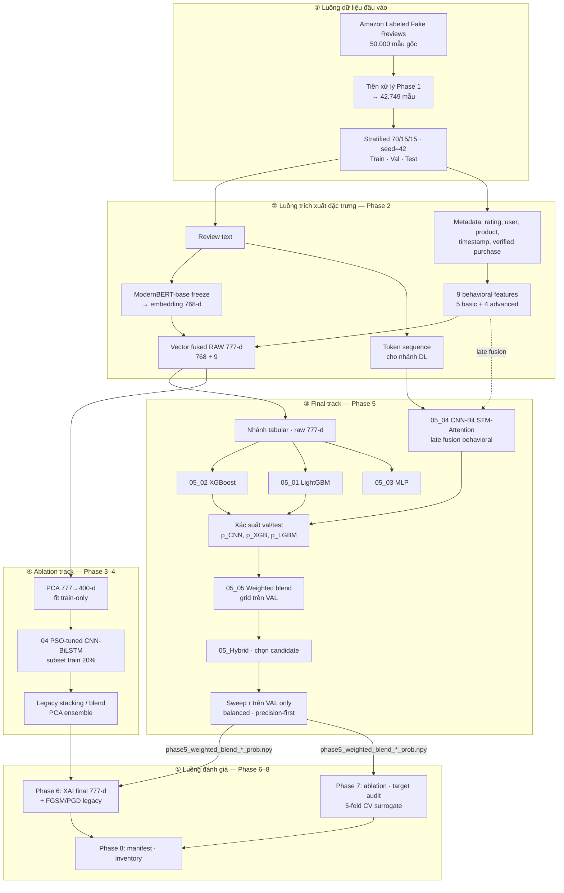
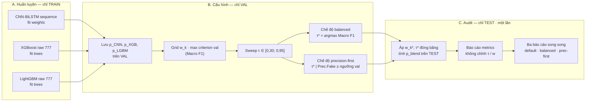
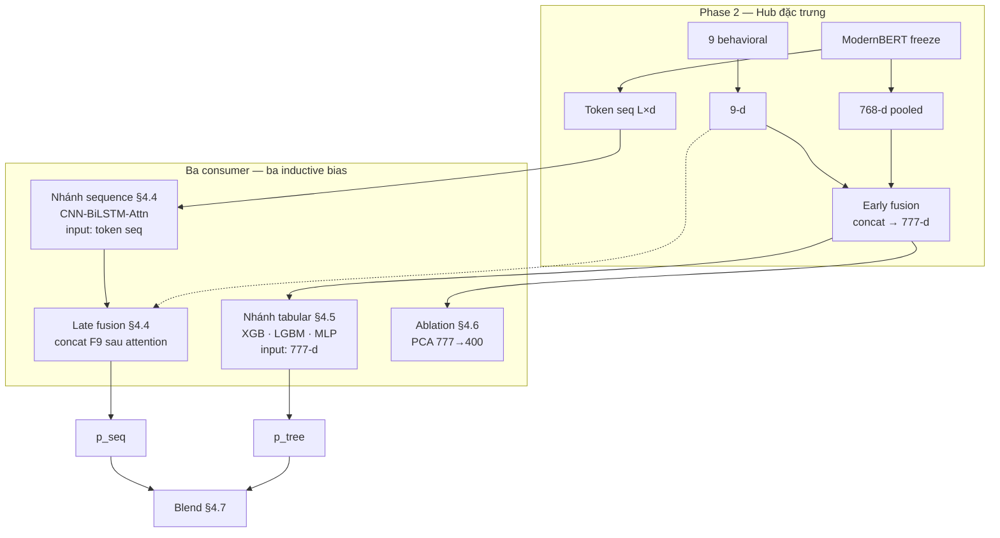

# CHƯƠNG 3: PHƯƠNG PHÁP NGHIÊN CỨU

Chương này trình bày phương pháp theo **trình tự logic khoa học**: (1) **mô tả bộ dữ liệu** (§3.1); (2) **EDA** (§3.2); (3) **thiết kế pipeline từ EDA** (§3.3); (4) **biện luận lựa chọn** thành phần — neo G1–G8 và Bảng 3.5 (§3.4); (5) **kiến trúc dual-track và sơ đồ** (§3.5); (6) **protocol thực nghiệm** (§3.6); (7) **môi trường** (§3.7); (8) **khung đánh giá** D0–D8 (§3.8). Nền tảng thuật toán: **Ch.2 §2.3**. **Số liệu** → Ch.4; **điểm tự chấm** → §4.14.

Mọi triển khai tuân thủ reproducibility và tránh leakage (Gupta et al., 2024; Ren & Ji, 2019), dưới ràng buộc RAM 12GB (Google Colab, Tesla T4 — chi tiết môi trường §3.7, §4.0).

### Bảng 3.1. Ánh xạ lý thuyết (Chương 2) → phương pháp (Chương 3) → kết quả (Chương 4)

| Mục Ch. 2 | Ý nghĩa | Phương pháp (Ch. 3) | Kết quả (Ch. 4) |
|-----------|---------|---------------------|-----------------|
| — | Bộ dữ liệu | §3.1 | §4.1 (số làm sạch, EDA) |
| — | EDA → thiết kế | §3.2–3.3 | §4.1 |
| §2.3.1 + §3.4.1 | Dual-track | §3.5 | §4.2–4.15 |
| §2.3.2 + §3.4.2 | ModernBERT | §3.5, Hình 3.3 | §4.2 |
| §2.3.3 + §3.4.3 | 9 behavioral; 777-d | §3.2, §3.3 | §4.3 |
| §2.3.4–2.3.6 + §3.4.4–3.4.6 | GBDT, sequence, blend | §3.5–3.6 | §4.4–4.8 |
| §2.3.7 + §3.4.7 | PCA/PSO ablation | §3.5 | §4.6, §4.10 |
| §2.3.8 + §3.4.8 | XAI | §3.5 | §4.9 |
| — | Protocol, metric | §3.6 | §4.8, §4.11 |
| — | Tái lập | §3.6.3 | §4.0, §4.15 |

**Diễn giải:** Bảng 3.1 phản ánh flow **dữ liệu → EDA → thiết kế → thực nghiệm → kết quả**. Ch.3 không nhúng số test; Ch.4 kiểm chứng phương pháp đã thiết kế.

### Bảng 3.2. Ánh xạ RQ → phương pháp → kiểm chứng (Ch. 4)

| RQ | Phương pháp (Ch. 3) | Kết quả (Ch. 4) |
|----|---------------------|-----------------|
| RQ1 | §3.3–3.4.3 — fusion 777-d | §4.3, §4.9, §4.10 Model C |
| RQ2 | §3.4.7 — PSO ablation | §4.6 |
| RQ3 | §3.4.7 — PCA vs raw | §4.6, §4.10 Model B |
| RQ4 | §3.4.6, §3.5–3.6 — blend | §4.4–4.7, §4.10 Models A/D/E |
| RQ5 | §3.6.2 — dual-threshold | §4.8 |
| RQ6 | §3.6 — ablation protocol | §4.10 |

**Kết luận:** Sáu RQ đóng vòng Ch.3 (thiết kế) → Ch.4 (đo) → Ch.5 (diễn giải).

---

## 3.1. Mô tả bộ dữ liệu nghiên cứu

### 3.1.1. Nguồn gốc và quy mô

**Nguồn:** [Amazon Labeled Fake Reviews](https://www.kaggle.com/datasets/mexwell/amazon-reviews-for-sentiment-analysis) — corpus công khai gán nhãn Fake/Real cho đánh giá sản phẩm Amazon, thường dùng trong nghiên cứu phát hiện spam review (Hajek et al., 2020; Vidanagama et al., 2020).

| Giai đoạn | Quy mô | Ghi chú |
|-----------|--------|---------|
| Gốc (RAW) | **50.000** mẫu | Nhãn nhị phân, metadata đầy đủ |
| Sau làm sạch | **42.749** mẫu | Dedup + loại missing (§3.3.1) |
| Train / Val / Test | 29.923 / 6.413 / 6.413 | Stratified 70/15/15, seed 42 |

Ngôn ngữ: **tiếng Anh**. Domain chủ đạo: **mỹ phẩm / chăm sóc cá nhân** (top unigram *hair*, *skin*, *product* — §4.1.7); cần thận trọng khi khái quát sang category Amazon khác.

So với corpus lịch sử: Ott et al. (2011) 400 gold deceptive; Mukherjee et al. (2013) Yelp graph; Gupta (2021) 1,4M Yelp (weighted-F1 0,69). Amazon Labeled 42k nằm vùng trung bình–lớn cho text classification, với protocol leakage control rõ (§3.6.3).

### 3.1.2. Cấu trúc schema

### Bảng 3.6. Schema corpus — 11 cột gốc và trường dẫn xuất (n = 50.000 gốc)

| # | Cột | Vai trò | Dùng trong pipeline |
|---|-----|---------|---------------------|
| 1 | `rating` | 1–5 sao | `basic_rating_deviation`; EDA-07 |
| 2 | `title` | Text ngắn | Tham khảo; không vào model |
| 3 | `text` | Nội dung review | ModernBERT; EDA-01 |
| 4 | `images` | URL ảnh (thường rỗng) | Không dùng (không multimodal) |
| 5 | `asin` | Mã sản phẩm | Burst product; EDA-08 |
| 6 | `parent_asin` | ASIN nhóm | Tham khảo |
| 7 | `user_id` | Reviewer | Velocity, burst; EDA-06 |
| 8 | `timestamp` | Thời gian đăng | Temporal EDA-05 |
| 9 | `helpful_vote` | Vote hữu ích | EDA bổ sung (§4.1.6) |
| 10 | `verified_purchase` | Boolean | `basic_verified_purchase` |
| 11 | `label` | 0=Real, 1=Fake | Nhãn giám sát |
| *dx* | `review_char_len`, `review_word_count` | *Derived sau clean* | Feature Phase 2 |

*Nguồn:* `phase1_eda_summary.csv` (original_columns = 13 bao gồm derived). **Không có** cột category → EDA-08 category skipped (§3.2.2).

### 3.1.3. Đặc điểm nhãn và mất cân bằng lớp

Trước làm sạch: Fake 49,4% / Real 50,6% (gần cân bằng). Sau dedup: **~41% Fake / 59% Real** — mất cân bằng nhẹ, stratified split giữ tỷ lệ trên mọi tập (chi tiết Bảng 4.0a, §4.1.1). Corpus **không** phản ánh tỷ lệ fake thực tế trên Amazon (real thường chiếm đa số) — đây là đặc điểm của bộ gán nhãn, không phải kết luận hiện trường.

**Giới hạn khái quát hóa:** Kết quả và EDA chủ yếu phản ánh **review tiếng Anh, domain mỹ phẩm/chăm sóc cá nhân** (§4.1.7), trên corpus gán nhãn công khai với tỷ lệ fake ~41%. Không suy diễn trực tiếp sang category Amazon khác, ngôn ngữ khác, hoặc marketplace không có metadata tương đương (`verified_purchase`, `user_id`, `timestamp`) — hạn chế disclose thêm ở Ch.5 §5.6.

**Kết luận:** §3.1 cố định **đối tượng nghiên cứu** trước EDA và modeling. Insight định lượng → §3.2 (phương pháp) và §4.1 (số liệu).

---

## 3.2. Phân tích khám phá dữ liệu (EDA)

Phân tích khám phá nhằm làm rõ **đặc điểm, vấn đề và insight** của corpus trước khi thiết kế pipeline (§3.3). Đây là bước bắt buộc theo rubric D0 (Bảng 3.8).

### 3.2.1. Chiến lược EDA

Trước khi huấn luyện bất kỳ mô hình nào, đề tài thực hiện **EDA có cấu trúc** trên toàn bộ corpus sau làm sạch (n = 42.749). Mục tiêu không phải mô tả đồ thị đẹp mà trả lời ba câu hỏi phương pháp:

1. **Corpus có đặc điểm gì** khiến fake và real khó tách bằng một quy tắc đơn?
2. **Tín hiệu nào** có biên phân tách đủ lớn để justify đặc trưng engineered và dual-view BERT+behavioral?
3. **Artifact nào** phải được sinh ra để Phase 2–5 không thiết kế “mù” dữ liệu?

**Nguồn dữ liệu:** Amazon Labeled Fake Reviews — 50.000 mẫu gốc, 13 cột metadata (Bảng 3.6, §3.1.2). Sau deduplicate text+label và loại mẫu thiếu trường bắt buộc → **42.749** mẫu (`phase1_cleaning_report.csv`). Không imputation text — mẫu thiếu ngữ nghĩa bị loại (Ren & Ji, 2019).

**Chiến lược EDA:**

| Nguyên tắc | Lý do |
|------------|-------|
| Checklist EDA-01..08 cố định | Tránh “cherry-pick” biểu đồ sau khi đã có kết quả mô hình |
| Sinh artifact CSV + PNG mỗi mục | SSOT cho luận văn và notebook Phase 2 (`phase1_advanced_eda_summary.csv`) |
| EDA trên **toàn corpus** trước split | Hiểu population; split chỉ áp dụng khi train (§3.6.3) |
| Bỏ qua category/wordcloud có lý do | Corpus không có cột category; wordcloud tắt mặc định — thay bằng top unigram (EDA-04) |
| Artifact Phase 1 đủ cho checklist | Verified/helpful bổ sung qua aggregation từ `data/processed/*.csv` (export khuyến nghị: `phase1_verified_by_label.csv`) |

**Diễn giải:** EDA được đặt **trước** mọi số liệu thuật toán trong Chương 4 — độc giả hiểu dataset trước khi đọc Macro F1. Đây là yêu cầu rubric D0 (Bảng 3.8) và phản ánh best practice survey FRD (Gupta et al., 2024).

**Kết luận:** §3.2.1 định vị EDA là **bước thiết kế thí nghiệm**, không phụ lục. Số liệu chi tiết → §4.1; ánh xạ thiết kế → §3.3.

---

### 3.2.2. Checklist EDA-01..08

Checklist được khai báo trong `01_EDA_Preprocessing.ipynb` và audit qua `phase1_advanced_eda_summary.csv` (generated 2026-05-31). Mỗi mục có artifact bắt buộc (table và/hoặc figure).

### Bảng 3.4. Checklist EDA — câu hỏi, artifact và trạng thái

| Mã | Câu hỏi EDA | Artifact chính | Trạng thái | Ghi chú |
|----|-------------|----------------|------------|---------|
| EDA-01 | Fake và real khác nhau về độ dài văn bản không? | `phase1_length_by_label.csv`, boxplot | ✓ generated | Median char fake = 43 vs real = 125 |
| EDA-02 | Mẫu text điển hình của mỗi lớp trông như thế nào? | `phase1_samples_by_label.csv` | ✓ generated | 10 mẫu/label, có text thô |
| EDA-03 | Sentiment VADER phân tách được hai lớp không? | `phase1_sentiment_by_label.csv` | ✓ generated | Compound gần nhau → cần embedding |
| EDA-04 | Từ khóa nào lệch phân phối giữa fake/real? | `phase1_top_terms_by_label.csv` | ✓ generated | Overlap cao → cần BERT |
| EDA-05 | Spam có pattern theo thời gian không? | `phase1_temporal_stats.csv`, volume/fake_rate figures | ✓ generated | 2003–2025, parse rate 100% |
| EDA-06 | User có burst review bất thường không? | `phase1_user_burst_stats.csv` | ✓ generated | 17.122 user có burst_fake_count > 0 |
| EDA-07 | Rating và nhãn có tương quan không? | `phase1_rating_label_stats.csv` | ✓ generated | Fake mean rating 4,06 > real 3,84 |
| EDA-08 | Fake tập trung theo sản phẩm không? | `phase1_product_fake_rate.csv` | ✓ generated | 36,6% ASIN có fake rate > 50% |
| — | Category theo nhãn? | `phase1_category_fake_rate.csv` | skipped | Không có cột category |
| — | Wordcloud? | `phase1_wordcloud_*.png` | skipped | `ENABLE_WORDCLOUD=False`; dùng top terms |

**Diễn giải:** **8/8** mục checklist cốt lõi đã có artifact; 2 mục optional bỏ qua có **lý do ghi trong CSV** (không phải thiếu sót im lặng). EDA-02 và EDA-04 bổ sung khía cạnh **ngôn ngữ** mà EDA-01 (độ dài) không thay thế được.

**Kết luận:** Checklist đủ để đạt nấc D0 ≥ 3 (Bảng 3.8). Chi tiết số → Bảng 4.0a–4.0n (§4.1). *Lưu ý:* Các số trong cột Ghi chú là tóm tắt; bảng đầy đủ ở Ch.4.

---

## 3.3. Thiết kế pipeline dựa trên kết quả EDA

Dựa trên insight EDA (§3.2), đề tài thiết kế **tiền xử lý**, **đặc trưng**; biện luận và kiến trúc mô hình (§3.4–3.5). Bảng 3.5 tóm tắt ánh xạ phát hiện → quyết định thiết kế; số liệu đối chiếu tại §4.1.

### 3.3.1. Thiết kế tiền xử lý và phân chia dữ liệu

Triển khai trong `01_EDA_Preprocessing.ipynb` (Phase 1); các quy tắc dưới đây **thiết kế** từ insight EDA (§3.2), thực thi theo thứ tự cuối mục §3.3.1:

| Bước | Quy tắc | Lý do (từ EDA / phương pháp) |
|------|---------|------------------------------|
| Loại missing | 57 dòng thiếu trường bắt buộc | Không imputation text — mẫu thiếu ngữ nghĩa không có cơ sở gán nhãn (Ren & Ji, 2019) |
| Dedup | Trùng `text` + `label` → bỏ 7.194 dòng | EDA gợi ý spam tái sử dụng cùng mẫu văn bản (§4.1.1) |
| Không imputation | Text thiếu → loại | Tránh nhiễu nhãn giả định |
| Split | Stratified **70/15/15**, seed **42** | ~41% Fake / 59% Real; val đủ grid blend; test audit một lần (§3.6.3) |
| Fit policy | Scaler, PCA, aggregate behavioral **train-only** | Ngăn leakage từ val/test vào đặc trưng hành vi |

**Đầu ra:** `train/val/test.csv` (29.923 / 6.413 / 6.413), `split_metadata.json` — điểm neo cho Phase 2–8 (Hình 3.1 khối ①).

**Kết quả số làm sạch:** Bảng 4.0a (§4.1.1). Thiết kế ở Ch.3; số liệu ở Ch.4 — tách *tại sao* khỏi *bao nhiêu*.

**Thứ tự thực thi Phase 1** (`01_EDA_Preprocessing.ipynb`, cell 16): (1) nạp RAW 50.000 mẫu; (2) loại missing trường bắt buộc (57 dòng); (3) deduplicate `text`+`label` (7.194 dòng) → **42.749** mẫu; (4) stratified split 70/15/15 seed 42; (5) export `train/val/test.csv`; (6) **EDA checklist EDA-01..08** (Phase 1.1) trên toàn bộ `clean_df` 42.749 — notebook đặt section này sau cell split, nhưng mọi aggregate (`phase1_length_by_label.csv`, `phase1_sentiment_by_label.csv`, …) tính trên **population đầy đủ**, không dùng tập con train/val/test. EDA mô tả corpus sau làm sạch; leakage control chỉ áp dụng từ Phase 2 trở đi (§3.6.3).

### 3.3.2. Bảng 3.5. Ánh xạ EDA → quyết định thiết kế pipeline

| EDA | Phát hiện chính (tóm tắt) | Quyết định thiết kế | Consumer |
|-----|---------------------------|---------------------|----------|
| EDA-01 | Fake median 7 từ / 43 ký tự; real 24 từ / 125 ký tự | `basic_char_len_log`, `basic_word_count_log` | Fusion 777-d §4.3; SHAP top-1/3 §4.9 |
| EDA-02 | Fake có cả review cực ngắn (“best ever”) lẫn dài (copy) | `max_length=160` ModernBERT; không rule độ dài cứng | §4.2, §4.4 |
| EDA-03 | VADER compound fake 0,456 ≈ real 0,445 | `basic_sentiment_compound` — tín hiệu phụ | Fusion 777-d |
| EDA-04 | Top unigram overlap (hair, product, great, like, love) | ModernBERT freeze thay bag-of-words | §4.2 |
| EDA-05 | Fake rate theo năm 33–41%; biến thiên giờ ~6 điểm % | `adv_time_gap_hours_log`, velocity, burst | Advanced behavioral §4.3 |
| EDA-06 | 17.122 user có burst_fake_count > 0 | `adv_reviewer_behavior_score`, `adv_review_velocity_30d` | Advanced behavioral |
| EDA-07 | Fake rating mean cao hơn; 63,8% fake là 5 sao | `basic_rating_deviation` | Fusion 777-d; SHAP top-4 |
| EDA-08 | 36,6% ASIN fake rate > 50% | `adv_product_burst_7d` | Advanced behavioral |
| Verified* | Real 100% verified; fake **74,02%** | `basic_verified_purchase` | SHAP top-2 §4.9 |
| Helpful* | Real mean 1,05; fake 0,868 vote | Không đưa vào 9-d (tránh leakage hiếm); ghi nhận qualitative | — |

*\*Verified/helpful: tính từ `data/processed/train+val+test.csv` sau split; không có trong checklist gốc nhưng bổ sung cho D0.*

**Diễn giải:** Mọi feature trong Bảng 4.2 (§4.3) đều **truy vết được** về ít nhất một dòng EDA — tránh “feature engineering ngẫu nhiên”. Overlap từ vựng (EDA-04) và sentiment gần nhau (EDA-03) justify **nhánh BERT** song song behavioral, không thay thế.

---
### 3.3.3. Giới hạn ánh xạ EDA và kiểm chứng bằng ablation

Bảng 3.5 chỉ justify **giả thuyết thiết kế** — *khả năng* tồn tại tín hiệu, không đồng nghĩa mọi feature đều đóng góp lớn khi huấn luyện. **Mức đóng góp thực tế** được đo ở Ch.4: khối advanced behavioral chỉ **+0,0023** Macro F1 so với ref. (Model C, §4.10); SHAP/XGB (§4.9.2) xác nhận basic behavioral top-4. EDA vì vậy là **đầu vào thiết kế**, ablation là **đầu ra kiểm chứng** — tránh hồi tố (post-hoc rationalization).

**Kết luận:** §3.3 nối §3.2 → §3.4: độc giả hiểu *tại sao* pipeline được thiết kế như vậy; Ch.4 trả lời *hiệu quả* và *đóng góp từng thành phần*.

---

---

## 3.4. Biện luận lựa chọn thành phần pipeline

Sau EDA và Bảng 3.5 (§3.3), mục này trả lời **vì sao đề tài chọn** từng thành phần — so sánh với Bảng 2.1–2.2, ánh xạ Gap Bảng 2.4, và bằng chứng qualitative từ EDA. Nền tảng thuật toán (cơ chế, công thức): **Ch.2 §2.3**. Kiến trúc vận hành và sơ đồ: **§3.5**.

### 3.4.1. Khung tổng thể: dual-track và hai không gian tín hiệu

#### So sánh với tài liệu và phương án thay thế

So sánh kiến trúc trong tài liệu

| Kiến trúc | Cách vận hành | Paper (Bảng 2.2) | Hạn chế lý thuyết |
|-----------|---------------|------------------|-------------------|
| Text-only | text → BERT → classifier | Refaeli (13), Mir (16) | Bỏ metadata → G1 |
| Behavioral-only | meta → SVM/rules/graph | Mukherjee (3) | Yếu khi nội dung là signal chính |
| Single hybrid | fusion → **một** model | Duma (15) gần | Không tách tabular vs sequence → G2 |
| **Dual-track + ensemble** | fusion → GBDT **và** sequence → blend | Bhuvaneshwari (12) có sequence; thiếu GBDT+blend cùng protocol | Phức tạp hơn — **đề tài** lấp G2 |

#### Kết luận lựa chọn

Kết luận chọn dual-track

GBDT mạnh trên **vector cố định** nhờ cây quyết định và tương tác phi tuyến (Chen & Guestrin, 2016; Shwartz-Ziv & Armon, 2021). CNN-BiLSTM mạnh trên **chuỗi** nhờ n-gram cục bộ và phụ thuộc dài hạn (Kim, 2014; Hochreiter & Schmidhuber, 1997). Hai inductive bias khác nhau → ensemble giảm phương sai khi sai số không tương quan (Breiman, 1996). Tài liệu chưa có paper Tier A nào trong Bảng 2.2 kết hợp đủ **ModernBERT + behavioral + GBDT + sequence + blend** trên cùng protocol — đây là lý do đề tài chọn dual-track làm khung lý thuyết trung tâm.

---

### 3.4.2. Biểu diễn văn bản: ModernBERT freeze

#### So sánh với tài liệu và phương án thay thế

So sánh biểu diễn văn bản trong tài liệu

| Phương án | Cơ chế | Đầu ra | FRD (Bảng 2.2) | Giới hạn |
|-----------|--------|--------|----------------|----------|
| BoW / TF-IDF | Đếm từ, TF-IDF | Vector sparse | Jindal (1), Ott (2), Shah (7) | Paraphrase, LLM-spam |
| CNN trên embedding tĩnh | Conv1D | Logits | Hajek (8) | Embedding tĩnh yếu ngữ cảnh |
| BERT fine-tune | Cập nhật toàn encoder | Logits | Refaeli (13) | Cần data/GPU lớn |
| BERT/ModernBERT **freeze** | $\phi$ cố định + head | 768-d hoặc $p$ | Refaeli (13) feature-based; **ModernBERT ít paper Amazon** | Có thể kém E2E fine-tune |

Gupta et al. (2024) ghi nhận họ Transformer chiếm đa số nhưng thường **text-only** — chưa kết hợp behavioral engineered (G1).

#### Kết luận lựa chọn

Kết luận chọn ModernBERT freeze

- **ModernBERT** thay BERT-base: ngữ cảnh dài hơn, kiến trúc mới (Warner et al., 2024) — phù hợp review TMDT độ dài biến thiên.
- **Freeze** thay fine-tune E2E: corpus ~40k và pipeline đa nhánh — fine-tune toàn encoder dễ overfit và OOM (Refaeli & Hajek, 2021; Ren & Ji, 2019).
- **Hai đầu ra** (768-d pooled + token sequence): phục vụ đồng thời nhánh tabular và sequence — một encoder, hai inductive bias (§2.3.1 và §3.4.1).

---

### 3.4.3. Đặc trưng hành vi: 9 feature và fusion

#### So sánh với tài liệu và phương án thay thế

So sánh khai thác metadata trong tài liệu

| Phương án | Đầu vào | Đầu ra | Paper | Nhận xét |
|-----------|---------|--------|-------|----------|
| Rule / heuristic | meta | nhãn 0/1 | Jindal (1) sơ khai | Không đủ LLM + verified thật |
| Feature + SVM | vector meta | nhãn | Mukherjee (3) | Nền tảng behavioral |
| Graph feature | đồ thị | embedding node | Rayana (4), Wu (20) | Mạnh collective; RAM cao |
| **Engineered + fusion text** | meta + BERT | 777-d | Duma (15) aspect+rating; **chưa ModernBERT+9 feat.** | G1 đề tài lấp chỗ trống |

#### Kết luận lựa chọn

Kết luận chọn 9 behavioral + dual fusion

Graph (Bảng 2.1, hàng Graph; ID 4, 20) vượt RAM và Tier B. Text-only (Refaeli, Mir) bỏ metadata. Đề tài chọn **engineered 9 features** vì: (i) có đủ trường metadata Amazon; (ii) Mukherjee/Duma chứng minh hướng có signal; (iii) fusion sớm cho GBDT + fusion muộn cho sequence — hai đường khai thác cùng một bộ feature, phù hợp dual-track.

*Bằng chứng EDA:* median độ dài fake 7 từ / 43 ký tự; verified fake 74,02% — justify khối basic và `basic_verified_purchase` (Bảng 3.5, §4.1). *Ablation thực tế:* advanced chỉ +0,0023 Macro F1 (§4.10) — không overclaim EDA checklist.*

---

### 3.4.4. Nhánh tabular: XGBoost và LightGBM

#### So sánh với tài liệu và phương án thay thế

So sánh classifier tabular trong tài liệu

| Họ | Cơ chế | Paper FRD | Trên fused dense vector |
|----|--------|-----------|-------------------------|
| LR / SVM | Linear / kernel margin | Jindal (1), Mukherjee (3) | Yếu tương tác cao chiều |
| MLP | Fully-connected | Vidanagama (9) CNN pipeline | Dễ overfit ~40k |
| **GBDT** | Boosting trees | Duma (15), Refaeli (13) hybrid | **Mạnh** (Shwartz-Ziv & Armon, 2021) |

Shwartz-Ziv & Armon (2021) chỉ ra trên tabular có cấu trúc, GBDT thường **thắng hoặc ngang** deep learning — vector 777-d sau Transformer thuộc loại này.

#### Kết luận lựa chọn

Kết luận chọn XGBoost + LightGBM

Refaeli (13) và Duma (15) đã chứng minh hybrid **embedding + tree** trên FRD. Đề tài áp dụng trên **777-d fused** (không chỉ text embedding). Hai implementation GBDT khác nhau → hai $p_{\text{tree}}$ đa dạng cho blend. MLP có thể tham gia grid ensemble nhưng GBDT là **nhánh tabular chính** theo lý thuyết tabular data.

---

### 3.4.5. Nhánh sequence: CNN-BiLSTM-Attention và Focal Loss

#### So sánh với tài liệu và phương án thay thế

So sánh nhánh sequence trong tài liệu

| Kiến trúc | Inductive bias | Paper | Ghi chú |
|-----------|----------------|-------|---------|
| Pure CNN | N-gram cục bộ | Hajek (8) | Thiếu phụ thuộc dài |
| Pure LSTM | Trình tự | — | Thiếu conv cục bộ |
| CNN-BiLSTM-Att | Cục bộ + toàn cục + attention | **Bhuvaneshwari (12)** >90% Amazon | Tier A gần nhất |
| Transformer E2E | Global attention, fine-tune all | Refaeli (13) | Cần GPU/data lớn |

Bhuvaneshwari et al. (2021) — ID 12 Bảng 2.2 — là **mốc lý thuyết** cho nhánh sequence trên Amazon; đề tài kế thừa kiến trúc lai nhưng thay embedding bằng ModernBERT freeze.

#### Kết luận lựa chọn

Kết luận chọn CNN-BiLSTM-Attention + Focal Loss

- **Kiến trúc lai** vượt pure CNN/LSTM trên text classification (Kim, 2014; Bhuvaneshwari, 2021).
- **Trên embedding freeze** thay E2E: phù hợp corpus và tài nguyên (so sánh Refaeli fine-tune vs Bhuvaneshwari hybrid).
- **Focal Loss** xử lý imbalance trong hàm mất mát — nhất quán Ott (2011) và thực tế ~40% fake.
- **Late fusion behavioral** — metadata không bị mất khi chỉ học trên token.

---

### 3.4.6. Tổng hợp dự đoán: weighted blend

#### So sánh với tài liệu và phương án thay thế

So sánh tổng hợp trong tài liệu

| Phương án | Cơ chế | Paper | Rủi ro |
|-----------|--------|-------|--------|
| Single best | Một $p_k$ | Đa số paper Bảng 2.2 | Bỏ diversity |
| **Weighted blend** | $\sum w_k p_k$ | Zhang (10) ensemble Yelp | Cần grid $w_k$ |
| Stacking | Meta trên $p_k$ | Zhang (10) | Overfit val nhỏ |
| APSO + hybrid | PSO tối ưu + DL | Deshai (14) | Khó reproduce (G6) |

Zhang et al. (2020) — ID 10 — chứng minh ensemble vượt RF/SVM trên Yelp; Gupta (2024) vẫn chỉ ra thiếu protocol τ (G3, G7).

#### Kết luận lựa chọn

Kết luận chọn weighted blend

Base models đủ mạnh và **khác họ** (sequence DL vs GBDT tabular) → điều kiện ensemble của Breiman (1996). Stacking trên val ~6k mẫu dễ overfit meta-layer (Zhang, 2020). Blend **trong suốt** (biết $w_k$), reproducible, map G3. Áp dual-threshold trên $p_{\text{blend}}$ là bước **sau** ensemble — thuộc protocol Chương 3 §3.5–3.6, không đổi lý thuyết blend.

---

### 3.4.7. Ablation: PCA và PSO (track phụ)

#### So sánh với tài liệu và phương án thay thế

So sánh với hướng chính (raw + grid)

| Thành phần | Pipeline chính (lý thuyết) | Ablation (PCA/PSO) | Paper tham chiếu |
|------------|---------------------------|---------------------|------------------|
| Biểu diễn | Raw 777-d | PCA 777→400 | Shah (7) PCA text |
| Tối ưu DL | Grid blend / grid HP | PSO swarm | Deshai (14) |
| GBDT input | $\mathbf{x}$ đầy đủ | $\mathbf{z}$ nén | Shwartz-Ziv & Armon (2021) nghi ngờ PCA+tree |

#### Kết luận lựa chọn

Kết luận: ablation track, không final track

Shwartz-Ziv & Armon (2021): GBDT trên tabular dense **không cần** PCA — giảm chiều có thể phá tương tác. Shah (2019) PCA trên **text sparse** — bối cảnh khác fused BERT. PSO (Deshai, 14) hợp lý cho ablation so sánh nhưng dễ overclaim (G6). **Final track** theo raw 777-d + grid blend; PCA/PSO chỉ để **kiểm chứng G5, G6** (kết quả: Chương 4).

---

### 3.4.8. XAI và đánh giá độ bền

#### So sánh với tài liệu và phương án thay thế

So sánh trong bối cảnh FRD

| Hướng | Có trong 20 papers? | Ghi chú |
|-------|----------------------|---------|
| Black-box F1 only | Đa số Tier A | Không giải thích được |
| XAI post-hoc | Một số survey khuyến nghị | Ren & Ji (2019) |
| **XAI trên vector có tên feature** | Hiếm khi 777-d behavioral+embedding | Đề tài: kiểm chứng fusion §2.3.3 |

#### Kết luận lựa chọn

Kết luận có XAI trong đề tài

Không phải thuật toán phát hiện spam mới mà **lớp kiểm chứng lý thuyết**: nếu SHAP top là verified, word count, sentiment — nhất quán Mukherjee/Ott; nếu chỉ embedding — gợi ý behavioral yếu. Triển khai và kết quả: Chương 4 §4.9.

---
---

## 3.5. Kiến trúc dual-track và lựa chọn mô hình

Kiến trúc được tổ chức thành **hai track song song** trên cùng nguồn đặc trưng Phase 2, nhưng **khác biểu diễn** và **khác mục đích báo cáo** (Ch.2 §2.3.1; biện luận §3.4.1):

| Track | Giả thuyết vận hành | Vai trò trong luận văn |
|-------|---------------------|----------------------|
| **Final track** | Vector fused **raw 777-d** đủ thông tin cho GBDT; sequence DL bổ sung inductive bias token | Pipeline headline — mọi số SOTA và XAI chính |
| **Ablation track** | PCA + PSO + legacy ensemble phục vụ giảm RAM và so sánh lịch sử | Diagnostic, negative result, appendix |

**Nguyên tắc bất biến:** Track ③ và ④ **không hợp nhất** ở inference — PCA không được đưa vào `weighted_blend` final; ngược lại, ablation không “kéo” raw 777 vào legacy τ = 0,79. Vi phạm nguyên tắc này làm mất tính audit của dual-track (chiều D8, Bảng 3.8).

---

### 3.5.1. Sơ đồ kiến trúc tổng thể (Hình 3.1)

Hình 3.1 là **bản đồ pha** (*phase map*): năm khối luồng ①–⑤, thứ tự phụ thuộc, và điểm tách dual-track.

*Hình 3.1. Sơ đồ kiến trúc dual-track — năm luồng logic ①–⑤.*

#### Giải thích khối ① — Luồng dữ liệu đầu vào

Khối ① tạo **điểm neo reproducible** cho toàn pipeline. Mọi phase sau chỉ được *đọc* split đã cố định, không tái chia hay tái làm sạch khi đã có artifact Phase 1.

| Nút | Chức năng | Logic học thuật |
|-----|-----------|-----------------|
| **RAW** | Corpus gốc 50.000 mẫu, nhãn Fake/Real, metadata đầy đủ | Một nguồn duy nhất — mọi so sánh ablation sau này cùng population |
| **CLEAN** | Loại duplicate, thiếu trường bắt buộc → 42.749 mẫu | Không imputation text: mẫu thiếu ngữ nghĩa không có cơ sở gán nhãn giả định (Ren & Ji, 2019) |
| **SPLIT** | Stratified 70/15/15, seed 42 | Val dành cho **chọn** cấu hình (blend, τ); test dành cho **audit một lần** — tách vai trò tập theo best practice survey FRD |

**Đầu ra khối ①** (`train/val/test.csv`) là **điều kiện tiên quyết** của khối ②: không có split hợp lệ thì mọi fit policy “train-only” vô nghĩa.

#### Giải thích khối ② — Luồng trích xuất đặc trưng (hub)

Khối ② là **hub trung tâm** — mọi track đều xuất phát từ đây nhưng **phân nhánh biểu diễn** khác nhau (Hình 3.3, §3.5.3).

| Nút | Đầu vào | Đầu ra | Vai trò trong luồng |
|-----|---------|--------|---------------------|
| **TXT / META** | Tách từ cùng một review sau split | Hai luồng song song | Thể hiện hai không gian tín hiệu (Ch.2 §2.3.1; biện luận §3.4.1): ngôn ngữ vs hành vi |
| **MBERT** | Text | (A) Vector 768-d pooled; (B) Ma trận token | Một encoder, **hai consumer** — tiết kiệm RAM, tránh hai bản mã hóa không nhất quán |
| **BEH9** | Metadata | Vector 9-d | Tín hiệu engineered — khó đồng bộ hóa ở quy mô chiến dịch (Mukherjee et al., 2013) |
| **V777** | Concat $[\mathbf{e}_{768}; \mathbf{f}_9]$ | Vector tabular 777-d | **Early fusion** cho nhánh GBDT (Ch. 4, §4.5) và PCA ablation (§4.6) |
| **TOKSEQ** | Token từ MBERT | Chuỗi $L \times d$ | **Không** fusion sớm với 777-d — giữ inductive bias sequence (§4.4) |

**Fit policy khối ②:** Inference ModernBERT không cập nhật trọng số; scaler behavioral và aggregate rating (cho `basic_rating_deviation`, velocity, burst) **chỉ học từ train**. Val/test chỉ transform — ngăn leakage từ phân phối tương lai vào thống kê hành vi.

#### Giải thích khối ③ — Final track (đường báo cáo chính)

Khối ③ triển khai giả thuyết **dual-view**: cùng một review được đọc theo hai inductive bias (tabular GBDT + sequence DL), rồi **hợp nhất ở tầng xác suất**, không ở tầng đặc trưng.

| Giai đoạn con | Nút | Logic vận hành |
|---------------|-----|----------------|
| Phân loại song song | **TAB** → XGB, LGBM, MLP | Cùng input 777-d; GBDT khai thác tương tác phi tuyến chiều embedding–behavioral (Shwartz-Ziv & Armon, 2021) |
| Phân loại song song | **TOKSEQ** → **SEQ** | CNN-BiLSTM-Attention trên thứ tự token; **BEH9** nối đường chấm *late fusion* — behavioral vào sau attention, không trộn vào token |
| Thu thập xác suất | **PROB** | Mỗi base model xuất $p_k \in [0,1]$ trên val và test — **tách** khỏi quyết định nhị phân |
| Hợp nhất | **BLEND** | $p_{\text{blend}} = \sum_k w_k p_k$; $w_k$ chọn bằng grid **chỉ trên val** — không thêm meta-learner (tránh overfit val ~6k mẫu, Zhang et al., 2020) |
| Chọn báo cáo | **HYBRID** | So sánh candidate (blend vs stacking) theo protocol đóng băng |
| Quyết định vận hành | **TAU** | Sweep τ trên val → hai chế độ balanced / precision-first (§3.6.2; kết quả §4.8) |

**Mũi tên vào Phase 6–7:** `phase5_weighted_blend_*_prob.npy` là **hợp đồng dữ liệu** giữa huấn luyện và đánh giá — Phase 7 không retrain khi audit.

#### Giải thích khối ④ — Ablation track (song song, không thay thế ③)

| Nút | Mục đích trong luồng | Quan hệ với khối ③ |
|-----|---------------------|-------------------|
| **PCA** | Giảm 777→400, fit train — phục vụ DL trong RAM 12GB | Cùng nguồn V777 nhưng **biến đổi** không gian; kết quả so sánh controlled tại Phase 7 (RQ3) |
| **PSO** | Tối ưu 12 hyperparameter DL trên subset train | Trả lời RQ2 trong **không gian PCA**, không claim cho final blend |
| **LEGSTACK** | Ensemble legacy trên PCA — lịch sử thiết kế ban đầu | Cung cấp mô hình cho FGSM/PGD appendix (Ch. 4, §4.9); τ legacy **khác** protocol final |

Khối ④ **không có cạnh** vào BLEND hay TAU — đây là cam kết phương pháp luận: ablation không “ô nhiễm” đường SOTA.

#### Giải thích khối ⑤ — Luồng đánh giá và đóng gói

| Phase | Đọc từ đâu | Logic |
|-------|------------|-------|
| **P6** | Probs + model final 777-d; legacy từ ④ | Tách XAI headline (giải thích fusion) vs adversarial legacy (không overclaim robustness final) |
| **P7** | Probs blend final | Target audit (M1–M3), ablation Models A–E **cùng split**, CV surrogate |
| **P8** | Toàn bộ artifact ①–⑦ | Manifest, inventory — phục vụ reproducibility (D3, Bảng 3.8) |

**Thứ tự logic:** ③ hoàn tất → ⑤ đọc kết quả; ④ có thể chạy song song với ③ sau khi ② xong, nhưng ⑤ chỉ **diễn giải** ④ ở mức appendix/ablation.

#### Tổng hợp quy tắc kết nối Hình 3.1

1. **Chiều dọc (phụ thuộc pha):** ① → ② → (③ ∥ ④) → ⑤ — không bỏ qua ② để vào ③.
2. **Chiều ngang (tách track):** ③ ⊥ ④ ở inference; chỉ ⑤ được đọc cả hai với nhãn rõ ràng.
3. **Hub ②:** Một lần trích xuất — nhiều consumer; tránh leakage bằng fit policy thống nhất.
4. **Điểm quyết định duy nhất trên val:** BLEND ($w_k$) và TAU (τ) — test không tham gia chọn lựa.

---

### 3.5.2. Sơ đồ luồng xác suất và chọn ngưỡng (Hình 3.2)

Hình 3.2 **phóng đại** giai đoạn cuối khối ③: tách bạch ba **vai trò tập** (train / val / test) theo Ren & Ji (2019) — tránh *test-set peeking*.

*Hình 3.2. Ba giai đoạn A–B–C: học tham số → chọn cấu hình → audit.*

#### Giai đoạn A — Huấn luyện (TRAIN only)

Ba base model **độc lập** về tham số nhưng **phụ thuộc** cùng split và cùng hub đặc trưng ②:

| Model | Học gì trên train | Không được làm trên val/test |
|-------|-------------------|------------------------------|
| CNN-BiLSTM | Trọng số CNN, LSTM, attention, FC | Fit, early-stop theo val chỉ để **dừng epoch**, không chọn kiến trúc thay thế |
| XGBoost / LightGBM | Cấu trúc cây, split feature | Không dùng phân phối val để tái fit scaler/embedding |

**Ý nghĩa học thuật:** Giai đoạn A chỉ trả lời câu hỏi “với đặc trưng đã đóng băng, mỗi họ phân loại học được gì?” — chưa có quyết định vận hành (blend, τ).

#### Giai đoạn B — Chọn cấu hình (VAL only)

Đây là **điểm ra quyết định** của pipeline — mọi hyperparameter “vận hành” (không phải trọng số neural/tree) được chọn ở đây:

| Bước | Đối tượng chọn | Tiêu chí | Tại sao trên val |
|------|----------------|----------|------------------|
| **PV** | Vector xác suất per model | Lưu artifact — không quyết định nhãn | Val có nhãn để tính metric nhưng **chưa** phải báo cáo cuối |
| **GRID** | $\mathbf{w} = (w_{\text{CNN}}, w_{\text{XGB}}, \ldots)$ | Max Macro F1 val (criterion chính) | Convex blend — ít tham số, ổn định hơn stacking khi val nhỏ |
| **SWEEP** | $\tau$ | Quét dải rộng | ROC-AUC cao (M3) cho phép τ hoạt động — metric ranking đã được kiểm tra ở §3.6.1 |
| **MODE1/2** | $\tau^*$ cho từng kịch bản | Balanced vs precision-first (§3.6.2) | Một $p_{\text{blend}}$, hai **chính sách triển khai** — map nghiệp vụ e-commerce |

**Hai chế độ τ không phải hai mô hình:** Cùng $p_{\text{blend}}$, khác ngưỡng cắt — phản ánh trade-off moderation rộng (recall) vs auto-flag (precision), không cần retrain.

#### Giai đoạn C — Audit (TEST · một lần)

| Quy tắc | Lý do |
|---------|-------|
| Áp $(\mathbf{w}^*, \tau^*)$ đã đóng băng từ B | Test không tham gia tối ưu → ước lượng không chệch (optimistic bias) |
| Báo cáo đồng thời default τ=0,50 và hai chế độ val-select | Default là đối chiếu literature; hai chế độ kia map M1–M2 |
| Không chỉnh pipeline sau khi đọc test | Mọi chỉnh sửa sau audit làm mất ý nghĩa test độc lập (Gap G4) |

**Đầu ra C** chuyển sang Chương 4 và chiều D1/D7 (Bảng 3.8) — Chương 3 chỉ khẳng định **luồng** đảm bảo tính hợp lệ của việc đo.

---

### 3.5.3. Sơ đồ phân nhánh biểu diễn đặc trưng (Hình 3.3)

Hình 3.3 làm rõ **tại sao** cùng hub ② lại tạo ba đường consumer khác nhau — tránh nhầm lẫn “fusion 777-d” với “sequence input”.

*Hình 3.3. Early fusion (tabular) vs late fusion (sequence) — cùng nguồn, khác điểm hợp nhất.*

#### Phân tích logic từng nhánh consumer

**Nhánh tabular (777-d, early fusion):** Behavioral và embedding gặp nhau **trước** bộ phân loại. GBDT có thể học split trên cả chiều BERT lẫn `basic_verified_purchase` — phù hợp khi tín hiệu hành vi mang tên feature, giải thích được (XAI §4.9).

**Nhánh sequence (token, late fusion):** Behavioral **không** đưa vào chuỗi token vì (i) metadata không có thứ tự như từ, (ii) trộn sai modality làm nhiễu convolution/attention. Behavioral chỉ vào **sau** khi text đã được mã hóa thành representation — mô hình hóa tương tác text–meta ở tầng quyết định.

**Nhánh PCA (ablation):** Cùng 777-d nhưng nén chiều — kiểm chứng giả thuyết “giảm chiều giúp generalization” (Shah, 2019) trên **vector fused hiện đại**, tách khỏi đường raw đã chọn cho GBDT final.

**Hợp nhất cuối:** Chỉ $p_{\text{tree}}$ và $p_{\text{seq}}$ (và các biến thể tabular) vào blend — **không** hợp nhất representation trung gian. Điều này giữ diversity giữa họ mô hình (Breiman, 1996) và làm ablation “bỏ một nhánh” có ý nghĩa (Models A, D — Ch. 4, §4.10).

---

### 3.5.4. Tổng hợp logic năm luồng

| Luồng | Câu hỏi phương pháp luận trả lời | Invariant (không vi phạm) |
|-------|----------------------------------|---------------------------|
| ① | Dữ liệu có đủ sạch và tách tập hợp lệ không? | Một split seed 42; không đổi sau khi có kết quả test |
| ② | Hai không gian tín hiệu được mã hóa nhất quán? | Fit train-only; một encoder → hai đầu ra |
| ③ | Dual-view + ensemble có vận hành đúng protocol val/test? | w, τ chọn val; test audit một lần |
| ④ | PCA/PSO có đóng góp gì khi tách khỏi final? | Không đưa PCA vào blend headline |
| ⑤ | Kết quả có audit được và tái lập được? | Artifact JSON; dual-track disclose |

**Phụ thuộc thời gian:** ①→② bắt buộc tuần tự; ③ và ④ có thể song song sau ②; ⑤ sau ③ (và đọc một phần ④ cho appendix). Bảng 3.6 liệt kê notebook tương ứng.

### 3.5.5. Liên kết Chương 2

Nền tảng thuật toán → **Ch.2 §2.3**; biện luận *tại sao chọn* (neo EDA + G1–G8) → **§3.4**; *luồng vận hành và sơ đồ* → **§3.5**; *protocol đo* → **§3.6**.

### Bảng 3.6. Lộ trình notebook theo phase

| Phase | Notebook | Vai trò trong luồng | Track |
|-------|----------|---------------------|-------|
| 1 | `01_EDA_Preprocessing` | Khối ① | Chung |
| 2 | `02_Feature_Engineering` | Khối ② — hub | Chung |
| 3 | `03_PCA_Feature_Selection` | Khối ④ — PCA | Ablation |
| 4 | `04_PSO_Model_Training` | Khối ④ — PSO | Ablation |
| 5 | `05_00`→`05_Hybrid` | Khối ③ | Final |
| 6 | `06_Adversarial_XAI` | Khối ⑤ — P6 | Audit |
| 7 | `07_Evaluation_Ablation` | Khối ⑤ — P7 | Audit |
| 8 | `08_Final_Report_Kaggle` | Khối ⑤ — P8 | Audit |

**Diễn giải:** Phase 1–2 là **đường bắt buộc** cho mọi track; Phase 3–4 chỉ phục vụ ablation; Phase 5–7 là final + audit; Phase 8 đóng gói. Cột Track giúp tránh nhầm artifact PCA (Phase 3) với raw 777-d (Phase 5) — nguyên tắc dual-track §3.5.

**Kết luận:** Thứ tự 01→08 trong `phase8_run_order_checklist.csv` phản ánh bảng này; vi phạm thứ tự (ví dụ blend trước feature) sẽ phá fit policy.

---

## 3.6. Quy trình thực nghiệm: phân chia, đánh giá và kiểm chứng

Phần này trả lời **tại sao đo theo cách này** — không báo cáo số test (→ Ch. 4). Khung tổng hợp *đánh giá chất lượng nghiên cứu*: §3.8 (D0–D8).

### 3.6.1. Metric — vai trò trong luồng quyết định

Trên corpus ~40% fake, **Accuracy** dễ che lấp thiên lệch lớp (Ott et al., 2011). Mỗi metric gắn **một điểm** trong pipeline:

| Metric | Vai trò trong luồng | Mục tiêu (Ch. 1) | Dùng ở đâu |
|--------|---------------------|------------------|------------|
| **Macro F1** | Criterion chính chọn $w_k$ (grid val) và chế độ balanced cho $\tau$ | M1 | Giai đoạn B, Hình 3.2 |
| **Precision (Fake)** | Ràng buộc chế độ precision-first khi auto-flag | M2 | Sweep τ, MODE2 |
| **Recall (Fake)** | Báo cáo kèm — đối xứng moderation rộng | — | Audit C |
| **ROC-AUC** | Đánh giá chất lượng ranking $p$ **trước** khi cắt τ — AUC thấp → τ kém ổn định | M3 | Leaderboard, target audit |

**Logic hai metric vận hành:** Macro F1 và Precision Fake không thay thế nhau — map hai kịch bản triển khai (Luca & Zervas, 2016): kiểm duyệt rộng vs cờ tự động. Dual-threshold (§3.6.2) formalize trên **cùng** $p_{\text{blend}}$.

### 3.6.2. Chính sách ngưỡng kép (*dual-threshold*)

| Chế độ | Quy tắc chọn τ (val only) | Kịch bản triển khai |
|--------|---------------------------|---------------------|
| **Balanced** | $\tau^* = \arg\max$ Macro F1 | Ưu tiên bắt đủ spam — chấp nhận FP cao hơn |
| **Precision-first** | Prec. Fake ≥ ngưỡng val (0,975), sau đó max Recall | Ưu tiên không khóa nhầm review thật |
| **Default** | τ = 0,50 | Đối chiếu convention sklearn / literature |

Nguyên tắc: τ **không** chọn trên test (Gap G3–G4). Luồng cụ thể: Hình 3.2, giai đoạn B→C.

### 3.6.3. Protocol tái lập và tránh leakage

| Quy tắc | Tác dụng trong luồng |
|---------|---------------------|
| Seed 42 (split + train chính) | Cố định điểm neo — multi-seed là kiểm tra ổn định (D5), không thay split giữa chừng |
| Stratified 70/15/15 | Val đủ lớn để grid blend; test đủ lớn để audit một lần |
| Fit train-only (scaler, PCA, aggregate behavioral) | Ngăn thông tin tương lai rò vào đặc trưng |
| Test audit một lần | Giữ vai trò test như ước lượng không chệch |
| Metadata JSON mỗi phase | Cho phép truy vết luồng artifact → manifest Phase 8 |

*Số liệu kết quả (EDA, hiệu năng mô hình, ablation, XAI): **Chương 4**, §4.0–4.15.*

### 3.6.4. Cross-validation và kiểm định độ ổn định

Ngoài hold-out 70/15/15, đề tài bổ sung:

| Kiểm định | Mục đích | Triển khai | Kết quả |
|-----------|----------|------------|---------|
| **5-fold CV** | Độ ổn định surrogate trên PCA track | LightGBM PCA, `phase7_cv_summary.csv` | Macro F1 **0,8659 ± 0,0036** — §4.10 |
| **Multi-seed** (42, 123, 456) | Độ tin cậy pipeline final | Huấn luyện lại Phase 5, cùng split | Balanced **0,9485 ± 0,0018** — §4.11 |

CV trên PCA **không** thay thế audit test final track (hạn chế disclose §4.10, Ch.5 §5.7); multi-seed kiểm định metric, không ép đồng nhất trọng số blend (Ren & Ji, 2019).

**Kết luận:** Ba lớp đánh giá — (i) val chọn cấu hình, (ii) test audit một lần, (iii) CV/multi-seed kiểm tra ổn định — tách vai trò rõ ràng, tránh leakage (§3.6.3).

---

## 3.7. Môi trường thực nghiệm

| Thành phần | Giá trị | Ảnh hưởng lên luồng |
|------------|---------|---------------------|
| Colab + T4 | GPU 16GB, RAM cap 12GB | Freeze BERT; max_length 160; PCA track song song |
| Python 3.12 / PyTorch 2.11 | Stack thống nhất Phase 1–8 | Reproducibility |
| Seed 42 | Split + train chính | Điểm neo Bảng 3.6 |
| XGB 3.2 / LGBM 4.6 / SHAP 0.52 | Artifact versioned | Audit cross-phase |

Ràng buộc RAM không phải hậu quyết định — nó **định hình** tách track (raw GBDT final vs PCA DL ablation) và freeze encoder, là một phần của thiết kế phương pháp (M4).

---

## 3.8. Khung đánh giá chất lượng nghiên cứu

Chương 3 mô tả **luồng**; Bảng 3.8 quy định **cách đánh giá** toàn bộ nghiên cứu đã thực hiện đúng luồng đó hay chưa. Đây là nơi tổng hợp: EDA (D0), hiệu năng và metric (D1), so sánh literature (D2), reproducibility (D3), ablation (D4), ổn định (D5), XAI/robustness (D6), triển khai dual-threshold (D7), trung thực dual-track (D8).

**Quy tắc chấm:** Mỗi chiều một nấc 0–4; điểm đóng góp $= \text{Trọng số} \times (\text{Nấc}/4)$; tổng tối đa 100. **Điểm số và nấc tự chấm** được ghi tại Chương 4 (§4.14) — Chương 3 chỉ định nghĩa khung.

### Bảng 3.8. Ma trận khung đánh giá chất lượng nghiên cứu

| Mã | Tên chiều | Trọng số | Nấc 0 — Không đạt | Nấc 1 — Yếu | Nấc 2 — Trung bình | Nấc 3 — Tốt | Nấc 4 — Xuất sắc |
|----|-----------|----------|-------------------|-------------|-------------------|-------------|------------------|
| D0 | Phân tích dữ liệu và EDA | 8% | Không có phân tích EDA hoặc số liệu mâu thuẫn | Phân tích chỉ dừng ở mức mô tả số lượng và nhãn | Thực hiện được 4–5 khía cạnh EDA cơ bản kèm bảng và hình | Khi phân tích được ≥6 khía cạnh EDA (bao gồm đặc trưng hành vi) và trình bày rõ trong Chương 4 thì đạt mức Tốt | Khi thực hiện đầy đủ 8 khía cạnh EDA, có so sánh với benchmark công khai và EDA trở thành cơ sở thiết kế thí nghiệm thì đạt mức Xuất sắc |
| D1 | Hiệu năng mô hình | 16% | Không có đánh giá trên tập test độc lập | Hiệu năng thấp hoặc chỉ dùng Accuracy | Đạt 2/3 mục tiêu hiệu năng ở ít nhất một chế độ | Khi đạt đủ 3/3 mục tiêu ở chế độ precision-first với Precision Fake cao (≥ 0,97) và Macro F1 cân bằng tốt thì đạt mức Tốt | Khi đạt Precision Fake rất cao (≥ 0,97) kết hợp Macro F1 cân bằng xuất sắc, khoảng cách val–test rất nhỏ và có đánh giá nhiều seed thì đạt mức Xuất sắc |
| D2 | So sánh với nghiên cứu trước | 14% | Không so sánh hoặc số liệu không chính xác | Bảng so sánh chỉ liệt kê | So sánh được 3–4 công trình Tier A | Khi đối chiếu có hệ thống ≥5 công trình Tier A, nêu rõ điều kiện so sánh và không overclaim thì đạt mức Tốt | Khi phân tích sâu các khoảng trống được lấp kèm bằng chứng artifact và có bảng gap–evidence–kết luận rõ ràng thì đạt mức Xuất sắc |
| D3 | Phương pháp luận và tái lập | 12% | Thiếu kiểm soát seed hoặc có rò rỉ dữ liệu | Chính sách xử lý dữ liệu chưa rõ | Có seed cố định và chia dữ liệu hợp lý | Khi thực hiện đúng chính sách fit chỉ trên train, chọn ngưỡng trên validation và audit test một lần thì đạt mức Tốt | Khi cung cấp đầy đủ manifest, metadata và có thể tái lập toàn bộ quy trình một cách rõ ràng thì đạt mức Xuất sắc |
| D4 | Phân tích ablation | 14% | Không có ablation | Ablation ít và thiếu kiểm soát | Thực hiện ≥3 biến thể có so sánh | Khi thực hiện ablation có kiểm soát (raw vs PCA, behavioral features) và ghi nhận kết quả tiêu cực một cách trung thực thì đạt mức Tốt | Khi phân tích sâu kết quả ablation, giải thích được ý nghĩa của kết quả tiêu cực và đóng góp vào khoảng trống nghiên cứu thì đạt mức Xuất sắc |
| D5 | Độ tin cậy và tổng quát hóa | 12% | Chỉ báo cáo kết quả train | Khoảng cách val–test lớn | Khoảng cách val–test nhỏ, thực hiện 5-fold CV | Khi có khoảng cách val–test rất nhỏ và 5-fold CV ổn định thì đạt mức Tốt | Khi kết hợp được multi-seed hoặc cross-dataset cùng với độ ổn định cao của mô hình thì đạt mức Xuất sắc |
| D6 | Khả năng chống tấn công và XAI | 9% | Không thực hiện robustness lẫn XAI | Chỉ thực hiện một trong hai | Có cả robustness và XAI nhưng chưa trên mô hình chính | Khi thực hiện đầy đủ FGSM/PGD và XAI (SHAP/LIME) trên pipeline báo cáo thì đạt mức Tốt | Khi thực hiện trên mô hình cuối cùng và phân tích XAI nhất quán với kết quả ablation behavioral thì đạt mức Xuất sắc |
| D7 | Khả năng triển khai thực tiễn | 5% | Chỉ tập trung vào accuracy | Có precision/recall nhưng thiếu phân tích FPR/FNR | Đề xuất dual-threshold có số liệu | Khi đưa ra được hai chế độ hoạt động với FPR, FNR và Precision cụ thể thì đạt mức Tốt | Khi phân tích chi phí false alarm kèm khuyến nghị thực tiễn có cơ sở thì đạt mức Xuất sắc |
| D8 | Tính trung thực và hoàn chỉnh | 10% | Che giấu hạn chế | Limitations trình bày sơ sài | Công khai hạn chế và track legacy | Khi trình bày dual-track nhất quán từ đầu đến cuối và công khai hạn chế một cách rõ ràng trong Chương 5 thì đạt mức Tốt | Khi đảm bảo sự nhất quán cao giữa nội dung luận văn, kết quả thực nghiệm và các tài liệu hỗ trợ thì đạt mức Xuất sắc |

**Diễn giải:** Bảng 3.8 là **rubric chấm**, không phải báo cáo điểm — mỗi nấc mô tả tiêu chí đạt/không đạt để tránh tự chấm chủ quan. Trọng số D1 (16%) và D2 (14%) phản ánh ưu tiên hiệu năng có kiểm chứng và so sánh literature có trách nhiệm.

**Kết luận:** Điểm số và nấc thực tế ghi tại **Bảng 4.14** (§4.14); Chương 3 chỉ định nghĩa khung, Chương 4 thực hiện chấm đối chiếu artifact.

---

---
